# fubonsec_-KLEA_c88xI — 關鍵畫面索引

- 來源逐字稿：[fubonsec_-KLEA_c88xI_FIN.srt](fubonsec_-KLEA_c88xI_FIN.srt)
- 影片：https://www.youtube.com/watch?v=-KLEA_c88xI
- 截圖數：16

| 時間碼 | 畫面 | 逐字稿片段 | 話題推測 |
| --- | --- | --- | --- |
| 00:00:31 | 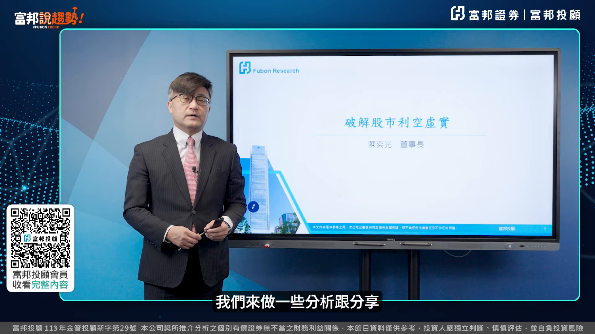 | 我們今天的這個標題叫做 破解股市的利空虛實 因為在這條AI的這個道路上來看 其實它的基本面沒有變 變的是籌碼 變的是資金 它在這個地方有做些轉換 我今天針對這個所謂的市場上的利空 跟利多來跟各位做一下分享 首先我們來看一下7月29號FOMC會議 我想這部分的解讀到9月份 這一份報告聯準會的利率一直會影響市場 所以我覺得你要很清楚的去解讀聯準會利率到底會怎麼走 結論上來看我們覺得他今年升息的機會應該不高 而且還是有可能比較偏向去降息 等於說最差最差就是不升 就是維持不變 那我們可以看到他這次的部分 有三位委員支持升息一碼 那我想當然他最近的這個通膨 是讓他支持他去升息一碼主要理由 然後他這邊藍色字所提到 市場利率自行上升以提供部分緊縮的效果 顯示市場不再完全依賴聯準會 這是WASH所提到的 我講到這句話 很明顯的表達一個重點 什麼重點 他希望未來打球的人看球打球 不要看裁判打球 等於說在過去一般的投資人 都是看著聯準會的方向來做利率 他希望你用市場上面的一個 所謂的經濟數據 你自己去判斷 而不是你來看我的想法 然後去猜測我的想法 這是他所要表達的 | 影片主題切到標題頁，介紹「破解股市的利空虛實」與AI基本面、籌碼資金變化。 |
| 00:01:55 | 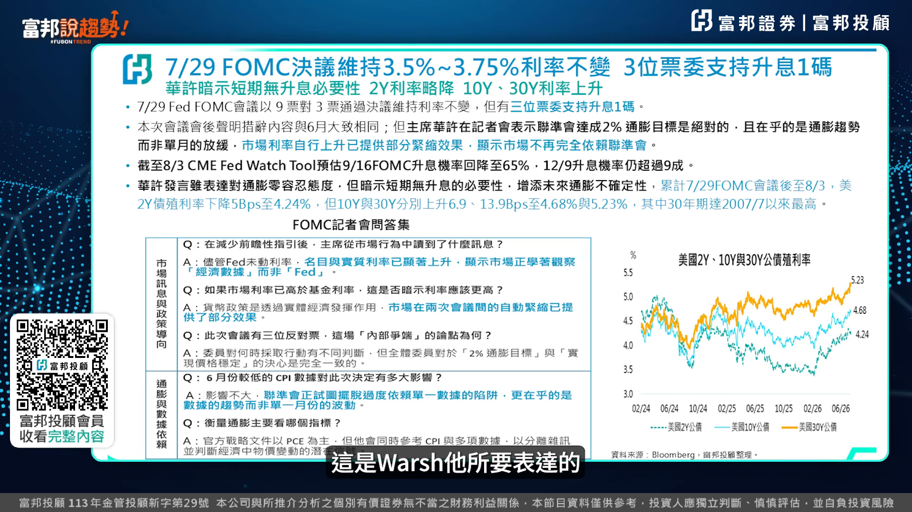 | 然後他在記者會問答集裡面 我覺得比較精彩 那我這邊有把他的QA的部分 有五個問題 我覺得他的回答部分 我想這個地方已經很明顯的告訴市場 就是市場上正觀察經濟數據而非Fed 然後第二個就是 兩次會議裡面自動緊縮 也提供了這部分的效果 所以我覺得他整體的 這樣的聯準會裡面的內容裡面來看的話 我覺得他有一點點失誠green span 我記得Green Span講了一句話非常經典 就是說當你聽懂我講的話的時候 我想你可能誤解我的意思 換句話說 Green Span不希望市場上去臆測 他在每一次的會議裡面的講話 WASH也是一樣 | 切到FOMC記者會QA重點，可能出現五個問答整理表。 |
| 00:02:39 | 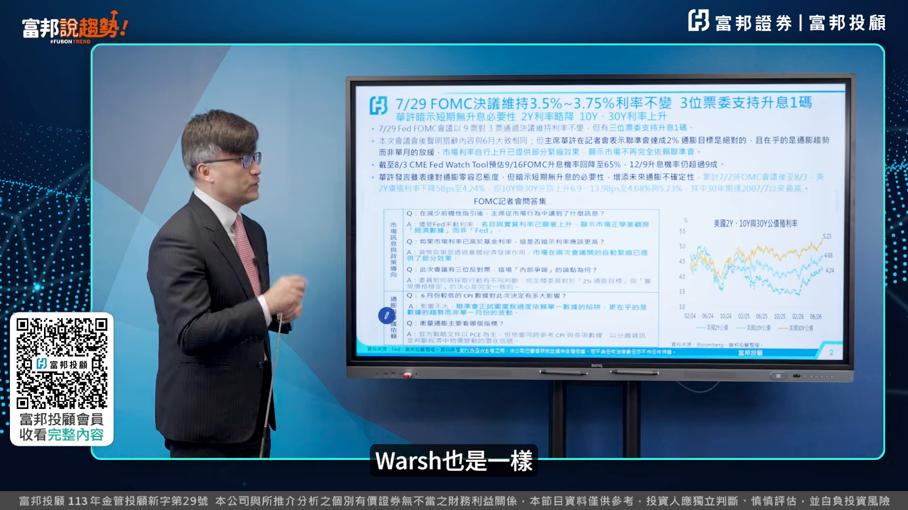 | 所以這一塊我覺得WASH未來應該就是兩個方向 A Data Dependent 看Felip曲線 兩個象限 Job Report 跟Inflation 這兩個 第二個Chain Dependent 看趨勢 看AI AI的生產力是否能夠讓通膨降下來 需要一點時間 但是他相信AI可以帶動整個生產力的增加 所以我想這兩個會是我們在觀察整個 接下來新的聯準會主席 他所要帶給市場上的方向 那第二個部分我們來看一下 市場上的Badge News 他的這種所謂的熊市的這部分的一個利空 到底有些哪些是真的有哪些是假的 我整理一下總共17項 17項裡面有將近一半是真的 有超過一半是假的 等於說你在判斷這樣子的一個過程裡面 可能你會誤殺你的股票 或者有些人是停損真的利空的股票 但是後面可能會慢慢的利空頓化 利空所謂的出盡 我們可以看到資金的部分全部打勾 代表是真正實質的利空 但是會不會真的影響 這個基本上它的影響都是 在瞬間影響完之後 後面慢慢就會淡化 所以在資金的部分 我們坦白說 它這一次是實質的利空 | 提出未來聯準會主席觀察框架，畫面可能切到Data Dependent與Trend Dependent兩方向圖。 |
| 00:03:57 | 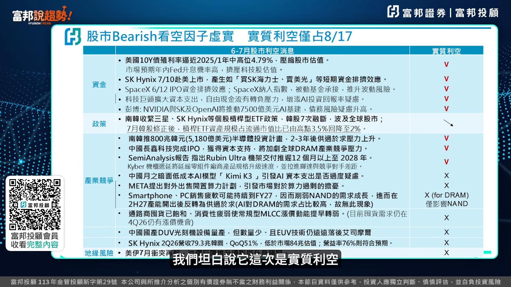 | 然後再來看一下 政策的部分 我想這一次去幹感 它造成整個這個成交量的 一個下跌之後的自息量完之後 去幹感效果非常好 所以我們把它用一個箭頭向下 然後再來就是在產業競爭的部分 有包括南韓的擴產 長興科技的這部分的一個IPO 其實事實上會影響到 然後這部分Lubinarcha的這個 所謂的基價交付延遲12個月 這也是實質的利空 但是接下來這下面的部分 我們覺得像Case 3啦 或者是Meta這部分的這個 租算力的部分 我們覺得這個都是屬於比較虛的利空 所以這部分實際的影響並不是太大 等於說你現在的三立 算力 存力 電力 基本上存利已經變成是主旋律了 假設你的存利內存 包括DDR5 DDR4 或是LPDDR 或者是我們講的HBM NAND Flash SSD這四個 其實你看海力士 他所開出來的財報 其實是非常不錯的 只是市場上基站裡面挑鋼筋 讓他在整個財報裡面 就挑出了說 漲價的幅度不如預期 可是你去看 假設漲價幅度不如預期 為什麼會有出現LTA 長期的合約 三星這次長期合約簽了10項裡面有7項的產品 全部綁長期合約 而且它是漲價沒有封頂 跌價有一個Protection 5% 所以基本上這樣子的一個純利 還是持續的一個Positive的情況之下 其實這個AI的敘事才到中間而已 並沒有所謂的泡沫的問題 | 切到政策面與去槓桿效果，可能顯示成交量下降與政策影響整理。 |
| 00:05:41 | 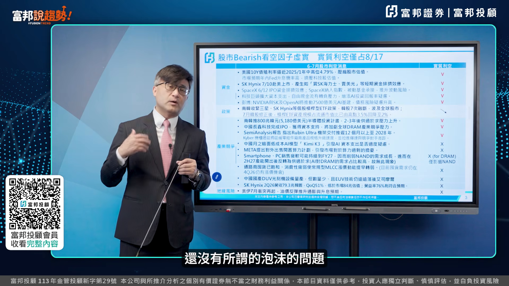 | 看完熊市這部分利空的真與假 那我們就來看一下 第三個我們所提到的 賣產值的目前實質 我覺得接下來十月份可能還是會持續 影響到市場上面的這部分的Cash Flow Margin的部分 我們可以看到四大CSP場 我們從第二季的這部分的Cash Flow 整個四家加起來是正68億 但是你去看彭博 彭博給出來的2026年整體的這部分的 四大CSP廠的Cash Flow會轉成負值 負7億 負7億這樣的一個數字其實 10月份開始轉負的話 等於第三季的這部分的季標它開始轉負的話 我覺得可能就會再一次來做壓力測試 而且這一次是Total加起來是負的 然後你看2027年它是負470億 等於說你這個產業在Hiking的過程裡面 其實你所面臨的這部分的這個Cash Flow 短線上面 我就短暫這種一年到兩年 這部分的一個所謂的負值 我覺得應該是可以承受的 | 看完熊市利空真假後，切到賣產值與現金流的實質影響分析。 |
| 00:06:44 | 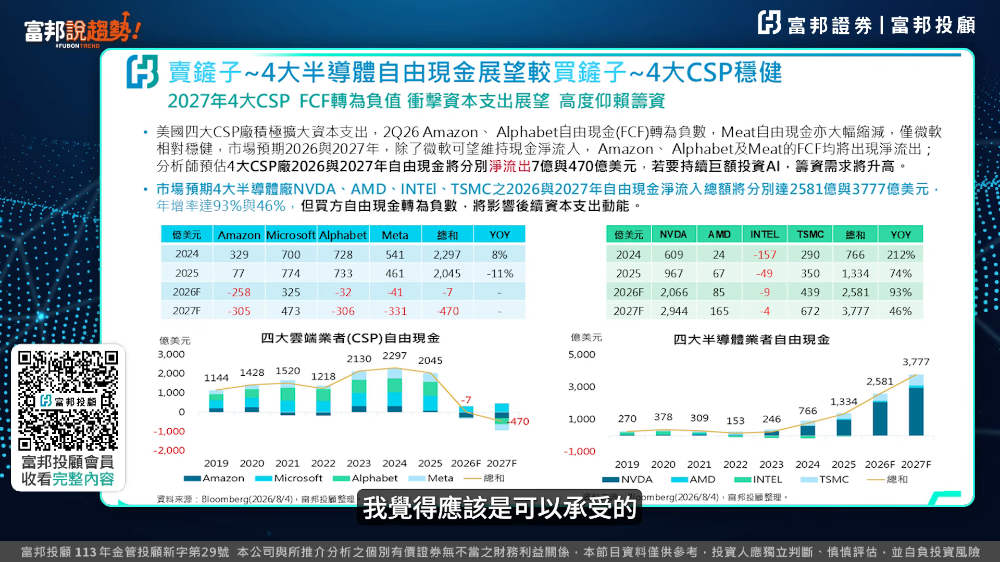 | 但是你看一下賣產值的 賣產值的其實數字非常非常亮眼 你看2026年 我把這4家NVIDIA AMD Intel加TSMC 把它加起來 現金流的這部分的正值是2580億 明年是高達3777億 分別成長93跟46% 等於說目前看起來很明顯 賣產值的它是賺得波滿盤滿 那CSP場Cash Flow的Margin的部分 其實是轉負的 這個可能就會變成說 我們在這種所謂的上肥下壽 或者是說整個結構上來看 會產生短暫上面的這樣的一個 所謂的財務報表這部分的現金流量 我們講Cash Flow的差異 所以這一塊的一個獲利數字來講 應該沒有太大懸念 臺灣剛好是在這一塊 那美國這個地方我覺得 假設它這邊正值 變成說CSP廠不再做CAPEX投資 那這邊就會降低 那股價跌得更兇 所以我想從這樣子的一個CSP的大廠 Cash Flow這部分的一種所謂的進出來看的話 可能在接下來的兩個季度 都會持續受這樣的一個議題拿出來講 | 切到賣產值公司現金流亮眼，可能顯示NVIDIA、AMD、Intel、TSMC合計數據。 |
| 00:07:55 | 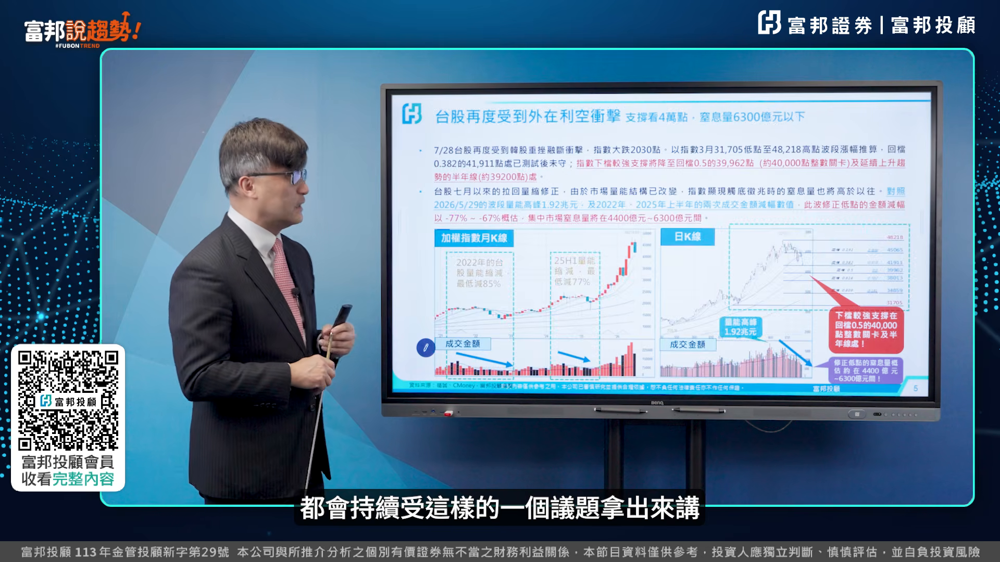 | 好 那我們拉回來看臺股 臺股走到這個地方 我想在7月份 我們在各的報章媒體裡面都有提出 我們的看法 其實我們覺得說跌破4萬點 其實應該是超跌 那我們從幾個方向上來看 第一個就是說我們從3月份的31705 到48218這樣的一個波段來算 所謂的這個回檔0.382 0.618 0.5的這樣的一個趨勢上來看 從48218到0.382反彈是41911 然後到至15000點 可能就是反彈上來的這樣的一個滿足點 這個是從這一波的趨勢上面往下看 這個我們可以用我們團隊所估計的這樣數字來做參考 | 拉回台股走勢，可能切到台股指數圖與7月回檔分析。 |
| 00:08:38 | 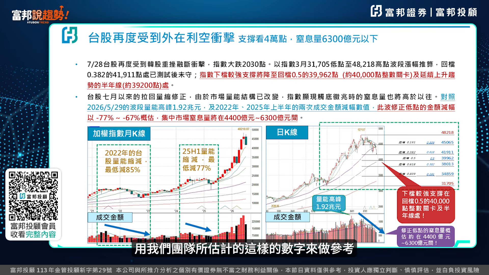 | 然後第二自息量的部分就是從 去年的上半年跟2022年當時的自息量的這樣的一個最低減的幅度 我們去算出來的這個幅度差不多4400億到6300億 但是我們覺得這個是比較是極端值啦 一般來講是用日均量打7折日均量打7折差不多7000億 我們在今年的7月27號假如沒記錯的話 當時我們的新低量是7400億 然後7月30號來到新低價 等於說新低量出現完之後就有一個新低價 新高量出現之後 4個月之後會有一個新高價 所以目前看起來低量應該短線上已經出現了 只是說我們現在把短線上所反彈 就是說下跌的這部分的一個滿足點 39000到39200這個地方 應該是來到一個 我們在計算上面來看一個相對一個支撐點 這個量的部分 我們剛剛用這個月均量的這部分的七折 去算新低量的出現 所以目前看起來在短線上來看 它已經從所謂的這個跌升完之後的反彈 反彈之後變成反轉 我待會做一個所謂的結論來跟各位做分享我的看法 | 切到自息量與低量測算，可能顯示日均量七折、新低量7400億等成交量表。 |
| 00:09:49 | 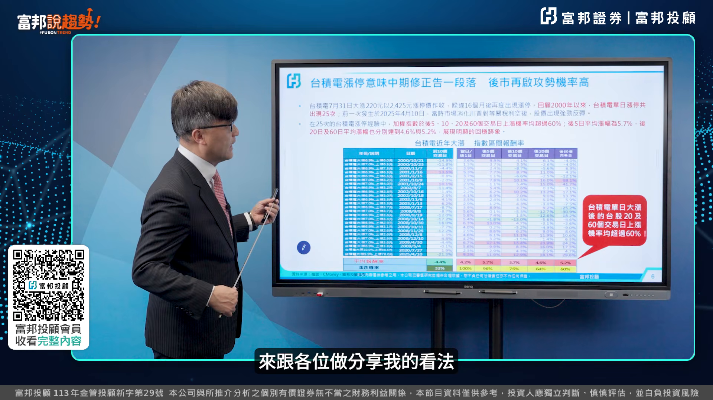 | 然後第二就是臺積電漲停的這部分的一個次數 臺積電在7月30號漲停板 那天我就開始在思考就是說 臺積電從1994年掛牌到2015年當時的漲停盤是7% 總共漲停 觸及漲停107次 漲停完之後或觸及漲停後面的20天到40天 它的這部分的漲幅 我這個地方是用比較屬於近幾次 但是我剛剛是用比較宏觀是1994年到2015年 如果是開始漲幅是10%的話只有3次 分別是2020年跟2025年 還有今年這一次的7月30號 然後我們可以看一下以後10天後20天 這樣子的3.7 4.6 5.2的 這樣子的一個反彈的幅度上來看 用4319當時7月30號臺積電漲停 對標臺股的這個指數的位置上來看 4.6會到45000點一個月之後 如果是5.2%的話可能到46000點 所以你從這個角度上來看 臺一電的漲停 告訴你它後面的趨勢的變化 等於說它再去測39000點 這個位置的機會相對比較低 所以我覺得從這樣子的一個漲停 可以告訴你在整體的這部分的方向 | 轉入台積電漲停次數分析，可能顯示歷史漲停統計與後續20到40天漲幅。 |
| 00:11:12 | 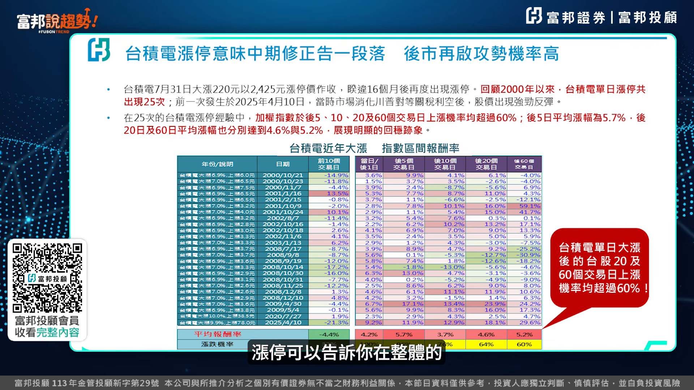 | 然後再來我用第二個面向 來跟各位做分享 就是其實一般來講 景氣對這訊號 你看到的數字 可能紅燈綠燈 對你來講沒有感 我把景氣堆積訊號把它連結到股市來看 一般假設景氣堆積訊號 第一顆紅燈亮起的時候 九個月指數見高點 那你就要去看臺灣第一顆紅燈什麼時候亮 2025年12月份第一顆紅燈亮 那往後面推九個月 今年九月份 今年九月份若是以剛剛這樣子的一個60天來看 就是兩個月 這次的這個7月30號 後面兩個月8月9月 跟這個緊急對話訊號是不是很接近 | 切到第二個面向：景氣對策訊號與股市高點關聯，可能顯示紅燈時間與九個月推算圖。 |
| 00:11:58 | 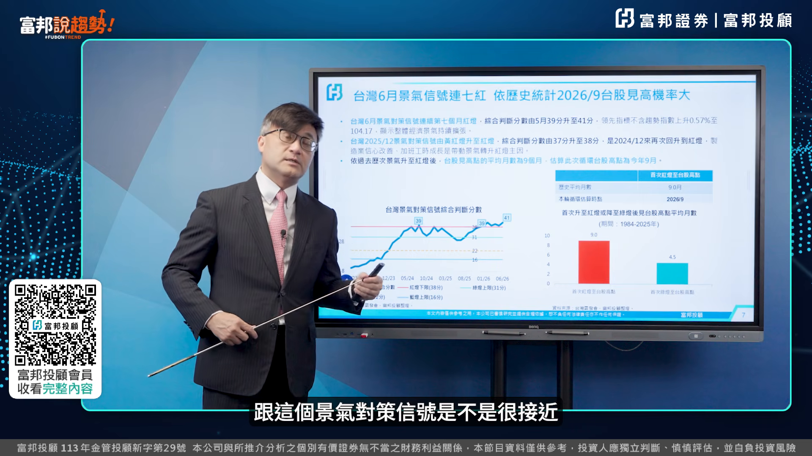 | 再來看第三個面向 天亮 這個我在之前有跟各位提過 我們再把它整合在一起來看 我們在看到天亮之後的天價應該是3.8個月 我們用4個月來算 4個月來算的話 它這4個月會漲多少 漲17.4% 然後就要去看天亮是什麼時候發生 5月29 5月29當時用盤後成交量加進來的話是1.91兆 若是隻用盤前的話是1.87兆 我們用1.91兆去算這個天量來看的話 3.8月加起來5296789929是不是也是4個月 跟剛剛的景氣對象的話一樣 跟剛剛臺積電漲停板後面往後推的這個時間也是一樣 那它再漲17.4%你把它乘上去超過5萬點 這三個邏輯 我覺得很清楚的 告訴我們富邦說趣的好朋友 其實我們一再一再的提醒你 景氣資金籌碼 基本上景氣沒有變 資金行情沒有變 變的是什麼 籌碼 籌碼這個地方在去槓桿 所以基本上 你就會產生出 這樣子的一個FOMO交易 在這個恐懼的時候 出現了三萬九千多點的 這樣的一個低點 | 切到第三個面向：天量天價，可能顯示5月29日天量與四個月後目標推估。 |
| 00:13:09 | 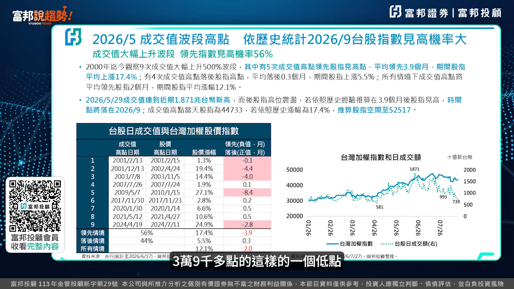 | 最後我來用結論 我用光哥筆記 我想我平常每天都做筆記 我想記者在跟我做這個互動的時候 有時候我就直接把筆記傳給他看 我今天把筆記來跟各位做一下分享 一般來講 疊完之後有三個步驟 反彈 反彈還會再去徹底 那反彈假設不要去徹底就反轉 反轉就是前波低點要來徹的機會比較不高 但是還是有機會 只是說比較不高 那反彈的話會來再徹一次腳 那目前看起來從反彈變反轉 那什麼時候反轉變回升 等於說是2到3個N字型的上攻 形成一個W底才上去 所以目前要到回升的這個時間點 可能還是需要一點點時間 那現在比較好的是量有出來 好 我們先把它界定現在是反轉 還沒到回升 | 進入結論與光哥筆記，可能切到筆記頁或反彈、反轉、回升三階段示意。 |
| 00:13:53 | 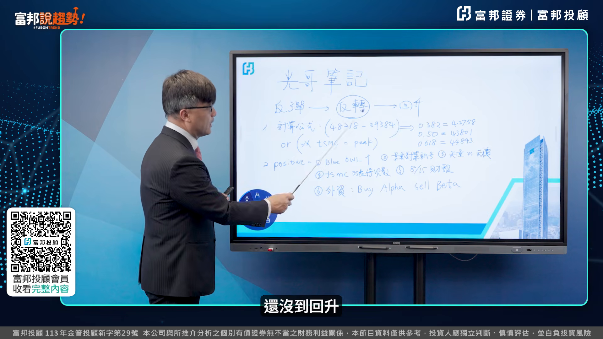 | 那計算公式怎麼算 從這一波的高點 6月份48218點 跌到這波低點 7月30號的39384 我們用反彈0.3822到0.618 分別滿足點是42000到44800點左右 今天已經突破了 等於說它已經強勢反彈 382是弱勢反彈 0.5是中性反彈 618是強勢反彈 強勢反彈一出現的時候 代表就是說它已經進入所謂翻轉行情 那什麼時候會到回升 過47000點 等於是48000點下一個高點47000點300多點 過了變回升 這個我們先把它定掉出來 那或者是你用臺積電的這部分的一個算法 臺電高點是2535塊 2535塊你去減掉現在一塊錢漲8點的話 其實你把它減掉現在應該還可以貢獻1000多點 所以第二種算法其實也是告訴我們 跟0.618是很接近的 而且是超過它的 這第一個算法 | 開始用高低點計算反彈滿足點，可能顯示48218跌到39384與0.382、0.618區間。 |
| 00:14:52 | 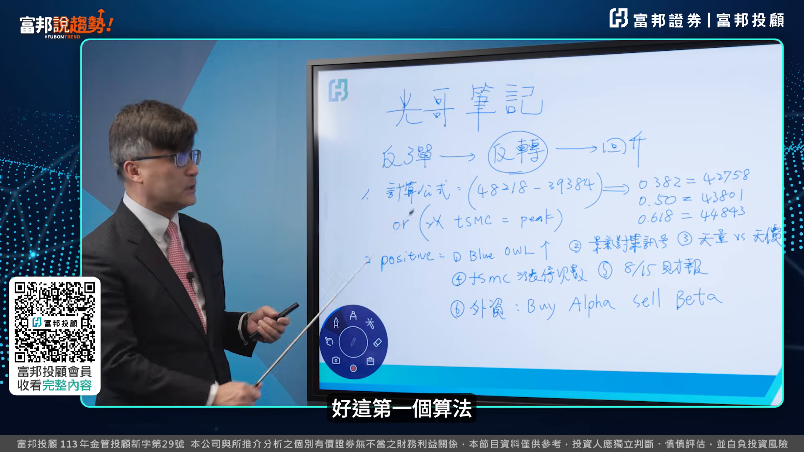 | 好那為什麼我們覺得這一波行情 還是持續看好 短線上面這個positive的這個利多因素 第一個我觀察的一個AI的資金溫度計 你記不記得我在之前的幾個影片裡面提到 Bluer Hour 蘭肖這家公司 蘭肖這個蝨目基金其實在過去一年來跌得非常兇喔 可是最近一個月反彈 就代表其實AI的這部分的資金溫度計並沒有太大問題 來第一個 它上漲 第二個 景氣對熱性化 剛剛已經提過了 我就不在這邊贅述 第三個 天亮天價 我剛才提過了 我這邊也不再做這個重複的說明 第四個 臺積電漲停的這部分的次數 我們也是把剛剛把這三點把它加起來一起來看 其實目前看起來 直至9月份有機會去往前波高點來挑戰的 這樣的一個主要的一個positive的利多 | 轉入短線持續看好的利多因素清單，可能切到Positive利多整理表。 |
| 00:15:41 | 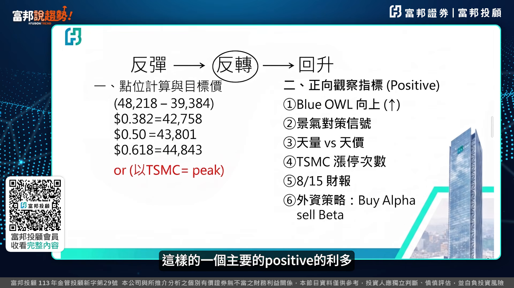 | 第五個 8月15號彩報 我在前面幾次的影片裡面有提到 第一季的這部分的獲利數字1.61兆 第二季QOQ營收成長12% 第一季的butternight11.22% 用第一季的butternight乘以第二季的營收 其實他是有機會挑戰1.88兆 上半年3.5兆 一般過去上下半年是4比6 我用1比1來比的話 其實今年就會挑戰7兆的水準 非常非常棒 這個數字我覺得很好 等於說接下來的每個月的10號 他公佈上個月的營收 回歸基本面 絕對是我們臺灣股市裡面的一個利多 這是一個財報部分的效應 | 第五個利多切到8月15日財報，可能顯示第一季、第二季獲利與全年7兆推估。 |
| 00:16:23 | 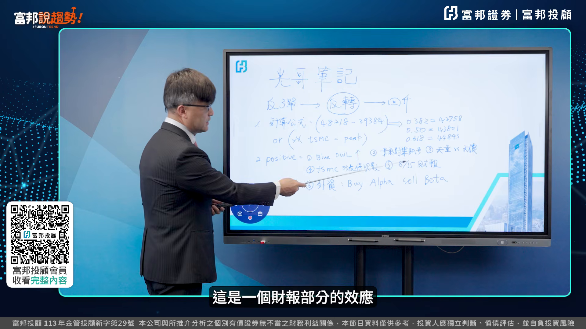 | 第六個是外資 外資為什麼空單這麼多 我覺得他在做一個動作 Buy Alpha Sell Beta 什麼叫Buy Alpha Buy Alpha就是他買主動式ETF 你去看一下他有買一檔主動式ETF 他買了50多萬張 他買了50多萬張的這個主動式ETF 基本上他是看好整個AI的趨勢喔 然後他放空什麼 放空期貨 放空期貨我把它算了一下 他放空期貨7月17號轉倉的當時的成本 43,600點 然後那時候指數上上下下 46000 42000 所以他平均成本應該44000 所以現在只要指數過44000 8月的第三個禮拜三 他要棋子結算 他勢必被尬到 所以他基本上我覺得他到底是避險還是實際看空 你從他by alpha sell beta這樣角度來看 他沒有看空臺股 而且各位富邦數據草片要注意到 投信是做多臺子期89000口 等於說投信做了 跟外資放空的口數 其實是一樣的 所以你在這個地方 就會形成一個多空對決 所以我從這張表 我的筆記裡面 我想就是短線上 我先跟各位講說 現在是進入所謂的反轉區 那我們這個地方就是 折時這個地方 已經跟各位做分享了 再來就是折股 就是你可能要持續追蹤 我們富邦投顧的裡面的報告 | 第六個利多切到外資部位，可能顯示Buy Alpha Sell Beta、ETF買超與期貨空單。 |
