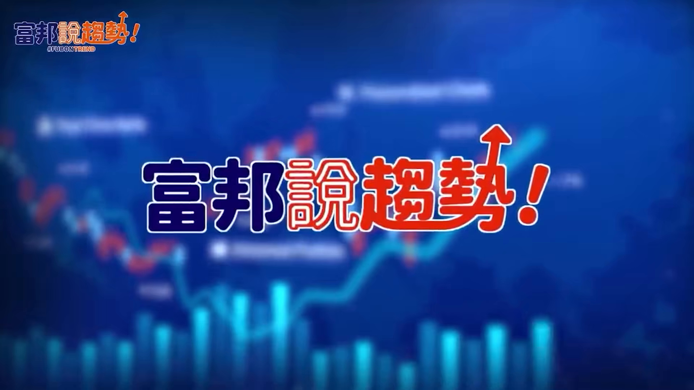
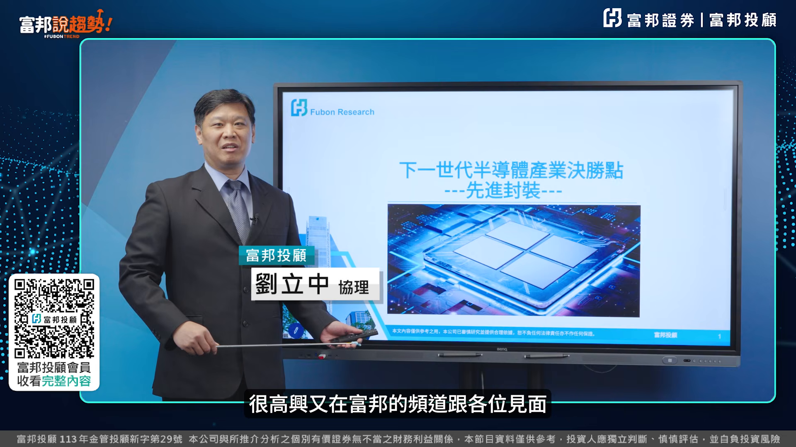
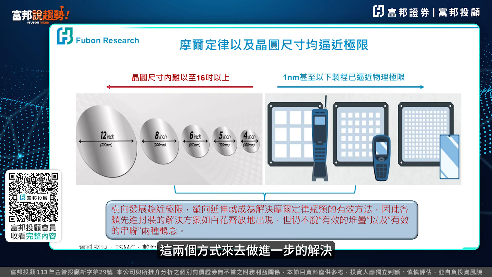
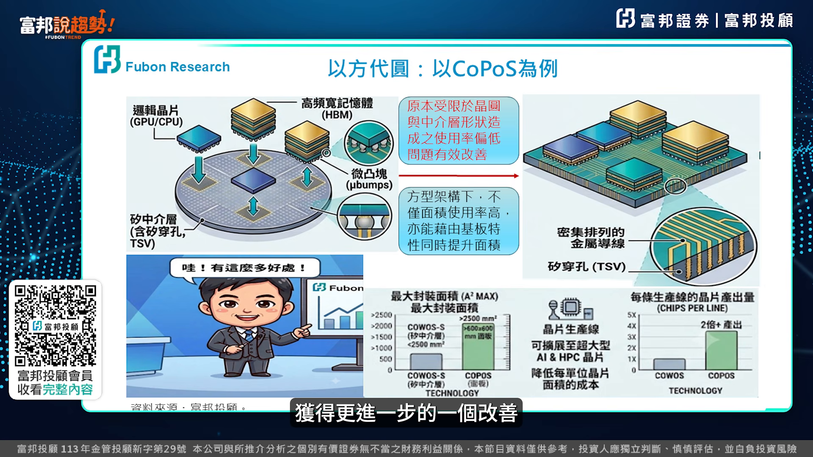
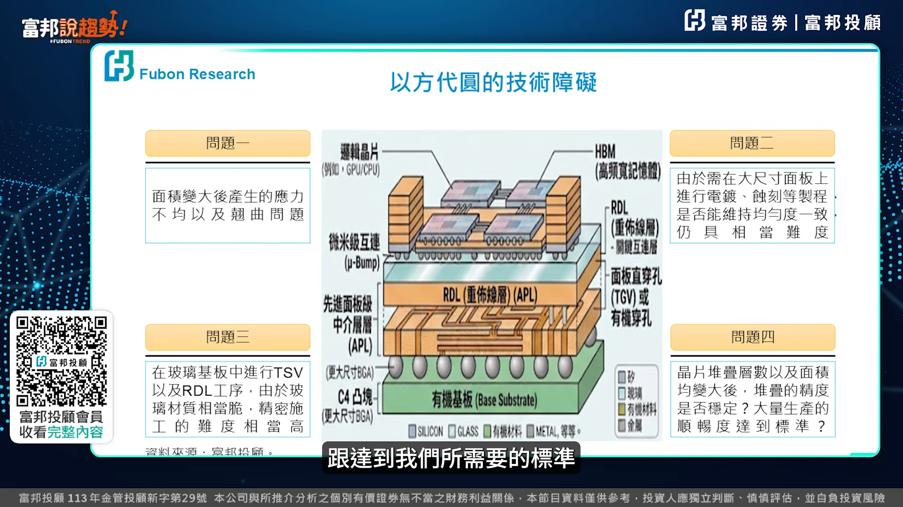
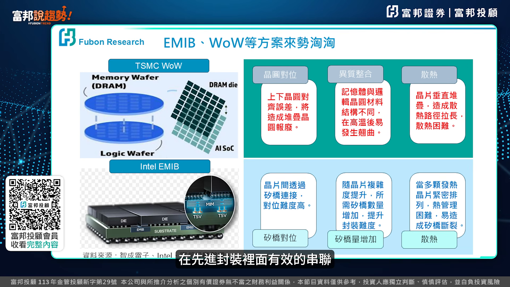
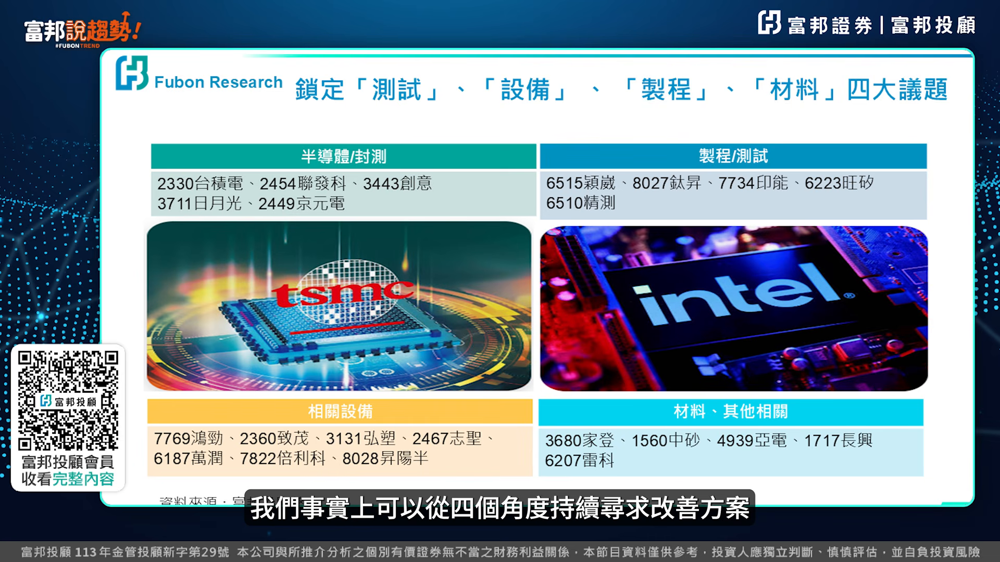

# fubonsec_0L7DV-hnWmM — 關鍵畫面索引

- 來源逐字稿：[fubonsec_0L7DV-hnWmM_FIN.srt](fubonsec_0L7DV-hnWmM_FIN.srt)
- 影片：https://www.youtube.com/watch?v=0L7DV-hnWmM
- 截圖數：7

## 00:00:05

**逐字稿片段：** 富邦陣陣 新戶優惠來囉! 開戶急診500摩比 完成指定任務再領200摩比 加500手續費抵用金 還有星宇航空布拉格商務艙 雙人機票等你抽 心動不如行動 火速開戶做任務囉! 哈囉 各位富邦的朋友大家好 我是立中 很高興又在富邦的頻道跟各位見面

**話題推測：** 影片開場進入富邦新戶優惠活動畫面，可能顯示開戶獎勵與抽獎資訊。

---

## 00:00:25

**逐字稿片段：** 那今天要來從技術的困難點 來跟各位聊一聊新進封裝 並且從技術的困難點來看一下 新進封裝下一次 我們要留意什麼樣的一個投資焦點 半導體現在面臨最大的問題 摩爾定律跟晶圓尺寸 都逼近極限的這個情況之下 我們藉由先進封裝裡的 有效堆疊跟有效串聯 這兩個方式來去做進一步的解決

**話題推測：** 講者正式切入本集主題，預期畫面切到先進封裝與投資焦點的標題頁。

---

## 00:00:48

**逐字稿片段：** 首先第一個 就是用乙方帶圓的方式來解決 我們剛剛提到的有效堆疊 各位可以看得到 過去都是以圓形 作為主要的施工的基礎 那接下來我們藉由方形的方式 解決有效堆疊 這樣子的一個技術的障礙 不僅提升了整個堆疊的效率 甚至在未來的佈線上 我們可以在材料的選擇 跟佈線的施工上 獲得更進一步的一個改善

**話題推測：** 提出第一個技術方向「以方代圓」解決有效堆疊，預期畫面切到圓形與方形封裝比較圖。

---

## 00:01:14

**逐字稿片段：** 剛剛提到的乙方代元的方式雖然好 但是仍然會有四大類的問題產生 那分別是面積變大之後 所產生的硬力撬取問題 那第二個就是 必須在石科更多的線路的情況之下 這些線路是否能夠達到均勻度一致 第三 在施工的過程中 材料是否會容易破碎或者是損壞 那第四晶片堆疊數量變多之後 是否能夠在晶片跟晶片之間 甚至是層數跟層數之間 達到一致的穩定性 跟達到我們所需要的標準

**話題推測：** 轉入以方代圓仍會產生四大類問題，可能切到列點式風險或技術難題簡報。

---

## 00:01:48

**逐字稿片段：** 那在接下來我們看到 剛剛我們提到的是有效的堆疊 接下來我們來看一下有效的串聯 在先進封裝裡面有效的串聯

**話題推測：** 從有效堆疊切換到有效串聯，預期畫面進入另一張先進封裝架構圖。

---

## 00:01:57

**逐字稿片段：** 我們以臺積電跟Intel 這兩個方案來去做為例子 各位可以看到 不管是臺積電的方案 或者是Intel的方案 都不約而同的產生了 共同的一個困難點 第一個當然就是散熱 第二個就是材料的整合 第三個我們可以看到 晶片跟晶片之間 它是以細橋作為一個連結的方式 那它的對位跟它的數量增加之後 封裝的難度 事實上在現階段 我們在製造的過程中 可以看到這部分的難度相當的高 針對我們剛剛提到的各類的問題 我們事實上可以從四個角度來去做解決

**話題推測：** 以台積電與 Intel 兩個方案作為例子，可能切到兩家公司封裝方案對照圖。

---

## 00:02:34

**逐字稿片段：** 第一個從半導體的製成跟封測 像臺積電 日月光 晶圓電等 都針對Cobos跟我們剛提到的簡化的封裝架構 提出了新的半導體的製成 第二個在這些施工的過程中 要採用什麼樣的方法 怎麼樣去確保我們施工的品質 包括影微 泰森 金測等 其實都有對應的方案去提出 第三個我們看到就是 我們選擇了不同的方案 不同的製成 我們要怎麼去實施它 對應我們需要有工具 而這些工具就包括像 紅鏡 質帽 紅碩 制勝等 都有相對應的新的一些工具 來讓半導體業者 可以達到這樣子的一個目的 那最後在材料的部分 如果我們可以選擇更好的材料 或者更適當的材料 事實上搞不好這些問題 都會迎刃而解 甚至不會發生 那因此我們看到像中砂 氧電 長芯等 都針對這樣子的一個材料 去做進一步的一個研發 來去解決我們所遇到 目前剛提到的這些問題 如果各位喜歡我們這次的內容的話 並且關注我們 富方說去吃的頻道 謝謝各位

**話題推測：** 第一個解決角度是半導體製程與封測，並點名台積電、日月光、晶圓電等公司。

---
