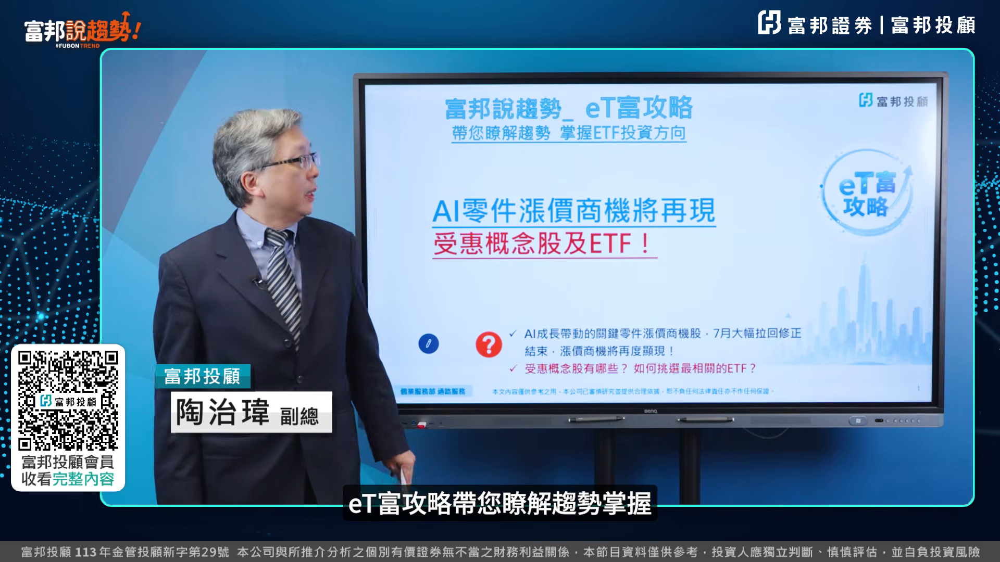
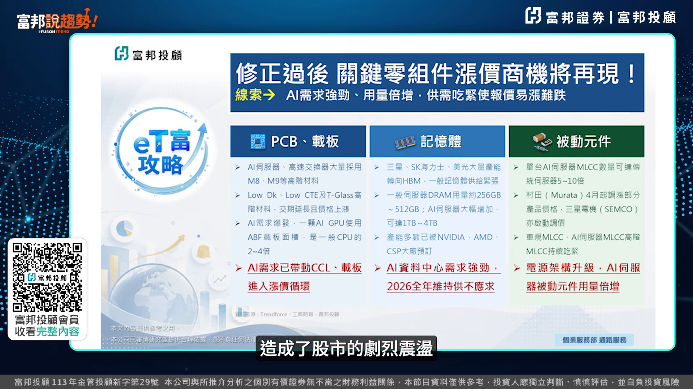
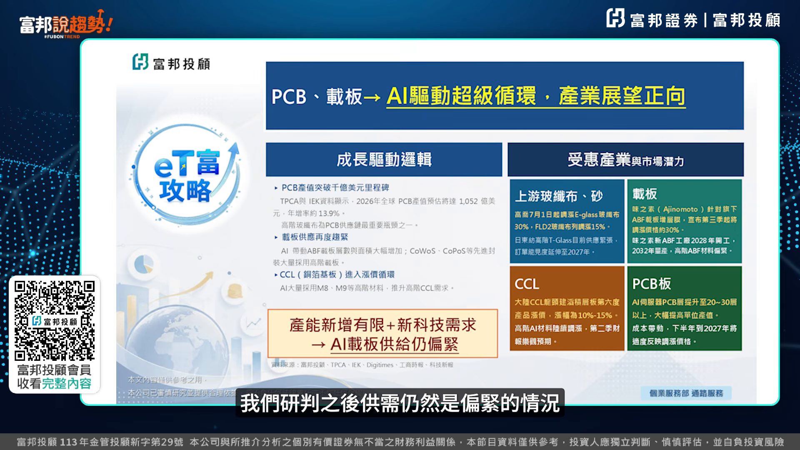
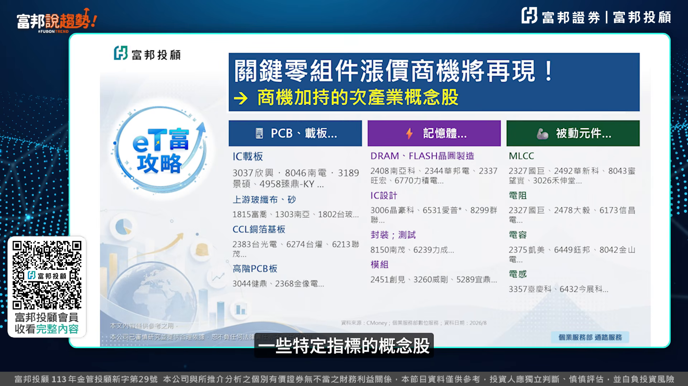
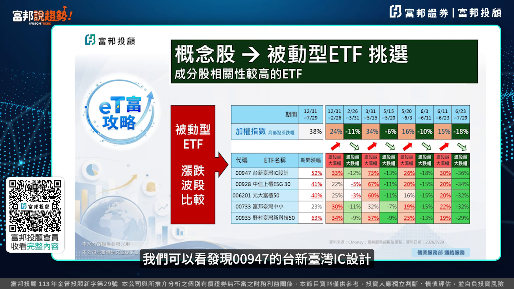
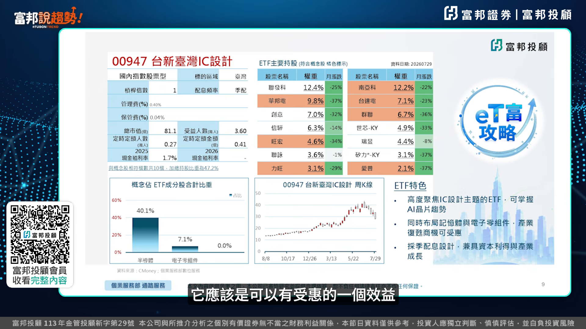
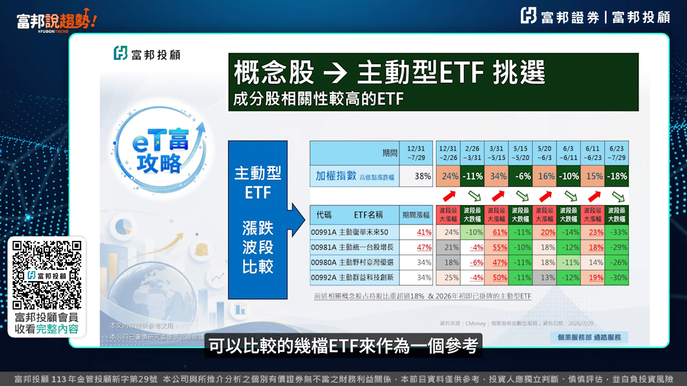

# fubonsec_DfN9yS3xkuU — 關鍵畫面索引

- 來源逐字稿：[fubonsec_DfN9yS3xkuU_FIN.srt](fubonsec_DfN9yS3xkuU_FIN.srt)
- 影片：https://www.youtube.com/watch?v=DfN9yS3xkuU
- 截圖數：8

## 00:00:06

**逐字稿片段：** ETF工業帶您瞭解趨勢,掌握ETF未來投資的方向。 臺股在7月份出現了明顯的大跌走勢, 指數從高點拉回8800多點之後, 出現了強勁的反彈。 在上半年帶動臺股大漲的AI零件個股的部分, 也在7月出現了明顯的修正。 不過從產業供需的情況來看 在整個供需吃緊的部分 在下半年還會再度的一個顯現 因此相關的AI的零組件的個股 我們研判漲價的商機會再度的一個顯現 受惠的概念股以及相關的ETF的部分 我們也在這邊後面跟您做一個分享 其實在關鍵零組件的一個部分 我們看到在AI需求 相當強勁的一個帶動之下 雖然之前有AI的一些泡沫的 一些相關的傳言 造成了股市的一個劇烈的震盪

**話題推測：** 影片開場，預期出現ETF工業／富方趨勢品牌與主題標題畫面。

---

## 00:01:07

**逐字稿片段：** 不過三大零組件 包括PCB 載板 記憶體 以及被動元件 它們整個用量 在今年跟明年的倍增的情況 並沒有改變 因此在供需吃緊的部分 會使得之後的一個報價 仍然呈現一掌難疊的一個情況 其中三大產業的一個裡面 在PCB跟載板的一個部分 我們也看到在AI帶動了ABF 載板的一個面積 以及乘數的大幅的增加的情況之下 加上在先進封裝所採用的 高階的載板的一個需求 持續的一個提升 因此在下半年主要廠商的一個 載動率的一個部分 都渴望比今年上半年 再有一個明顯的一個拉伸 因此在ABF載板跟PCB的一個部分 我們研判之後供需 仍然是一個偏緊的一個情況

**話題推測：** 提出三大零組件PCB、載板、記憶體與被動元件，預期出現產業分類表。

---

## 00:02:04

**逐字稿片段：** 受惠的一個族群 包括載板以及上游的撥籤部 以及CCL的一個部分 在之後的一個漲價題材部分 渴望會再度的一個升溫 第二個重點產業在記憶體的一個部分 我們知道在之前 而且三大記憶體廠商 產能的大幅轉向了高頻寬的HBM之後 它造成了明顯的一個排擠的效應 那AI的部分在應用上 往AI Engine的方向去做一個發展上的 在記憶體的用量的一個部分 不管是原本的HBM 或者其他的記憶體的部分 都大幅的一個增加 因此在記憶體的部分 供需吃緊的情況的一個部分 時間上也會有一個拉長的狀況 當然在這樣的一個趨勢之下 包括HBN 以及其他的記憶體族群的部分 也是之後漲價題材 可望受惠的一些族群 第三個在被動元件的一個部分 我們知道被動元件 這一波的向下修正的幅度 相當的一個可觀 不過被動元件本身 在AI伺服器MLCT的用量的一個部分 上就是出現一個暴增的一個情況 加上在GPU的功耗大幅的提升之後 相關的被動元件的需求的部分 也是快速的一個成長 因此包括MLCG 以及電阻電容電感的 這些整體的被動元件漲價的部分 我們研判下半年還會再捲土再來 所以從產業的一個工序的一個情況 我們把它整理出幾個漲價的商機 可望持續加匯的一些特定的指標的一些概念股

**話題推測：** 點出PCB／載板受惠族群包含載板、上游玻纖布與CCL，預期出現受惠族群清單。

---

## 00:03:53

**逐字稿片段：** 包括在PCB跟載板裡面 像新興南電錦碩 另外像CCL通波基板裡面的臺光電的一個部分 另外在記憶體的部分 像南亞科華邦電 另外像模組的創建這些指標概念股的部分 雖然這一波的修正相當的猛烈 不過在之後的漲價所帶動的反彈的一個商機 還是值得正面做一個期待 至於在被動元件 這一波的修正幅度上是最大的 指標個股都有打回到年限 甚至在年限更往下的這樣一個幅度 不過我們剛剛提到了 在整個用量跟漲價題材帶動之下 指標股如果我們觀察到 營收的大幅成長還是持續的話 後面漲價商機 它也是會持續有一個受惠的狀況 因此從我們剛剛提到的概念股的部分 我們可以看到相關未來 我們佈局逢低承接的一個選擇的方向 那與這些概念股比較相關的ETF的部分 在被動型的ETF 我們挑選在成分股相關性最高的幾檔 包括像0094C臺新臺灣IC設計 00928中信中貴ESG30的部分 它的成分股所佔的剛剛概念股的比重 都有超過三成以上的這樣的幅度 另外包括006201的元大富貴50 00733的富邦臺灣中小 以及00935的野村臺灣新科技50的部分 也都有超過20%以上的持股的比重 這個是在被動型ETF的部分 主動型ETF的部分 也有五檔的主動型ETF 到上個月底的持股比重的部分 有超過24%以上的一個水準 那以被動型的ETF來看 我們把今年到目前指數 四波的一個上漲跟下跌之後 相關的ETF的一個波段的漲跌幅 來做一個比較 我們可以看

**話題推測：** 列出PCB與載板概念股如新興、南電、景碩，預期出現個股名單或產業表格。

---

## 00:06:09

**逐字稿片段：** 發現00947的臺新臺灣IC設計 以及00928的中信上櫃ESG的部分 在臺股先前的一個上漲的一個走勢中 分別有四次跟三次的部分 都有超過大盤同期間的一個漲幅 另外在00935的野村臺灣新科技50的部分 它在過去四波的臺股上漲的一個過程中 在漲幅上面也都明顯超過了指數的一個表現 因此在被動式的ETF的一個挑選 我們如果之後從逢低單比承接 或者針對未來這半年的定期定額的一個操作的話 這幾檔ETF的部分都是不錯的一個選擇的標的 那至於在個別的細節來看 我們看到00947的臺新臺灣IC設計的一個部分 它是高度聚焦在IC設計主題的一檔ETF 它同時在記憶體跟電子零組件的一個部分 它的佔比都相當的高 因此在後續如果有產業的復甦的商機的話 它應該是可以有受惠的一個效益

**話題推測：** 指出00947與00928在多次上漲波段勝過大盤，預期出現ETF與大盤漲幅比較表。

---

## 00:07:26

**逐字稿片段：** 00928的中信上櫃ESG30 它是聚焦在上櫃的一個成長股 它兼具了中小型成長以及產業的創新 它同樣在AI供應鏈的一個佔比的一個部分 有超過了四成以上的一個比重 因此它的一個特色的部分 如果符合好朋友 你們的一個ETF的一個挑選的話 也是可以納入選擇的一個參考 那第三檔是00935的 野村臺灣新科技50 它是聚焦半導體跟電子零組件 因此在臺積電的部分 它佔了將近有三成的一個持股比重 之後在AI或者半導體 概念股的部分 如果有再度的一個轉強的一個契機的話 那當然這一檔也是建議可以作為選擇的參考 至於在主動型的ETF的部分 我們挑選概念股所佔持股比重超過18% 而且今年年初以來就已經有掛牌的股價走勢 可以比較的幾檔ETF來作為一個參考

**話題推測：** 轉到00928中信上櫃ESG30，預期出現該ETF特色與AI供應鏈占比。

---

## 00:08:35

**逐字稿片段：** 那我們可以發現裡面包括0091A的主動復華未來50的部分 過去這幾次的臺股的一個上漲 它的漲幅的表現的部分是屬於相對突出的 那另外幾檔的主動型ETF的部分 在上漲的過程之中 它的股價表現也屬於相對比較亮麗 因此這幾檔主動型ETF的部分都可以提供各位好朋友來做一個參考 以上是我們針對AI零件 在下半年如果再度發動 漲勢我們所挑選出的概念股 以及相關性的ETF的部分 供好朋友來做一個參考 富方趨勢的好朋友 如果喜歡這支影片 別忘了按贊訂閱加分享 還沒有加入富方投股會員的好朋友

**話題推測：** 點名0091A主動復華未來50表現突出，預期出現主動ETF績效排行或走勢比較。

---

## 00:09:29

**逐字稿片段：** 也可以掃描我們這邊的QR Code 加入投股的會員 那我們這邊之後有任何的ETF的 投資的一個趨勢的部分 我們會跟好朋友做進一步的一個分享

**話題推測：** 提到掃描QR Code加入會員，預期出現QR Code與會員加入資訊。

---
