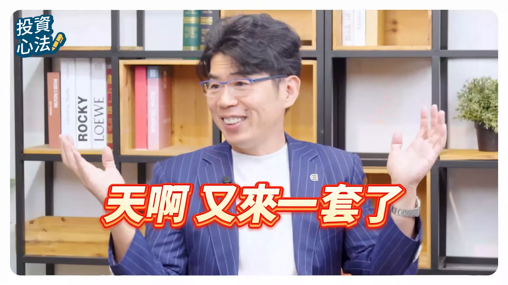
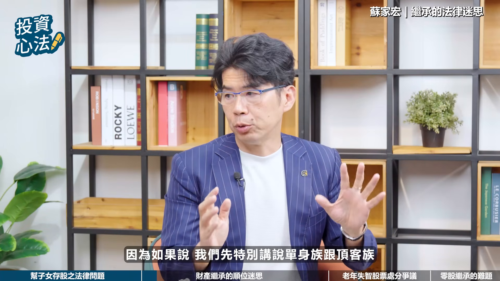
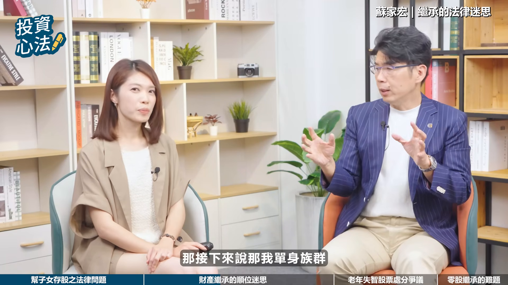
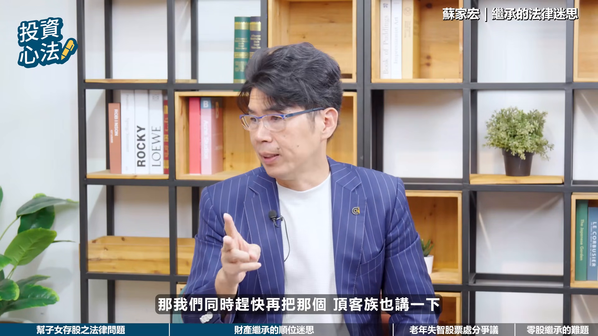
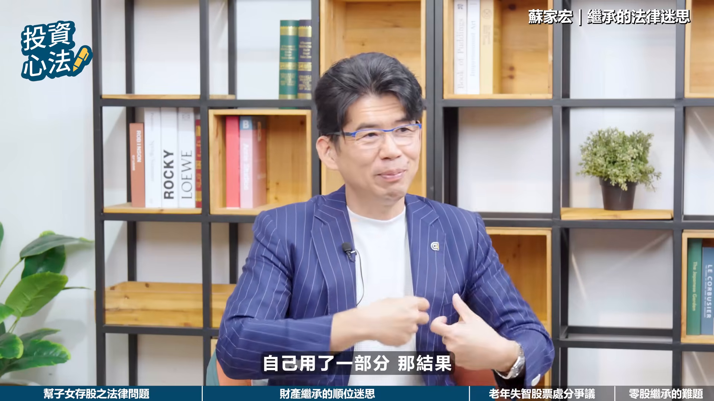
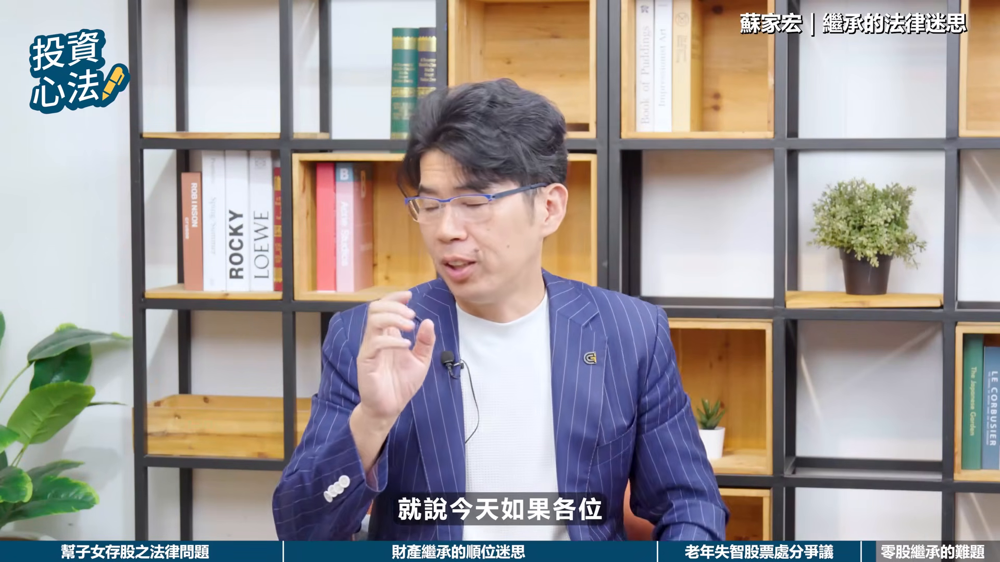

# fubonsec_W_cLHLRD1m8 — 關鍵畫面索引

- 來源逐字稿：[fubonsec_W_cLHLRD1m8_FIN.srt](fubonsec_W_cLHLRD1m8_FIN.srt)
- 影片：https://www.youtube.com/watch?v=W_cLHLRD1m8
- 截圖數：17

## 00:00:12

**逐字稿片段：** 富邦鎮鎮新戶優惠來囉 開戶急證500摩比 完成指定任務再領200摩比 加500手續費抵用金 還有新宇航空布拉格商務艙 雙人機票等你抽 心動不如行動 火速開戶做任務囉

**話題推測：** 切入富邦證券新戶優惠廣告，預期出現開戶獎勵與抽獎資訊畫面。

---

## 00:00:27

**逐字稿片段：** 嗨大家好我是Sabrina 我們常說投資是為了讓生活更好 很多人每天盯盤研究財報 辛苦存股 希望為自己和家人存下一個保障 但是當你的資產慢慢累積 或者家庭結構發生變化的時候 很多以為理所當然的理財動作 在法律和稅務上 可能會產生沒在預期的結果 今天我們非常榮幸邀請到 在財富傳承家庭法律領域的專家 恩典法律事務所的所長 蘇嘉宏律師來和我們聊聊 股民會遇到的法律和稅務問題 蘇律師您好 Suprae好 大家好

**話題推測：** 主持人開場介紹投資、財富累積與法律稅務主題，預期出現節目標題或來賓介紹畫面。

---

## 00:01:06

**逐字稿片段：** 現在很流行從小就幫小孩來存股 很多爸媽會在孩子一出生 就幫他們開證券戶 還有一些爸媽呢 是會用小孩的賬戶來做短線交易 認為這樣可以分散所得稅 或是兼顧贈與 只是這樣的安排 在孩子未成年的時候 看起來沒什麼問題 但等到子女成年之後 可能會面臨什麼樣的稅務 或是法律問題呢

**話題推測：** 開始談父母用小孩帳戶存股與交易的問題，預期出現親子存股或未成年證券戶示意圖。

---

## 00:01:37

**逐字稿片段：** 其實我剛剛告訴大家 這其實有兩個淺長的問題 一個是成年後會發生的 非常重大問題 民事的問題 你都知道嗎 你知道現在小孩子多難管 你知道嗎 叫他讀書他不讀書 叫你說 這個你不要去花錢 什麼課金 現在最多用課金 那你不讓他課金的時候 他要沒有錢 那怎麼辦 他就想辦法 想盡辦法 各位小孩子會想盡辦法 超乎你所求所想的

**話題推測：** 律師提出成年後會有兩個潛在問題，預期切到重點條列或法律風險簡報。

---

## 00:02:03

**逐字稿片段：** 今天小孩子成年之後 你知道成年人有什麼權利 他可以調查自己所有財產的權利 我可以去國稅局調查 我有什麼財產 一調出來 我本來以為我賬戶一無所有 又發現說 哇 沒想到我在付方里面還有賬戶 我在付方里面還有什麼證件 就發現臺積電10張 天啊 我本來沒有錢課金的 突然發現說 我名下有錢 然後他開始問確的GPT 這我可以自己怎麼用呢 我可以自己去賣掉股票 把這賬戶說我遺失賬戶 然後就把他錢拿出來去玩什麼 玩手遊 課金 把它花掉 那這時候有辦法處理嗎 你說這個父母親說 我今天存這個錢 我幫小孩存股是做什麼 希望他 對 有時候希望說 他今天累積資產之後 教育基金嘛 你可能要去美國 去哪個國家留學 甚至你要做生意的時候 我幫你留一桶金 但是沒想到他一成年之後 他有辦法自己處理自己的事情 我的天啊 我從小時候開始 十八年來 我幫他存了這麼多股 結果沒想到 一時之間瓦解掉了 所以第一個最大的問題是這樣 所以大家都覺得說 沒關係 我以為我用別人告訴你的觀念 去幫小孩子存錢 為他好 應該沒有錯嘛 沒有錯 可是他因為長大整個反噬 這第一個常常碰到的問題 所以要怎麼解決呢 其實我們解決的方法是 你今天如果要給小孩子 財產的時候記得你要付條件 或者付一些負擔 也就是今天情形下 如果最簡單的方法 我們就必須說 我今天給他其實有一些限制的 而不是毫無限制給他 我覺得這是第一個 大家注意了

**話題推測：** 說明子女成年後可查詢並處分自己名下財產，預期出現成年、國稅局查財產或帳戶資產畫面。

---

## 00:03:42

**逐字稿片段：** 那第二個是 其實最多的問題 其實產生在很多爸媽 我今天剛剛尤其當充對不對 充到賺很多 尤其是我們前一陣子的時候 股票一直上漲對不對 我們好多時間就賣當充 充到賺了很多錢 只有賺很多錢知道嗎 賺很多錢本來是想說 很多的財產放在孩子名下 有一部分在我名下 有一部分在配偶的名下 我們都這樣做一些調整 可是突然有時候你需要財務的運用 資金流轉的時候 我這邊沒有錢了 我這邊的股票不適合賣 等著它再往上漲 孩子這邊趕快充掉了 可能需要我就要做一些資金挪移 結果他就把他資金挪移下來 從孩子賬戶移轉到自己的賬戶 用一用之後可能沒多久又還回去 用一用之後投資完 就這樣來來回回 想說沒有關係 我幫孩子處理 所以也沒有什麼稅務問題 我告訴你危險了 國稅局認定說 到底今天你給孩子的財產 是真的給他贈予之後 在他名下又到你這邊 真的孩子又贈予給你 還是你沒有真正贈予 你知道資金大手 國稅局開始就盯上說 你今天怎麼從孩子賬戶 又到你自己賬戶 你的錢轉來轉去 到底是你互相贈予呢 還是你沒有真正贈予 會被國際局調查 所以我說這些地方 稅務的部分跟法律的部分 真的要好好注意 那律師您會怎麼來提醒 這類的投資人 應該要來提早思考 善用制度工具來做好預防 因為這個 對這種條件是 這些親子之間的條件 而且這親子之間的條件 是這樣的 我們今天要 法律上這樣 你不能給孩子說一個說 你必須要幫我賺錢 好像不太對對不對 因為他未成年嘛 可是我可以給你一千萬 可是這一千萬你不能亂花對嗎 這就是一個在這個限制範圍內 其實對孩子來說是沒有損失的東西 我給你一千萬 或給你兩百四十萬 讓你去做一個投資 所以在這情形下 就可以跟孩子簽了一個合約 那你說未成年前 當然是你自己可以代理 可是慢慢在他在未成年前 在限制行為能力的時候 那時候可以跟他做一個備忘錄 或做一個簽約 那在這種情形下 等到孩子成年的時候 才不會說你以前沒跟我講 所以有時候情況下 可能越來越大 開始慢慢地釋放一些訊息 沒錯沒錯 在這地方做確認的時候 你知道現在孩子 還可能聽我們的話 像小學還勉強 可是國中生就不聽你的話 所以要趕快做一些安排 對孩子絕對的好處的情形下 我們可以做一些限制 好除了親子之間的賬戶問題 現在社會形態改變 不婚的單身族 不生小孩的頂客族 或是離婚後重組的家庭越來越多 這在財產繼承上又增加了複雜度 從法律繼承的順位來看 萬一其中一方發生了意外 這會發生什麼跟想像 完全不一樣的情況呢 你想想看我錢越賺越多 那我這個錢到底是保障誰 因為如果說我們先特別講說

**話題推測：** 轉入第二個問題：父母用孩子帳戶資金挪移與稅務風險，預期出現資金流向或國稅局查核示意。

---

## 00:06:54

**逐字稿片段：** 單身族跟頂客族的 那單身族我的錢要保障誰 其實我希望保障我自己 單身族 我看到很多單身族 他過得很好 生活過得很好 他想要做什麼 他熱愛做什麼 投資什麼也都獲利 但是碰到一個問題是 人生總是有生老病死 對不對 那你就知道 那老會碰到什麼狀況 老會碰到說 有的時候我們沒有辦法 自己治理的狀況 沒有辦法治理 分兩種 一個是辦清楚 辦不清楚 一個是完全不清楚 那在這情形下 我今天重算我今天投資賺了很多錢 那這些錢怎麼能夠讓我 能夠很平安的維護我自己的老後生活 或退休生活 甚至說我們未來要給誰的情況下 所以我們就要知道 單身族群要知道 誰能夠繼承我的財產 然後在這個我不在的時候 錢誰拿去 然後我在的時候 我要怎麼保護我自己的部分 所以單身族群這樣的 你想單身族群在正常狀況下 因為正常狀況就是沒有孩子 單身沒有配偶 那父母親原則上也會不在 原則上因為我們都一代一代相傳 我們用正常狀況下 所以法定的繼承 大概會是你的兄弟姐妹 所以今天的兄弟姐妹 問題很大 就是哇兄弟姐妹 我就最不喜歡兄弟姐妹 是不是你有這樣想法呢 如果有這樣想法的話 怎麼樣趕快跟他和好了 就是看看有什麼解趕快解 那如果真的沒辦法解 那怎麼辦 我真的不想給他 我怎麼做 我們就要寫遺囑 因為法定繼承是他 那法定繼承是他 如果我沒有寫的話 你今天如果 今天單身主權 哇 很會賺 他可能股光是股票 就兩千萬了 那我兩千萬 就全部給什麼 給我最不喜歡的 那我很氣啊 對不對 那我很氣 那不要氣 我只要寫一份 法律有效的文件 叫做遺囑 那這樣情形下 就可以調整掉 不是全部就給他了 那你會說 那這樣 聽說還有什麼特留份對不對 但是先不要管 你要先寫遺囑 你如果 你連遺囑都沒寫 就全部給他啊 所以你第一個 先不要去糾結說 法律上有什麼規定 先這樣思考說 我賺的錢我就要給誰 所以先不要管這個 我先寫一份遺囑 那雖然有特留份 我們法律政策最近在修正 可能過半年 一年的時候 就會修正完畢 那到時候也不用 特留份的問題 所以首先要寫遺囑 那接下來說

**話題推測：** 開始聚焦單身族財產保障與老後安排，預期出現單身族資產規劃或退休照護畫面。

---

## 00:09:18

**逐字稿片段：** 那我單身族群 那麼我現在老後說要怎麼過生活 要怎麼樣的安排 那你就要特別注意說 可能你要做安排像什麼 以財產做信託 或者說今天議定監護 監護人的選取 就是說我老的時候誰來照顧我 你說那我兄弟姐妹不可靠 那誰可靠呢 那總是有可能你的閨蜜 或你的有特別的好朋友 或者說你說真的都找不到 那怎麼找律師可不可以 最近蠻多在詢問這種找我們 我真的找不到 怎麼找你呢 我說那請先拜託找一下 真的找不到我們再來協助各位 那也就是說今天在我們老後的時候 你怎麼去管理這份財產 是非常的重要 那我們從此趕快再把那個

**話題推測：** 轉到單身族老後生活安排，包括信託與意定監護，預期出現信託、監護人選擇重點。

---

## 00:10:03

**逐字稿片段：** 頂客族也講一下 頂客族的部分其實也 其實是有一點傷心 因為畢竟沒有小孩嘛 很像嘛 頂客族的問題更大你知道嗎 因為還有配偶 所以說如果有配偶的情況下 我們都以為 我最害怕是誤以為 以戶以為會都給配偶 對不對 但其實還有 其實有兄弟姊妹可以繼承 很多人就說哇 我想說我們頂客族啊 反正沒有小孩啊 兩個人甜甜蜜蜜一輩子對不對 是有夫妻身份的對不對 不是沒有名分的 沒有名分前一陣有個新聞對不對 沒名分 就是在30幾年就還是可能沒有辦法 因為沒有名分 沒有法律上配偶 我沒有配偶啊 是不是應該是我說的才有過世 就另外一半拿去 抱歉不是

**話題推測：** 開始談頂客族繼承問題，預期出現頂客夫妻與無子女繼承結構圖。

---

## 00:10:49

**逐字稿片段：** 所以很多頂客族忘記說 原來不是這樣 法律規定是 當我頂客族不在的時候 一半是給什麼配偶 另外一半什麼兄弟姊妹 天啊又來一套了 我就不想給我兄弟姊妹有沒有 所以有什麼的辦法可以讓 就是可能如這個人自己所想的安排 第一個一樣跟單身族一樣 立一族 你不立一族還真不行 立完一族之後 然後當然等修法 那冷修吧 那接下來就是我們在升錢的時候 那我怎麼去安排好我的妥善 老後的生活 退休生活 因為這樣情形下才能保護自己 當然也可以做一些贈與 因為配偶 夫妻之間贈與是免贈與稅的 今天如果有兩千萬的 也像股票 我們直接舉例 十張臺積電 好不好 十張臺積電 兩千多萬嘛 兩千三百多萬 搞不好播出來的時候已經三千萬 因為有可能啊 我3000萬我全部給配偶可不可以 我告訴你可以喔 而且還不用課證語稅 配偶之間證語 他沒有額度限制嗎 沒有額度限制耶 如果你今天有 看這一集說賺到趕快 跟你另外一半說快點 今天蘇律師告訴你 Sabrina今天有主持這一集裡面 告訴你 配偶之間證語 我跟你講股票 股票證語 免證語稅嘛 趕快證語給我啦 對不對 那如果他兩年內 就是如果是他 因為給繼承的話 的話是兩年內 他會回追那些贈餘稅 那如果是給配偶 那些都沒有一些時間 我跟你講 就是贈餘給他之後好好照顧他 哦這樣子哦 也一樣有兩年限制 但是要好好照顧 我們把它回過頭來講說我們今天 鼎克族的朋友們他們其實知道說 我們人總是會有追一天 到去上天堂的時候 那天情況下如果我的財產 法律上現在目前的規定 是會給兄弟姊妹 鼎克族的話跟兄弟姊妹有一半 那我不想要 甚至你的財產可能是兩億 兩億分他一億 天啊怎麼辦對不對 那趕快先寫一份遺囑 至少讓他變特留份減少 可能是三千多萬 那三千多萬可能太多 我就把我的兩億變成什麼 一億 好因為我就一億給 對縮小遺產 說把這個遺產縮小給另外一半 是不是很重要呢

**話題推測：** 點出頂客族遺產一半給配偶、一半給兄弟姊妹，預期出現比例分配圖。

---

## 00:13:04

**逐字稿片段：** 那第三種呢 如果是像那種重組家庭的 結構比較複雜 家庭結構比較複雜的情況下 我建議大家 就是可以說複雜 畫下來 今天我的孩子有幾個 你的孩子有幾個 我們兩個之間孩子有幾個 然後我們來看 我過世之後呢 那誰可以繼承 這樣算起來 然後你要保護誰 以你保護人最重要 所以我們記得 所以當我這樣人 人麻畫下來之後 然後再把錢算 不行 他會拿太多 所以這時候就 透過像剛剛的方法 用贈予 贈予給另外一半 或未來我們來談 以後找一個時間 我們再談一個信託 告訴他用信託來保護 好我們剛才談到的是

**話題推測：** 切換到重組家庭的繼承規劃，預期出現複雜家庭成員關係圖。

---

## 00:13:50

**逐字稿片段：** 人走了之後的情況 但現在臺灣人平均壽命 已經突破了80歲 高齡失智率也越來越高 存骨族如果老後失智 這個時候子女如果登入APP 來賣股籌措醫藥費 在法律上會不會產生爭議呢 其實會你知道嗎 其實我跟你講 你有沒有聽過 就是說其實 很多人在旁邊照顧的 像有人照顧爸爸媽媽 很辛苦 爸媽都養我對不對 所以我有什麼 幫他拔石保 那些捨不得請看護 然後用的錢 他也捨不得用爸媽的 是用一部分

**話題推測：** 主持人轉入老後失智與子女代賣股票籌醫藥費的法律爭議，預期出現高齡失智、APP賣股或醫療費畫面。

---

## 00:14:29

**逐字稿片段：** 那結果爸爸過世之後 可能名下也有五千萬的資產 那個海外的 住在其他地方都回來說 我要平均分配 然後你說我要多拿一點 他還質疑說 你拿爸媽裡面的錢 你是不是偷拿走了 你為什麼登錄他的富邦APP 就把它賣掉 明明是可以賣更高 為什麼這時候賣 還質疑你 錢拿去之後還怎麼樣 你是不是吞走了 他就會開始 其他人就講很多 你會覺得說奇怪 不是我在照顧嗎 在什麼樣子合法 所以其實我常常講說 尤其是在我們做父母親的 那對旁邊願意照顧我們的 其實我們要給他一個授權書 這個授權書 我授權給他使用 授權給他這個部分 什麼東西是可以不需要 讓他不需要什麼列帳等等的 什麼東西是需要 我們把一些授權進去講清楚 那未來他來照顧我的 他就可以很安心的 我儘量可以用APP去做處理 那在這個情形下 當別人來執行的時候 我有這個法律保護自己 也就是在旁邊孝順的人 有保率可以保護他 那別人質疑的時候 也不要不用怕 這是第一個部分 那當然就是說 那這個授權有個好處是說 有的地方 例如說 各位存股族 你是希望賺價差 還賺股利股息 我不知道每個人不一樣對不對 像你的股票有的是 一定要存用股利股息嗎 像我自己 我自己以前的 賠了很多啦 我賠了很多 又聽了很多名牌 沒有正正式式 好好去研究 那我們研究的時候發現說 其實有一些留下的股票 所以我有去把它稍微做一些處理 有些股票是真的是我希望 領股利股息的 那股利股息的它不要賣 就是要股利股息 可是有的是波動價差的 所以這些授權 如果你把它講清楚 就可以要求那些人 不會賣掉你想要保留的 那些存股的部分 因為你知道有時像上漲下跌 如果不會操作的人會亂賣 那這第一個部分 你授權很清楚 那第二個是說 那如果今天我完全失智了 完全沒辦法處理自己的事情 那該怎麼辦 那我也希望把我這樣的 規則秩序給傳下去 其實有一個法律的方法很好 叫做異定監護契約 也就是今天我跟那個照顧我的人 他可能是自己的孩子 也可以是你自己的好友 例如說Soprano是你的好朋友 那就我跟Soprano籤個約 萬一我真的失智了 你當我的監護人 那監護契約就是異定監護契約 那這裡面除了說 未來你可以幫我決定很多生活事項 還有股票 可以寫說我股票哪些股不能賣 哪些股你可以幫我賣 那用這樣的方法怎麼樣 就是你主要不是保護別人 也是保護你自己 因為你財產越多 不是該賣不賣 股票最怕什麼 該賣的沒有賣 不該賣的一直賣 對不對 所以當我們老後 我們要幫自己做好一個 一定的籤誤企業 找一個適合能幫你 管理你的生活 也管理你的股票 所以是透過授權或者是議定監護 對 而且議定監護簽名可以寫得很清楚 我覺得這一點是會保護你 也保護那些照顧你的人 類似在您處理過的案件中 客戶最常遇到的痛點或盲點是什麼 尤其現在零股交易越來越方便了 這對繼承人來說 反而可能會遇到哪些意想不到的問題呢 就是說今天如果 如果各位

**話題推測：** 舉例父親過世後有五千萬資產、其他繼承人質疑照顧者，預期出現遺產分配爭議或資產數字畫面。

---

## 00:18:08

**逐字稿片段：** 如果今天你繼承了臺積電 20張臺積電 你會怎麼樣 很開心啊 對不對 你說突然世界好美好有沒有 20張臺積電 我也好想要有 我就說我沒有 就是如果20張臺積電 其實繼承不會覺得很困擾 為什麼 因為臺積電是一家好公司好股票嘛 那也許你就知道湊 等下預留稅源的話 或今天就算是這樣 好啦慘慘你給他抵繳一下 一兩張那也沒有沒有關係 因為它是一個好的股票穩定的 所以大部分人 但每個人都希望賺錢 哪一個人不希望賺錢 我也希望賺錢 可是我偏偏就沒有那麼多臺積電

**話題推測：** 以繼承20張臺積電為例，預期出現臺積電20張股票或遺產價值畫面。

---

## 00:18:45

**逐字稿片段：** 就是零股 我跟你講我有很多零股 那種雞蛋 水餃 下市股我非常多 所以我那麼多的情況下 你知道每一張股票 它其實沒什麼價值 你都要去 有的下市了 你要去跟人家公司去詢問它的淨值 去報稅 報稅完之後還要做什麼 移轉每一檔股票都每一檔 要資料要填寫 所以你知道最常遇到

**話題推測：** 話題轉到大量零股、雞蛋水餃股與下市股造成繼承麻煩，預期出現零股清單或下市股資料畫面。

---

## 00:19:10

**逐字稿片段：** 沒有意料不到的關卡基金 太多零股 你看一百間 哇塞天啊 那一百間完全沒有賺到太多的錢 或那個整個算起來價格不高 你卻要花很多成本去過戶 所以很多情形下 我們會投資 大家一定要看我們的頻道 才可以知道如何去 把這股票如何好好的管理 好好的賺錢 所以並不是一籃子 如果是一籃子不如買ETF 對不對 我們富方ETF 富人買這個ETF會比較好嗎 所以買這個情形 所以你要去去思考 不要去太散 所以太散的時候 只是說萬一 這他的金額比較低 那繼承真的會比較困擾 因為要一間一間的去跑 每一隻股的 對有的是 有的下市或者說今天真的是 會找不到了 你甚至還想要拋棄 還有很多情形下來麻煩 當然我們上市上櫃股票也有事屬於 沒有上市上櫃公司股票 你還要找他禁止 甚至有的是股票交易 他沒有經過吉保的 那你還要拿股票證本 你還沒有找到證本 你還要去掛絲 所以非常非常多 所以詢問很多的 非常謝謝蘇律師的解析

**話題推測：** 點出最常見關卡是零股太多、一百間公司過戶成本高，預期出現多檔股票繼承流程或成本示意。

---

## 00:20:17

**逐字稿片段：** 今天這一集呢 讓我們理解投資不只看獲利 更要看懂背後的法律制度 下一集呢 我們要跟蘇律師進一步來看 當你手上的股票資產越來越多 甚至是股票大於現金的時候 該如何做繼承與傳承規劃 如果對這集影片有任何的想法 也歡迎在留言區告訴我們 也別忘了按贊訂閱分享開啟小鈴鐺 我們下集見拜拜

**話題推測：** 主持人總結本集並預告下一集股票資產大於現金的傳承規劃，預期出現結尾摘要或下集預告畫面。

---
