# fubonsec_ehESBhQSWyM — 關鍵畫面索引

- 來源逐字稿：[fubonsec_ehESBhQSWyM_FIN.srt](fubonsec_ehESBhQSWyM_FIN.srt)
- 影片：https://www.youtube.com/watch?v=ehESBhQSWyM
- 截圖數：12

## 00:00:00

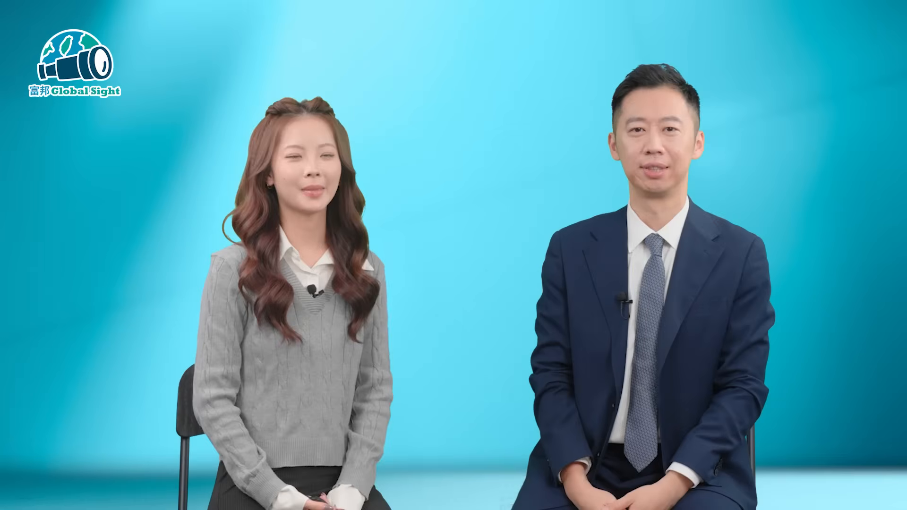

**逐字稿片段：** 各位觀眾朋友大家好,我是阿雅,歡迎回到 GlobalSight 在上一集的節目,我們 Sean 幫我們洗刷了對韓股的刻板印象 那今天我們很榮幸能夠再次邀請他來和我們聊聊韓股怎麼佈局 讓我們歡迎大華銀投信指數量化部門的主管 Sean Sean 您好 各位觀眾朋友大家好,我是大華銀投信量化部門指數主管郭修成 Sean

**話題推測：** 節目開場與主持人介紹，可能出現節目標題或來賓開場畫面

---

## 00:00:20

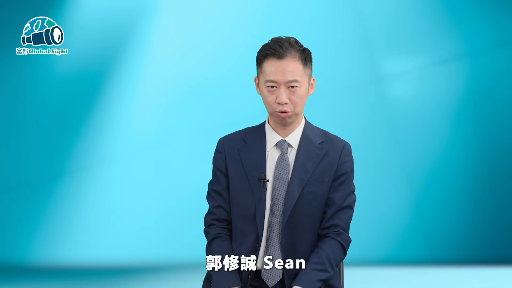

**逐字稿片段：** 富邦政證新戶優惠來囉 開戶急證 500 毛幣 完成指定任務再領 200 毛幣加 500 手續費抵用金 還有星宇航空布拉格商務艙雙人機票等你抽 心動不如行動 火速開戶做任務囉

**話題推測：** 切入富邦證券新戶優惠廣告，畫面可能轉為開戶活動與獎項資訊

---

## 00:00:41

**逐字稿片段：** 那Shang 既然我們確認HBM是AI時代的剛性需求 那投資組合上全球科技巨頭這麼多 臺股也有臺積電 那為什麼現在您反而會建議大家 要把一部分的目光留到這個韓國股市呢 我想投資AI的話 大家如果只是上網搜尋你想投資AI 你很有可能會投資到一些題材相關的股票 或是一些可能邊緣受益股 你真正投資AI 你可能投資不到最核心的一個部分 那當然目前AI的一個浪潮 我想說是延燒到HBM 那當然你是挑到 最核心的一個股市去投

**話題推測：** 回到主題並提出HBM與AI投資布局問題，可能出現AI、HBM或韓股主題簡報

---

## 00:01:24

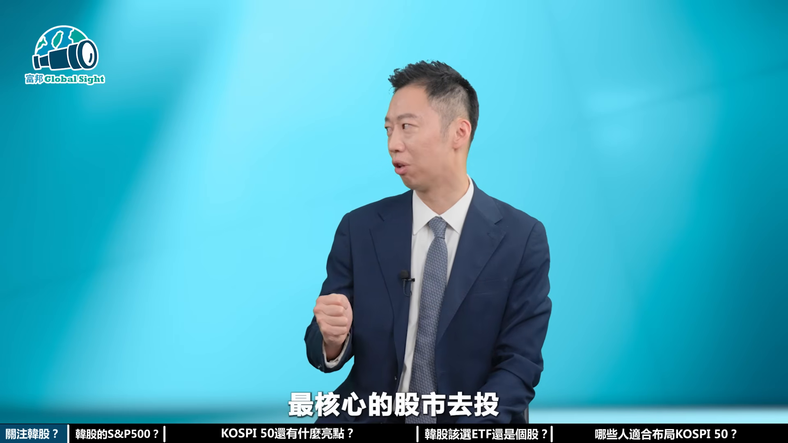

**逐字稿片段：** 那當然就是韓股 不過對於我們一般投資人來說 去富爾多開戶買韓股好像很複雜 更別說挑個股了 那我們知道美國有S&P500 代表美國的門面 那韓國有沒有類似的總指標 可以讓我們一眼看懂 輕鬆參與呢

**話題推測：** 講者明確指出AI核心投資標的是韓股，可能切到韓國股市或半導體產業圖表

---

## 00:01:42

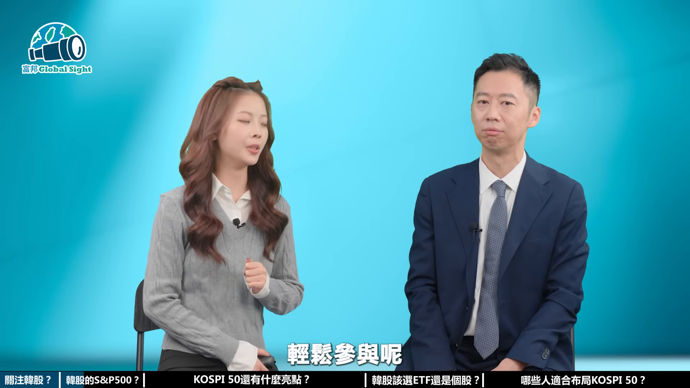

**逐字稿片段：** 韓國Cosby50 它就是代表整個韓國的一個 經濟體的可以說是縮影 那它就是一個韓國的門面

**話題推測：** 開始介紹韓國KOSPI 50作為韓國經濟縮影，可能出現指數介紹頁

---

## 00:01:50

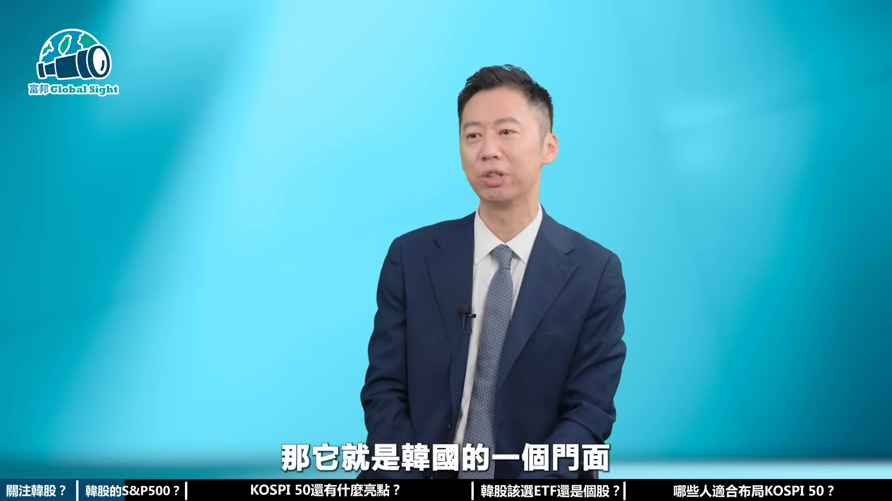

**逐字稿片段：** 那當然它除了大家所熟悉的三星 那可能裡面有一些LG 大家也可能有聽過 那當然SK海力士 它也是最主要我們目前的一個主角 那當然還有一些其他的 就像我們臺灣50裡面有一些金融股 他們也有韓國的金融巨頭 OK也有汽車 現代跟KIA 那再來是大型的通路的一些零售的一個股票都在裡面 所以投資韓國這樣子COSB50 你就等於算是整個投資韓國整個經濟的一個縮影 那聽起來呢 就是把韓國最強的50支經濟目綁在一起 不過我們既然要投資 我們還是得要看看這是基因能生多少顆蛋 那除了前面講的AI跟HBM之外 這個COSB50指數還有哪些重要產業 那可以值得投資人來關注呢 我想COSB50裡面除了 所謂AI相關的一個產業 接下來我們要關注的 大概是整個韓國股市的 它整個是國家隊的一個 政策的一個做多

**話題推測：** 列舉三星、LG、SK海力士等成分股，可能切到KOSPI 50主要成分股列表

---

## 00:02:50

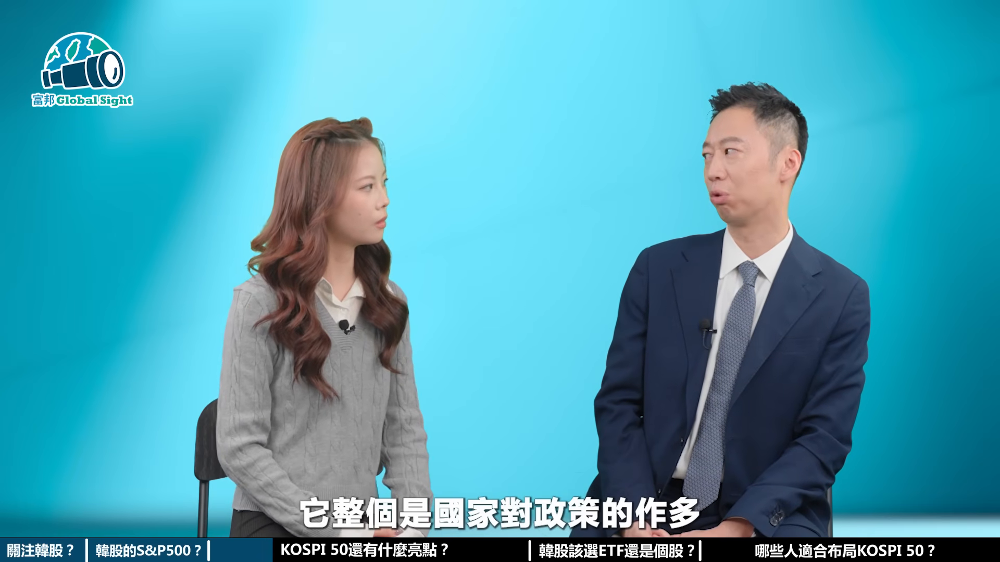

**逐字稿片段：** 大概是第一個引擎 當然我剛提到 就是說AI跟HBM的浪潮 這是可能是短中期 韓國股市最主要的推力

**話題推測：** 提出第一個投資引擎為AI與HBM浪潮，可能出現成長動能或半導體需求圖表

---

## 00:02:58

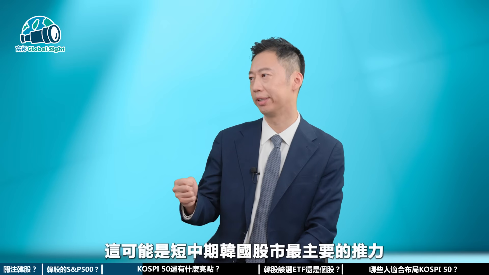

**逐字稿片段：** 第二個引擎是 以前的韓國股市 可能在配息 或是Value Up的一個提升 沒那麼多著重 但是韓國政府已經算是 有指示他們的一些財閥 希望可以改善這些 譬如說註銷庫場股 或是增加你們的股票的配型 你讓這個AI的革命的紅利 可以散發到韓國的普羅大眾 他們政府在整個經濟的宏觀角度上面 一個最主要的政策 當然我覺得也是一個很不錯的一個政策 因為畢竟如果你的 AI的一個工業革命紅利 只是集中在少部分的產業 或是他們常提到的財閥 那可能就跟以前的 韓戰之後的一個工業革命 沒有什麼太大的不一樣 真正的普羅大眾 還是沒有辦法享受到 AI革命所帶來的紅利 那再來第三個就是近期 大家也知道他們到美國去發行ADR 成績跟價格其實都不錯 甚至溢價 盤中可能溢價超過 可能有到達三四十的溢價 我講的是ADR跟韓國股市的溢價 那當然大家會想要提到說 那這樣子我可不可以進去套利 當然一般人都會這樣想 但是在ADR跟韓國股市 就像我們的臺積電的ADR 他們中間的轉換有些限制 它不是這麼的自由 所以在套利的空間其實是少之又少的 在如果是一般的Retail Market 是很難去做到這件事情 但是如果你反過來看的話就是說 竟然國外的投資者 對於你SAK海力士的評價 竟然可以溢價這麼高 那你反觀直接去投資韓國股市 相當於是用比較便宜的一個部分價格 去做投資 那接下來就是執行面的問題 很多觀眾朋友現在可能已經拿出手機 準備看怎麼下單 不過Sean我們還是要去研究 怎麼直接買個股 還是透過ETF來參與會比較聰明 那在兩者操作上有什麼差異呢

**話題推測：** 提出第二個引擎為韓國Value Up與配息政策，可能切到政策或股東回報相關簡報

---

## 00:04:58

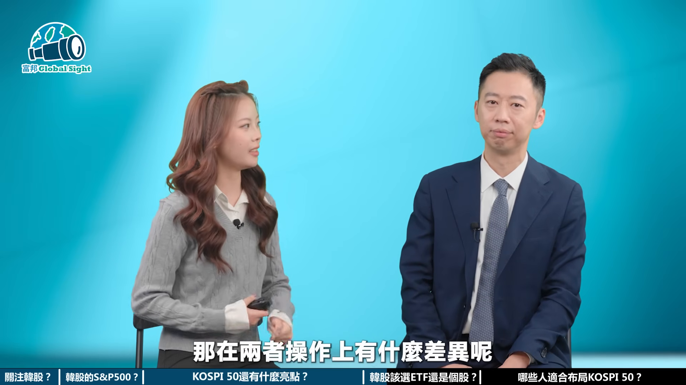

**逐字稿片段：** 我想投資上面有分 分散投資跟集中投資 或是你是價值型投資 或是成長型投資 每個人都有自己習慣的一個投資方式 但是如果以ETF的角度來講 當然第一首要是什麼 分散風險 不要把所有的籌碼都集中在一顆雞蛋上面 你應該是一籃子裡面的一個風險 它可以達到平均的一個分散的一個效果 我想這是我們發行ETF最主要的精神之一 在ETF的裡面你可以很分散的去做投資 我講的就是說你可能設計上面 可以用權重很分散 或是市值加權的一個設計 那這是兩種不同流派的 我們做出這樣的工具 讓投資人在不同的景氣循環 你去用那個工具去做投資 這是ETF發行商最主要的精神之一 以我們ETF來說的話 如果投資韓國 你可能一般投資人 沒這麼懂韓國的股市 當然你就是從ETF下手 是最好的 如同剛剛經理所說到的 小孩子才做選擇 那成熟投資人 就是可以用ETF一網打盡

**話題推測：** 講者開始比較分散投資、集中投資與投資風格，可能出現投資策略分類圖

---

## 00:06:03

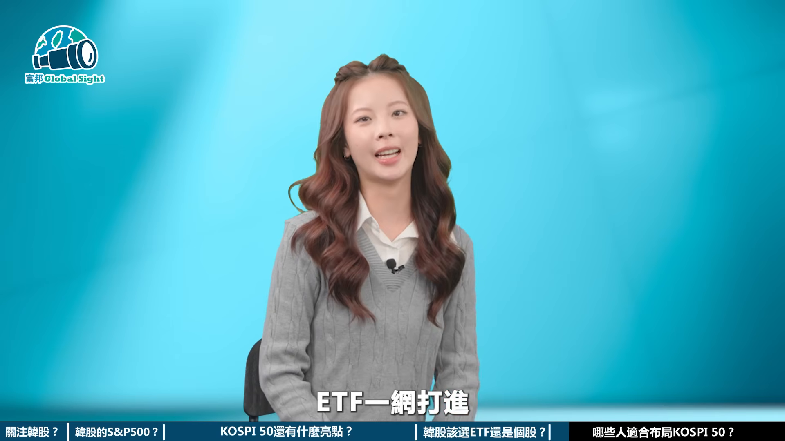

**逐字稿片段：** 那我們最後想要再請教 雖然韓股看起來潛力無窮 但每一種工具都有適合的體質 你認為什麼樣類型的投資人 適合把COSB50 納入自己的資產配置當中 那操作上有沒有策略可以提醒大家呢

**話題推測：** 主持人轉問適合哪些投資人與操作策略，可能出現資產配置或投資人類型頁

---

## 00:06:16

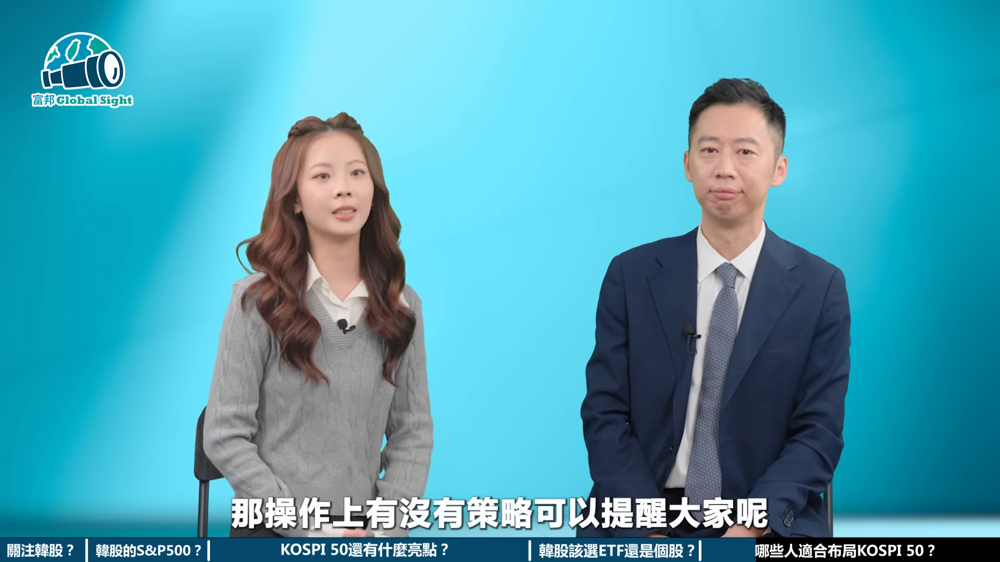

**逐字稿片段：** AI的浪潮我剛說的 主聲段剛開始 那我相信很多投資人可能還沒有上車 或是正主要上車COSB50 第一個它是屬於AI浪潮的一個 主聲段的其中一個商品 那當然它的韓國的一個本益比 或是什麼相對於其他估值比較低 所以這是不錯的一個選擇 那怎樣的投資適合這樣的商品呢 第一個因為它是COSB50 那50檔裡面三星跟海力士 它又是佔的權重相當高一點 就是我剛剛提到的 分散投資跟集中投資裡面的 比較偏向集中投資的ETF 當然它的波動會跟三星跟海力士的波動 比較有關聯 所以它的波動會相對其他 可能等權重的ETF還要來得大 你本來就在投資債券的一種 比較保守型的投資人 你當然可能就會放的資產配置 當然會少一點 你當然不能不投資AI 當然你可能自己在資產配置上面的權重 可能就要自己去琢磨

**話題推測：** 講者提出AI主升段剛開始與KOSPI 50估值較低，可能出現行情階段或估值比較圖

---

## 00:07:14

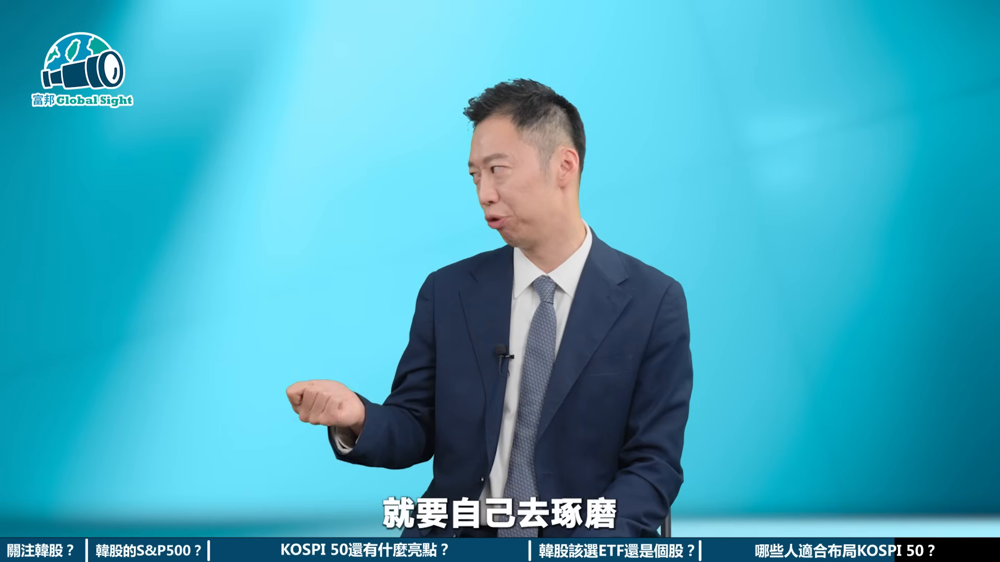

**逐字稿片段：** 再來另外一方式就是 比較忙碌或是我還沒有上車 但是AI的浪潮已經不知道要到哪裡了 你可以用什麼方式 定期定額的方式 因為它長期來說的話 它不會是很差的一個投資方式 所以總結來說我們算是把 把AI的一個浪潮裝進整個COSB 以韓國股市來說的話 就是把AI的浪潮裝進去一個ETF裡面 你買的ETF就是買的 整個AI的主聲段的一個浪潮 非常感謝Shion今天來到我們的節目 帶我們從更高的維度 來重新認識韓股跟HBM的戰略價值 想要跟上這波AI基建的重複行情 韓國COSB50 或許就是你不可或缺的科技拼圖 最後喜歡我的影片也不要忘記 訂閱按讚開啟小鈴鐺 我們下次再見 我們下次見 掰掰

**話題推測：** 提出忙碌或尚未上車者可用定期定額方式，可能出現定期定額策略圖

---
