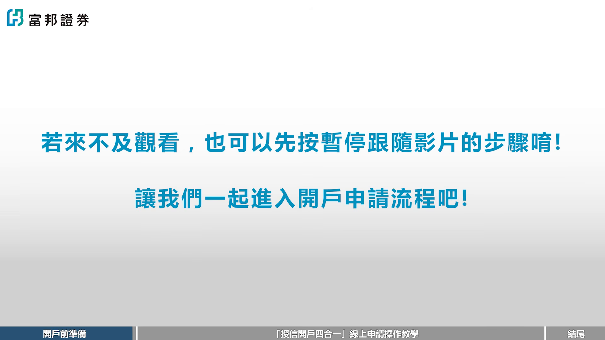
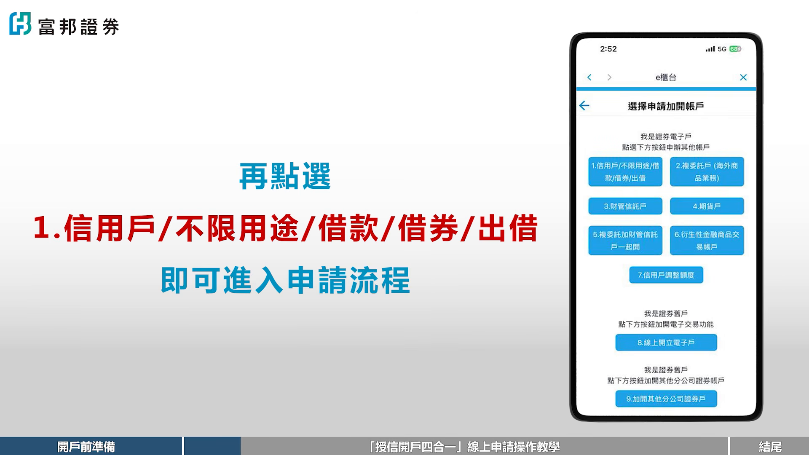
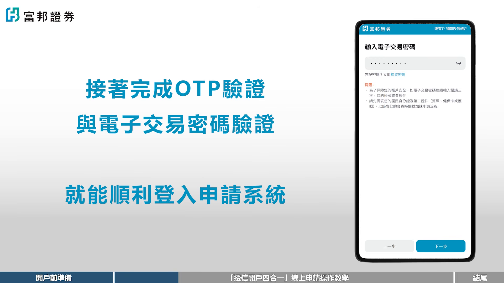
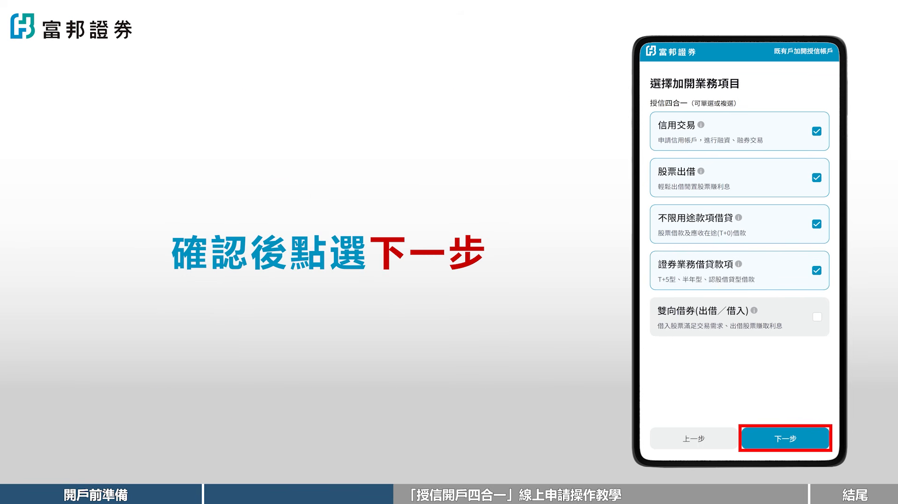
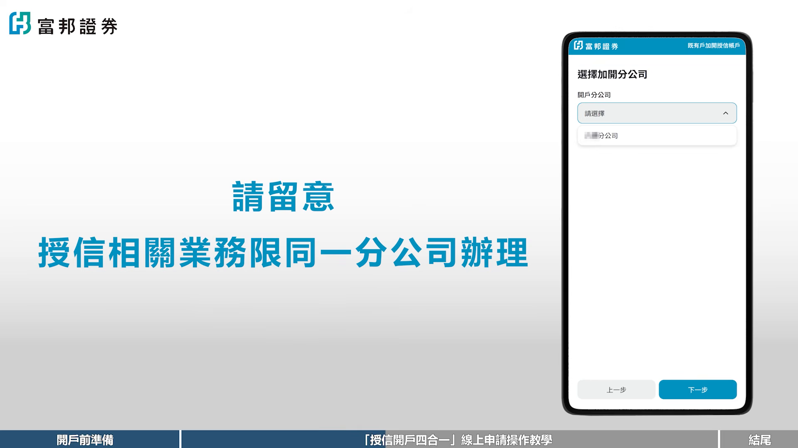
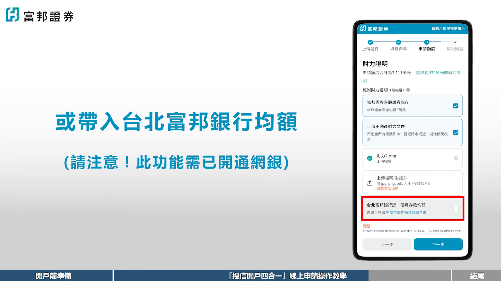
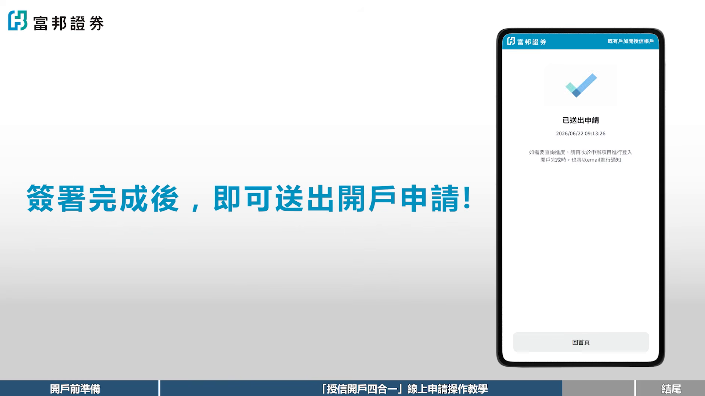
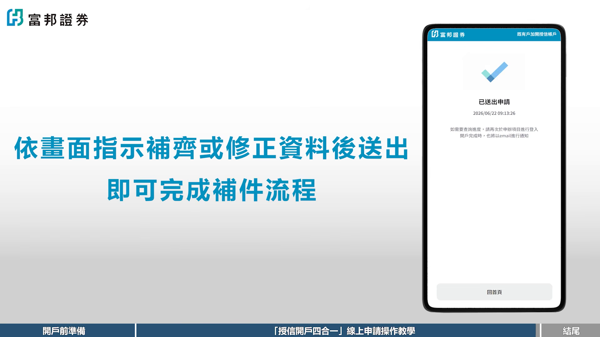

# fubonsec_mhIgas9TsMU — 關鍵畫面索引

- 來源逐字稿：[fubonsec_mhIgas9TsMU_FIN.srt](fubonsec_mhIgas9TsMU_FIN.srt)
- 影片：https://www.youtube.com/watch?v=mhIgas9TsMU
- 截圖數：9

## 00:00:00

**逐字稿片段：** 你已經是富邦證券的客戶了嗎? 這支影片我們帶您用五分鐘完成受信開戶四合一的線上申請。 一次整合信用交易、不限用途借貸、證證借貸與雙項借貸四大業務。 以上業務都在同一個申請入口,可以依據您的情況申請所需的受信業務。 開戶前準備。 申請開始之前,請先準備好您的身份證、證反面與第二證件、健保卡或駕照。 並依據申請業務規定準備彩利證明 並且確定您已具備中華民國稅級身份 就可以開始申請咯 如果來不及觀看的朋友 也可以隨時按暫停跟隨影片的步驟哦 讓我們一起進入開戶申請流程吧

**話題推測：** 影片開場，預期顯示富邦證券客戶與線上申請教學主題畫面

---

## 00:00:39

**逐字稿片段：** 步驟一 進入開戶鏈接 首先請先登入富邦AI Pro 點選衣櫃臺中的寄有庫加開 再點選新用戶 無限用途 借款 借卷 出借 即可進入申請流程

**話題推測：** 步驟一進入開戶連結，預期顯示富邦 AI Pro 或申請入口操作畫面

---

## 00:00:53

**逐字稿片段：** 步驟二 身份驗證 請輸入您的身份證字號與生日 接著完成OTP驗證與電子交易密碼驗證 就能順利登入申請系統

**話題推測：** 步驟二身份驗證，預期顯示身分證字號、生日與 OTP 驗證畫面

---

## 00:01:03

**逐字稿片段：** 步驟三 選擇申請項目 在這一步請勾選受信開戶 並依據你的需求選擇要申請信用交易 股票出借 補信用途借貸 證券業務借貸 雙項借券 確認後請點選下一步

**話題推測：** 步驟三選擇申請項目，預期顯示受信開戶與各項業務勾選頁面

---

## 00:01:18

**逐字稿片段：** 選擇開戶分公司 這一步請留意 受信相關業務僅限同個分公司辦理

**話題推測：** 切換到選擇開戶分公司，預期顯示分公司選擇欄位或注意事項畫面

---

## 00:01:26

**逐字稿片段：** 步驟四 上傳證件及填寫開戶資料與內部人聲明 一畫面指示上傳身份證正反面及第二證件 完成後點選確認上傳 接著填寫基本資料與職業資訊 如果申請項目包含不限用途借貸 雙項借卷或警派出借 系統會請您進行內部人身份資訊確認 步驟五 填寫申請額度與財力資料提供 這個步驟會依據您的需求填寫各項授信申請額度 並請您提供財力證明資料 您可以選擇臺股庫存資料 自行上傳財力證明檔案 例如他行財力、不動產等 或帶入臺北富邦銀行的均額 請注意,此功能需以開通網銀

**話題推測：** 步驟四上傳證件與填寫資料，預期顯示證件上傳、基本資料與內部人聲明頁面

---

## 00:02:11

**逐字稿片段：** 步驟六,簽署契約 最後一步,請您依據您申請的授信項目 逐一相約並勾選相關契約內容 簽署完成後,即可送出開戶申請

**話題推測：** 步驟六簽署契約，預期顯示契約閱讀、勾選與送出申請畫面

---

## 00:02:22

**逐字稿片段：** 步驟七 查詢審核進度 送出申請後 只要重新登入申辦入口 就能隨時查詢審核進度 如果系統顯示需補件 請點選立即補件 依照畫面指示補齊或修正資料後送出 即可完成補件的流程咯

**話題推測：** 步驟七查詢審核進度，預期顯示申請進度查詢與補件入口畫面

---

## 00:02:39

**逐字稿片段：** 好啦 是不是發現受信開戶很簡單 現在就動動手指把賬戶開起來吧 如果在操作過程中有任何的疑問 歡迎查詢您所屬的營業員 最後記得訂閱按贊 並把影片分享給那個 永遠都在說明天再開戶的朋友 那我們下次再見 拜拜

**話題推測：** 進入結尾行動呼籲，預期顯示完成開戶、聯絡營業員或訂閱分享畫面

---
