# smartmonthly-bw_-3z0BSuQ9p8 — 關鍵畫面索引

- 來源逐字稿：[smartmonthly-bw_-3z0BSuQ9p8_GT.srt](smartmonthly-bw_-3z0BSuQ9p8_GT.srt)
- 影片：https://www.youtube.com/watch?v=-3z0BSuQ9p8
- 截圖數：24

## 00:00:00

**逐字稿片段：** 美國跟日本 聯手進場干預了日圓匯率 市場立刻炸鍋 會不會又要重演 日圓利差交易 大量平倉引爆的 小型股災 大家好 歡迎再次收看 投資的一千零一夜 我是峰哥

**話題推測：** 開場導入美日聯手干預日圓匯率，預期畫面是日圓匯率或重大新聞標題。

---

## 00:00:19

**逐字稿片段：** 28年首見的 美日聯合干預日圓 這會造成股市 跟債市的風暴嗎 我們先看一下最近 AI股殺槓桿的風波 才剛停歇 可是上週又發生一件 28年來首見的大事情 就是美國跟日本 聯手進場干預了日圓匯率 那在此之前 日圓一度貶到 1美元兌163日圓 這是逼近40年的新低 然後兩國政府就出手了

**話題推測：** 正式提出28年首見美日聯合干預日圓的主題，可能切到影片主標題或日圓走勢圖。

---

## 00:00:49

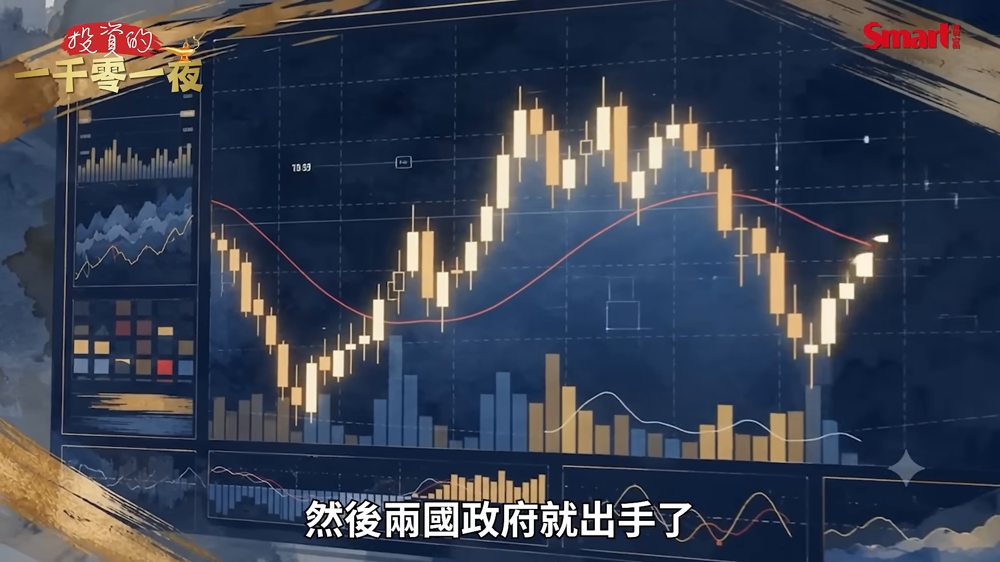

**逐字稿片段：** 硬是把日圓從163元 拉回到156元附近 速度非常的快 市場立刻炸鍋 因為大家腦海中 馬上快速浮現的是

**話題推測：** 說明官方把日圓從163拉回156附近，可能切到干預後匯率急升的走勢圖。

---

## 00:00:59

**逐字稿片段：** 會不會又要重演 2024年8月那一場 日圓利差交易 大量平倉引爆的 小型股災 那這一集我想跟大家 把這個事情的 來龍去脈說清楚 因為它牽動的不只是日圓 還有美國的科技股 美國公債 新台幣 最後甚至也會影響到 我們的台股 首先我們來回顧一下 在2024年8月5號的時候 因為出現了日圓利差交易的 大規模反向平倉 投資人就賣出 日股 美股這些風險性的資產 買回日圓要去還債 所以當天造成市場的反應 非常的劇烈

**話題推測：** 轉入市場擔心重演2024年8月日圓利差交易平倉股災，可能出現歷史崩跌新聞或指數圖。

---

## 00:01:40

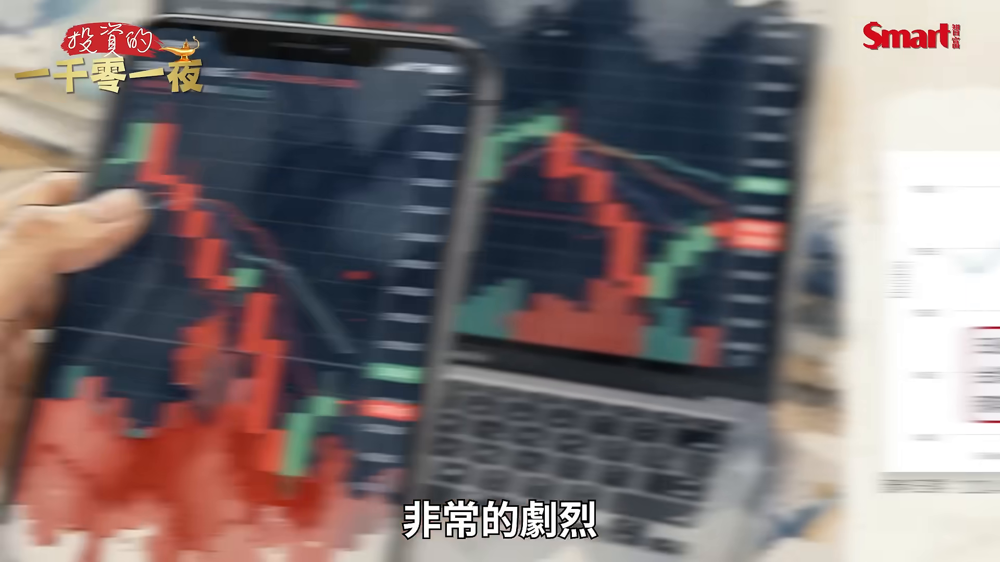

**逐字稿片段：** 日經225指數 當天居然下跌了12.4%

**話題推測：** 提出日經225當天下跌12.4%的關鍵數字，可能切到日經指數暴跌圖。

---

## 00:01:44

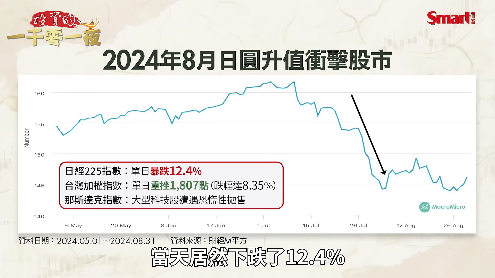

**逐字稿片段：** 台股下跌了1807點 8.35%的跌幅 這個跌點是當時的 歷史最大跌點 雖然現在看起來 已經被打破了 另外那斯達克跟 大型的科技股 也都受到了拋售

**話題推測：** 提出台股下跌1807點與8.35%跌幅，預期畫面是台股當日跌幅或加權指數圖。

---

## 00:02:02

**逐字稿片段：** 那接下來我們就跟大家 討論一下各種可能的情境 第一個問題是 日圓利差交易的資金 會不會真的要被迫平倉 什麼是日圓利差交易 過去日本長年是零利率 或者是低利率 它等於是全世界最便宜的 資金水龍頭 你可以幾乎不花成本 借到日圓 換成美元拿去買美股 拿去買美債 賺那4 5個百分點的利差 這就是所謂的carry trade

**話題推測：** 進入各種可能情境討論，畫面可能切到章節頁或情境分析簡報。

---

## 00:02:33

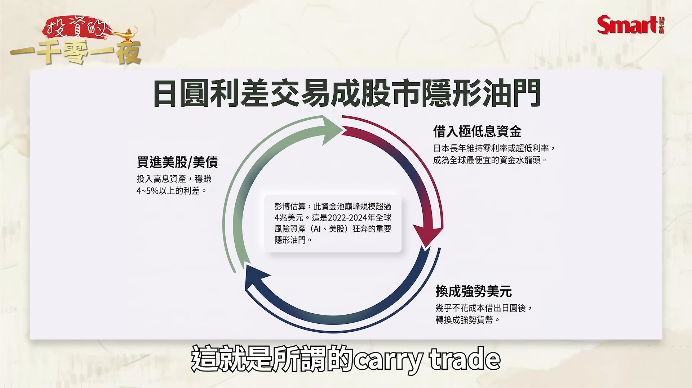

**逐字稿片段：** 那彭博就曾經估計過 這個池子最大的時候 全球規模一度超過4兆美元 那這是2022年到2024年 這一波的多頭市場 很重要的柴火 那被迫平倉什麼意思 就是當日圓開始升值 而想套利的人一算 匯率的損失 可能會把利差全部吃掉 所以他們必須當機立斷 賣掉手上的美股 還掉借來的日圓 本來這就是一個 正常的市場操作 可是如果市場上所有人 同時都做這個動作 那會怎麼辦 就會造成日圓愈升 風險資產就會愈跌 跌了之後就逼更多人去平倉 這個惡性循環產生 就會造成市場那個風暴

**話題推測：** 引用彭博估計利差交易池子曾超過4兆美元，可能出現規模數字卡或資金流圖。

---

## 00:03:20

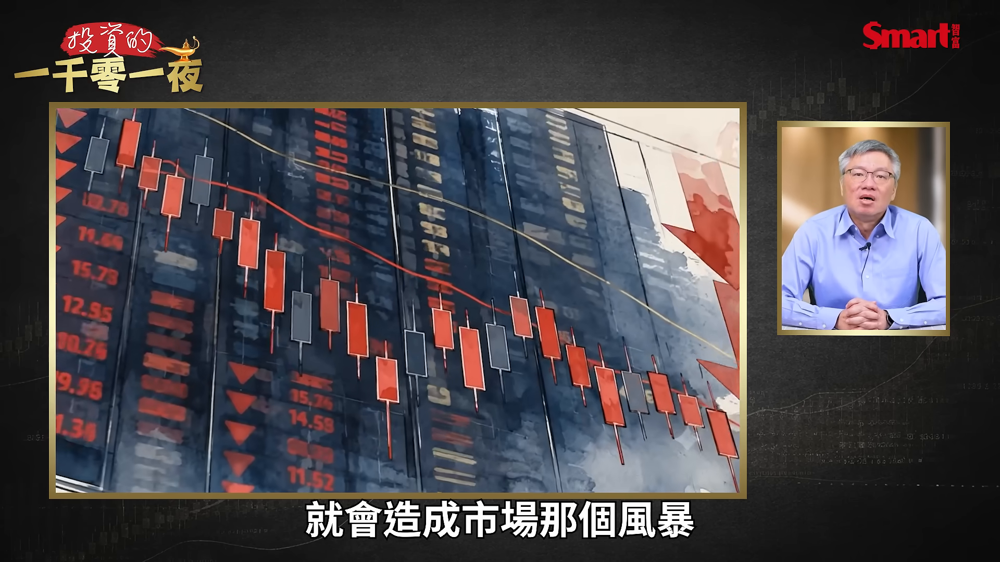

**逐字稿片段：** 那2024年8月5號那天 就是一個活生生的教材 當時的狀況是 日本央行升息 日圓暴衝 套利資金奪門而出 日股重挫12% 台股當日也重挫了 1807點 摜破了2萬點關卡 是當時台股當日最大的 單日跌點

**話題推測：** 再次以2024年8月5日作為活教材，可能切回歷史事件的市場暴跌整理圖。

---

## 00:03:41

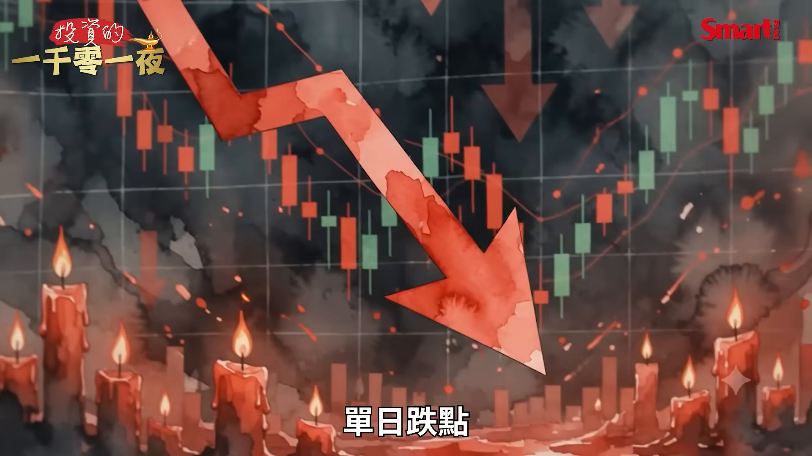

**逐字稿片段：** 那這一次會重演 當時的狀況嗎 我認為是暫時不至於 到這麼嚴重 關鍵的差別在於 當時的市場 它是看升日本利率 同時又預估美國聯準會 會快速降息 也就是說 日圓後續可能 還會繼續升值 可是這一次 日圓的弱勢 是自己本身所造成的 還要拉美國進來幫忙護日圓 因為日本央行很清楚 這次它只靠它自己 是護不住日圓的

**話題推測：** 提出這次是否會重演當時狀況並給出判斷，預期畫面是本次與2024年對比表。

---

## 00:04:13

**逐字稿片段：** 不過峰哥這邊要提醒大家 觀察這次日圓的後續動向 你眼睛不能只盯著東京 你還要盯著華盛頓 因為連川普都說了 是日本求他幫忙 雖然川普最近的說話 可信度不高 不過這件事我是信的 因為日本經濟 在結構性的弱勢下 日圓近期確實是有 貶不停的壓力 真的是必須要美國幫忙

**話題推測：** 提醒觀察日圓不能只看東京也要看華盛頓，可能切到日本與美國政策關係圖。

---

## 00:04:40

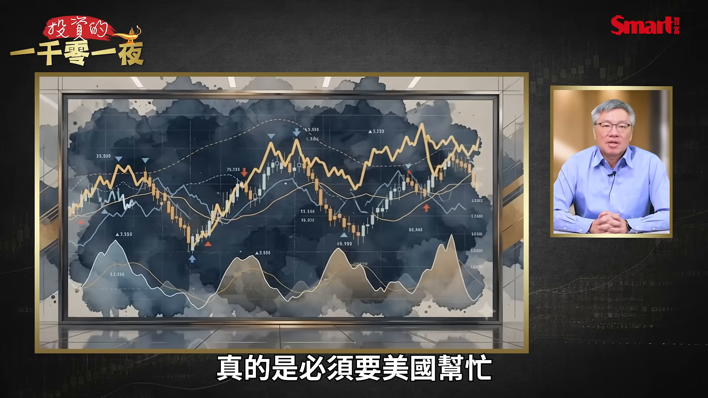

**逐字稿片段：** 接下來第二個問題 日圓升值 那為什麼會打擊到 美國科技股 這個問題可能比較多人疑惑 日圓是日本的事 干美國科技股什麼事 那答案就在剛才講的 套利機制 因為便宜日圓是接近 無息借來的 所以你想 如果你是一個美國的外資 你要借美元這個高利率 還是要借便宜的 日圓的低利率 所以如果你有那個能力 你當然會借便宜日圓 可是你借了便宜日圓 拿在手上幹嘛 當然是要把它換成美元 拿去買美國的科技成長股 這是現在市場上最擁擠 最熱門的交易

**話題推測：** 第二個問題轉向日圓升值為何打擊美國科技股，預期畫面是日圓與科技股連動圖。

---

## 00:05:21

**逐字稿片段：** 就是低成本資金 拿去買美國AI科技成長股 也就是說不管是前幾年的 美股七雄 到這兩年的AI股狂奔 背後多多少少都有 便宜日圓的影子 在後面幫忙撐這個行情 所以一旦日圓如果升值了 那就代表這些套利資金要回收 畢竟AI股也賺了那麼多 所以趁這個時候 見好就收 把這些套利資金回收 把日圓的債務還掉 這是一個 現在很合理的一個思考邏輯

**話題推測：** 說明低成本日圓資金買進美國AI科技成長股，可能切到AI股或美股七雄資金流示意。

---

## 00:05:54

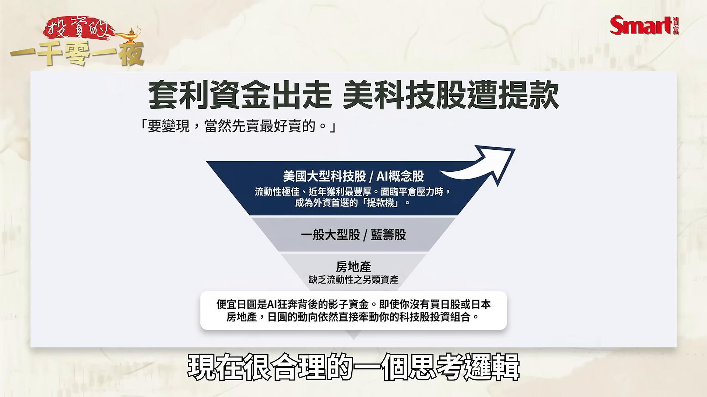

**逐字稿片段：** 所以第一個被提款的 當然就是這幾年 漲最多流動性又最好的 美國科技股 那其實這跟 外資提款台積電邏輯 是不是很像 所以因為他們要變現 那當然先賣最好賣的 那2024年8月那一次 日圓一升 所以那斯達克科技股 就跌得特別兇 所以我們要了解到 日圓雖然是日本的貨幣 可是等於是 全球風險資產的一個隱形油門 假設這個油門收了 那科技股可能會先感冒 那也提醒我們 AI股需要更多的資金來推動 你可能沒有買日股 或沒有買日本的房地產 但是日圓的動向要盯著 因為這個油門一旦收掉 那AI股的資金 可能就會不夠

**話題推測：** 指出第一個被提款的是漲最多且流動性最好的美國科技股，預期畫面是科技股賣壓或指數下跌圖。

---

## 00:06:42

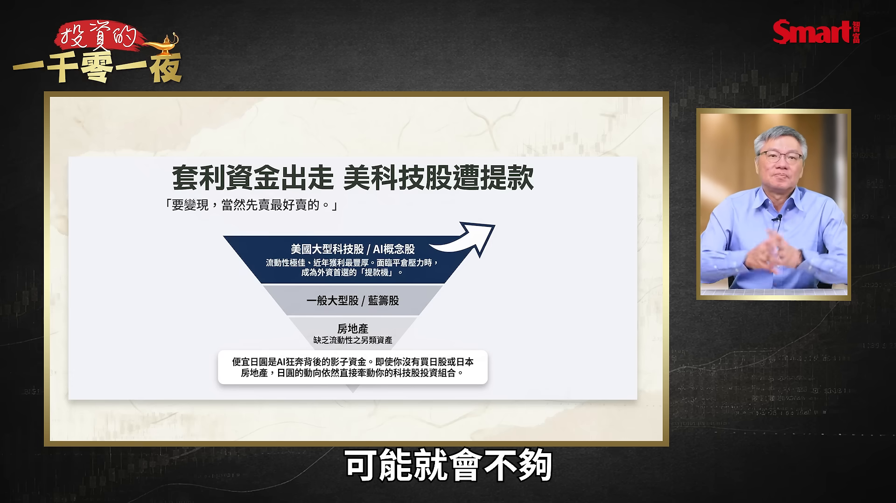

**逐字稿片段：** 第三個問題 日本如果被迫 大量賣美債去救日圓 美債殖利率會不會失控 那這個是這次事件的 真正核心

**話題推測：** 第三個問題轉向日本賣美債救日圓是否讓美債殖利率失控，可能切到美債殖利率圖。

---

## 00:06:52

**逐字稿片段：** 先給大家一個關鍵數字喔 日本是全世界 目前持有最多 美國公債的國家 手上目前大概有 1.1兆美元的美債 那如果日本要護匯 它就必須要去買回日圓 錢從哪裡來 最直接的方法 就是賣美債換美元 再拿美元去買日圓 所以問題就出在這裡 現在的美債市場 正站在一個 很脆弱的位置上 美國10年期公債殖利率 今年以來持續走高 目前已經來到 4.7%上下 這反映出什麼 就是反映出Fed的一個 政策偏鷹的態度 同時又有通膨隱憂 以及影響長期利率 最重要的就是 美國政府的赤字龐大 發債如流水 目前美國政府的債務總額 已經來到了39兆美元

**話題推測：** 提出日本持有約1.1兆美元美債的關鍵數字，預期畫面是各國持有美債排行。

---

## 00:07:41

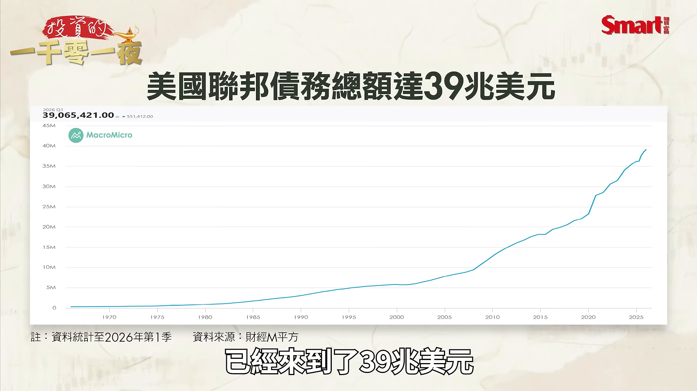

**逐字稿片段：** 我們來看這一張圖 你看這個火箭升空的畫面 是不是感覺很心驚 我憑良心說 如果拿日本跟美國的 財政紀律相比 我覺得台灣的財政紀律 真的算是很好的 那我們再回到美債的問題上

**話題推測：** 講者明確說看這張火箭升空圖，畫面應是美國債務快速攀升的圖表。

---

## 00:07:56

**逐字稿片段：** 如果美國在全世界的 最大債主日本 也被迫加入了 大賣美債的行列 那就等於在現在的 美債行情上火上加油 美國的長債殖利率 可能會瞬間失控往上 再噴出 進而就會衝擊到 全球最重要的定錨資產 就是美國的長債市場 就是這個最重要的定錨市場 一旦這個定錨資產 產生了巨大的波動 甚至可能會引發金融海嘯

**話題推測：** 回到美債核心問題並假設日本大賣美債，可能切到美債市場壓力或殖利率噴出示意。

---

## 00:08:26

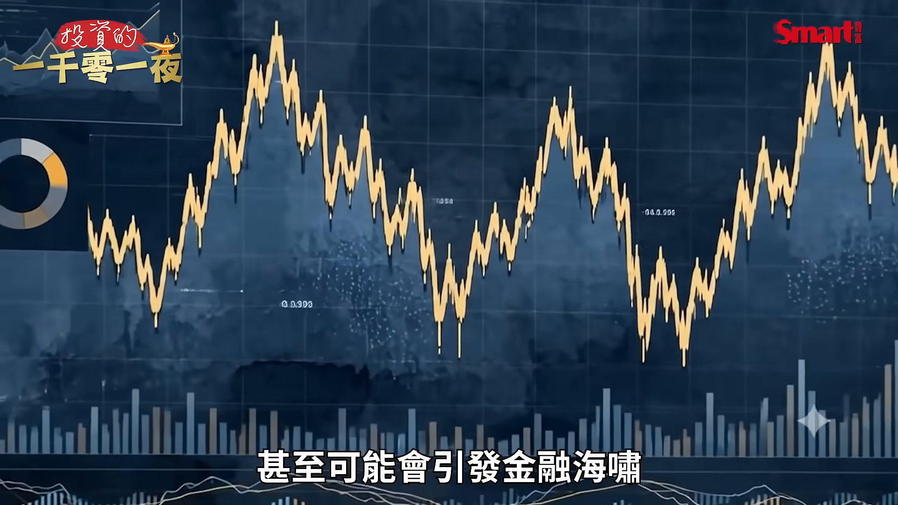

**逐字稿片段：** 所以如果看懂這一層 你就知道為什麼 美國這一次非出手不可 以往美國只要罵罵日本 說你們操縱匯率 日圓就乖乖的 止跌回升 但這一次美國也看穿了 日本光靠自己是 扛不住日圓的 所以美國必須進場 把日圓撐住 這其實是美國在自救 它並不願意看到日本 被逼到要最後去 大賣美債來救日圓 所以美國做了這一步 它表面上是 幫了日本幫了別人 其實是在保自己

**話題推測：** 解釋美國為何非出手不可，預期畫面是美國協助支撐日圓以保護美債市場的邏輯圖。

---

## 00:09:00

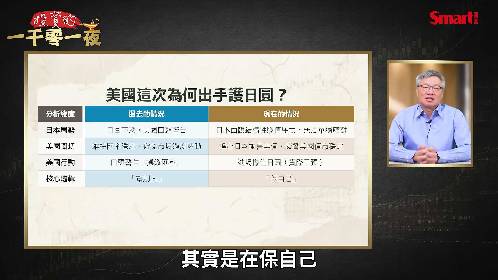

**逐字稿片段：** 所以從這件事 我們要隨時留意 現在掌握全球 市場命脈的風向球 就是一個重要的風向球 但又不是每天會影響市場的 是美國的長債殖利率 它比單一公司的財報 比中東的戰事 影響力都更大 只是說它長期是在一個 比較有序的控制下 它可以被接受是在一個 有序的波動裡 那就不會對市場 造成很大的影響 可是最好不要 急速的波動 如果急速波動 一定會出大事 所以記得 最好每天花一分鐘 把美國10年期公債 跟30年期公債的殖利率 放進你的監控儀表裡 看看它 不要看到它波動太厲害 如果它波動太厲害 你就可能要小心 連動到其他你的相關 風險性資產

**話題推測：** 總結全球市場風向球是美國長債殖利率，可能切到監控儀表或殖利率曲線。

---

## 00:09:50

**逐字稿片段：** 接下來第四個問題 如果日圓升了 那為什麼新台幣沒有升 大家最近可能 開始有點哀嚎 因為之前想說日圓一直兌台幣 一直貶 這個甜甜價 不斷有更甜的價位 最近突然甜甜價位都沒了 所以如果最近想要 去日本玩的人 突然覺得 怎麼這個拉麵變貴了 所以很多人就直覺想 日圓升了 照理過去的經驗 亞幣不是應該一起變強嗎 怎麼這一次新台幣兌日圓 反而有點貶值 我們來看一下這個圖 這就是新台幣兌日圓 最近稍微有點貶的狀況 那我來解釋一下這個原因 第一個這次干預主要是針對日圓 不是全面性的打壓美元 因為美方這邊的操作是 賣歐元買日圓 日方這邊的操作是 賣美元買日圓 大家可以注意到 這兩個節奏不一樣 整套操作裡面 避免美元過度承受賣壓 所以它沒有大規模 拋售美元 就不會造成直接去刺激 新台幣升值的力量

**話題推測：** 第四個問題轉向日圓升值但新台幣沒有升，預期畫面是日圓與新台幣匯率比較圖。

---

## 00:10:51

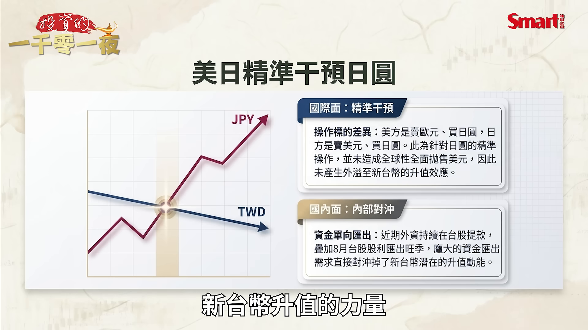

**逐字稿片段：** 第二個是 因為外資最近也持續的在 台股提款 再加上8月本來就是 台股發放股利 然後外資收到股利 又要把它這些股利匯出去 所以也會形成了 賣新台幣買美元的 一個動力喔 這也就對沖掉了新台幣的 可能的升值動能

**話題推測：** 第二個原因轉向外資台股提款與股利匯出，預期畫面是外資買賣超或資金匯出圖。

---

## 00:11:09

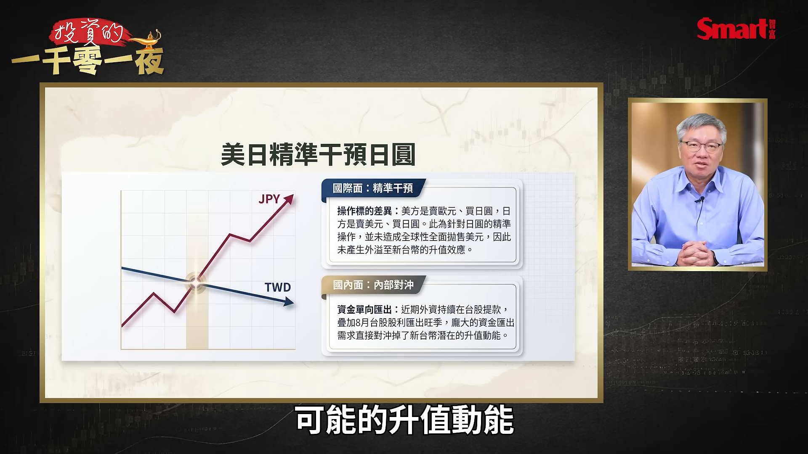

**逐字稿片段：** 接下來我們看 第五個問題 就是這個狀況 會影響台股嗎 我們前面有說到 這次日圓利差交易 沒有被大量平倉 本來基於這一點 對台股 基本上應該是說 影響不大的 可是我們要留意一件事

**話題推測：** 第五個問題轉向這個狀況是否影響台股，可能切到台股大盤走勢或章節頁。

---

## 00:11:27

**逐字稿片段：** 就是台股7月波動 很不尋常 從6月高點48218點 一路殺到7月盤中低點 39384點 這過程中重挫了8800多點 所以這反映出 現在的市場信心是 比較不足的 要注意這重挫8800多點 當中並沒有日圓利差交易 造成的問題喔 所以在這個目前是 波動放大的狀況下 如果有任何新的 影響市場因素 或是新的利空 我們都要留意 會不會再來一次 回馬槍喔 特別是 最近台股在反彈的過程中 量能其實是不太夠的 也就是說 在這邊換手不積極 表示這個底部 也沒有很堅實喔 所以它是經不起 比較大的 利空再來衝擊一次 那所以我們要留意 上一波韓股清槓桿 結果拖累了台股 整個也雪崩式的下跌 所以這次我們要盯著 日股有沒有因為這個狀況 而產生後續的大波動 那至於在日圓 最近升值的狀況下 要不要特別去買進 日圓資產 可能有人會這樣想 那是不是要買進日圓資產 反而好像可以賺到 日圓資產升值的機會 那我的觀點是這樣 163日圓這個價位附近 是美國跟日本官方 聯手畫出來的紅線 紅線在這裡 不是說這個紅線 絕對不能被跌破 但至少來到這裡 你要知道官方在這裡 就是不太開心了 所以你很難討到便宜 所以至少我們可以肯定一件事 日圓不容易再大貶 但這不意味著

**話題推測：** 提出台股7月從48218點殺到39384點、重挫8800多點，預期畫面是台股波段下跌圖。

---
