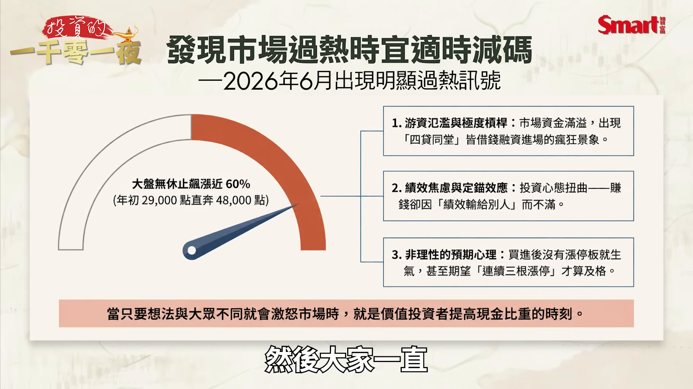
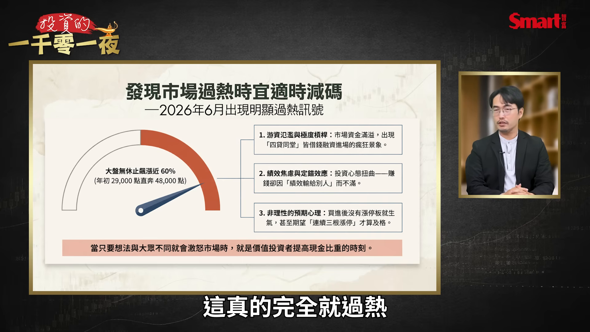
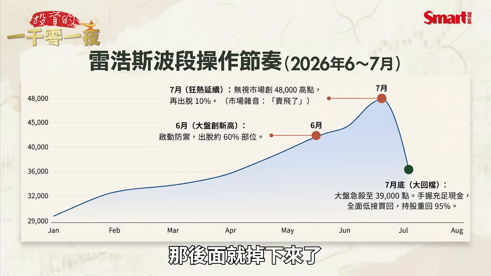
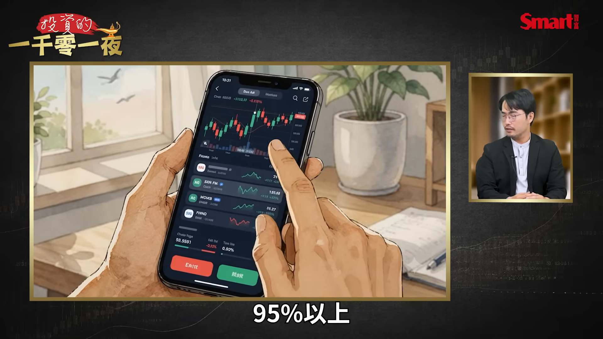
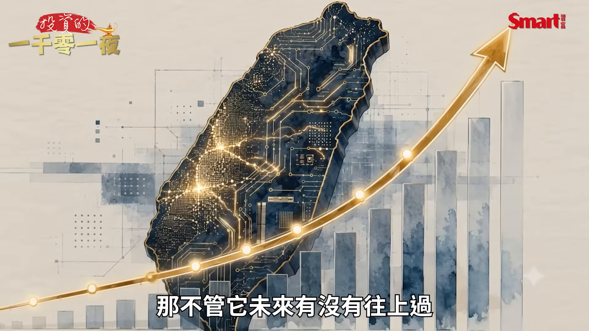
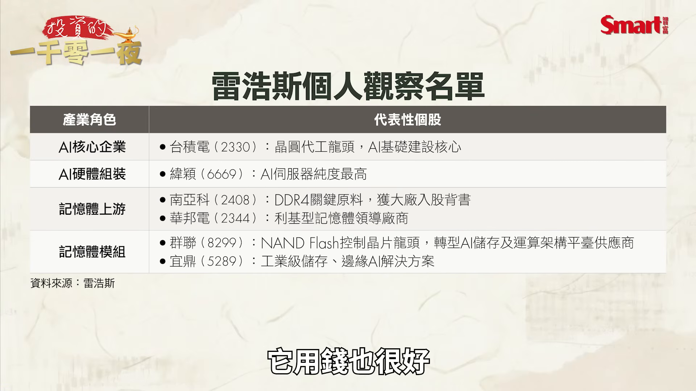
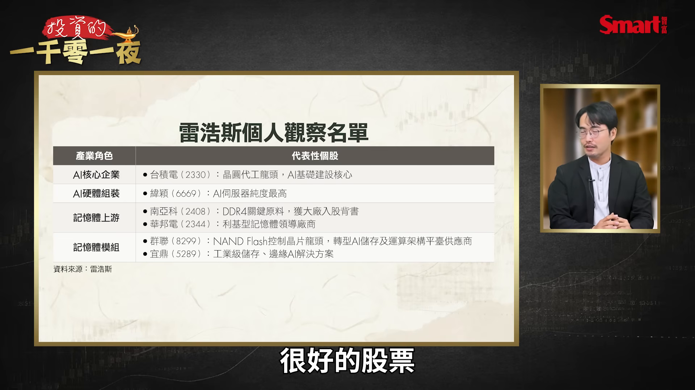
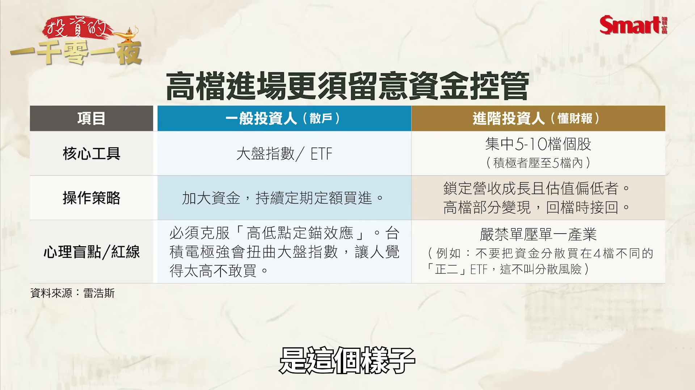
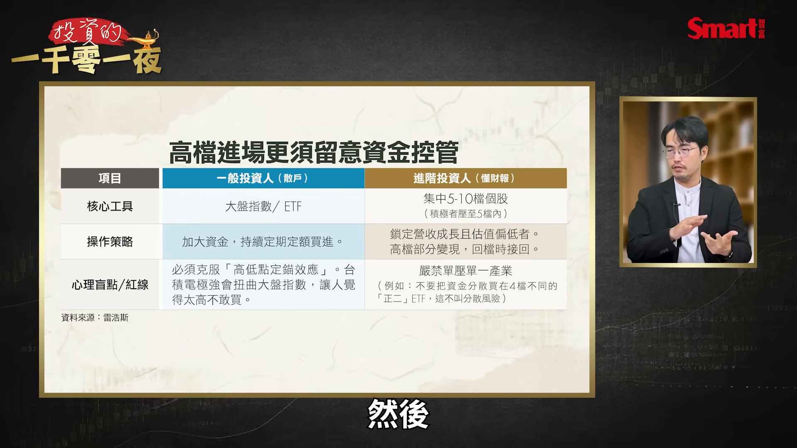

# smartmonthly-bw_5wLmS5-slJY — 關鍵畫面索引

- 來源逐字稿：[smartmonthly-bw_5wLmS5-slJY_GT.srt](smartmonthly-bw_5wLmS5-slJY_GT.srt)
- 影片：https://www.youtube.com/watch?v=5wLmS5-slJY
- 截圖數：19

## 00:00:00

**逐字稿片段：** 前一陣子殺到 快3萬9000點 我就趁那個時候 撿了非常多的股票 我又把全部的投資組合 幾乎是買回來 現在持股是 95%以上 大家好 歡迎再次收看 投資的一千零一夜 我是峰哥

**話題推測：** 開場鉤子提到大盤殺到3萬9000點與持股回補，預期畫面會呈現重點數字或投資組合狀態。

---

## 00:00:16

**逐字稿片段：** 台股今年真的非常刺激 我們相信 投資人也賺了不少 不過因為這個 7月的大回檔呢 就開始讓 大家也有點震撼 原來喔 賺錢不是這樣 閉著眼睛就這樣 又大賺上去了 所以呢 在一個比較相對 進入高檔的時候呢 這個真的是 資產配置或者是 相對應的操作 真的愈來愈重要 我們今天幫大家邀請來 就是這方面的專家 雷浩斯 雷大 先跟大家打個招呼 哈囉大家好 峰哥好

**話題推測：** 正式進入台股今年行情回顧，可能切到台股走勢或年度漲跌圖。

---

## 00:00:46

**逐字稿片段：** 你前一陣子喔 前一陣子我看 你跟大家說 可能會有回檔下來 那時候市場 漲得正高的時候 大家都罵 不要亂講話 不要亂講話 來先講講你當時的心情 就你想一下

**話題推測：** 主持人提起來賓先前預警回檔，話題轉到市場高檔時的判斷背景。

---

## 00:00:59

**逐字稿片段：** 其實我們年初的時候 （大盤）大概2萬9000點 你到差不多 6月初到6月 6月底那時候 漲到4萬8000點 對 其實 都沒休息喔 就這樣 就上去了 漲了差不多快60% 這在台股以前 歷史到現在 很少有這種事 過去幾年是每年30% 已經很厲害了 那一到這個 60%的時候 我就覺得 第一個它很驚人 第二個是市場的游資太多

**話題推測：** 來賓開始用年初2萬9000點到6月底4萬8000點說明大盤漲幅，適合呈現指數走勢圖。

---

## 00:01:25

**逐字稿片段：** 然後大家一直 不斷的去借錢 四貸同堂 甚至大部分的人 其實已經狂熱到 你投資賺錢你心情不好 因為你績效輸別人 你買1檔股票你漲了 你不高興 你要它漲停才高興 賺太少 那可能漲停還不高興 你希望它漲3根才高興 所以那個時候變成說 你只要你的想法 跟別人不一樣 那市場上的人 是會生氣的 這叫什麼 這就是真的是過熱 這真的完全就過熱

**話題推測：** 開始談市場游資、借錢與投資人狂熱，畫面可能切到融資或市場情緒資料。

---

## 00:01:50

**逐字稿片段：** 那過熱的時候 像我們這種做 價值投資的 就很清楚一件事 過熱的時候 你就要提高現金比重 那當然 當我提高現金比重的時候 我就是先 先出掉一部分 我在那個時候 6月的時候大概就出掉 差不多快60%吧 對 網路上還有人過來說 你出掉之後 還創了 大盤還創了新高 到4萬8000點 一個經驗夠久的投資人 我也夠久了 我也做了20幾年了 過熱 出掉一點 是很合理的事情 因為它就是過熱 那沒有人能夠 出到最高點 那後面就掉下來了

**話題推測：** 提出過熱時價值投資者應提高現金比重，可能呈現資金配置示意圖。

---

## 00:02:24

**逐字稿片段：** 而且其實我7月的時候 我還有繼續出 所以6月的時候 我大概出了快60% 7月的時候 我再出10% 那今年 那個7月下跌 對我來講就沒差 我還有很多的子彈 可以進場 那你可以分享一下 那你今年到現在為止 你的操作狀況 大概怎麼樣

**話題推測：** 補充7月繼續減碼10%，並說明下跌時仍有資金進場，可能呈現時間軸操作紀錄。

---

## 00:02:42

**逐字稿片段：** 其實今年的績效 算滿不錯 整體投資組合績效 大概是85% 那相對大盤的話 目前大盤 大概是55%左右啦 所以我自認是滿不錯的 那而且像前一陣子 前一陣子從殺到 快3萬9000嘛 其實大盤從高點 算是回落20% 但個股的體感 比較不一樣 有些砍了5成 很多個股的感覺 像是中小型的 他會覺得說 哇塞 怎麼會跌得亂七八糟 看起來跟腰斬一樣 那種狀況常常 你就會變成 抱了一座山 又是一座山 高檔沒有賣 後面它又回到了 你原本的原點 雖然不見得會虧錢 但很多人就會因此 心情不好

**話題推測：** 主持人詢問今年績效，來賓提出投資組合85%與大盤55%的比較，適合切到績效對照圖。

---

## 00:03:20

**逐字稿片段：** 我就趁那個時候 已經撿了非常非常多 在7月底 撿了非常多的股票 我又把全部的投資組合 幾乎是買回來 現在持股是 95%以上

**話題推測：** 開始說明7月底大量撿股票並回到95%以上持股，預期畫面呈現加碼或持股水位。

---

## 00:03:30

**逐字稿片段：** 那你的主要的 投資的產業或標的 可以跟我們分享一下 其實現在來講 我們最重要是因為現在

**話題推測：** 主持人轉問主要投資產業與標的，畫面可能切到產業配置。

---

## 00:03:37

**逐字稿片段：** 大家都是因為AI 這個時代 這大家已經知道了 那我認為AI的重點 在於它是一個接近 工業革命等級的變化 那搞不好其實是 我們這輩子 只會遇到一次的 這種超級經濟成長率 所以你可以看到上半年 台灣經濟成長率就暴增 所以選股一定是選 AI相關的 那我們就要再 從裡面找 它的供給跟需求 供需缺口很大的 也就是它是一個 缺的東西 那目前來講 最缺的就是記憶體 那記憶體既然缺的話 那我們就可以 把很多部位放在 記憶體上面 其實像記憶體主要 年初到現在我 其實南亞科也有 華邦電也有 群聯 宜鼎統統都有 對 你不會覺得有點 太集中嗎 太集中喔 還是說就是要這麼集中 才會火力強 沒有我之前 也還有台積電 但是相對高點的時候 我有先 先把它賣出一部分 那當然其實我覺得 集中火力強 並不代表有風險 因為風險是 你不知道你在幹嘛 那個才叫有風險 那還有 一旦你做了 集中投資的時候 你績效創下新高的時候 你就要進行動態調整 集中投資不是叫 你完全抱住 對而且 集中投資 不是一開始我就給 它梭哈 凹下去 而是我一開始可能會 先下一些測試單 然後對它有一些假設 我假設後面的營收成長 假設後面的獲利提升 然後當財報裡面 所有的資訊都出現了 一步一步驗證我的假設 而且我的方向正確的話 我就把部位愈來愈集中 你剛才講的是一個 比較順利的狀態 那如果不順利就是說 你試單之後 後面表現得不如 你的預期 那你會做什麼樣的調整 首先你要先重新 檢查一次基本面 基本面知道 如果基本面出來了 跟你想的真的不一樣 那你必須認賠 因為你就看錯了嘛 這個時候你就是要 做一個正確操作 要不然跌了之後呢 跌的時候大部分人情緒 就會愈來愈糟糕 然後就會進到一個 操作上的負面循環 所以如果不如預期 說真的就砍掉就好了 我覺得有時候就是 沒有那個勇氣啦 因為其實套牢還是一件 帳面一點虧損還是小事 怕的是這個 資金卡在那裡之後 失去了你後面 賺錢的機會成本 對 沒錯 所以其實資金卡住 才是最危險的事情 那現在也跟我們 再分享一下說 這個時段呢 你覺得是一個相對 應該繼續撿便宜的階段 還是說 要再留意接下來可能 修正的風險 因為畢竟最近呢 是站上了季線 又往上一點點 可是呢大家也擔心 會不會 4萬8000點也不對 不是那麼容易 一次就過去 其實大家 所有的投資人的困擾 以前到現在的困擾 都很接近 就是 沒有買怕它漲 買了以後怕它跌 對 怕 永遠都這樣子 那這時候你就是必須要 用資金控管的方式 這是一個 第二個是我認為 大趨勢沒有改變的東西 你就是要抱著 甚至在回檔的時候 就產生加碼 那不管它未來有沒有往上過

**話題推測：** 來賓切入AI時代與工業革命等級變化，預期畫面切到AI產業趨勢或宏觀成長圖。

---

## 00:06:31

**逐字稿片段：** 那我認為 第一個是 我們現在經濟成長率好 而且我們持續的 關注台積電法說會 釋出的消息 然後它的獲利 它的EPS 或者短期間的 例如它的每月的營收 只要這台灣最大權值股 然後又是AI最 重要的中心 持續上升 其實它就本質上 就是會一直上升 所以有沒有過都沒關係 哪個時間點過也沒關係 因為長期下來 這個持續是會上升的 所以基本上 我是不煩惱的

**話題推測：** 來賓開始列出台灣經濟成長率、台積電法說會、EPS與營收等支撐因素，畫面可能切到基本面數據。

---

## 00:07:01

**逐字稿片段：** 如果它跌下來的話 我們資金控管做得好 然後你不要融資 在這個時候 我們講不要融資 反而是需要勇氣的事情 照道理來講 你是借錢買股票 才需要勇氣 現在你跟大家講 不要融資 真的是一個 今年以來確實是這樣 你叫人家 不要融資都被罵 是別人來罵你 別人一定罵 你賺得少 但是你知道嗎 在這種狀況下 任何回檔我就不用怕啦 對吧 因為公司的 基本面好 它有獲利能力 帳上現金多 負債低 更甚之有些有負債的公司 它其實是為了抓住 後面的成長機會 那你只要看出這些 老闆怎麼用錢的 一個方式 了解這些方式之後 你持股就可以很安心 漲跌不會影響你 而且如果你自己的 投資組合 你有做你的生活預備金 那漲跌其實跟你 沒有關係 你可以撐過 下跌的所有狀況 更重要的是 當前面一波下跌 已經讓一些 比較猶豫的人出場了 這個時候 你進場的成本相對低 所以反而是不用害怕的 你剛才講到一個 就是再進場的問題 不管是前面沒賺到的 或者是賺太少的 那現在又要再進場 那你覺得應該 要怎麼去選股票 我覺得還是要選 AI相關並且 供給跟需求 落差很大的個股 然後你的投資組合裡面 對大部分的人來講 神山就是必備 為什麼因為 大家最討厭就是 大盤漲你的股票沒有漲 所以如果 你有神山就沒有差 再來就是其他 可能跟年底裡面 跟NVIDIA相關的 相關的一些 不管是組裝啊 或者是不管是一些 一些ASIC啊 這些晶片相關的 或者是散熱啊 或者是記憶體啊 這些 AI全系列 把它打包起來 因為台灣的 競爭優勢是什麼 就是我們從AI 最上面的 從那個晶圓代工 到後面一直到封裝 全部都在一起緊密的 接合在一起 這就是台灣整體產業上的 競爭優勢 那你自己的投資組合 你也可以把這樣 直接包起來 那你的風險就會相對低 並且有跟上 我們整個 一個整體的產業趨勢 那你在各個這個 我們說整個產業裡面的 各個的主要的觀察名單 可以跟我們介紹一下 其實我個人是 一定會挑 ROE比較高的 所以你看像台積電 它用錢也很好

**話題推測：** 話題轉到跌下來時資金控管與不要融資，可能呈現融資風險或槓桿警示。

---

## 00:09:17

**逐字稿片段：** 再來像組裝廠的話 我去年靠緯穎 賺了很多錢 那相對高點我出了 出了滿多的 那其實今年 今年我又把它 出了一部分 那雖然低點 我很想把它接回來 但沒有接 沒有低點啦 對 因為沒有低點 但緯穎本身 還是一間很強 很好的股票

**話題推測：** 話題切到組裝廠緯穎與去年獲利操作，畫面可能呈現緯穎股價走勢。

---

## 00:09:38

**逐字稿片段：** 像最近漲很兇的川湖 它漲得太兇了 所以我要先說 這個價位1萬2000元 價位是有風險的 但是以基本面 它是很強勁的 只是它現在的 股價實在是太高 它的財報沒有風險 它的風險是股價太高的 估值風險 有這種風險的話你就 就這個價位 都不要去碰它 要不然太危險

**話題推測：** 開始談近期漲很兇的川湖與1萬2000元價位風險，預期切到川湖股價或估值圖。

---

## 00:10:03

**逐字稿片段：** 那當然也有像其他的 我覺得很缺的記憶體 那可能它到明年 其實都還是會缺 雖然記憶體 大家可能會講說 如果報價沒有再上漲呢 其實上漲它不可能永遠的上漲 所以記憶體的毛利率 就像是美國那些美光 都80幾%了 很高了 對 超越台積電 但是它不可能 再一直上去 因為如果再上去的話 對你底下的客戶 跟底下一些產業 可能會有負面影響 所以 那個不要管它所謂的 加速度 不要管它毛利上升 很像是一個加速度 但是它的獲利整體都 還是會持續的上升 因為這很重要 因為AI來說 AI工廠 AI資料中心 最後你生產出來的東西 就是要儲存 所以儲存相關的個股 也是要多注意 確實是記憶體漲太多 我本來電腦還 要加一下RAM 你看它漲這麼厲害 我都忍一下算了 將就一點 先撐一下好了 有啊 我自己都有買 我都提早的在蘋果 漲價之前 就買了Mac 買了iMac 記憶體漲價之前 我趕快去買 買那個隨身硬碟啊 買那個大姆哥(USB 隨身碟) 全部都該買的都買 這一波真的大家都是 如果換太慢了 就只能等著被漲價 要不然用股市賺到的錢去買 最後一個我們聊一下 就是說在目前這個行情 這現在這個位階 還有這個市場的 風險情況下 那你的資金配置的 給大家的建議是什麼 大部分的投資人 我覺得就是 如果你是 很一般的投資人 其實我還是建議 你是要買指數 但你可以買多一點 而且 持續的定期定額買下去 不要被高低點所影響 因為現在台積電太強 所以它會影響 股市的高低 然後大部分人 以往的舊經驗 就是你是按照 股市的高低點 去被錨定了這個心理的樣子 你就覺得一直很高 不敢買 所以如果是一般人的話 是這個樣子

**話題推測：** 話題轉回其他仍很缺的記憶體，可能切到記憶體產業景氣或明年供需展望。

---

## 00:11:52

**逐字稿片段：** 如果你是厲害 一點的投資人 甚至你懂得看報表 也有相關的獲利經驗 獲利經驗也很不錯 那你可以集中一點 例如持股 就是5到10檔內 你更積極一點 你就可以壓縮 到5檔以內 但你的整體績效 只要確認這5檔股票 它的營收獲利成長 估值偏低 然後

**話題推測：** 轉向較有經驗投資人可集中持股5到10檔，預期畫面呈現持股檔數與配置範例。

---

## 00:12:15

**逐字稿片段：** 你要避開一些產業 你不要跟我講 我5檔全壓記憶體 雷大 我還有一個網友 跟我開玩笑說 雷大你好 我壓了4檔 分散4檔 4檔都是不同 公司的正二 這不太對吧 都是追蹤同一個指數 對 都是正二 但是是四個不同正二 這個不叫分散風險 就你可能要調然後 你可能就是要不同 產業要避開 按照不同產業 這樣的話 每個產業 它在波動的時候呢 對你整個投資組合的影響 是相對少的 那更重要就是

**話題推測：** 提醒不要5檔全押記憶體，轉到產業分散與風險控制。

---

## 00:12:47

**逐字稿片段：** 你相對高點的時候 你可以部分的調節掉一些 讓你的投資組合 暫時性的變現 一旦產生回檔的時候 那些變現的部分 你就可以重新再接回來 那如果沒有呢 沒有回檔呢 你的持股也是 持續上升的 那對投資人來講 就可以維持住平常心 因為平常心很重要 很多人他在 上漲的過程中 因為績效輸給別人 就跑去借錢 然後在高點就套牢了 殺下來就停損了 你就被這樣子 不只是抱住一座山 而是反而變成 一個虧錢的績效 巴來巴去 對 反而變成雙巴 這個對投資人來講 是太大的風險 那就算現在是 一個大行情 我覺得投資人 都要把它當成說 這是一個長久的修煉 因為我們做投資 你是用好幾年 為單位來練的 早期的投資人一開始 你當然會很希望說 我快快賺大錢 但我也做了夠久了 隨著時間過去 你中間只要 不要有巨大的失誤 複利就可以讓 你賺很多錢 確實喔 大家都希望 趁這一波的 AI股市能夠 大賺一筆喔 不過我們也老實說 行情來到這裡 確實是不管是對績效的要求 跟對風險的注意 兩個都應該要 同時注意了 而不是只是 妄想的就是說 一次就要把它賺到飽 那我們今天 非常謝謝雷大的分析 也非常謝謝大家的收看 喜歡我們的節目 歡迎幫我們按讚 訂閱 分享 以及開啟小鈴鐺 謝謝大家 謝謝大家

**話題推測：** 開始說明高點部分調節、回檔再接回的資金管理策略，可能切到波段配置示意。

---
