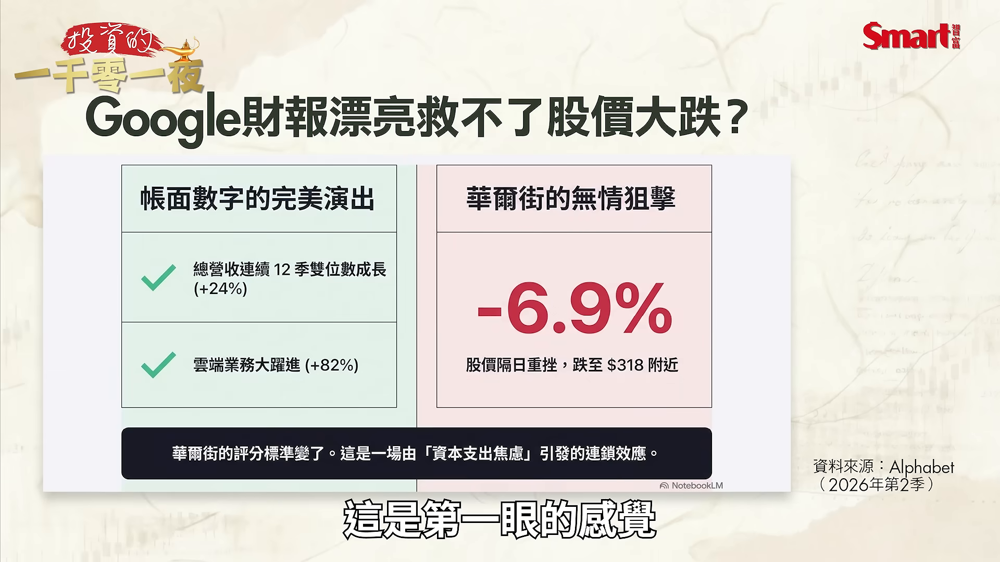
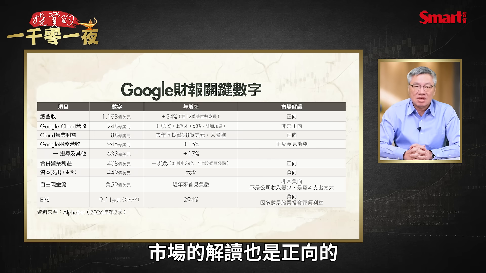
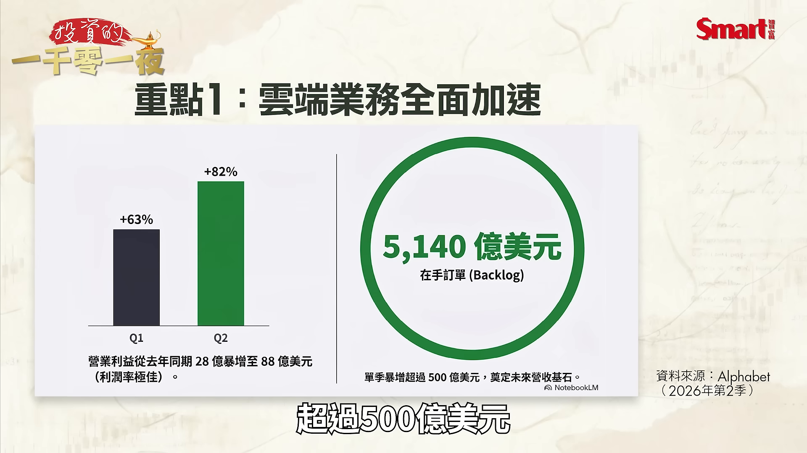
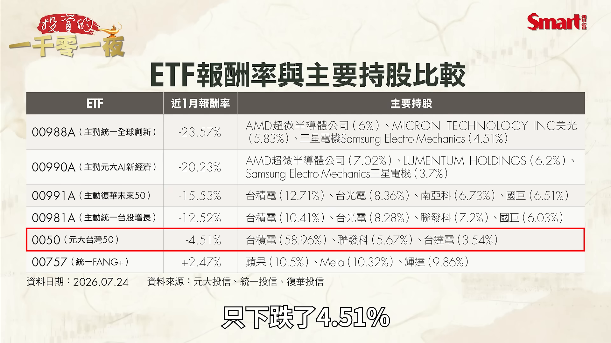
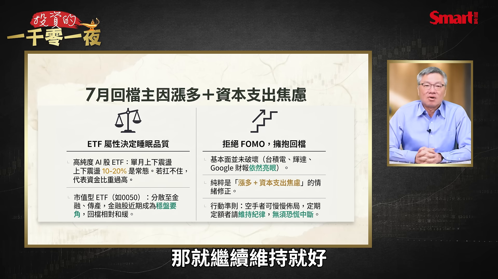

# smartmonthly-bw_WW1Kpl3LLc0 — 關鍵畫面索引

- 來源逐字稿：[smartmonthly-bw_WW1Kpl3LLc0_GT.srt](smartmonthly-bw_WW1Kpl3LLc0_GT.srt)
- 影片：https://www.youtube.com/watch?v=WW1Kpl3LLc0
- 截圖數：12

## 00:00:20

**逐字稿片段：** 最近Google發表了最新的財報 帳面數字非常好 但是AI股卻不領情 那些過去一年來 表現很熱門的 績效非常好的 AI股ETF它們最近還好嗎 我們這一集來看一下 首先我們來看 美國時間7月22號的 盤後Google的母公司 盤後Google的母公司 也就是Alphabet 它丟出了最新一季 2026年第二季的財報 帳面數字 可以說是漂亮得不得了 這是第一眼的感覺

**話題推測：** 開場切入Google最新財報與AI股回檔主題，可能出現影片標題或Google財報新聞畫面。

---

## 00:00:52

**逐字稿片段：** 我們來看總營收1198億美元 年增24% 這已經是連續第12季的 雙位數成長 那最受矚目的雲端業務 Google Cloud 營收更是年增82% 一口氣衝到了248億美元 你看到這個數字一定想說 那股價當然要大漲反應

**話題推測：** 提出總營收1198億美元、年增24%等核心財報數字，預期顯示營收圖表或表格。

---

## 00:01:14

**逐字稿片段：** 不是結果財報一出 隔天的股價卻是重挫了6.9% 跌到了318美元附近 那大家就想問 財報這麼漂亮 可是最近的資本市場 再一次的不買單 關鍵原因在哪裡 還是出在資本支出上 那這就是近期 最近這段期間以來 資本市場的主旋律 就是你的資本支出 如果太高的話 我反而會擔心你未來 這些投資的回收能力 但也因為市場上這一股 對高額資本支出的疑慮 就造成了全球的AI股 最近都大幅回檔 從美股 韓股 一直到台灣股市 那因為這些股票回檔 過去一年來表現 非常搶眼的ETF 也都在近期有了 大幅度的回落 我們這一集 我們就從 Google的財報效應 一路看到哪一些ETF 是受到了重創 先看Google的關鍵數字 那這一季2026年Q2 截到6月底的關鍵數字來看 總營收1198億年增率24% 市場解讀是正向的 Google Cloud的營收 248億美元 增長82%非常正向 那Cloud的營業利益 來到88億美元 去年同期只有28億美元 所以這是一個大躍進的表現 市場的解讀也是正向的

**話題推測：** 話題轉為財報後股價重挫6.9%，預期顯示Alphabet股價走勢或跌幅圖。

---

## 00:02:41

**逐字稿片段：** 另外Google的服務營收 來到945億美元 正15% 這一部分 正反意見衝突 那衝突的原因 就來自下面列的這項 就是搜尋以及其他這邊 占了633億美元 它是整個Google服務 營收裡面最重要的一塊 它增長了17% 那為什麼說正反意見衝突 因為過去一年 大家認為說AI上來之後 Google的搜尋服務 可能需求會下降 結果Google繳出來的 結果Google繳出來的 這個服務營收 也就是搜尋的廣告服務 反而有了增長 可是反派的意見說 因為Google 這是一個市場的說法 現在還沒有辦法被完全證實 先跟大家聲明 就是說Google在這中間 為了提高它的營收 有調整了一些 在廣告競價的做法 能夠在這個搜尋量 下降的情況下 收入變高 所以現在是正反的意見都有 但因為這個是屬於 Google內部的機密 我們無從得知 但至少我們知道 市場是這麼看的 最後來看合併的營業利益 是408億美元 正30% 這也是正向的 再來看資本支出 本季是449億美元 這是大增的 那市場的看法是負向 接下來自由現金流是 負的59億美元 這是近年來首見的負數 這也是我們前面講的 市場對它的看法是非常負向 它產生負數的原因 並不是因為公司的收入變少了 而是資本支出增加得太快 最後看EPS 每股盈餘是9.11美元 增長294% 雖然增長很大 但市場的評價也是負向 因為這裡面大多是 股票投資評價的利益所致

**話題推測：** 轉到Google服務營收與搜尋廣告收入，預期畫面切換至服務營收拆解。

---

## 00:04:28

**逐字稿片段：** 那整個財報 三個最重要的重點 我再幫大家重新再重述一遍 第一個當然就是雲端加速 這是整個財報最正向的部分 這一次Google Cloud的 直接年增率是82% 比它上一季的63% 還要再往上跳一階 而且雲端的營業利益 是從28億暴增到88億 這代表它現在 這個服務的利潤率非常好 那更狠的是 Google Cloud的在手訂單 就是backlog這個部分 來到了5140億美元 這一季就增加了 超過500億美元

**話題推測：** 整理財報三大重點，第一項聚焦雲端加速，預期切到重點摘要頁。

---

## 00:05:03

**逐字稿片段：** 第二個我們來看 EPS每股盈餘的來源分析 因為我們前面講 9.11美元的數字非常好 可是看這張表 大概是69%的本季EPS 是來自投資評價利益 投資哪些 就是Google之前 投資了Anthropic 然後投資OpenAI 就是這些股權 因為市場的評價利益 大幅的上升了 所以造成了它在帳面上有很多 這些未實現的股票的評價利益 但是它並不是 Google本身的核心業務 而且它們是屬於一次性的利益 所以如果你把 9.11美元減去了6.26美元 這6.26美元 就是這個股票的評價利益 得到的是2.85美元 那這個數字就大幅的縮水 那市場原先預估 這個利潤 應該是要來到2.88美元 也就是說EPS 不但沒有超出市場預期 反而其實是低於預期的 所以我們為什麼說 市場是反應負向 原因來自這裡 原因來自這裡

**話題推測：** 第二項切入EPS來源分析，預期顯示每股盈餘拆解與投資評價利益。

---

## 00:06:14

**逐字稿片段：** 第三個這是最重要的一項 就是我們前面講的 自由現金流轉負 我們來看這張表 Google本來是 華爾街典型的 輕資產超級印鈔機 2024年 2025年的 營業現金流都超過了 千億美元等級 即便它的資本支出非常高 但在這兩個年度 也都維持了超過 700億美元的自由現金流 那所謂的自由現金流 就是你入口袋的 這些營業現金流 減去投資之後 還能剩多少錢 那只要這個金額夠多 企業通常會用來回饋股東 方式有發股息 但這不是科技股裡面 最受歡迎的方式 另外一種就是 買回自家股票 減少在外流通股數 有助於提高股價 這才是科技股投資人 最喜歡的方式 但我們來看 2026年的Q1第一季 自由現金流 降到了101億美元 這是警訊 但到了第二季怎麼樣 直接就轉負了 所以如果按照這個趨勢 後面都沒有改變的話 全年的自由現金流 將會變成負數的 機會是很大 那如果華爾街的 超級印鈔機都這樣 那些賺錢能力不如Google 但花起錢的狠勁 不輸Google的公司 豈不是會更慘嗎 我們要知道 華爾街直到去年為止 都很相信 AI永動機這個概念 AI公司賺了錢 拿一部分錢 再投入在AI產業鏈上 又能創造自己的 未來競爭力 又讓整體AI的生態圈共榮 完美 這是所謂的AI永動機 但現在AI公司賺的錢 居然不夠花了 如果要繼續維持 這麼大手筆的花錢 只能靠它發新股 或發債來籌資 那這些都是 資本市場不喜歡的訊號 那另外一條路 就是如果你也不想要 發新股或發債 那另外一條路就是 省著點花 至少暫時要這麼做 那這看起來是 合乎邏輯的 不過後遺症就是 整個的AI供應鏈需求 可能會降溫一陣子 這就是最近 華爾街比較買單的邏輯 那我們總結一下 資本支出的衝擊喔 這不是Google一家的 問題而已 因為事實上7月中 台積電的法說會 明明財報創新高 數字也是跟Google一樣 好得不得了 但因為把2026年的資本支出 上調到600億到640億美元 整個市場反而就呈現了 負向的思考 當天晚上的費城半導體指數 就大回檔 隔天台股也是重挫 那市場現在心態很清楚 就是AI的軍備競賽 確實要打 但如果像現在 打得這麼狠 那這些投資 什麼時候才能 變成現金流 反而是這一刻 市場更關心的 這就是市場評分 股價的這把尺 今年換了 接下來我們來看 這些AI股的回檔 對過去一個月 ETF的影響 簡單說就是四個字 洗三溫暖 那我們來看一下現實 過去這個月 如果你手上全部都是AI 或半導體相關的 ETF或股票 肯定會非常辛苦 因為我前面講的 資本支出焦慮是 現在市場的主旋律

**話題推測：** 第三項切入自由現金流轉負，預期顯示Google歷年營業現金流與自由現金流比較。

---

## 00:09:40

**逐字稿片段：** 我們先來看 追蹤費城半導體指數的00830 過去一個月下跌了8.95% 這是到7月24號的統計為止 那過去一年 績效非常好 市場非常熱門的ETF 近期的回檔幅度 甚至就更大 可謂是成也AI 敗也AI

**話題推測：** 開始介紹00830一個月下跌8.95%，預期顯示00830或費半ETF走勢。

---

## 00:09:59

**逐字稿片段：** 我們來看 第一檔00988A 主動統一全球創新 過去一個月的報酬率 居然是負23.57% 接下來我們來看 第二檔00990A 主動元大AI新經濟 它跌了20.23% 第三檔00991A 主動復華未來50 它下跌了15.53% 第四檔00981A 我們瑤池金母操盤的 主動統一台股增長 也下跌了12.52% 最後我們來參照一下0050 這段期間反而表現 是比較持穩的 只下跌了4.51%

**話題推測：** 開始逐檔列出熱門AI ETF跌幅，預期顯示00988A、00990A、00991A、00981A報酬率排行表。

---

## 00:10:38

**逐字稿片段：** 它們下跌的原因是什麼 我們也來看一下 它們的主要持股是什麼 譬如00988A 跟00990A 它們的持股非常像 前三大 00988A是 AMD 美光 三星電機 然後00990A是 AMD Lumentum 跟三星電機 而且持股的比例 差距也很小 我也不曉得是誰學誰 總之這兩檔 它們的持股的風格 非常接近 再來看到的是 全部都是台股的 00991A它的前四大持股是 台積電 台光電 南亞科 國巨 那麼00981A是 台積電 台光電 聯發科 國巨 這也很有趣 這兩檔也非常的像 前四檔就只差了一檔而已 那同樣的我們來看0050 主要它跌幅比較小的原因 當然有兩個 一個就是台積電的 占比非常的大 那這段期間 台積電的表現是相對穩定的 另外一個就是 它有持有金融股 那這段時間金融股 表現也是不錯的

**話題推測：** 轉到ETF主要持股分析，預期切換成各ETF前大持股比較表。

---

## 00:11:41

**逐字稿片段：** 最後我們講一個比較特別的 就是00757統一FANG+ 在大家都下跌的時候 它居然過去一個月 是上漲了2.47% 我們來看它的持股 因為它的持股方式 一共只持有10檔股票 每一檔持股 平均10% 所以權重差異不大 會因為股票在那個期間的 表現差異 會有一點 略為有一點 高低的落差 第一大持股蘋果 是科技股現在的帳上現金王 而負現金流的Google 現在反而是被嫌棄 所以你看 本來大家討厭 或嫌棄蘋果 它AI投資落後 所以過去一年 兩年期間 蘋果股票表現不好 現在反而翻身了 所以你可以看到 這也是股市的一種現象 就是它的短期流行 跟流行服飾沒兩樣 就很吃當時的市場品味 最後總結 我要再次的強調 這一個月的股價回檔 ETF的報酬不佳 跟基本面壞掉 一點關係都沒有 不管是台積電 輝達或Google 它們財報全部都很漂亮 純粹就是股價漲多了 加上資本支出的焦慮 就進行一個現在的 情緒修正 所以我這邊提醒大家兩件事 第一個ETF的屬性 決定你的睡眠品質 像如果你是高純度 持有AI股的ETF 一個月上沖下洗10幾趴 現在不會是一個異常的狀態 你得要扛得住 如果你發現 你抱著會讓你睡不著 也就是說這個波動的程度是 會讓你焦慮的程度 這就表示你的投資比重 放太多在這類標的上了 相對的市值型的0050 除了前面講的 台積電占比比較大之外 還分散在金融 還有傳產 那同一段時間 就回檔和緩了很多 特別是金融股是 最近穩盤的要角 我們前兩集也介紹過 金融股最近漲幅非常的大 所以算這段期間 比較穩定市場的一個中心 那第二點是漲太快 所以現在回檔不是壞事 不要看到這個回檔 就非常的驚訝 如果你是之前沒上車的 或是買太少 這個時候 你反而可以慢慢撿 不要再有FOMO心態 因為前一段急漲的時間 你都覺得 現在不上車好像來不及了 結果最後很多人 可能就套在 4萬5000點到4萬8000點 那如果你本來就有定期定額 那就繼續維持就好

**話題推測：** 開始介紹特殊案例00757統一FANG+逆勢上漲，預期切到FANG+持股或績效畫面。

---

## 00:14:06

**逐字稿片段：** 那最後跟大家分享 投資不要違逆明顯的趨勢 直到這個趨勢無力持續為止 到目前為止 AI這個趨勢還很有戲 不過短期 它需要一點調整的時間 財富不能只靠衝 你也要學會等 以上就是今天的分享 喜歡我們節目 歡迎幫我們按讚 訂閱 分享 以及開啟小鈴鐺 謝謝大家

**話題推測：** 收尾分享投資不要違逆AI趨勢但需等待調整，預期顯示結語或趨勢總結畫面。

---
