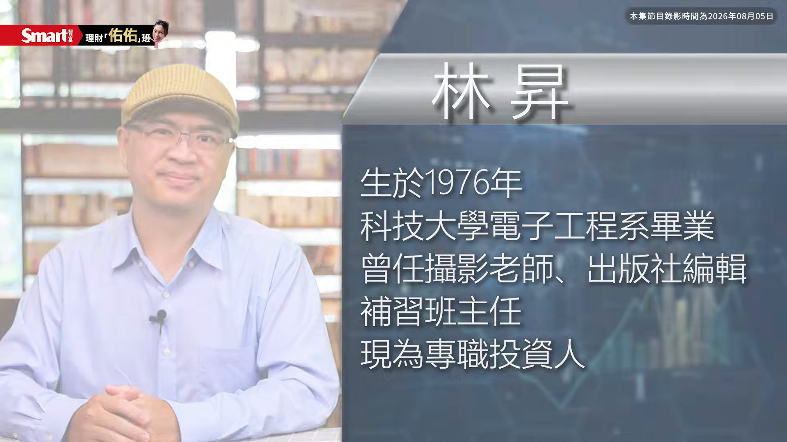
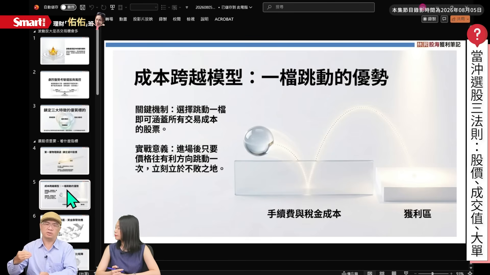
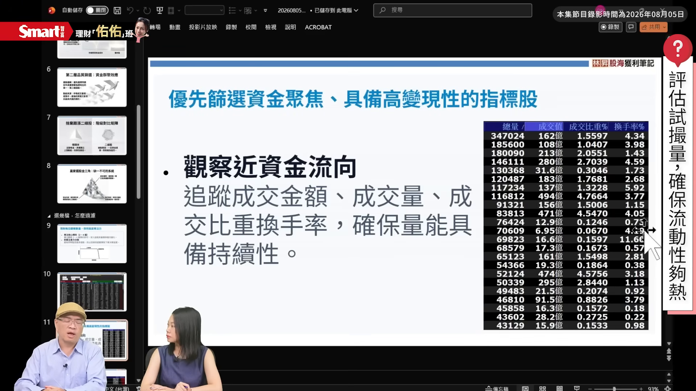
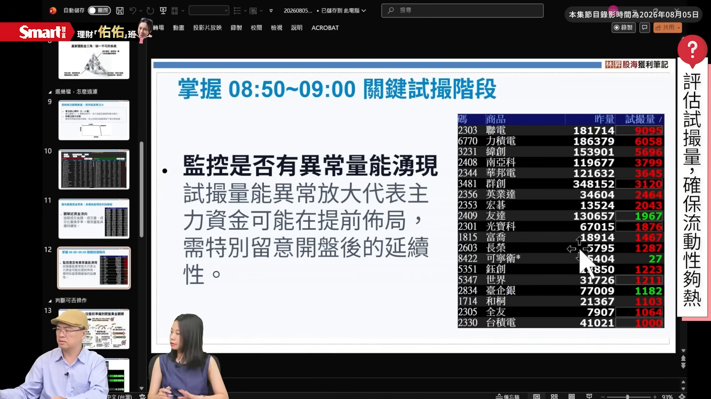
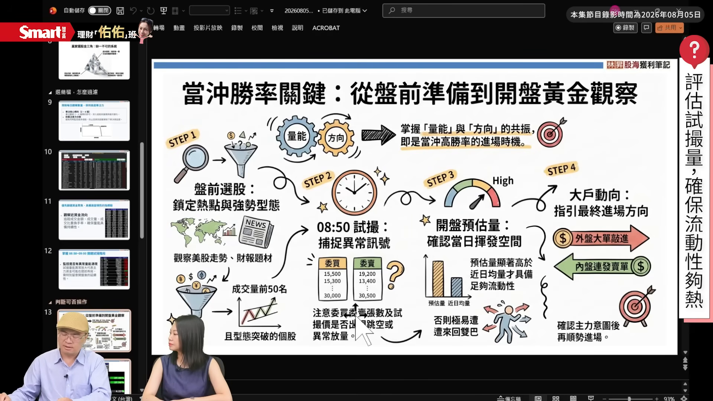
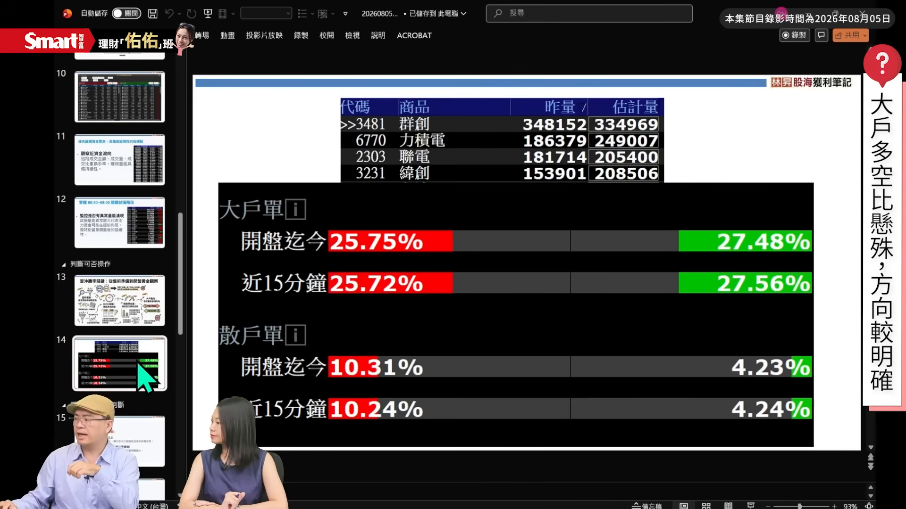
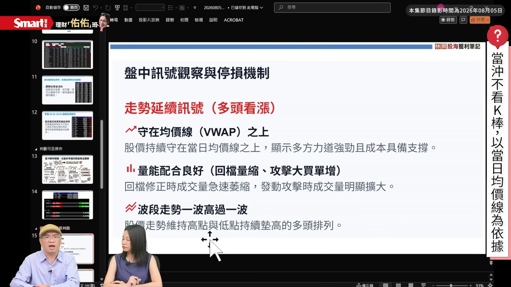
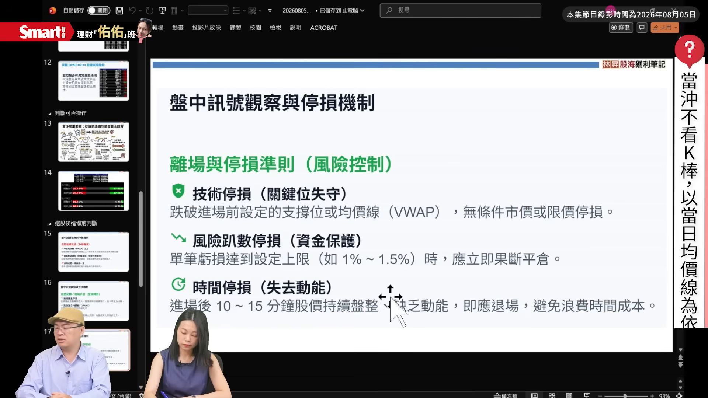

# smartmonthly-bw_XG6az-eXZNY — 關鍵畫面索引

- 來源逐字稿：[smartmonthly-bw_XG6az-eXZNY_GT.srt](smartmonthly-bw_XG6az-eXZNY_GT.srt)
- 影片：https://www.youtube.com/watch?v=XG6az-eXZNY
- 截圖數：15

## 00:00:04

**逐字稿片段：** 近期台股的波動非常劇烈 但對當沖的投資人來說 它有時候反而是個利多 因為你當沖就是你可能碰到 這個波動幅度比較大的時候 你看到 就是看對方向的時候 其實你可能可以 賺到更多的利潤 可是反過來說 風險其實也同步被放大了 那在這樣暴漲暴跌的行情下 我們到底要如何選對股票 然後掌握這個進出場的 當沖時機 避免就是被股市多空雙巴 所以今天我們邀請到 就是擁有20年市場實戰經驗的 林昇老師 然後帶我們從選股 然後操作到整個風險控管 請老師幫我們一次說清楚 那我們歡迎林昇老師 大家好 主持人好

**話題推測：** 開場切入近期台股暴漲暴跌與當沖波動題材，畫面可能顯示台股大盤或波動示意圖。

---

## 00:00:50

**逐字稿片段：** 老師我們就是其實看到 最近的盤式 真的是波動超級劇烈 可能今天暴漲就是1000點 隔天又暴跌1000點 這其實對當沖的投資人來說 是不是就是反而更有利 就是現在是不是 適合當沖的時機

**話題推測：** 主持人提出近期單日漲跌千點是否適合當沖，可能切到訪談主題或大盤走勢圖。

---

## 00:01:04

**逐字稿片段：** 我覺得波動啦 就是當沖的一個核心燃料嘛 所以一般來說 我們在做交易的時候 是希望有波動度的 那波動要明顯 其實反過來講 你要一個瞬間大漲 又瞬間大跌的機率 反而是不高的 是比較說隔天型的 那如果是當天 主力很明確波動很大 大部分那個方向性是 你會看做是選錯主力 不是選錯波動 波動就是這麼大 所以我們是希望波動 是越大越好 那再來看波動以外 你的方向到底有沒有選對 這個依據是 可以看出一個選股 你會有的一些 風控等等 那這裡面核心關鍵就是 波動有了 方向你要看大戶 大單 大單有 大戶有 那你的方向性 就比較明確 那方向性明確 你的波動又大 你的方向所帶來的波動的利潤 就會比較大 比較不會是什麼 價格漲我就跟著漲 因為這個漲 有可能是什麼 不是大戶的單啊 可能是散戶的單啊 或是非大戶非主力之外的單 你不明確的時候 那個時候的風險是會比較大的 所以一般而言 我們在選股的標的上面 就是希望它的趨勢 是比較清楚的 流動性是一定要的 因為你沒有流動性 我們這樣講好了 如果這個池子 它就是很穩定 這個水池什麼都沒有 那其實你沒有波瀾 沒有大魚可以釣 動能也是一樣 要有大單的動能 你的流動性高有大單 就表示裡面有魚嘛 那有魚趨勢就很明確 你就是重點就 掌控在資金管理 就是 該停損該停損 該獲利該獲利 不要說喔你的目標很大 然後盤中的那個理想 目標一直改一直改一直改 沒有 我們一般都是制定 比較固定的機制 然後進場達到目標 我們就結束了 比較不會是一個 心裡面的這個交易心理 變來變去變來變去 那就沒有依據了 老師剛剛講說 就是其實現在的波動大 有時候我們看 就是今天漲明天跌 但其實我們要抓的不是 隔天的應該是說當天有波動 但是重點是方向要看對 好那當然方向看對 是一件非常重要的事情 那這就牽扯到選股的部分 那想要問老師說 因為市場上的股票這麼多嘛 我們今天 假設真的要操作當沖的話 股票到底要怎麼選出來 我們要看哪些指標 很多人是不是 要從盤前就要開始做功課 一般這個是有一些機制 就是 你50塊跳一檔 跟500塊跳一檔 跟2000塊跳一檔 雖然都是一檔 可是利潤差異 要能夠打敗交易成本嘛 所以我們是希望說 挑比較高價股的 挑高價股的同時 我只要看到一個大單的發動 我一跟在他的後面 其實利潤就有 你剩下的就只是保本的問題 如果說你這是挑很便宜的 那跳個十檔可能利潤還不太夠 那這個交易的當沖 就利潤不足的情況下 交易成本又貴 當然長期就會比較有風險 利潤就會比較少啦 所以我們是希望說 可以挑高稍微高價一點 那再來 這個成本的概念 應該大家有一個熟悉啦 那接下來就是什麼

**話題推測：** 老師開始說明波動是當沖核心燃料，可能出現當沖波動與風險概念簡報。

---

## 00:04:52

**逐字稿片段：** 動能你要有動能 這個動能不是成交量 我就常講看成交量 大概就對一半而已 因為這個成交量裡面不純 有當沖的量 有散戶的量 有大單的量 有買量有賣量 所以真正的方向是要去剖析 這個成交量裡面 到底它有沒有可靠度 你所以你跳空向上 你要選的標的 你選了貴的 問題是貴的這個成交量 裡面的成分不純 那你的判斷依據 當然就會不準確啊 那資金 會有一些 我們這樣講 人性裡面會有一些跟風 那像隔日沖 其實就是跟風的概念 那你盤中有價格 它也是一種跟風 那這個跟風是 行為心理一個很重要的依據嘛 所以你的資金往哪裡去 很重要所以一般我喜歡挑 成交值比較高的 所以一般有時候是看成交量 那我們講嘛你 低價股量大沒有用啊 你高價股 量相對也許沒有低價股來得大 但是它的成交值很大 那這個基本上就是資金 那個群聚的 一個效應 那我們在看這種標的的時候 是比較有優先選擇的依據啊 那所謂的一線二線 其實這個很難去做 去做評斷 但是 台股基本上都是電子為優先 那電子裡面 就是半導體啦 電子零組件 這兩個是比較要優先的 那如果說你發現現在沒有主流 像今天主流就很明顯 你沒有主流跑到什麼 其他的產業去的話 你可以不一定要做交易 你可以休息 因為大多數的電子 它的吸金效果 它的成交值效果 它的動能 往往都是在台股的前幾名啊 所以這個是個人的一個偏好 所以一般而言 就是你的 價格不要的太低 再來就是資金 要有吸引的 吸引目光吸引投資人 進場的這個元素 因為畢竟它 在行為金融裡面 短期的反應 是很直覺的 這個很直覺就是價格漲 你就是本能上的會想要偏多 但是我們做當沖不行 那個只是觀察現象 我們看到價格漲 要去看這個是大單在漲 還是是大賣單在漲 大賣單在漲就是 叫抓交替 就是我有買單 但是我又有大賣單出現 那個就是不行的 雖然都是 大單 但是你要去看這個 大買單 還是大賣單 來決定你的方向 但是如果連大單都沒有 那就很難有較大波動的幅度嘛 因為畢竟當沖它的利潤 一天最多的範圍是有上限的 所以你要 這些每個元素 多種元素綜合起來 一起去判斷是會比較有優勢的

**話題推測：** 話題轉到動能不是單看成交量，可能切換到成交量成分拆解圖。

---

## 00:08:00

**逐字稿片段：** 老師那我想要追問一下 因為剛剛講說 其實有三個蠻重要的 元素吧就是要看股價 那第一個想要問老師的是 那老師因為 你跳一檔當然就是你每一個 因為每個股價區間 跳的一檔價格會不一樣 老師你通常會操作的話 你會找大概股價介於多少 會比較你比較常操作 500是一個 500以下我大概不太愛做啦 500以上會比較喜歡做 但是500沒有量到底做不做 不做 所以它其實 是一個綜合性的評估啦 那我再另外講一個 比如說它是低價 但是量很大你做不做 可能考慮做 我覺得就是說它可能要很 很三四檔以上 才會有相對的利潤 那你三四檔 那你跟單大單 就要有連續性的三四檔的大單 那你的相對成功機率 就會比較低一點 所以個人是有一點是 高頻交易又加當沖的一個概念 就是我們檔處 我們那個跳檔的檔數 一兩檔我們掌握度比較高 但是這個一兩檔的利潤要有 了解 那你希望 它走一個盤中的波段的話 那個可靠度就沒有說 看到大單進 你去追的這個效果好 所以它其實是 有一點綜合性的評價 不是說 貴就是好 或是這個便宜有量就是好 它就看當下 有點蠻靈活的感覺 就是盤中 不過個人就是喜歡 稍微高一點的價格 然後有放量的 當然我們等一下會有範例 同學就可以看得到 放量又高價 那你的相對大單的可靠度 就參考意義就比較大啦 所以三個關鍵 就是可能看一下股價 因為它牽涉到成本問題 然後再來就是 不要只看成交量 你應該要看成交值 然後再就看大單的狀況 這三個是蠻關鍵的核心 對對對 好老師那我想要再問你說 就是好我們選好 就是接下來我們 就是認真看完這三個嘛 就已經選好股票了嗎 當然不是啊 就是說 欸有一個這樣子的面向 但是你要 那個要突破 你的能力要突破 必須要很專精 所以就集中在 兩到四檔的股票裡面 那這兩到四檔的股票 就是讓你 其實這兩到四檔只做 我們剛剛講的 那三個元素 只是說有時候這檔就 欸沒有出現 那同時觀察兩到四檔 你就知道 哦就這一檔 那我就做這一檔 不是兩到四檔一起做哦 是我做一個 我們剛剛前面所講的 三個元素 然後 這兩到四檔 我去觀察它 什麼時候發現 出現這三個元素 然後就針對 出現的那一檔去做 交易 它就是我的目標 不會切來切去 切來切去 其實大多數人 做當沖都不專心啦 因為我的經驗是 有時候一邊做 還一邊追劇啊 那個就不能當作 是一個職業啦 所以如果你用這種角度 看當沖 大概勝率都是 非常非常非常非常低的 但是你如果很專精 甚至你就固定做那一支 其實勝算是會比較高的 是 因為我們有所謂的 注意力分散的問題嘛 現在人都注意力很難集中嘛 對啊 老師那我想問你 剛剛我們講說觀察這些元素 它應該是在 開盤九點到九點幾分 去做這件事情嗎 還是說它通常 或是盤中你都隨時可以做 一般而言 有幾種做法 就是你如果都固定做那一支 那就都盯那一支 但是你就要去接受說 它沒有行情發動的時候 的寂寞 這是第一種 第二種就是 你就針對主力 在做的那幾支 就盯好它 啊我們剛剛講的 我們要看成交值 要看放量 這個是比較說 在九點之前 從預搓量到九點十五分 這一段 它是不是符合 我們剛剛講的那三個元素 如果是 就所以你就做這種 啊每一個人對於 做當沖的概念不一樣 比如說像這個例子 哦 像聯發科 對不對它跳一檔就蠻多的嘛 然後以昨天的籌碼資料 欸 這個十大券商 人家是賺錢的 那你要跟什麼 要跟就是要跟賺錢的啊 那如果以昨天這個例子 那我今天 不看成交量也好 不看價格也好 我就知道 我就要鎖定聯發科了 因為 大部分的主力 不會只賺一天兩天 它也不會說賺什麼幾個月 它有一個小小的週期 你在那個小小的週期 抓到那一天的利潤 其實就可以了 所以 方法還蠻多的 但同學都聽 那你就聽了之後 你就去找 適合你自己的 欸不是說 我講的這個就是對 它其實它的分佈的勝率 其實是不太一樣的 但是如果你很熟悉了 你可以綜合使用啊 你可以綜合什麼 比如說聯發科 欸前一天主力有買 對不對前十大券商 它又是高價股 那假設開盤的時候 預搓量也可以 欸今天又放量 那你會發現多元素重疊 你的利潤就高了 好 老師那我們選好股票之後 開盤 因為現在已經開盤了嘛 那接下來到底是 直接就衝進去嗎 還是說它有什麼樣的訊號 是我們真正可以切入 按下下單的那個關鍵 哦 就是我們可以看一下 以這張例子來說就是資金 資金裡面會有所謂的成交值 對不對 成交值 就是真的砸錢嘛 對不對 然後相對它的成交比重 就會多 然後換手率 這些東西哦 就是表示 它現在很熱 它很熱的情況下 你的盤後看 或是盤中看 它都是相對的 你都可以看得到 所以以開盤之前 我們看一下它的成交值 尤其是成交值 我是非常在乎的 那剩下 有所謂的換手率

**話題推測：** 主持人追問三個選股元素中的股價區間，可能切到股價門檻或高價股案例。

---

## 00:14:08

**逐字稿片段：** 那換手率跟各位講一個技巧 平常行情的換手率哦 可靠度不高 它在極端值 比如說大漲 或是大跌 那大跌你應該是很害怕 但是為什麼 換手率會高 表示有人在這個地方買 所以它是比較抓 極值的概念 哦那這樣子 既然 它跌敢買 它漲會被賣掉 那它的趨勢 它的動能就會比較強大 因為一般散戶就比較是 追價的性質 那我比較喜歡做 這個叫逆勢交易啦 逆勢交易就是要抓 頂點跟低點 這兩個 極端值出現 所以它的成交值很大 它的換手率很高 又相對在股價的高低檔 那你就跟著大單的方向就好 這個時候的大單方向的 可靠度還蠻高的

**話題推測：** 老師開始說明換手率在極端值大漲大跌時的用法，可能切到換手率與股價高低檔示意圖。

---

## 00:15:00

**逐字稿片段：** 老師這一個右邊的那一張 就是那個數字 它是個股收盤後的資料嗎 對 當然你盤中也是可以看啊 它盤中也是會有排序 只是這個是疊加的結果 了解 好的

**話題推測：** 主持人詢問右邊數字是否為個股收盤後資料，畫面可能聚焦在個股數據表。

---

## 00:15:16

**逐字稿片段：** 那如果說8點50到9點 那因為就是試搓嘛 那這邊有個例子 就是試搓量 哦那我舉這個啦 以可威林來說 欸它的昨天的量是5404 它的試搓量27 你就知道今天 好像比較沒什麼行情 那你做這個 那那那就比較推不動嘛 那如果說通常很熱的股票哦 就是怎麼樣 就百貨公司11點還沒開 前面就已經很多人了 這就是預搓嘛 對 那預搓 你就去對比 假設預搓量 跟昨量 哇 還沒開盤的預搓量 就跟昨量有的拼 那那一定是超級熱 那熱不是方向哦 只是它熱 啊方向是什麼 方向是盤中的大單 那 預搓要特別注意 最好就是 我個人習慣就是 8點58分才定案 欸因為它要到很後面 才會比較有可靠度 前面會跳來跳去 跳來跳去 對對對對 所以 整體而言 前面我們已經講過概念了 但是

**話題推測：** 主持人轉到8點50到9點試搓案例，可能切換到試搓量畫面。

---

## 00:16:28

**逐字稿片段：** 開盤之後 就是一個 預估量 預估量 跟大單方向 所以假設今天 開盤之後 我們會有個預估量嘛 開盤前的我們剛剛都講了 開盤後有個預估量 這個預估量比昨天還大 10%20%30% 越大效果越好 不管它的方向哦 所以這個就是我們盤中 有了預估量 開盤因為9點開盤後 預估量就出來了 那大部分9點5分就會 相當明顯了 好那我就挑定它了 挑定它 今天這個池子裡面有大魚 那只是這個魚是什麼魚 是偏多的還是偏空的 才會看大單 所以 池子有魚 大單又相對偏多 那可靠度就會比較高 那剩下的就是資金管理的部分 所以我們等於是盤前 比如說你已經可以看到 它的估量啊 或是相關就是量能的部分 然後股價其實你一看也知道嘛 接下來下一個很重要的訊號 就是老師說的大單的狀況 就是大魚要游去哪裡 我以這個例子來看哦

**話題推測：** 老師整理開盤後要看預估量與大單方向，可能切到盤中預估量條件頁。

---

## 00:17:35

**逐字稿片段：** 這個是今天早上抓的 我們可以看到昨量是這樣 對不對 那估計量是這樣 那以力積電來說 昨量是這樣 欸預估量 就估計量是比較大的 所以這個有池子嘛 這個池子夠大 對不對 加上力積電最近新聞很多 然後再來看 有了池子再來看大戶 欸開盤的時候 大戶竟然是什麼 25跟27 那像這種哦 2527就不明顯 如果說你很明顯 比如說 40對10 那方向就很明顯 很明顯 像這個有池子 但是它多空 激戰 那個方向性就不明顯 不明顯你就等到它明顯 所以這時候可能 就這檔就不行啦 你就去看其他檔 所以我們是希望說 哦比如說 緯創它有放量 有放量 欸我們又看到 大單比例有差 你可以看以這個例子來說 大戶的大單是在賣 那散戶是在買的 那誰贏誰輸 應該還蠻容易判斷的 所以 有量是正常 我們沒有到現在都沒有看K棒 有沒有發現 都沒有看K值 所以技術分析其實在盤中 做交易 如果你有聽到人家說 看 當沖看技術分析 我會跟你講那都落後的 那都落後的 所以我們就要看的是 大單的概念 那

**話題推測：** 老師展示今天早上抓的例子並比較昨量與估計量，可能切到即時看盤表格。

---

## 00:19:02

**逐字稿片段：** 盤中怎麼看 你要看均價線 這個均價線不是什麼 我們平常看的均價線 所以它不是什麼MA 它是當天的平均成本 這條線之上 所以這叫價格 大戶的大方向是 這條均線之上 還是之下 那如果說 它在這個均線之下 但是突然間跌很深之後 有個大單進來 你就知道這個可能是 相對底部了 所以其實當沖交易裡面 就是兩個方向 一個是要趨勢跟隨 再來就是均值回歸 那比如說漲漲漲漲漲 欸大單大賣單出現 它就很容易回歸到這個均值 你要回或是漲 總是要個目標嘛 這個目標就是我們當天的 平均成本的概念 那過程中要去 做價量配合 或者是說大單配合 那只要不配合 我們都不會去做介入 配合才做介入 那過程中它會有一個拉回 再漲 或者是再漲過前高 拉回破前低 這個多空那應該大家是熟悉 就是說要漲的那個樣子 就相對 欸它的大方向 可靠度比較高 那個樣子要先有 所以雖然技術分析不能預測 但是它那個樣子至少要有 不然你的樣子都沒有 那可靠度就大幅的下降 老師我想問一下剛剛講說 大單的狀況 就是那一張 那個上面的大單跟散戶的 那個單的訊號 那個是一樣看盤軟體 是可以自己點點點 然後找到那個指標的嗎 對啊 好的 那因為那個也是抓出來 不過那個 細項我們上課講 這個是總結 那 你總結是結論 但過程是重點 就是它是 怎麼樣堆砌成這樣的結果 那個是重點 好的

**話題推測：** 話題轉到盤中均價線與當天平均成本，可能顯示分時走勢與均價線。

---

## 00:21:01

**逐字稿片段：** 那反轉一樣嘛 就是欸漲 漲欸 一般人為什麼追價會輸 因為你在追價的同時 大單就賣出來 你當然就輸了 所以在漲的同時 大買單要跟著上去 那如果說在漲的同時 大買單沒跟上 反而是大賣單在出現 那就容易怎麼樣 拉回 所以常常喔 轉折點都在大量的 相對位置 高檔也好或低檔也好 而且是低檔更明顯 所以你要去看追喔 你要看一下你的相對位置 跟大單的方向 那個價格只是這些大單的 結果 但真正關鍵還是在 大單的方向 然後你要問的是

**話題推測：** 老師開始說明反轉情境與追價為何容易輸，可能顯示高檔大量反轉示意圖。

---

## 00:21:48

**逐字稿片段：** 假設是風險控制啊 就是 條件不成立就走 當沖很蠻殘酷的 你預估上漲 然後大單也買 然後下一刻大單 大賣單出現 那就是走 它就是走沒有什麼 然後是你本來做多 但是 你的底線就是 當日均線破了 然後是什麼破了 是大單讓它破了 也是走 停損機制是很重要 或是我都跟著大單了 進場就是要 趕快發酵啊 但等了10分鐘15分鐘 都沒有結果 那這有一點是 大單在試單的概念 那也走 所以老師我們進場之後 要不要離場 可能還是以大單的狀況為主嗎 對 因為 你沒有辦法撼動價格 你唯一可以撼動價格的 就是盤中的大單 所以你的依據 只是要找出 這個股票裡面的 什麼大單發動點 對不對那大單大 大人會吵架嘛 所以你還是 大單吵架你還是要選邊 如果說兩個都差不多 你也知道打不贏 打不贏那盤勢就是 這樣這樣這樣這樣這樣 那也許政府很大 但是它的方向性沒出來 我們要的是一個 比較明確的 方向性 那大方向性就勢必伴隨 大單的 那個百分比的差距

**話題推測：** 話題轉到風險控制與條件不成立就離場，可能切換到停損規則簡報。

---

## 00:23:15

**逐字稿片段：** 老師那另外一種狀況是 好假設我們今天進場之後 有時候你會發現 欸方向如你所預估 那有沒有可能什麼樣的狀況 你會選擇留倉而不當沖 除非賺到明天 可能的跌停板啊 假設 我要留當沖是這樣 就是如果你要留倉喔 就假設明天跌停板 那你可以不可以接受 那你今天假設你只賺1% 那明天跌10% 那就是一定不行留了嘛 對不對 那你如果運氣很好 因為交易還是有一些 機率的概念 你今天賺了8%了 那你明天如果跌停板 你可能可以接受 那個2%的差異 那就可以考慮 怎麼樣留倉 變成隔日沖 因為隔日沖的邏輯喔 它其實是希望追 假設今天啦 就追一個快要鎖漲停的 對不對 然後它的目標 就是希望明天 再繼續漲 有人看到 今天昨天漲停板的 它就變成是 它可能會進去的標的 所以它在 我們已經前一天就進場了 隔天 人家看到追進來的時候 去做一個平倉的動作 可是這裡有一個 隔日沖很重要的問題點 如果美股大跌 隔日沖就會失敗 所以 要做隔日沖有個核心關鍵 就是美股的大方向的 走勢 不能是空方 如果是空方 那隔日沖其實它的風險 還是存在 不過現在有所謂的電子盤嘛 美國的電子盤 其實你大概 在收盤前就可以推敲 欸美股 是不是一個空方的概念 然後再來決定要不要做留倉 總之你要做留倉哦 就是隔天的虧損 你可不可以接受 那你要算到10%哦 然後美國 有沒有可能會一個大跌 的這兩個依據 那當作 這個要不要留到隔天 否則是不要的啦 就是你如果想要留倉 你要考慮的事情 可能會要更多了 好老師那再來我想問你 因為一般人在當沖的時候 他可能會有一種錯覺 他會覺得說我好像比如說 買進跟賣出價差 那我賺了3000塊 他好像就是覺得哦 反正我只交割這3000 但是實際上 因為你在操作這檔股票的時候 你的操作部位 其實不是那3000塊 而是那整檔股票 所以你的資金部位 到底要怎麼去做規劃 那我們要怎麼去規劃 所謂的賺賠比之類的

**話題推測：** 主持人轉問進場後是否可能留倉而不當沖，話題進入留倉與隔日沖風險。

---

## 00:25:44

**逐字稿片段：** 我不能說這是一個 市場上的一個很奇怪的言論 就是說我只要做交割金額 其實 承受能力不足啊 做當沖大部分都失敗 那如果你的出發點是只要 考量交割金額的話 那大部分 你都沒有辦法承受 波動 是很多人都說是無本生意 但實際上 我覺得這個觀念 確實要稍微調整一下 對 因為因為你 你說台積電你跳一檔 假設你在路上掉個5000塊 你心不心疼 你一心疼你只要一輸 你只要一輸 你就會想跟他凹 你就會留單 留單明天的風險又產生了 那事實上為什麼你會有 這種5000塊的概念 就說它跳一檔我就可以賺5000 問題是台積電可能很貴啊 你的承受能力不足以 承受它1%或是1.5%的波動 那你又去做這個 那你的心思又放在 是交割金額而已 那其實這個就很多 控制幻覺 就是你好像你以為你可以控制 但其實你的承受能力是 是不足的 所以這個要很小心 邏輯上通哦 不表示你的交易心裡可以做得到 所以實際上你在操作當的時候 其實你應該要看 你操作那檔股票的價格去評估 而不是說哦 我今天可能就是只交割 價差不能這樣想

**話題推測：** 老師反駁只看交割金額的觀念，可能顯示部位風險與交割金額比較。

---
