# yutinghaofinance_5_poweJsVBA — 關鍵畫面索引

- 來源逐字稿：[yutinghaofinance_5_poweJsVBA_FIN.srt](yutinghaofinance_5_poweJsVBA_FIN.srt)
- 影片：https://www.youtube.com/watch?v=5_poweJsVBA
- 截圖數：25

| 時間碼 | 畫面 | 逐字稿片段 | 話題推測 |
| --- | --- | --- | --- |
| 00:00:49 |  | 今天我們主要從幾個角度來做思考 一方面呢 來看這一次非農就業數據公佈之後 市場上的解讀到底是否 代表著升息預期的下滑 還是僅僅在背後數據當中 大家也看到了不一樣的角度 因為這一次意外的爆冷 照來講是一個很負面的數據 可是對於聯准會現在的升息預期來看 其實變化好像沒有想像中來得大哦 那第二大方面則是我們看到 不管是Michael Berry持續 針對股市放話喊空 我們看這一次連巴菲特的波克夏 在新任投資長 新任的接班人阿貝爾底下 似乎在二季度也是 大幅度的開始買股了 是否代表著投資決策的轉換 價值投資是不是現在對於 巴菲特指標不再重視 重點在於個股的機奇 今天來跟投資朋友做一系列的探討 其實回歸現實哦 美國股市在上禮拜整體而言 單周大漲幅度算是不小哦 標普五百指數因為創下歷史新高嘛 單周上漲是3.6% 那更不用講納指和費半漲幅來得更多 更重要的事情是 現在最具代表性的案例是 嗯本輪美國股市的下修之後的創高 照來講其實大多數人呢 如果長期待在車上 不會受影響 可是像之前像是 阿申布倫納呢（口誤） 就是主打AI投資的避險基金經理人呢 他這一次就受到比較 驚人的一個衝擊 說明的即便看對趨勢 還是有可能會死在波動 韓國股市就是另外一次的縮影 那這一波AI股和半導體熱潮帶領 著韓國股市一度大漲到150%呢 哎結果現在根據市場統計 真正留下來賺錢的人居然不到一半呢 哎你要知道 從年初到現在 韓國股市還是全球最亮麗的表現 一方面就是大家都買在6月份 好第二大方面呢 很多人他看對了趨勢 的確半導體融井仍然在持續 但是死在波動了 標普五百指數上禮拜突破了7,700點呢 那等同於過去十年標普 已經漲了接近有3倍了 這也是2026年第八次突破新的 百點的整數關卡 如果你把時間拉得更長 會看到美國股市長期 趨勢的力量有多強大 撇開AI它都很強 一年前指數還在6,300點 五年前大概在4,400點 十年前只有2,200點 十年已經上漲了250% 來到當年的3.5倍 那短期內哦 你當然股市總會有估值過高的時候 景氣總會有衰退或者崩盤的擔憂 不過呢 隨著美國企業獲利和經濟規模的成長 標普500指數長期以來就是 不斷的被刷新歷史新高 那你要什麼樣的原因來判斷 本本輪的AI股市不會造成 標普五百指數持續創下歷史新高呢 它也許會有估值回檔 但是下一個題材發生的時候 標普還會不會創新高呢 | 開場列出今日主題，可能切到節目大綱或非農就業與升息預期摘要。 |
| 00:03:45 | 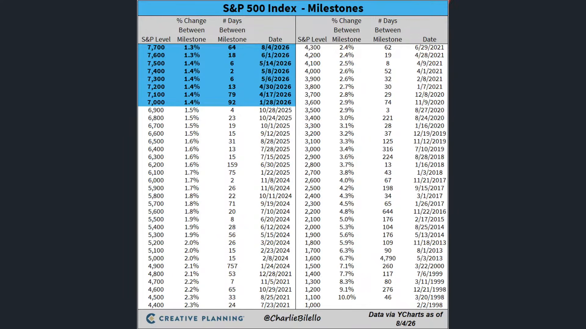 | 我們上禮拜觀察的不 只是標普道瓊的創高 歐洲股市也創下歷史新高了 我們看歐洲STOXX600指數 這一次在企業獲利增幅也不小 美國股市是很離譜了 47% 歐洲股市本輪企業 獲利是暴增了22% 這個是2022年以來的最佳表現哦 7月份的歐洲股票ETF 也出現了美伊衝突 以來首次的單月淨流入 這歐洲股市其實比亞洲股市好哦 你說亞洲股市漲比較多嘛是沒錯 臺灣和 韓國股市今年漲幅很亮麗 可是臺灣和韓國股市哦 外資都在賣 都是靠本地投資人撐起來的 但是歐洲股市哦 是有外資流入的 | 轉到歐洲股市創新高，可能顯示STOXX 600與歐股獲利數據。 |
| 00:04:27 | 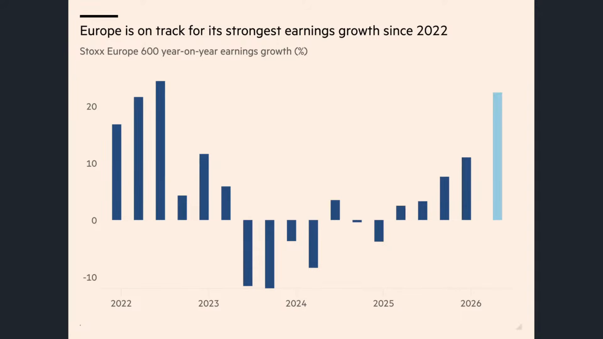 | 我們看光是貝萊德旗下的歐股產品呢 就吸金了44億 上禮拜像德國DAX指數 英國的富時指數 法國的CAC 40指數 西班牙指數全部創下歷史新高了 今年整體 歐洲銀行指數漲幅超過21% 這個是目前 表現最為亮麗的板塊 你說歐洲股市好像 半導體沒有這麼亮麗沒錯 不過它的銀行股也跟著創高了 主要就來自於市場 交易量的顯著增長 那英國股市更是那種 標準的金融股創高模式 因為全球在5月6月7月 在股市大漲的過程當中 後來反轉嘛 當大家選擇降低半導體和 AI概念股的部位的時候 英國股市是最早創高的 科技含量最低 現在反而成為了贏家 | 點名貝萊德歐股產品吸金與多國股指創高，可能切到歐洲主要指數表格。 |
| 00:05:12 | 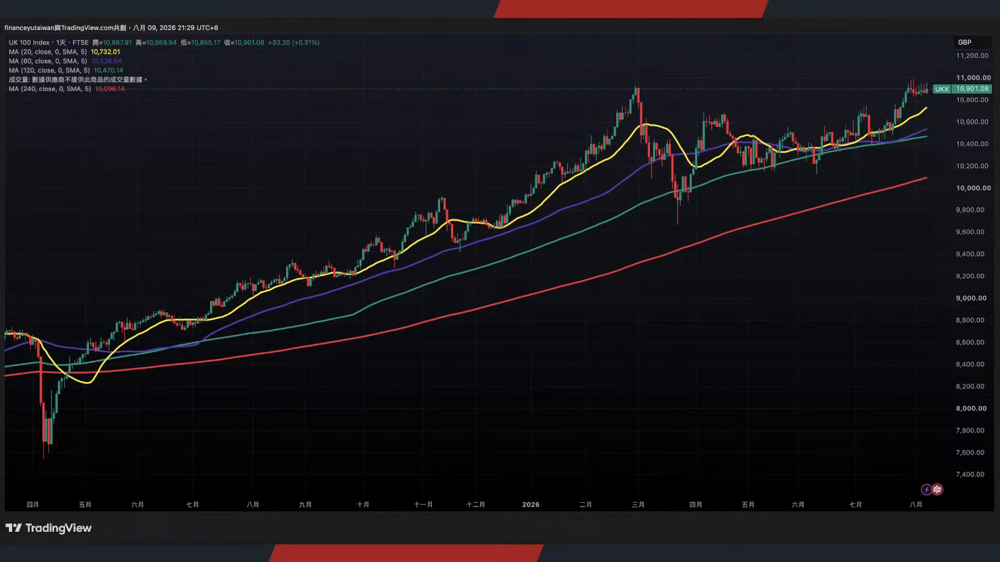 | 富時100指數當時跟著道瓊一起創高 因為它主要就是由銀行 能源和防禦性企業來撐盤吧 7月底的時候 一度來到10,951點呢 現在還在高位持續震盪 好所以現在就是AI股 部分大型巨頭 美國股市 科技巨頭又開始跟上了 晶片股呢 適度下修哦 非AI股 暴衝道瓊創高 歐洲股市創高 英國股市的創高 | 轉到英國富時100金融股創高模式，可能顯示富時100走勢與成分產業。 |
| 00:05:38 |  | 那當然回過頭說 這等同於 今年大多數資產又重新回到了正報酬 今年表現最為亮麗的資產 第一名 還是大眾資產 有29.3% 第二名是價值股 23.3% 那小型股的部分是23% 其他像是中型股納斯達克100指數 可轉債已開發市場 漲幅大概15-18% 還是很漂亮 大型股一直往下看到美國的Reits 到新興市場股市 美國成長股 高收益債 漲幅大概2到10%左右 那大多數債券漲幅 大概都是0到2%左右 | 開始整理今年各類資產報酬排行，可能顯示資產類別績效排名圖。 |
| 00:06:13 | 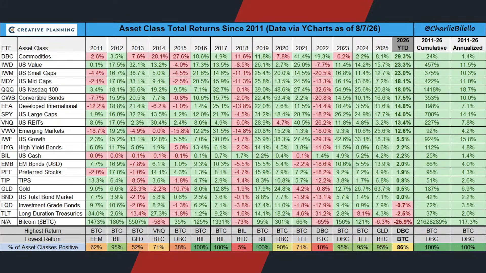 | 誒現在特別值得觀察的是黃金價格 黃金價格在上禮拜是 大漲了接近有7% 本來今年還是負報酬 硬是給他拉到正值了 那當然了 在短期內很有可能是因為連 總會立即升息的壓力瞬間釋放嘛 那對於黃金價格的提振效果 就開始快速的擴大 不過黃金呢 的確從今年2月3月當時高點見到以後 它就處於一個標準的下行格局 它其實是跟美伊戰事所造成的 通膨預期聯動的哦 正由於在今年3月4月以後 市場的升息預期就在不斷的提高 所以它就一直壓抑住 了黃金的價格表現 不過黃金過去兩年 價格也漲得很誇張嘛 你看黃金價格在去年 漲幅基本上有63% 前年漲幅有26% 大前年漲幅有12% 好所以適度休息一下也是ok的 加上今年也不太可能暴利升息了 不過真正表現比較差勁的哦 大概就是比特幣了 比特幣今年還是跌兩成5 快要沒救了 去年它已經跌6.3了 今年一整年價格表現都不是特別好 那黃金當然有另外一個因數了 那就是央行和ETF的資金哦 它一直在定期定額的買入 從4月份以來 全球央行針對黃金的 購買量已經來到350萬盎司 那同期間呢 幾乎沒有任何的淨賣出 ETF資金也開始止穩了 本來上半年套牢了一堆 大家都轉買AI股了 還有流出 現在中國的黃金ETF又 重新開始了資金的流入 你說那是因為拋棄股市改買黃金嗎 看起來沒有這麼明顯的替代相關 更多是當股市估值增高以後 當你股市漲以後 你很自然的就是想要 去訂一下頭等艙了嘛 然後或商務艙了 或者呢就買買傢俱啦 換換房啦 換換車啦 那買一點黃金吧 有這樣的一個感覺啦 哦所以它反而是反映流動性的繁榮 可是不得不承認 | 轉到黃金價格上週大漲與今年轉正，可能顯示黃金價格走勢。 |
| 00:08:10 |  | 今年漲幅最亮麗的 其實還是大宗資產 也就是原物料 花旗銀行也指出 大宗商品已經正式 進入到十年一遇的事件 變成百年 應該講說 變成半年一遇了 因為大家從以前那個 銀價和黃金價格的上漲 那感覺以前都是好幾年才來一次哦 現在好像每隔個幾個月 有時候是黃金 有時候是石油 有時候是白銀 新時代開始出現了 那主要一個原因就是 因為川普上任以後 包括地緣政治的問題 極端氣候還有科技革命 它慢慢的取代傳統的供需 變成現在的價格主導力量 從以前的阿拉伯之春 到美國的葉岩油革命 到這幾年是疫情 烏俄戰事貿易戰中東衝突 都讓商品價格來得越來越劇烈 所以呢 大宗商品按照花旗的角度而言呢 代表著未來的波動會持續的加大 那單年度今年漲幅很亮麗 可是也有很多資產價格可能在明年 在景氣回暖或者中東 局勢淡化的過程當中 回跌幅度會加快 這是大家值得觀察的項目 但至少現在的通脹預期 看起來並沒有完全消失 大眾資產還漲幅第一名呢 | 轉到大宗商品為今年最亮麗資產，可能顯示花旗商品波動觀點或原物料表現。 |
| 00:09:19 | 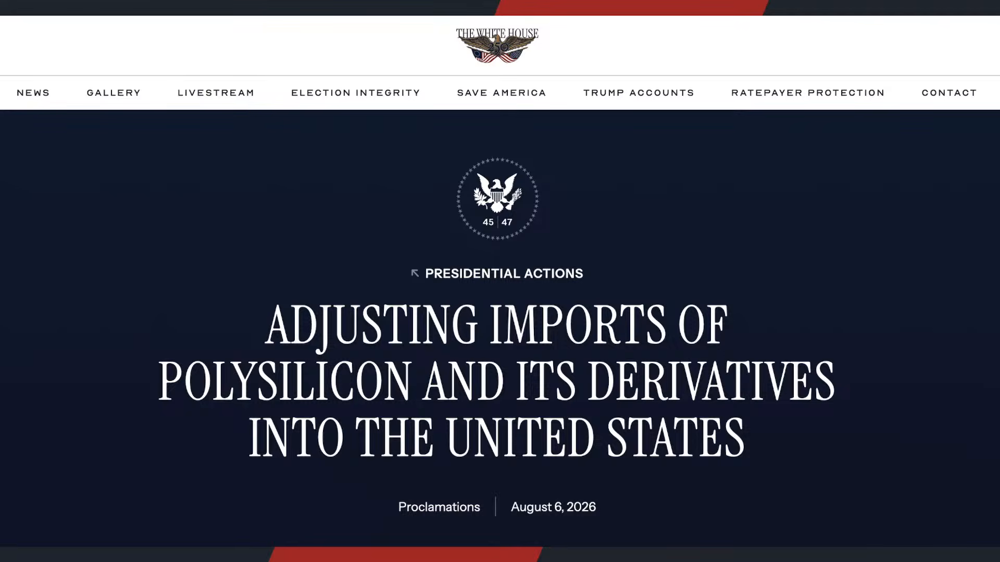 | 甚至我們看到在上禮拜川普政府正對 正式針對太陽能板或者相關離 組件來重新課徵15%的關稅 因為其實美國的IEEPA 現在已經開始退款了 好所以之前課的關稅 現在正在還給代理商 如果你有去申請的話 那為了要銜接關稅持續性的收取 從12月4號開始 如果企業承諾在美國製造相關設施 可以申請豁免 但沒有的話 那基本上 要課徵15%的關稅 那10五%這個關稅 就不一定會吸引各大廠區到美國投資 因為關稅稅率還沒有想像中來的高 也許在海外生產 便宜成本是便宜三成四成嘛好 所以這有可能會形成內部的通膨加成 持續加劇 包括多晶矽 包括矽錠或者晶圓 每公斤是100美元嘛 來做課徵太陽能 電池每瓦時0.22美元 那有沒有可能產生 第二輪或者第三輪通脹 | 切到川普政府對太陽能板與零組件課徵15%關稅，可能顯示關稅新聞或太陽能供應鏈表。 |
| 00:10:15 |  | 值得留意 那第三個當然就是中東問題 現在還是僵局 我們知道伊朗現在基本上 已經跟美國又重新拒絕談判了 霍爾木茲海峽的協議還是 卡關上禮拜本來講的信誓旦旦 連貝森特都出來喊話 哦結果 雙方還是沒有達成顯著的共識 那當然那也代表美國對於 伊朗的封鎖也在持續 伊朗是針對全球的封鎖 那美國是專門針對伊朗的封鎖 我封鎖你的封鎖 | 轉到中東與伊朗談判僵局，可能顯示霍爾木茲海峽或波斯灣地圖。 |
| 00:10:41 | 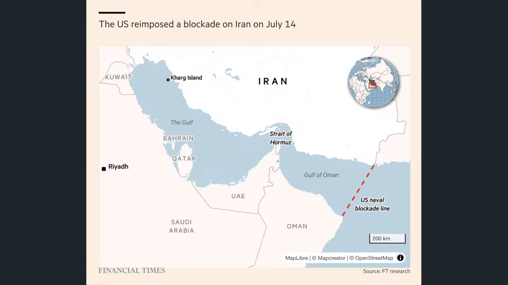 | 我們看到在波斯灣外側 這個美國的封鎖 它就互成一條線 不允許伊朗任何的油輪能夠 離開當然了 這也代表著哈格島大概 承擔了伊朗90%的原油出口 目前看起來 伊朗9成的原油出口 已經正式進入了停擺 在哈格島上的三座裝 油碼頭已經閒置 那預估在一周內就會滿出來 那就被迫要全面停產 伊朗短期內還可以靠 出港的原油來撐住 現在已經完全斷運了 我們就看一下雙方的僵持會多久 貝森特在禮拜四晚間也表示 荷姆茲海峽也許了 永遠無法恢復到戰前狀態他承認 但他也解釋了 他認為在未來2年呢 這條水道會變得毫無重要 伊拉克和敘利亞現在 已經簽了一條協議 修復一條石油運輸路上管道 以後就直接用管子運出來 就不用開船了 多方便多環保 概念是這樣子誒 不過之前那個北溪管道好像也是這樣 那變成固定靶子好像也有風險的 不過他沒有回應 當然了那海灣其他的出口貿易怎麼辦 那中東又不是只有把石油運出來 中東自己也需要原物料 也需要糧食 也需要其他相關的能源或者水 誒那該怎麼辦呢 他沒有講 但是川普對於伊朗的策略哦 看起來逐步轉彎了 變成等你撐不住再說 不跟你短期內要求一定的成果了 反正短期內 這個原油價格也沒有持續創高 那不如就保持在這樣的一個氛圍 長期的改善原油輸出 的環境或者管道吧 結論就是 反正美國不需要這一條了 那就算了 那當然了 伊朗目前態度也是很強硬 目前整體開放的門檻仍然要求 要麼停戰撤軍解封鎖 而且還要求美國 賠償甚至呢 在永久性的 霍爾木茲海峽能夠收取過路費 好這個是伊朗所給予的態勢 那到底長期下去會有 什麼樣的一個結果呢 我認為不是特別樂觀的 我們舉例來說 當時金正恩 也是遭到聯合國全面封鎖制裁多年了 不過金正恩 哎這兩年他的外匯收入是持續飆高 我們看彭博最新所做的專題 在過去四年當中 北韓透過軍火的出口海外 勞工黃金煤炭還有網路犯罪 已經取得220億美元 大概是台幣6,500億美元的海外收入 大概是前一個四年的接近有4倍左右 最大轉折是烏俄戰事了 北韓向俄羅斯供應炮彈 2025年 從開始哦 大概已經供應了烏軍 應該講說俄軍哦 大概是前線50%的彈藥 甚至現在北韓也派了 2萬名士兵來參戰 每個人可以拿2,000塊美元的收入 哎那等於月薪有6萬塊台幣 也不少哎 那這波資金呢 都反映在經濟場 北韓的經濟成長按照 南韓官方的預估現在 是3.5% 好遠遠高於歐洲國家或者美國國家 而且已經連續三年擴張了 哦那你要知道哦 他現在還在被制裁 北韓已經不止靠軍火賺錢了 他是建立更多規避制裁的收入來源了 所以伊朗問題 到底美國能不能取得良好的結果 這可能會有一定程度的壓力的 當然這也就意味著 整個通膨 原油價格不至於創高 但是要讓它大幅破底也有一點難度 | 開始描述美國在波斯灣外側封鎖線與伊朗油輪受阻，可能切到航運或原油出口示意圖。 |
| 00:13:59 | 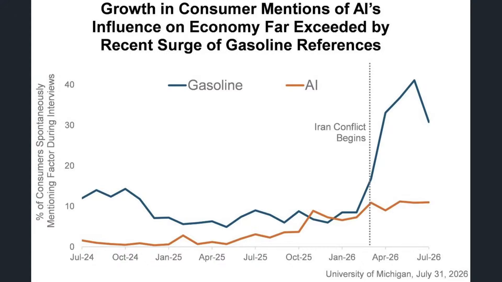 | 現在美國核心通膨的部分呢 有沒有可能有進一步的降溫呢 它有兩個角度 第一個呢 就是借由其他價格的下跌來帶動 原物料成本的下滑 把大宗成本給壓低 能源可能短期內無法 但是其他成本也許可以 借由供給的開採而試圖降低 | 轉到美國核心通膨是否降溫，可能顯示通膨、能源與原物料成本分析。 |
| 00:14:18 |  | 那第二個 來調整一下物價指數的方式了 其實美國商務部已經預估從8月份 所公佈的個人消費支出物價指數 也就是PCE的部分 有可能要開始進行改善 新演算法主要涉及電腦軟體法律 服務和投資顧問費三個項目 按照目前估算 新的方法可以讓通膨率 至少下滑0.2個百分點呢 好也就是說你只要把演算法改變 通膨就消失了嘛 對不對 物價很高 外食費像臺灣外食費漲特別誇張 那不看外時 其實就沒通膨了嘛誒 這最簡單的方式 那爭議最大的當然是 軟體和投資顧問費 舊演算法底下 軟體價格和硬體價格聯動較強 那AI熱潮現在推高電腦和晶片價格嘛 所以通膨容易偏高 但是呢如果現在進行適度的修改的話 那等同於 就可以撇除科技通膨 什麼意思呢 就是除非它傳導到你的筆電和手機端 那我們再做記錄嘛 那如果AI資料中心裡頭的消費 或者說伺服器越來越昂貴 有沒有必要統計到PCE數據當中呢 就也許沒有必要 懂我意思嗎 這個人消費 個人有關的再統計 那至於一些科技通膨 影響的是資料中心 沒有必要 誒那就不統計了吧 那也許最後就可以 造成通膨的數據下行呢 這也是另外一種改善方式了當然了 回過頭說 現在市場上最為關注的還是 有沒有必要把它拿來跟就業 數據的軟化來互相沖銷 為什麼這樣講 因為只要就業數據夠差 其實升息預期一樣可以打消 | 提出美國PCE物價指數演算法調整，可能顯示PCE項目與通膨下修幅度表。 |
| 00:15:52 | 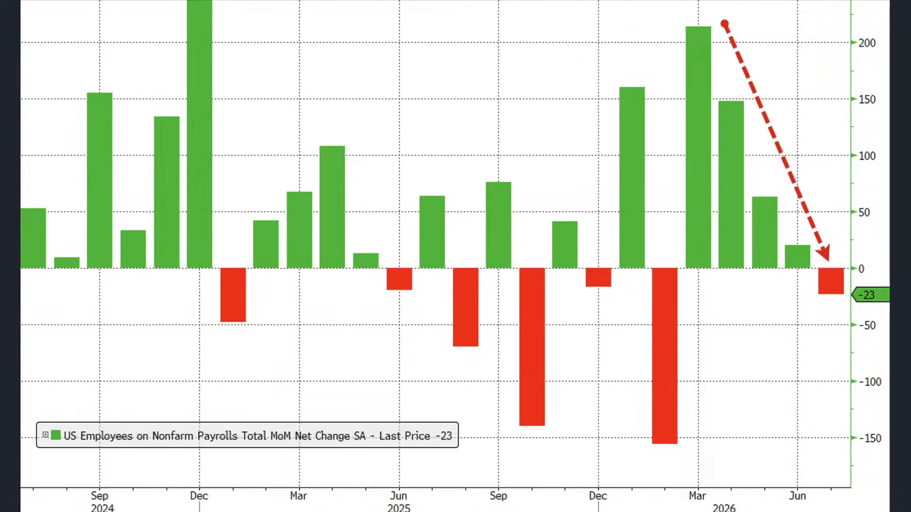 | 你看美國7月份這一次的就業報告 它就明顯的低於市場預期 非農就業數據是減少了2.3萬人 原本市場預估會增加8萬人 現在是減少2.3萬人 這創下了2月份減少15.6 萬人以來最弱的單月表現 那更值得注意的事情是 6月新增的就業數據 原本是5.7哦 現在下修到2萬人了 5月也從12.9萬人下修到6.3萬人 哇這個校正回歸有點離譜 兩個月居然比原本公佈少了10.3萬人 那你反映當下的非農 意義到底在哪裡呢 過兩個月全部下修 所以現在這份數據 真正擔憂的不是什麼 7月份的數據怎麼樣 7月份單月數據 本來就沒有什麼太大參考意義 是他把前面幾個月全部都下修了 那美國可能就業起起伏伏嘛 那現在回過頭看 哇那不是過去幾個月就業亂七八糟嘛 慘不忍睹那 | 公布7月非農減少2.3萬人且低於預期，可能切到非農新增就業數據圖。 |
| 00:16:46 | 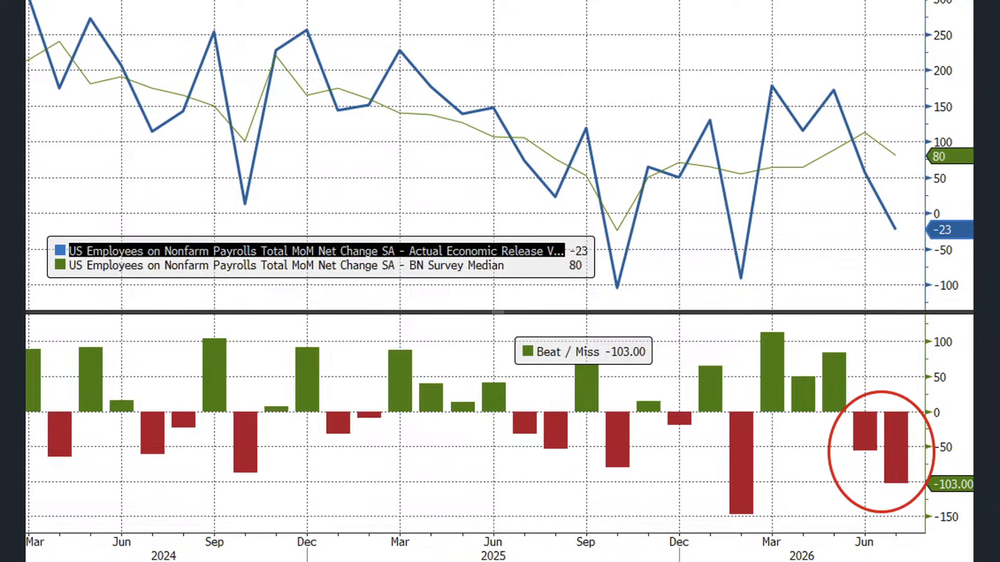 | 比較反直覺的事情是哦 這個非農就業數據 看起來過去幾個月是很差 可是美國的失業率居然 從4.2%下滑到4.1%了 原因不是突然有更多人找到工作 是家庭調查顯示失業 人口減少的17.8萬人的同時 就業人口也減少8.7萬人了 什麼意思 就是一部分人呢 他是直接離開勞動力市場之後 就不再被計算為失業人口了 他退休了 所以反而造成了失業率的下滑 這也提醒我們 失業率看起來不能夠單獨看 你看7月份的勞動參與率只有61.4% 就業人口占成年人口的比例是58.9% 兩項數據的單月變化不大 可是從今年1月份以來 其實勞參率已經下滑 了大概有0.7% 而且薪資動能也一樣失去嘍 7月份平均時薪月增只有0.1%哦 好這比原本預估的 0.3%還要下滑蠻多的 好從這這幾個數據來做觀察 都可以感受到美國的 就業數據實質現況 看起來沒有想像中這麼樂觀 失業率的下滑反而有一點 疑慮 那反而非農就業數據的校正回歸哦 真的說明美國的就業市場 已經擴張太多年了 現在仍然在一個保持 常年期的收縮當中 | 轉到失業率反而從4.2%降至4.1%的反直覺現象，可能顯示失業率與勞動人口拆解。 |
| 00:18:04 | 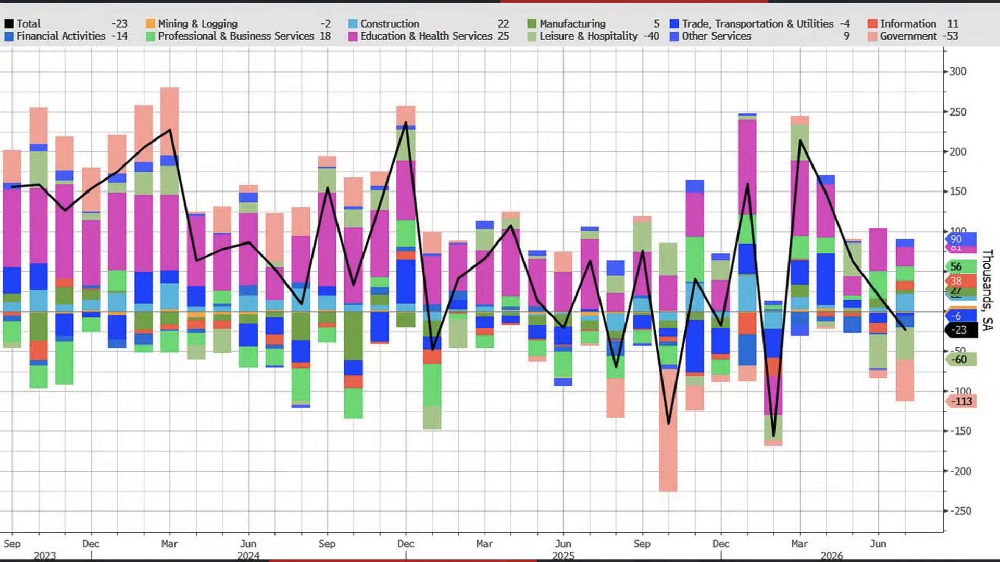 | 我們拆開產業來看 7月拖累最多的是地方教育部門 就業人口少了5萬人 零售業減少了1.9萬人 加油站燃料相關減少了5,000人 金融業也不好 金融業其實我們知道很清楚 以前招MA都招的很樂觀 然後今年就很多初級 工作直接交給AI了 7月份直接減少1.4萬人 信貸仲介和相關業務減少了9,000人 醫療保健是少數還在持續增長的 有2.2萬人 休閒餐飲業在7月份 也減少了4萬份工作 好所以為什麼我們講說7月報告 我們也很難說那種很差 但是也不能說還不錯 還可以 不能用一個簡單的結論來下一方面 就業新增是遠遠低於市場預期 全職大幅下修 全職工作甚至還大幅減少 薪資成長又放緩 這都很警訊可是呢 教育和休閒餐飲月的下滑 好像又是一次性或者季節性的因素 單月的負增長並不代表什麼 但是如果接下來數據 有持續軟化的態勢 那說明美國看起來就業是越來越疲軟 它並不是一個保持平穩的情況 | 拆解各產業就業變化，可能顯示教育、零售、金融、醫療、餐飲就業增減表。 |
| 00:19:12 |  | 好 7月份表面上最醒目的數字 就是非農減少2.3萬人嘛 然後失業率從4.2也下滑到4.1 光看兩個數據就會 很容易有一種誤解 就業變差 但失業率還穩住 但我覺得真正重要的現在是 前兩個月的就業數據 已經下修10萬人了 全職工作又減少 薪資增速又放緩 有大量想工作卻已經 不再積極求職的人 現在並沒有被計入 計算到失業人口當中 所以我覺得接下來要觀察的哦 不是每個月去看非農 就業數據增長多少 或者全職工作 重點是哦 勞動參與率是否還在下滑 還有薪資增速 這個數據可能更准了 因為現在有教師暑假 有世界盃的原因 所以統計數據可能 過去兩個月有點失真了 那你就看你的薪資是不是越領越少嘛 那大概就可以比較 符合真實的就業情況 那有時候我們以為自己 看了一個飛龍就掌握 就業市場的數據哦 可以判斷經濟到底好不好 但真正危險的往往都是那些沒有 出現在第一個數字裡的東西了 好就非農就像市場攤在 桌面上的一張牌 但真正決定市場強弱的是整副牌嘛 包括你的修正值 包括你的參與率 薪資或者職缺結構 所以你看那個職位利率哦雖然 一下子預期往下掉 結果馬上又拉回來了 好看經濟最怕的不是說數字不好 是看到了一個誒感覺 還可以的數位以後 就把它當成全部 就很多時候我們以為 掌握了足夠的資訊 就可以判斷所有的全域 那有時候真正危險的是我們 還沒有去瞭解的那些資訊 這是比較重要的 昨天我才看到網路上講 講說有同學 大學聚會 那有一個很裝的女同學 那各種炫耀 我男朋友做大生意 特別有錢 那有個富二代同學 看不下去了 說要是真的有錢 你就讓他來 把我們的單子都給買單了 好不好 那女同學二話不說 一通電話就搞定了 結果聚會的時候發現富二代買的單 那很多同學就不理解 問富二代 哎怎麼是你買單呢 那富二代說 哦沒有啦 剛才我爸打電話過來說 他來不及過來 讓我幫他買單 原來是公公 有時候遇到後媽不結帳也不行了 就很多時候 我們以為自己掌握了足夠的資訊 可以判斷 一場經濟數據的真假輸贏或者實力哦 但真正危險的就是我們 那些根本還不知道的資訊 我們看7月非農就業數據哦 7月非農減少了 但失業率也下降 就覺得勉強還可以哦 可是從一些細節數據來看呢 我認為 聯準會今年呢 真的是有機會不升息哦 甚至轉為降息哦 即便原油價格還在高位持續震盪 因為就業數據的軟化 也比想像中還要開快得多 很多人都說那個AI影響的 只是一個裁員的藉口是沒錯 只是也許他在一年前 兩年前就想裁了 他只是終於找到AI這個藉口 可以合理的裁員了 本來在就業的擴張當中 就遇到了一定的僵持 尤其在服務業 服務業本來是最缺工的 可是時間拖一年一年過去 人力成本現在已經成為 服務業最大的頭疼了 這一方面我們很需要人 但是另外一方面呢 現在開店最大的成本是什麼 我們很清楚知道 在臺灣也是 都甚至不是店租了 最大成本就是人 好那當然 如果企業獲利暴增 我們也不能期待就業 市場就一系列崩潰 然後造成聯準會大降息 | 重新歸納7月非農表面數字與真正重點，可能顯示非農、失業率、修正值、薪資比較。 |
| 00:22:36 | 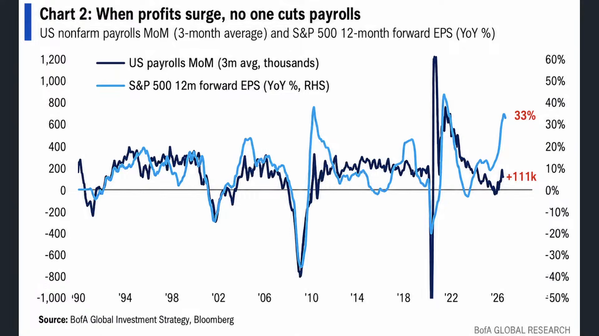 | 因為呢從標普500未來12個月的預估EPS 年增幅已經衝高到33%了 那 按照過往經驗呢 我們先拿過去數據來對照通常 美股的EPS跟美國勞動就業市場的3個月 平均非農就業年增幅呈現高度聯動 所以照來講 如果貨力大幅拉升 就業不會太差 好那現在問題來了 現在貨力已經大幅拉升了 可是非農就業數據 看起來不是特別亮麗 這到底是史上第一次經濟大好 就業大壞的脫鉤 還是說就業市場會後來跟上呢 我覺得這個可以值得來做參考 或者說有更多的人退出就業市場 所以可以讓就業總人口因此而下滑 好這也是有可能的啦 用AI來做取代嘛 但至少可以承認AI已經成為 美國經濟最重要的成長引擎 所以會造成部分的數據失 市郊比如說兩年前 在企業投入到 軟體資料中心的年化支出 大概是一兆美元 現在大概是1.5兆 光是今年6月份 美國資料中心建設的 支出年化就高達683億美元 比前一年還要增加了215億 光是AI的投資占了大概美國GDP的1/4 有好有壞 好處就是他帶領了 新一輪的生產力突破 讓大家急著去投入一個 還沒有確切能夠回饋 可是基礎建設起的大躍進 那反方向想 排擠效果 那因為本來你要做投資的 但是都給錢都給了AI 就沒有錢去做其他實業投資了 所以其他的實業投資 可能就會遭受到排擠 | 轉到標普500未來12個月EPS年增33%，可能顯示EPS與非農就業聯動圖。 |
| 00:24:10 |  | 但是呢由於現在美國的經濟 又由於財富效果的原因呢 導致美國家庭淨資產呢 從174兆美元 現在又增加了13兆 大部分都來自於股市的上漲 所以財富效果又讓大量持有股票 的美國的中產或者資產階級 他其實覺得自己 購買力並沒有衰退多少 即便通膨增加很快可是 很明顯當財富效果不斷提升 台股如果接下來突破5萬點6萬點 你會不會先訂一下中秋的機票 或者稍微訂一下明年過年機票 那很正常的嘛 即便你沒有賣掉 這就是標準的財富效果 陸續在攀升當中 | 轉到美國家庭淨資產與財富效果，可能顯示家庭淨資產增加13兆美元的圖表。 |
| 00:24:47 | 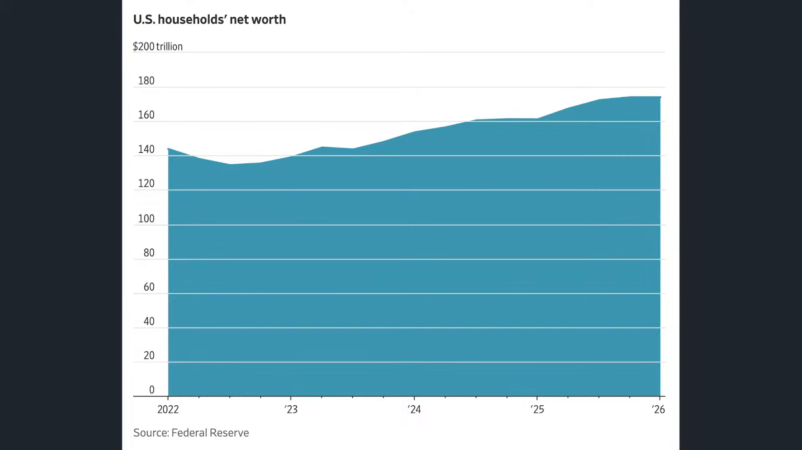 | 它也形成近一輪的脫節就是 AI到底好不好哦 它其實有不同角度來做觀察了 因為一方面呢 財富效果的確撐住了部分經濟 可是AI資本支出也成為了美國 經濟現在不可忽視的支柱 一旦它垮了 哦那麼過去的排擠效果 其資金就浪費了 我們從實質GDP當中 先把電腦設備給扣掉 把軟體也扣掉 把研發也扣掉哦誒 發現把AI這些相關的產品扣掉以後 經濟成長率 會大幅的下滑 從原本的3.5%到現在可能只會有0.8 哦所以你就可以瞭解 要是沒有AI 那現在經濟到底 能不能撐得起新一輪投資 我們找得到下一輪AI投資標的嗎 還是說最後標普五百指數 最後每家企業它可能都實施庫藏股 誒也有可能哦 所以這是壓力比較大的一點了 | 討論AI資本支出對GDP的支撐與排擠效果，可能顯示扣除AI相關投資後GDP成長差異。 |
| 00:25:39 | 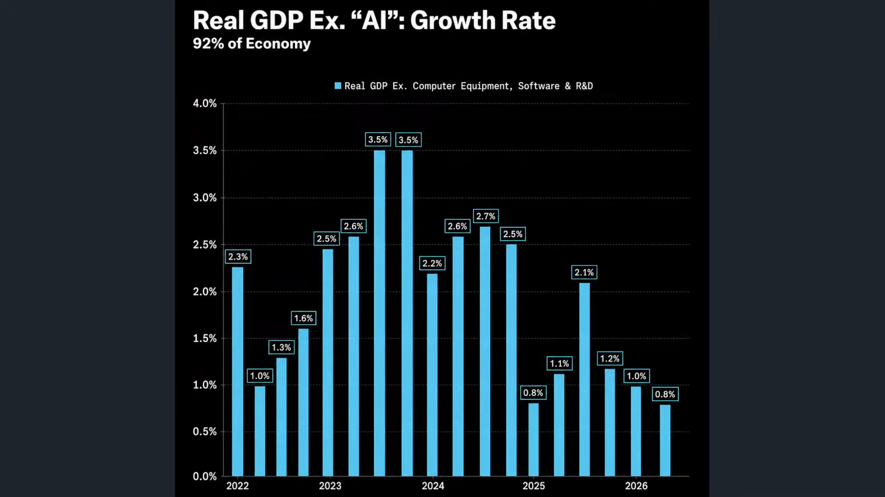 | 我們舉例來說 像巴菲特在過去一段時間呢 他相對於本輪的AI行情呢 初期還是比較保守的 可是當AI逐步成為財富效果以後 加上EPS的常年增高 然後科技巨頭又在 高位盤旋了一陣子 我們看最近 巴菲特旗下的 波克夏開始出手了 我們不能把它推給巴菲特了 應該把它推給新任的 執行長阿貝爾比較適合 因為巴菲特是囤了 接近有三年的現金嘛 上一次他 賣股票以後 基本上就沒怎麼做回補 所以現金水位一直在升高 他是在22年三季度到四季度 當時把台積電賣掉嘛 然後就真的就一直在賣股票 他不是針對台積電了 他是針對所有股票 | 切到巴菲特與波克夏投資動作，可能顯示波克夏現金水位與買股紀錄。 |
| 00:26:21 | 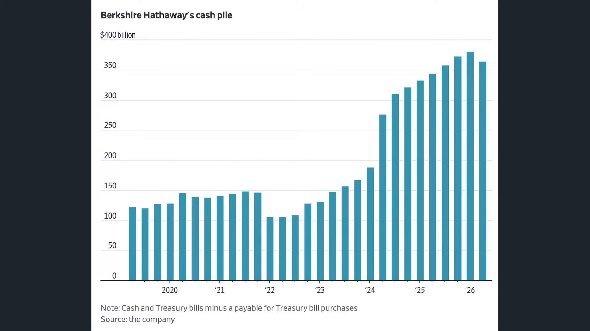 | 結果阿貝爾在巴菲特 囤了三年現金以後 一個季度他就已經砸了200億美元 好這個是過去三年來 最大的淨買股進入 其中呢我們看到他買了 100億美元的Google普通股股票 還花了45億美元回購自家股票 那你要知道哦 那很長一段時間 波克夏連自家股票都不願意做回購了 你看第一季回購自家 金額還不到3億哦 第二季直接增加到45億哦以前 巴菲特的說法都是 那個其他人的股票那麼貴 我就只願意購買這家股票股票嘛 後來呢過了一陣子他說 唉不行 我覺得我這家股票也很貴 那我這家股票股票也不 持有了我就只買短債就好 專門領配息 所以它的現金水位或者類短債部位 就不斷的升高 結果呢阿貝爾今年才正式接替波克夏 現在動作是非常非常的積極 又買了Google 然後又收購了美國的住宅建商 這個都是波克夏近年 比較少見的大型交易 阿貝爾在去年股東會就表示 只要機會合適 他會果斷的進行重大投資哦 誒所以波克夏會不會他的投資 哲學已經慢慢開始改變了 至少那一筆長期閒置的巨額 資金開始真正投入到市場 你說沒有 股市跌了會買 誒 6月份股市哪有跌 這是二季度的表現誒所以 可以肯定的是 三季度他肯定買更多 那為什麼這一次大幅度的買入Google呢 從本益比回檔我們也看得出來嘛 我們早就已經跟投資朋友講過 Google在上一次跌回到年線的時候 本益比就已經下滑到16倍了 這個水位 是比今年的 每一戰是比去年的關稅戰都來得低哦 它的水位哦 從本益比角度來說 接近於新冠疫情 那至少了 往好處想 我們以前買的點位都比股神來的低 現在它都追在2026年的 二季度哦 好所以大家買的都比巴菲特便宜 這是好事 但這件事情也就說明著 投資哲學的重大改變 似乎在AI EPS追上的過程當中 波克夏的操作邏輯 價值投資者的思維也開始轉變了 | 提出阿貝爾單季砸200億美元買股，可能顯示波克夏第二季交易明細。 |
| 00:28:25 | 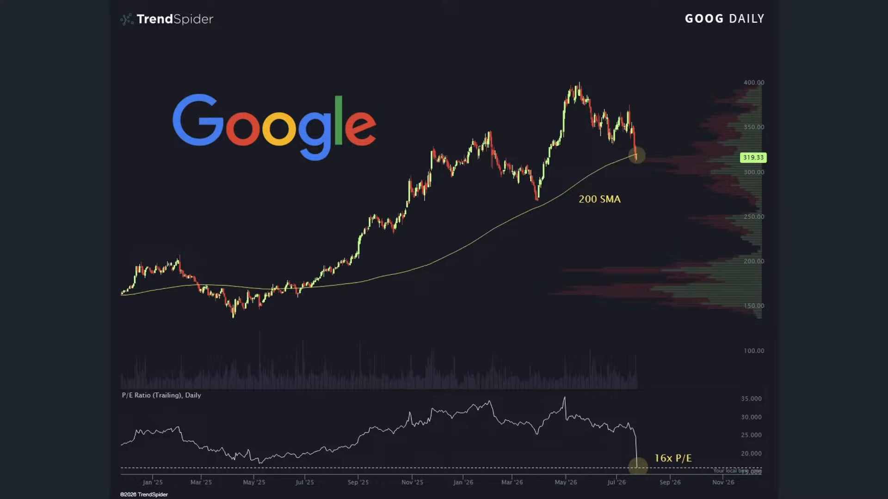 | 你說他以前擔心的 巴菲特指標呢 我們講過嘛 巴菲特指標是 股票市場的總市值除以GDP 可是最大的一個極限 你看現在已經高了接近有兩個標準差 其實估值還是很高 最大極限其實就來自於 那現在市場的集中幅度嘛 因為資金高度在集中在美股 我也買美股 韓國人也買美股 日本人也買美股 那麼股市增長的速度當然會比 美國本土GDP成長的速度來得快 尤其美國的AI巨頭 它又不是只賺美國企業的錢 美國本土的錢 它也賺韓國人日本的錢 所以股市市值超過美國的GDP漲幅 本來就是很正常的 | 解釋巴菲特指標與美股總市值相對GDP偏高，可能顯示巴菲特指標歷史分位圖。 |
| 00:29:03 | 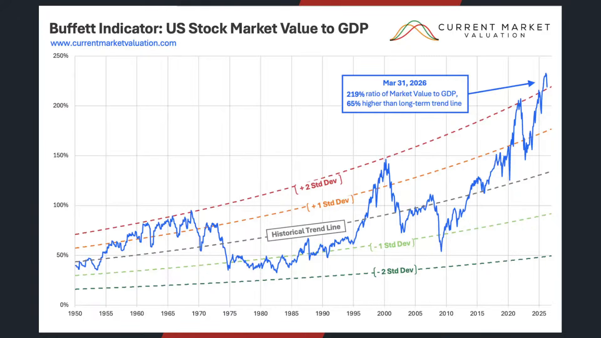 | 所以第一個是巴菲特 波克下操作思維的轉變 第二個是Michael Berry Michael Berry 這一次不只是嘴上看空 他真的是真金白銀去下碟 AI和半導體股的空頭 他在SOXX下了642塊 的美元附近建立空頭部位 7月半導體重挫以後 他都說他沒有獲利了結 會繼續看跌 然後他也曾經建立過 輝達應材帕蘭蒂爾個股的空單 那目前呢 持續看空 當然了從他的角度來看 他的思維也是很清晰了 他始終認為 現在行情不斷的 糾錯過程當中哦 你會發現資金鏈完全投入到AI 那如果AI沒有具體的生產力提升呢 那這些所有晶片股所 造成的獲利上漲它最終 可能你賺到的錢是真的 可是股價上漲之後是虛的 他的策略很簡單了 一旦到時候的波動率反轉了 現在由於大量的資金 都是由動能交易所主導 一旦波動反轉了 資金都不用形成崩盤了 同時解碼很有可能會類似出現1987年 的投資組合保險集體賣出的回饋 換句話說他賭 現在的動能交易 隨時一次性的下殺都會形成人踩人 好所以 即便不崩盤 他也可以賺的盆滿缽滿 而這是他的態度 從7月份的下修也看得出來 他在這場態度當中也 算是獲利了一些了好 雖然後來標普又創高了但是 其實這兩者他們都有自己比較 堅持原則的初心和看法 | 轉到Michael Burry真金白銀放空AI與半導體股，可能顯示SOXX與個股空單資訊。 |
| 00:30:36 |  | 真正我們看到本輪 最大挑戰的並不是 單純看多或者看空的人 真正的是看對趨勢但死在波動的人 我們才講說前Openai的研究員 20多歲的阿森布倫納 你看他作為避險基金 人家說叫做新股神 他管理的避險基金 我們講上禮拜嘛 因為人工智慧股的股票暴跌 加上持股高度集中在大量的杠杆 逼近爆倉邊緣 就在基金忙著處理危機之際哦誒 禮拜六 照常舉辦婚禮為什麼 因為危機過後 矽谷投資人沒有逃跑 反而排隊給他更多錢 本來他都覺得完蛋了 死定了因為杠杆爆掉了嘛 結果呢基金現在雖然現在是 暫停的接受新資金的 但紅杉資本 一系列的矽谷大佬都開始力挺哦 好這也反映出現在 華爾街不太一樣的文化 華爾街都逃了 看到的就是高度杠杆嘛 高度擁擠 資金都在撤資嘛 戲骨反而支持他 因為他覺得只是中途被 市場揍一拳的年輕天才嘛 誒這個基金 已經解除杠杆嘍 這一場爆倉危機 居然結束了 禮拜六還結婚了 很開心 所以工作跟生活的平衡保持相當重要 可是不是所有人都可以看對趨勢 但是沒死在波動 大多數人都死在波動了 所以我們才講說 阿布 阿森布倫納 他跟韓國散戶 兩個看起來是完全不同的故事嘛 一邊是戲骨天才基金 一個呢是追逐行情的散戶 但背後一個特點 就是一個人真正相信什麼 你不只要聽他怎麼說 還要看他長期重複做什麼 嘴巴上哦 你可以強調自己很重視風險 相信長期投資哦 但如果遇到行情選擇高度集中 增加杠杆 追逐最熱門的標的 這些反復出現的行為 才是你投資哲學的話 那挑戰就很大了 所以有時候不管是巴菲特 波克夏的投資初衷 Michael burry的投資投資初衷或者 阿森布倫納的投資初衷 韓國股市散戶的投資初衷 你不要只看他說什麼 你要看他具體在做什麼 能不能熬到最後 最近看到有故事嘛 講說那個獵人上山打熊 結果槍法太差 被熊抓到 那熊就說 你有兩個選擇 死或者伺候我 那獵人為了活命嘛 就忍辱答應伺候這隻熊 那第二天呢 他又帶槍上山報仇 結果又被抓 又被迫做同樣的事情 到第三天 獵人就準備的更充足 再次上山了 這次槍都還沒有拿出來 就被熊抓到了 那熊就看著他 忍不住問了 你老實說 你到底是來打獵的 還是來找我的 所以一個人真正想要什麼 你不要聽他怎麼說 你要看他長期重複做什麼 波克夏長期重複的作為已經 讓我們有一個心理的原則 可是在今年似乎產生了重大轉裂 高斯Michael Berry 你不要只聽他怎麼說 他真的選擇在這個時間點去放空 他也符合他的投資原則哦 好那一樣 不同人 不同的股神 阿森布倫納 他所經歷危機之後 還仍然得到投資人的力挺 是什麼原因呢 他真的很相信 他也許過程當中開了很大的杠杆 但是這個不是華爾街了 矽谷願意給他新一輪的機會 他現在能夠全身而退 還可以娶得太太 多開心 6月份的婚禮看起來很開心的 應該禮拜六的婚禮很開心的 久而久之 人不是從結果中學習 而是不斷地尋找理由 來合理化原本的行為 你要瞭解你當時所說你要投資的原則 現在還能不能套用得上 | 轉到看對趨勢但死在波動的案例，可能切到AI基金經理人阿森布倫納事件。 |
| 00:34:08 |  | 九點零五分了 臺北股市上漲507點 收在44,773點 我們今天主要跟投資朋友稍微梳理 一方面呢 是在整個通脹預期 持續增溫的情況底下 在中東戰局 在川普手掀起新一輪的關稅戰 以及現在在非農就業數據的軟化當中 能否互相沖銷至少 保持不升息的決定 那看看有沒有機會 就業數據市場持續軟化下去 聯準會可能要被迫放鴿 那第二大方面呢 是各大投資人呢 在本輪的行情波動當中 一看空看多都有他背後的理由 重點是你能不能把自己的 原則套用在自己實質的操練 操作策略上 要不然呢 嘴巴講一套 動作又是另外一套 那有時候反而能夠 創造更高的獲利變成 一個遙不可及的夢了 這給投資朋友多做一些思維和觀察了 那如果喜歡我們節目 記得幫我們訂閱按讚加分享 我們就明天早上8點半 早晨財經速解讀再相見 祝各位投資朋友看盤順利 操盤愉快 | 進入盤中即時台股數字與全篇總結，可能顯示台股指數上漲507點與收盤點位。 |
