# yutinghaofinance_9VqNpjPGmbM — 關鍵畫面索引

- 來源逐字稿：[yutinghaofinance_9VqNpjPGmbM_FIN.srt](yutinghaofinance_9VqNpjPGmbM_FIN.srt)
- 影片：https://www.youtube.com/watch?v=9VqNpjPGmbM
- 截圖數：27

## 00:00:41

**逐字稿片段：** 我們看這些美國股市在週二全數收黑, 隨著油價的攀升, 還有市場針對通膨再度拉抬以及企業融資成本的上升之後, 我們看到全世界長天齊國債殖利率 陸續創下本世紀以來的新高 肺瓣禮拜一才正式重返牛市 從低點這樣子漲上來 漲了接近兩成 結果才維持21天的熊市行情 現在又重挫了4.98% 這也代表著美國股市在晶片股的賣壓 上方仍然有顯著的市場賣壓出爐 不過要如何來看待 本輪的債市風暴 它所引發對於股市估值的削減 我們過去就一直提過說 這個殖利率一路上去 不太可能對於股市的估值沒有任何影響 不過如果現在風暴已經產生了 那麼對於股票市場所造成的壓回 它是一個機會還是一個危機呢 今天來跟投資朋友多做些觀察 這次國際油價已經攀升到兩週的高點了 那很明顯 這也讓大家對於通膨和債務的擔憂同時拉伸 那我相信尤其針對科技巨頭 在本次財報季所釋出的自由先進流轉幅 有的重要訊號 那就是下半年的發債規模 是不會停下來的 因為他們都在催錢

**話題推測：** 開場轉入美股週二全數收黑、油價與通膨推升市場賣壓的總覽畫面。

---

## 00:01:55

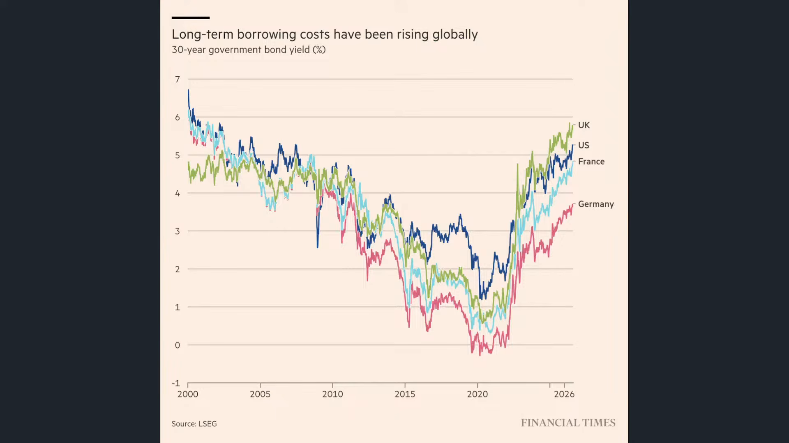

**逐字稿片段：** 我們看美國30年期公債殖利率 這一次是碰到5.34% 這是07年以來的最高 不到一個月前 之前還低於5% 德國30年期公債殖利率 已經來到3.78% 這是2011年歐債危機以來的最高 法國30年期殖利率來到4.91% 08年以來的新高 英國30年期公債殖利率 來到5.86% 這是1998年以來的新高 更不用講日本 日本來到4.16% 歷史新高 這背後其實彰顯的 一方面是剛才提到的 布蘭特原油這一次已經占上9字頭了 市場擔憂每一衝突 會持續推高能源成本 導致華許不得不採取相對緊縮的態勢 但是另外一個根本原因

**話題推測：** 開始列舉美國、德國、法國、英國、日本30年期公債殖利率創高數據，適合呈現全球長債殖利率圖表。

---

## 00:02:41

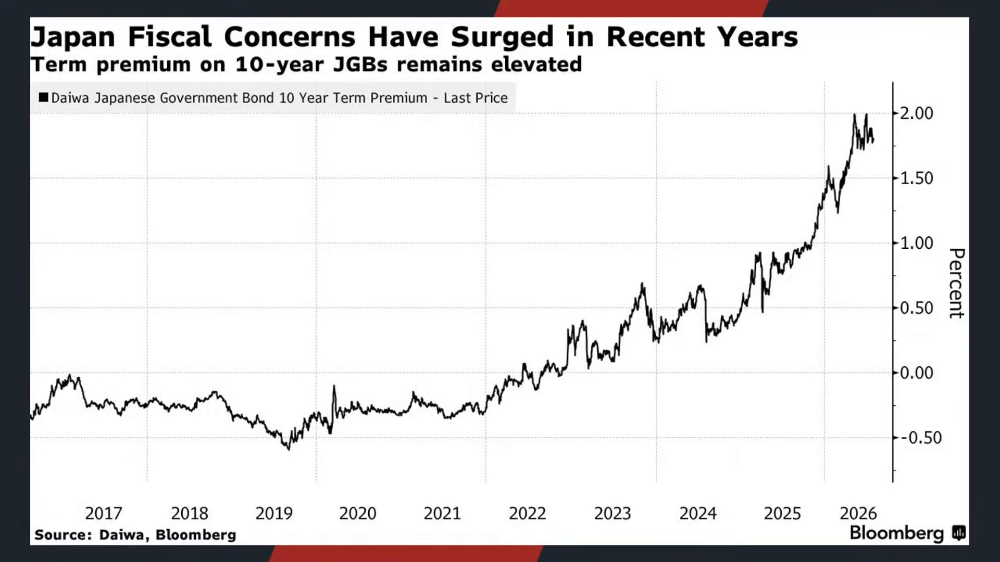

**逐字稿片段：** 我們其實都很清楚 那就是AI資本支出 正在和政府搶奪長期資金 這已經好幾周 我們都不斷在講了 只是當時的利空仍然沒有發酵 可是償債殖利率已經開始噴了 那就是科技巨頭為了建資料中心 晶片還有電力投資 是大量的發行長天期公司債

**話題推測：** 轉入AI資本支出與政府搶奪長期資金的核心解釋，可能切換到AI融資或公司債供給圖。

---

## 00:02:59

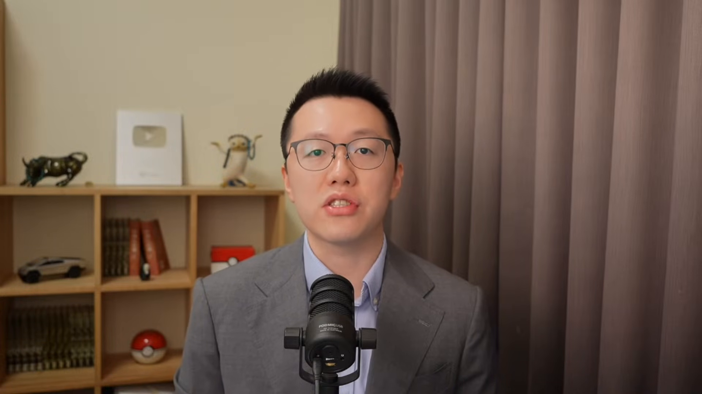

**逐字稿片段：** 你像Google 現在又要準備發行 50億美元的公司債了 在本週 然後有36億美元的澳幣的債券 所以某種程度而言 政府端以前每年 就會發行一定的規模 借新還舊 現在突然這麼多巨頭 也要同時發債 債券投資人的口袋 是有限的 錢都給你買完了 那沒辦法買不動 當你持續進行供給的時候 價格就會因此而鬆動 所以根據巴克萊的估計 光是買家結構 從官方部門轉向私人資金 就導致美國30年期公債制利率 被迫增加90個基點的期限溢價 就是沒有人要買美國國債了 因為投資等級在那利率開得更高 20年30年期 很多都到70%8% 而且是大巨頭 那很多人認為 這些巨頭跟美國政府一樣 怎麼可能倒呢 國泰集團 零元集團怎麼可能倒呢 富邦怎麼可能倒呢 當你給我更高的殖利率 我當然就去選擇了 所以導致全世界的長天期國債殖利率 都在快速的飆升 這是第一個重點 也就是通膨的加成 再加上AI的融資成本 巨頭跟政府端牆資金 所導致的結果 那第二個結果 當然來自於 政策的不穩定性還在上升 我們看到就在幾個小時之前 川普又發文了 他說目前美國的確跟伊朗 已經正式停止對話 也沒有排定任何的會談 那麼目前的海上封鎖 還是會全面的執行 荷姆斯海峽目前是維持開放 只是伊朗沒有維持開放 在美國的角度而言 船隻是可以自由通行的 那所有的水雷都已經清除或者引爆 但是很清楚知道 荷姆斯海峽目前幾乎沒有任何的 郵輪來做通過 甚至川普有一種 自行宣佈勝利的感覺 在幾個小時之前

**話題推測：** 提到Google本週準備發行50億美元公司債，畫面可能切到Google或大型科技債券新聞。

---

## 00:04:46

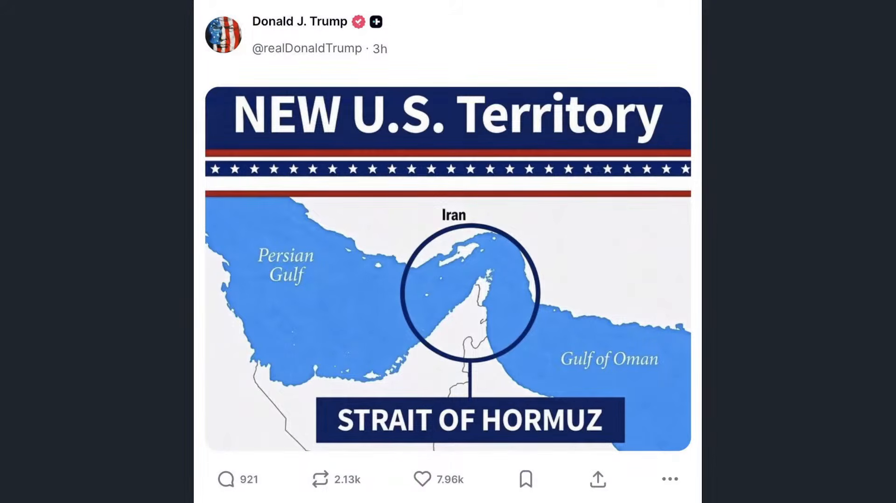

**逐字稿片段：** 川普也放上了新的美國的領土板塊 就畫在荷姆斯海峽 宣告大家荷姆斯海峽已經非美國所屬 這有點像大富翁環遊世界的版本 到處插旗 你有種就來臺灣插 請你插你又不敢插 當然我們也知道整個中東的局勢 到目前為止仍然持續僵持 這也就說明著攻擊鏈的改革 還是要給他一段的時間 那不代表說通膨就會失控 你要想想看 如果明年原油價格還是90塊 那會發生什麼事情 通膨至少從能源端的年增幅就變零 你說90塊還是很貴 今年開打前只有五六十 現在90不貴嗎 明年一整年都90塊 一路到年底 那年增幅也變零了 我們講通膨是年增幅 物價上升的速度 通膨不代表物價的高或低 他是講的是每年單年度的通膨增幅 每年的物價上漲的幅度 這是第一個 用時間沖淡一切 就好像前女友前妻一樣 用時間沖淡一切

**話題推測：** 提到川普放上新的美國領土板塊畫在荷姆斯海峽，可能切到社群貼文或地圖畫面。

---

## 00:05:49

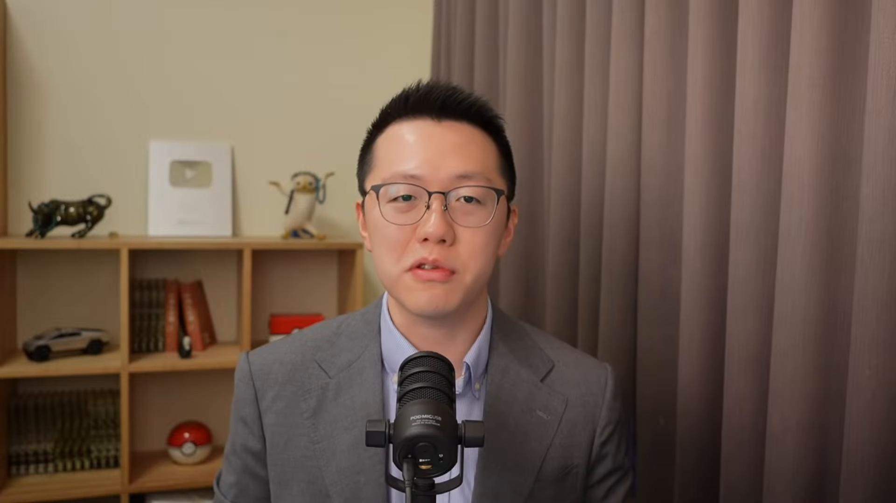

**逐字稿片段：** 這第一種 那第二種是我們要看 那是否能夠採取進一步的軍事行動來緩解呢 那市場的普遍預估是 軍事行動的確有可能改變 現在的石油緩步推升的情況 可是現在也沒有到失控的地步 不如等期中選舉大勢底定的時候 再來採取下一步的軍事行動 這是大家比較有所把握的 認為距離現在期中選舉 也不過就兩個多月的時間 那如果盲目的採取一些軍事動作 恐怕不利於共和黨的選情 所以最好呢 由軍事行動留在選後再說 事實上我不知道 美伊德六十天停火協議 昨天就已經到齊了嘛 那由於談判陷入僵局 所以川普乾脆就直接承認 的確現在已經沒有再談了 那現在呢

**話題推測：** 從時間淡化通膨轉到是否採取進一步軍事行動緩解油價，畫面可能切到中東軍事情勢。

---

## 00:06:32

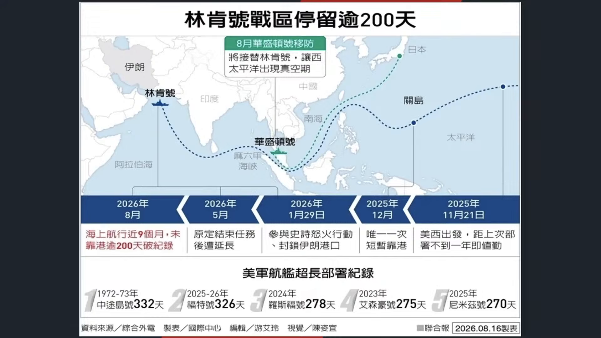

**逐字稿片段：** 最大的問題來自於 因為時間已經拖超過六個月的戰事了 長期部署在中東的林肯號航空母艦 已經在戰區停留超過兩百天 那現在累積出動次數 已經超過1萬架次 不僅是參與對於伊朗的空襲 也投入海上封鎖 潛艇人員或者裝備的負荷 現在都已經幾乎到達極限了 所以被迫要開始進行抽調 那要從哪裡抽調呢 從太平洋抽調 把駐日的華盛頓號 調往中東階梯 等於是把原本負責西太平洋的 重要航艦兵力給抽走 那大家當然就會擔心 尤其對於臺灣 對於日本南海周邊盟友就會擔憂 那是不是在短期內 西太平洋就有可能出現 航艦戰力的空窗 那更大的問題來自於 因為的確 當時美軍所採取的行動 你不要講說 軍事專家的角度 或者我們看五角大廈的角度 大家也不認為會打這麼久 可能就認為跟前一年的 午夜之錘行動一樣 炸完差不多就結束了 結果整個美國海軍的調度 由於長時間 已經半年在東東來做配置 現在調度壓力正在快速的浮現 這福特號當時是已經部署了11個月才返美 我忘記是福特號還是林肯號了 有一個是馬桶炸掉 所以被迫要返航 馬桶大便衝不下去 但不管怎麼說 這等同於整個中東局勢 它會為通膨奠定一定的僵固性 我們看柴油的部分 現在美加侖已經衝高到5.47美元了 這距離歷史新高5.82美元只差一步 這也很離譜 明明期貨價格距離120的歷史高點 還有很長一段路要走 結果柴油價格又快要衝下歷史新高了 過去一個月又漲了8% 你要知道柴油 它不像是汽油隻影響開車主 它會影響卡車運輸 影響到農業機械 影響到工廠的設備 冬夜的取暖 一些重要燃料 所以當油價上去之後 物流啊 食品零售製造成本 都會一步一步的往下傳 而且我們都知道 傳下去以後 那個僵固性就慢慢產生了 就算最後汽油價格終於跌回來 柴油價格終於跌回來 大概傳下去的物價也不會因此而下調了

**話題推測：** 轉入林肯號航空母艦長期部署、出動超過1萬架次與美軍調度壓力。

---

## 00:08:42

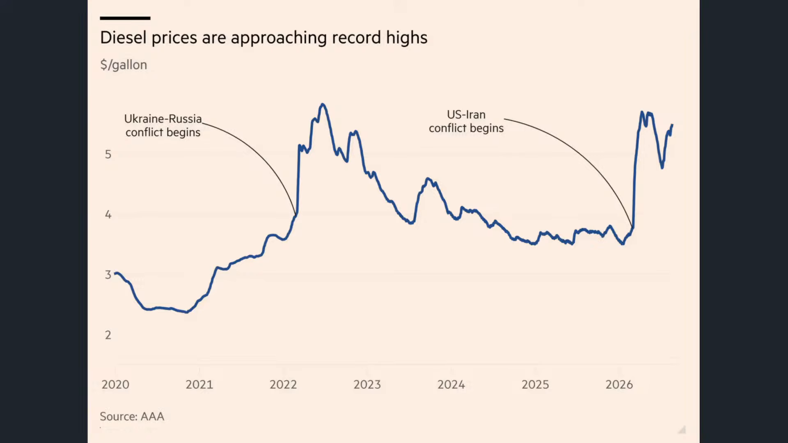

**逐字稿片段：** 我們從228到8月17號 各項商品的漲價幅度 小麥現在是漲了14% 棕櫚油17% 布蘭特雲油25% 西德州27% 棉花31% 汽油漲了3成6 稻米36% 柴油半年漲了4成5 航空燃油漲了5成6 取暖油漲了7成1 硫磺價格漲了145

**話題推測：** 開始列舉228到8月17日各項商品漲幅，適合呈現商品價格漲幅排行表。

---

## 00:09:03

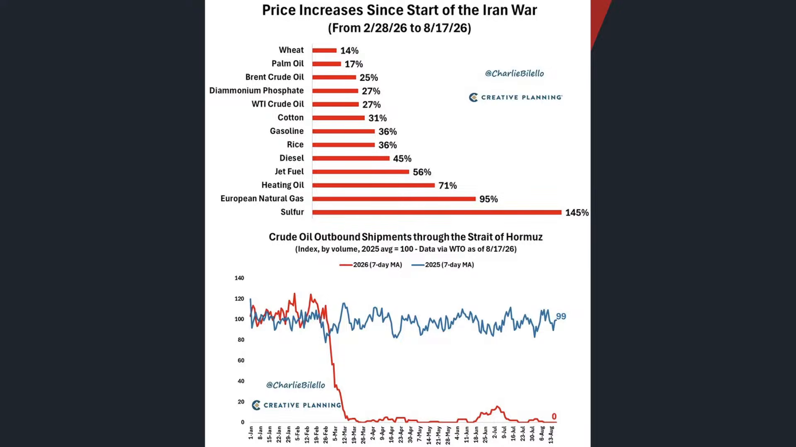

**逐字稿片段：** 這很多人說 硫磺價格為什麼會漲這麼多 硫磺其實很重要 它不像是石油這麼重要 但是它是全球農業和化工產品 很關鍵的上油材料 最大的用途 硫磺不是直接拿來使用 它是製作成硫酸 進一步生產成磷肥或者化肥 硫磺價格大漲 主要是跟農產品的生產成本有關 那現在漲了145% 就是因為之前硫磺供應 跟石油跟天然氣產業是高度綁定 尤其在中東 天然氣處理在脫硫過程當中的副作用 副產品是很重要的 所以硫磺價格的大漲 你不能把它當成一個冷門產品在漲 它比較像是第二次的能源危機傳導 第一波就當然就是石油 外溢出去 第二波就是硫磺價格的傳導 那預估在一到兩季內 會讓所有的農產品的生產成本 進一步調高 然後等到半年以後 逐步反映在終端物價身上 那這件事情 也不至於通膨會失控 因為油價也沒創高 但是就產生了極大的僵固性

**話題推測：** 從商品總表切入硫磺價格為何大漲145%，可能呈現硫磺與化肥供應鏈圖。

---

## 00:10:04

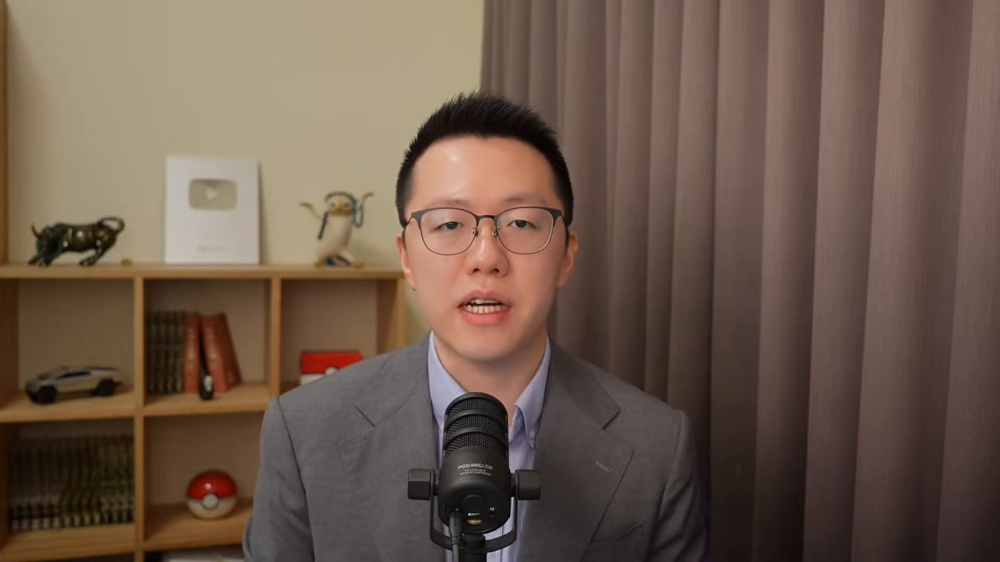

**逐字稿片段：** 我舉一個比較直觀的 全球航空公司 現在原油價格 至少相對於當時 3月到4月的高點 已經下來了 可是航空公司 沒有人要降價 航空公司現在是趁勢 加收燃油附加費 而且保持在當前的高水位 明明獲利已經放大了 但仍然不願意放低價格 為什麼呢 原因很簡單 因為這一波漲價潮以後 發現下半年 尤其是亞洲航空公司 平均是把票價提高了三分之一 但是需求 只有減少10% 這說明著航空公司已經意識到了 好像大家賺錢 股票賺的蠻多的 居然我票價已經調了三成 我的需求只減少10% 那我的獲利營收還不是繼續增長 有時候公司他追求的 不是營收的極大化 而是利潤的極大化 所以這個時候 就發現航空公司的機票價格 已經產生了比過去更強的價格粘性 居然沒有任何一家航空公司 下跌幅度超過10% 正常來講 按照原油價格的回檔 應該要陸續做調降 這是第二個觀察的重點

**話題推測：** 用全球航空公司作為通膨僵固性的例子，畫面可能切到航空票價或燃油附加費資料。

---

## 00:11:08

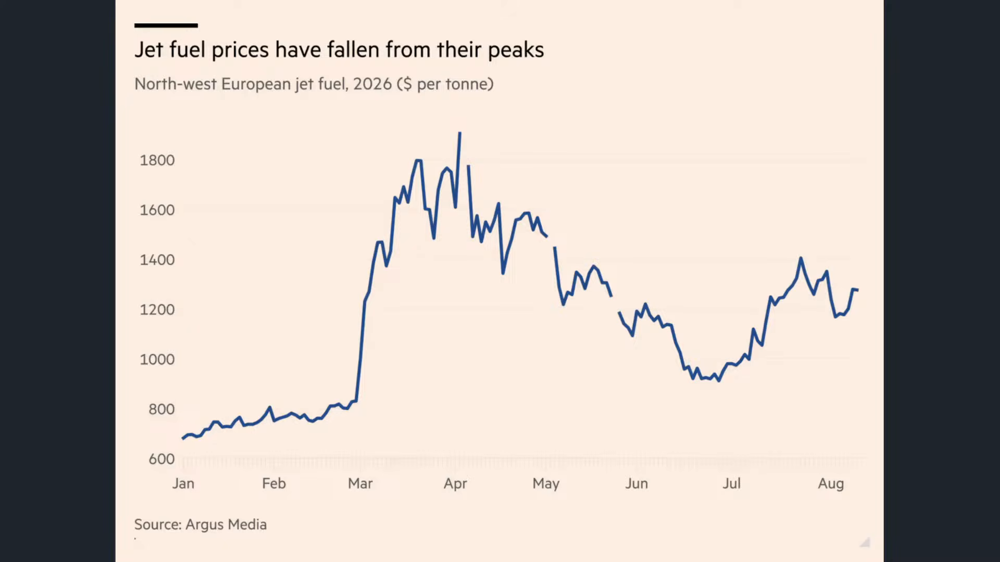

**逐字稿片段：** 當然我們也知道 全球的地緣政治緊張 也是要求債券更多風險貼水的主因 前陣子我們看到 川普已經下令五角大廈 要大幅縮減即將登場的美韓聯合軍演 這場演習是從過去兩天一直到27號 這個禮拜就已經開始了 一直到下禮拜 但是因為時間太近來不及取消 所以改成縮小規模 川普的理由很直接 他認為美韓軍演不只是花費昂貴 而且很多成本又由美國來負擔 重點是之前他跟李在明說 一起來推動伊朗的去核化 結果李在明居然拒絕他暗示縮減軍演 現在就是在反映李在明的不支持 或者說韓國政府對於美國盟友之間的不信任 你居然沒有跟著我一起去護航 怎麼可以這樣做呢 結果縮少金援 那當然這種軍演規模的縮減 它也不是什麼大事 可是問題看得出來 這個美方對於地緣政治所產生的影響 仍然在持續下去 事實上我們也知道

**話題推測：** 轉入全球地緣政治緊張與美韓聯合軍演縮減，適合切到美韓軍演新聞。

---

## 00:12:10

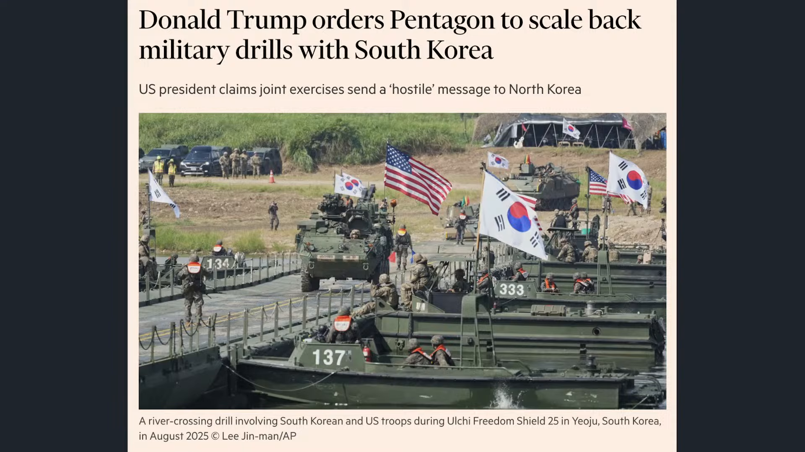

**逐字稿片段：** 韓國政府也有自己的理由 李在明一直要求 美方應該要儘快地 將核潛艇當時的承諾予以實施 李在明開始反擊 要求美國現在快速加快 南韓取得第一艘的核動力潛艇 當時在關稅談判就有提到說 如果韓國富如此高 昂貴的關稅投資額 那美方至少要提供核動力潛艇相關技術 而且強調我們越強大 同盟的價值和必要性就來得越高 可是美國到目前為止 仍然沒有提供任何相關的技術 甚至現在川普直接跟金正恩談判 南韓也沒有足夠的參與權 那我們要知道 南韓政府是對於核潛艇的渴望 主要就是來自於壓抑北韓潛艇 所以需求是很大的 雙方仍然在交涉當中 那不管怎麼說 我們知道全球的地緣政治緊張 再加上AI的融資需求持續暴增以後 造成了現在殖利率的創高

**話題推測：** 話題轉到韓國要求美國履行核動力潛艇技術承諾，可能呈現南韓核潛艇或關稅談判畫面。

---

## 00:13:03

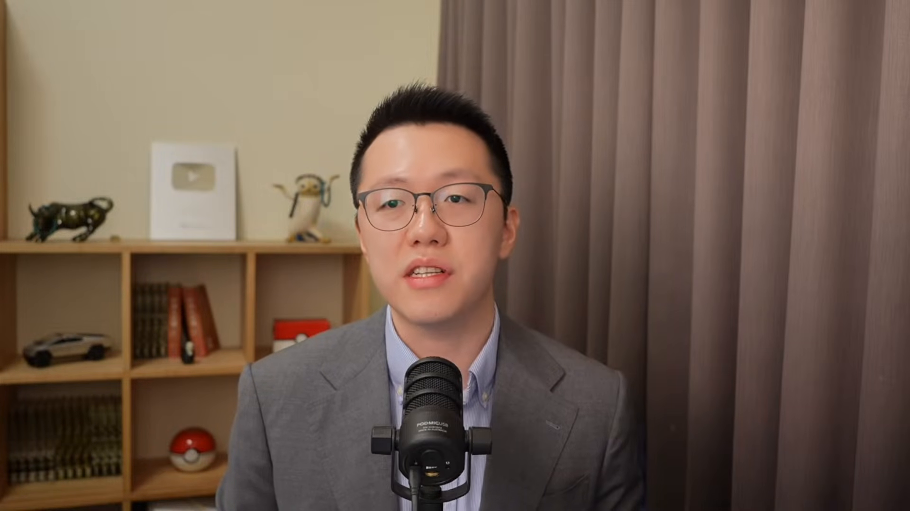

**逐字稿片段：** 但殖利率的創高 到底是機會還是危機呢 我們稍晚來做進一步追蹤 可是可以看到 就是由這兩大因子 這兩大因子過去幾週一直存在 我們一直提 現在終於造成了股價回擋 那我們就看看 有沒有機會可以來做選擇了 但不管怎麼說 美國走到這一步 的確戰事時間比想象中來得久 甚至只要把伊朗戰事給拿掉 今年我覺得百分之百已經在降息格局了 就由於伊朗戰事拖住了整條的時間線 前兩天我才看到那個 網絡上的講那個羅斯福的老笑話 他講說那個在天堂的小羅斯福 想要看看現在的美國怎麼樣 然後就到人間 還拜訪了川普 他先問國際局勢 說國際局勢怎麼樣 蘇聯現在怎麼樣 川普說已經沒有蘇聯了 他解體了 現在只有俄羅斯 不過他正在跟烏克蘭打仗 還有這種事 那日本呢 日本怎麼樣 川普說 日本現在是我們東亞的重要盟友 幫助我們牽制中國 羅斯福想 還有這種事 反而要牽制中國 那德國呢 德國應該被徹底摧毀了 川普說 德國現在也是我們的盟友 也是歐洲經濟的霸權 前幾天我們還邀請他們 一起去波斯灣護航 羅斯福想 還有這種事 護航是要針對英國和法國嗎 川普說 沒有 他們80年前就把殖民地都丟光了 我們現在是針對伊朗的行動 還有這種事 那打一個伊朗應該沒什麼挑戰吧 雖然他們完全沒有投降的跡象 不過我們美國已經贏了 孩子 我們真的打贏二戰了嗎 所以你把小羅斯福抓到現在 他也很難理解現在的局勢 你知道嗎 OK 所以這是我們觀察到的實質現象 當然這場戰是拖的時間比想象中來得久 是引起現在利率預期的重要變化 也許科技巨頭的確會導致 全球的公債市場的供給 因此資金鍊被吸走了一些 可是伊朗戰事才是罪魁禍首 這是第一個觀察重點 那第二件事情 是搶錢還在持續 Anthropic現在上市之前 整體把循環的信貸額度 已經擴張到100億美元 較去年取得的25億美元 五年期額度增加了至少三倍 那由於10月到11月 就有可能直接掛牌 那你要知道 這麼龐大的一個募資額 雖然不見得跟SpaceX一樣 可是至少可以看到 全球要準備好銀彈 要買這隻股票 那麼對於全球流動性的收縮 壓力會不會來得越來越大呢 這是進一步的壓力

**話題推測：** 回到殖利率創高究竟是機會還是危機的投資判斷主題，可能切到債券殖利率與股市估值對照。

---

## 00:15:33

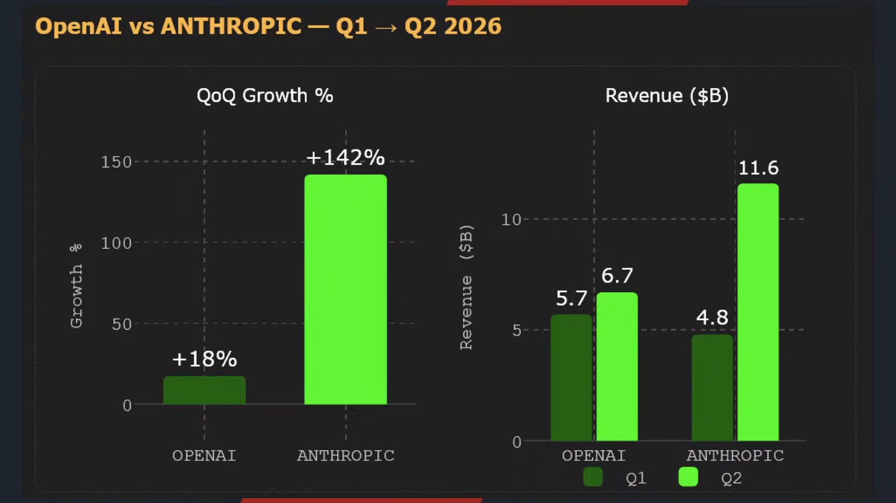

**逐字稿片段：** 其實Antropic 整體經營數字算是很不錯 截至到7月底 它的年化營收已經650億了 最近一個季度的初步營收 是115億 相對於OpenAI OpenAI第二季營收也不過67億 前一季才成長18% 這樣子比較起來 Antropic它是翻倍成長 所以的確看起來Enthropic在單季營收上 已經全面超越OpenAI 而且嘗試的做拉開距離了 那當然了既然有人要上市 那有人有做進一步的信貸計劃 融資計劃

**話題推測：** 開始比較Anthropic與OpenAI營收成長數字，適合呈現AI公司營收比較圖。

---

## 00:16:04

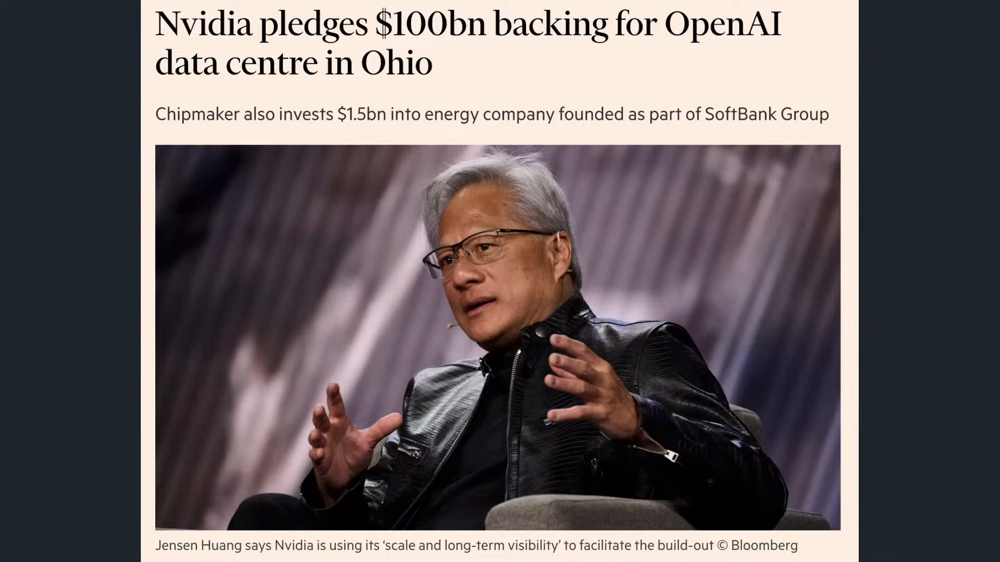

**逐字稿片段：** 輝達做什麼 輝達也是到處扶植 你不要看OpenAI好像 好像現在沒什麼人願意去理他 輝達也為OpenAI在美國Ohio 新建的大型資料中心 最近提供了1050億美元的信用支持 協助開發軟銀旗下的能源公司 來籌措數百億美元的建設資金 輝達本身是這樣 它之前的那個五千億 跟現在的一千億 它都不是自己出錢 它也不是去跟人家借錢 它是幫自己的客戶做擔保 就是OpenAI你要借錢 沒關係 OpenAI如果還不起 以後由我輝達來付 如果它倒閉的話 一樣CoreWave你要借錢 你華爾街不願意借你 或者利率條件不好 沒關係 我做擔保 如果未來它還不起 我來承擔 輝達現在就是到處跟人家擔保 目的就是為了幫助他的客戶 能夠全面的取得資金 那這些客戶又會繼續花錢 來買他的GPU 把整個市場給做大 那不只是美方企業 中國企業也是如此 字節跳動在本週宣佈 籌組200億美元的連帶 而且市場的認購金額 已經超過300億美元 這也顯示銀行對於這家 中國科技公司的融資需求 也相當踴躍 所以從這樣的一個角度來看 都會發現 全世界都進入到搶錢大作戰 那當然 這種針對債務的擔憂 它就會重新反映在殖利率身上

**話題推測：** 話題切到輝達替OpenAI資料中心提供1050億美元信用支持。

---

## 00:17:22

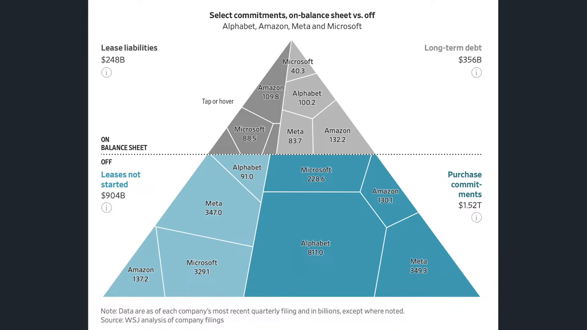

**逐字稿片段：** 華爾街最近做的三期報導 其實就彰顯了這種科技巨頭 表外承諾所造成的影響 因為大家都用SPV 很多表外的承諾 它不會認列到 公司本身的損益表身上 或者現金流量表 遠高於過去6000億的資本支出 反映在其他表外的資產 比如說尚未啟動的資料中心 承諾大概是1.2兆 比前一年大概增長了4倍 晶片設備或者一些電力的採購 大概是來到1.9兆 也是去年相對起 已經翻了一整倍 可是這些都沒有反映在 資產負債表身上 以Meta來說 Meta現在在路易斯安那 它有超大型的資料中心 融資需求是270億 不過它不會認列在 Meta的資產負債表身上 為什麼呢 因為它是成立了一個單獨公司 來反映它的負債 所以這些負債它的規模 它就以冰山來做舉例 底下規模其實比想象中 還要來得更為龐大 不過第一 有沒有可能重複計算的問題 第二本來市場上在AI生產力爆發前 他就要足夠的資金投入 一直到第一批的資料中心蓋成以後 錢才能夠收得回來 可是這些數據 這些文章這些報道 他就不斷的推波助瀾以後 讓大家擔憂 完了 到底我們有沒有那麼大的能力 去承接這麼多新發行的投資等級債 如果沒有能力 那麼先拋售一點債券 這就是形成最後的結果

**話題推測：** 引用華爾街報導科技巨頭表外承諾與SPV融資影響，適合呈現表外負債或冰山圖。

---

## 00:18:45

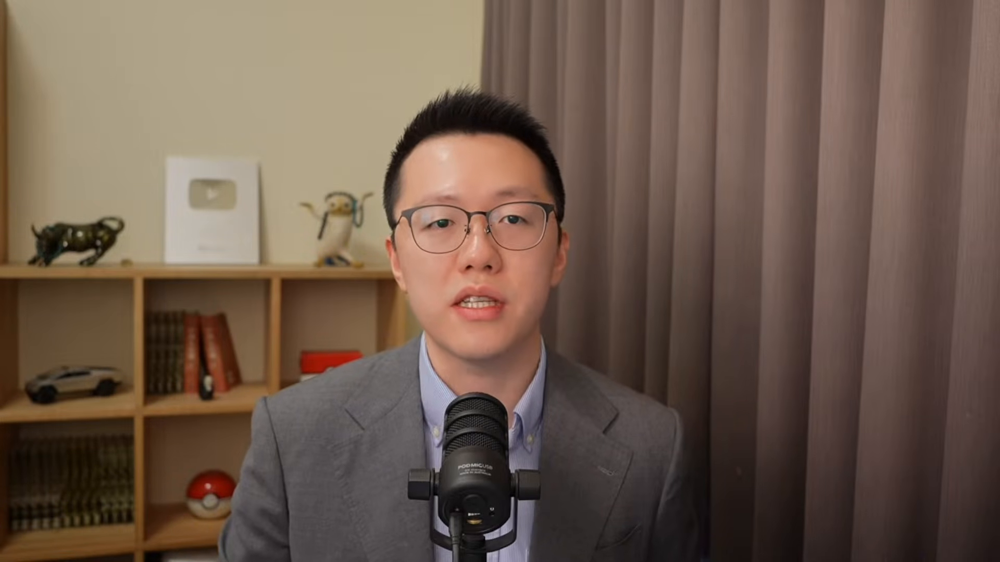

**逐字稿片段：** 可是我們剛才講要反過來想 沒在殖利率最容易讓人犯的錯 就是你等到殖利率真的一路衝高 股市開始沉壓 你才覺得常債已經開始擠壓估值 這個是很明確的信號沒錯 可是你就晚一拍 你怎麼會常債已經開始擠壓估值 你才覺得利空開始呢 它利空一直存在 只是現在發動了 那我覺得反過來 你現在反而要尋找機會 一樣你投資也不是等利率上升之後 你才發現有擠壓才賣股 也不是等降息具體落幕 或者說落地之後 你才開始追股票 你不能等公佈財報 來因為財報來買股票 做波段操作 你肯定是預測財報 所以股市通常就是會提前反應 如果常在供給通膨 或者極限溢價 正在累積壓力 你也不用等到殖利率創高才防守 你應該早就要防守了 所以不要慢一拍 我覺得現在要領先一拍就變成了 那殖利率的創高 造成股市估值的反應 它是泡沫撲面嗎 我相信不是 我相信距離供給過升 有很長一段時間 所以你要提前想一步 現在的心意人的左側回答 我們該做的是尋找機會 而不是規避危機 一個老頭看醫生 告訴醫生他的腸胃有問題 那你的大便有規律嗎 很規律 我每天早上八點鐘準時大便 那你還有什麼問題嗎 可是我九點才起床 所以時間線的問題 如果你拿捏不好 你知道的再準 知道他的意圖 知道要如何處理這個問題 都沒有任何作用 重點是你要提前進行規劃 好 那我們往下看 沒有股市 其實回漲幅度也沒有想象中來得大 因為前幾天還在創高 道瓊指數下跌116.0.22% 收在53,343點 標普下跌53.0.69% 收在7,691點 納指下跌355.1.33% 收在26,289點 費辦下跌628點 4.98% 收在11,992點 其實從三大指數表現都還好 那費辦本來就已經談很多了 你看這一次談這麼久 它也沒有真正的第二隻腳發生過 那很多人都認為 在過往的終極回調 至少要打第二隻腳才願意考慮 那現在終於出現了 那當然這種技術角度 並不是我們擅長 甚至有時候出現第三隻腳也很正常 像我也有第三隻腳 所以股票市場 本輪真正受傷的 也不是想象中來得多 今年受傷大概三種人 第一是比特挖 第二是債挖 第三是買在六月的記憶卡挖 大概是這樣子 你放到投資市場也是一樣 一開始當所有人都開始相信 AI一定是未來 所以AI未來不可能跌 這是一種敘事 美國科技巨頭怎麼會出事呢 或者這一次不一樣 最大的風險都不是這些產業沒有未來 是很多時候你不要把一件事情當成永恆 AI是不是發展趨勢 是啊 那AI永遠不會泡沫嗎 當然不是 資產價格總會有泡沫的問題 1929年以前你覺得沒有生產力大爆發嗎 在一戰二戰時期 其實是生產力大爆發的一個過程 所以很多時候我們本來就是 不能把所有事情都視為永恆 可是如果指標沒有到 你要提前去估計 不要過度的預判未來 認為很久性的未來一定會發生 你要稍微可以理解說 這個市場週期性的變化 羅馬帝國可以存在很久 也不代表它真的永恆 AI可以完全的改變世界 那難道估值都不回調的嗎 難道任何資本支出都是合理的嗎 任何的融資規模都永遠合理嗎 藉由債券市場的反應 讓你知道 你借錢不能借太誇張 這件事情本來就是適度的終極回調 固執回調 本來就是沒有一件事情是永恆 可以永遠的一路看好的 之前講那蘇聯公民 以前去那個政府辦公室 要申請移民 想要移民去美國 那官員還問 你為什麼想要離開偉大的蘇聯 那個人回答 我有兩個理由 第一個是我怕蘇聯會垮掉 那官員怒道 你胡說八道 蘇聯是永恆的 那公民點點頭 對對對這就是我第二個理由 所以我們每次都知道這一次不一樣 但是其實每一次也都一樣 時間尺度問題 你看好AI也不代表AI永遠估值都偏低 永遠都只會上漲 它一樣會有估值回調的時候 要了解你的恆久性看法 和市場本身的週期關係 好那我們要回過頭說 現在市場上更進一步觀察的 是中國的崛起是否會對於美國股市 形成進一步的估值消減 剛才講的都是債券市場的變化 事實上美國現在已經準備在 準備相關手續了

**話題推測：** 轉入投資判斷：殖利率衝高與股市承壓是否反而應該尋找機會。

---

## 00:23:18

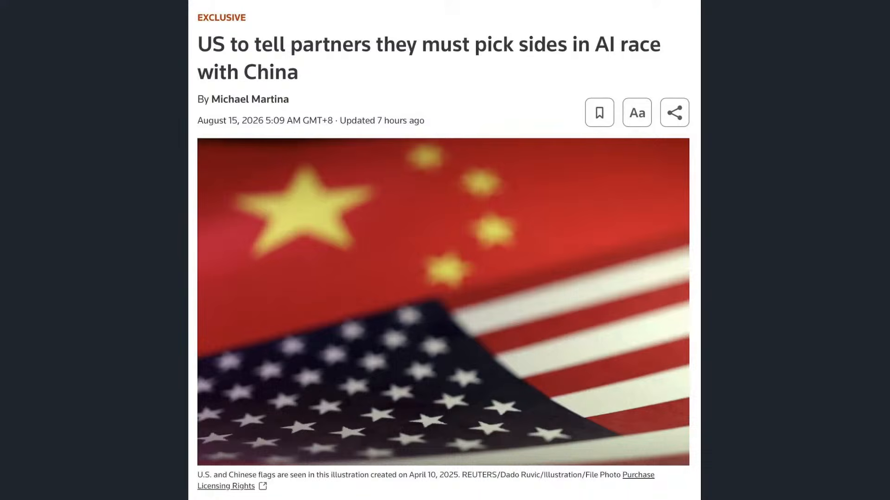

**逐字稿片段：** 根據路透社的報道 美國現在正在準備向35個國家 來發出明確的訊號 未來不能夠同時加入 美國或者中國主導的AI合作框架 必須要選偏戰了 什麼意思 就一個國家 以下是各公司選擇 比如說你喜歡AI 中國的AI 你喜歡它的開源 那你就使用它的 那你覺得成本 有些需要負擔比較多 但是要做前沿模型 就用美系的 現在剛照路透社的一個報道 美國白宮已經正在準備了 直接要求國家不能夠同時加入 由美國和中國主導的AI合作框架 美國國務院其實在朝你的信件 已經寫得相當清楚了 代表未來對於美國AI供應鏈 關鍵的礦物半導體甚至是模型 如果你轉而加入中國陣營 那你就會失去所有跟美方合作的機會 你只要採用它的軟體 那你以後就不要跟我做生意了 你可以跟它做沒關係 但是你就會喪失我這個人 對於你相關的技術授權 所以這也就說明 美國現在嘗試的 把晶片算力模型 關鍵礦物和出口管制 綁成同一個聯盟 你想想看 我們最害怕的就是 美國只用美國的AI模型 可是東南亞人 一部分用美國的 可是大部分用中國的AI模型 那麼美國在全球的 市佔影響力就會受到衝擊 那我現在逼你 只能二選一 那你要麼選美國 要麼選中國 這個時候對於美國的衝擊 似乎就沒這麼大了 所以現在壓力最大的 並不是中美 是東南亞 是中東 是中亞等地的這些開發中國家 那這件事情也很弔詭 因為白宮在傳出這項訊息的時候 之前 蘋果在中國的AI才剛剛解禁 蘋果這一次是為了中國市場 訓練了一整套的專屬大語言模型 而且是阿里籤問的配合 這代表蘋果可能是中國 第一家獲得北京批准 能夠在中國提供 自有AI模型的外國企業 中國網信辦在7月份就已經同意了 未來的Apple Intelligence 是用阿里的模型 就是蘋果現在是 你用Siri 當中他有跟German 有跟OpenAI合作的技術 這個我們知道 然後跟OpenAI好像有點爭議 但不是重點 我們用的手機 現在都是用美系的AI 可是iPhone之後 在中國用的Apple Intelligence 它是用阿里的籤問 會整合到iPhone iPad Mac 那未來會不會形成極大爭議呢 這個就是值得大家觀察的一個角度了 因為各項政策接連而來都看得出來 美方對於本土企業的保護有多大

**話題推測：** 引用路透社報導美國準備要求35國在美中AI合作框架間二選一。

---

## 00:25:51

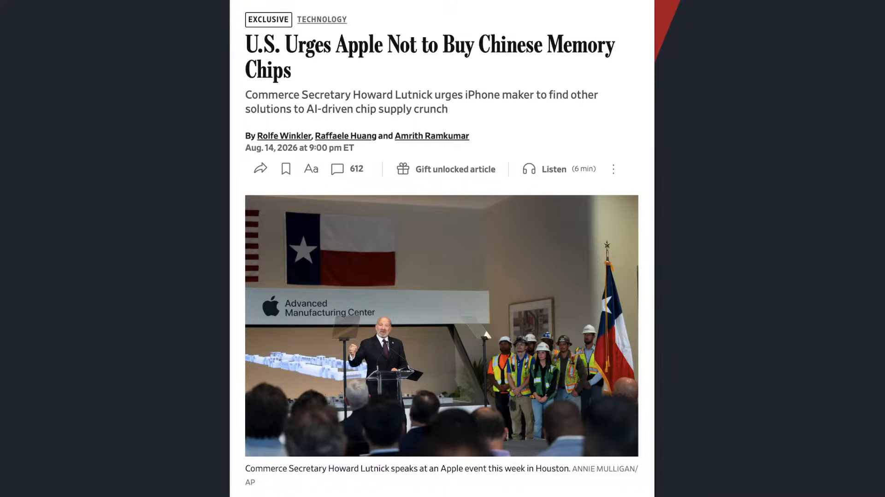

**逐字稿片段：** 川普這一次也施壓蘋果 不要買中國長期存儲的記憶體 AI缺貨正在把供應鏈變成了國安角力 這是盧特尼克直接表示的 川普已經向蘋果直接表明 不希望你要解決缺貨問題 這由中國記憶體廠來解決 如果你跟長興來接觸 目的是要去壓價格 要壓SK海力士 要壓三星價格 這可以理解 但是如果你真的採用 那我們就會受制於他人 所以盧特尼克已經把話說實了 希望蘋果不要採用長興存儲 這個是我們值得大家觀察的重點 事實上蘋果也不打算 真的把長興存儲 使用的記憶體的手機 賣到全世界了 應該是供應給本地端 供應給中國 不過盧特尼克也是做了 比較相當大的一個表態 那當然這就說明著

**話題推測：** 切到川普施壓蘋果不要採用中國長鑫存儲記憶體，適合呈現蘋果供應鏈或記憶體新聞。

---

## 00:26:39

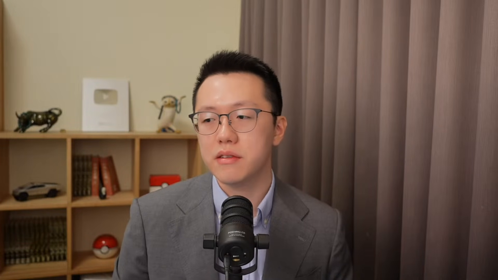

**逐字稿片段：** 中國的國產化速度也非常快速 我們以晶片來看 當時整個中國的晶片業進入到突破期 有85%的晶片都還是靠進口 結果現在進口已經來到60%了 等於有40%左右的國產率 那中國現在同時湊齊了國家資源 大型客戶和完整的供應鏈 你像阿里 華為 騰訊 字節跳動 小米 你過去都要買國際最新晶的晶片 但現在真的是大部分都是採用國內晶片 現在國產化自治率其實蠻高的 尤其大部分數十億美元的政府的支持 已經讓甚至連記憶體產業 都瞬間變成全球第四大的記憶體業者了 這件事情就說明著 中國國產化這條路 也不是說終有一天做出 能夠跟輝達抗衡的晶片 它就是一點一點補齊的過程 從政府資金到晶圓廠到社會材料 然後到阿里 華為 騰訊 這些大客戶真的最後都只買國產的產品了 那你現在即便雙方的技術還有一段距離 不管美中之間 不管川喜會談出了什麼樣的條件 這種國產化的速度和方向 應該是不會有所改變的 而這也是值得大家多做一些觀察的

**話題推測：** 轉入中國晶片國產化速度，提到進口占比從85%降至60%、國產率約40%。

---

## 00:27:53

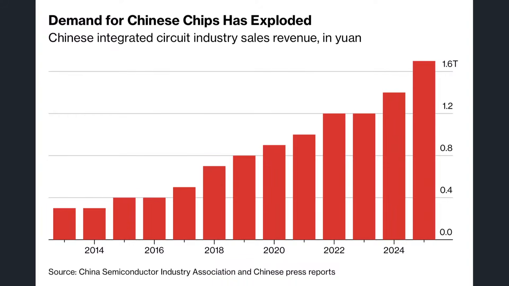

**逐字稿片段：** 尤其現在中國開院模型 它就一直在搶海外市佔 從推銷走向品牌之路 模型剛推出的時候 它可以靠低價 靠補貼 靠榜單 靠成績來吸引用戶 一開始有點像促銷了 可是當千問現在 下載量已經超過30億了 開源模型超過460個 所以API價格就壓得更低 讓更多開發者 主動拿來做微調或者部署 然後就慢慢的走向品牌 所以一步一步都是這樣的 你一開始當然要促銷 然後後來要強行的推銷 你要去行銷 最後你還是做出 一定程度的品牌 男生對女生說 我是最棒的 我保證讓你幸福 跟我好不好 這是推銷 男的對你的說 我老爸有三套房 跟我好以後都是你的 這是促銷 男的根本不對女生表白 但是女生被男生的氣質 和風度所迷倒 這叫行銷 最後女孩子不認識男生 但所有的朋友都誇讚這個男生 這叫品牌 你看到中國這幾年 促銷行銷推銷都做得不錯 品牌有沒有正式的走出來 至少我們看到 的確像ABNB 部分美國企業 還有東南亞中亞中東 已經有比較大規模的採用了 那這個都是形成美國科技巨頭估值削減的另外一大理由

**話題推測：** 切到中國開源模型搶海外市占，提到千問下載量超過30億與開源模型超過460個。

---

## 00:29:09

**逐字稿片段：** 好那不管怎麼說 我不代表說中國經濟就有多好 中國經濟一樣表現並不是特別好 它主要還是產能的持續向外銷售 因為這一次7月份中國經濟數據出現非常顯著的收縮 工業生產年增幅4.5 這是比預期的4.8來的低 最慘的是消費 7月零售只有0.6 低於市場預期的1.5 所以不管怎麼說 我們看到從消費到投資到政策 似乎整體金額都在收縮 唯一創高的就一個 就出口金額還在創高 這倒是沒錯 中國的出口到目前為止 順差創高速度還是很快 這代表全球對於中國供應鏈 還是有一定程度的依賴 尤其中國7月份工業生產

**話題推測：** 新段落轉為中國經濟表現不佳與7月經濟數據顯著收縮。

---

## 00:29:50

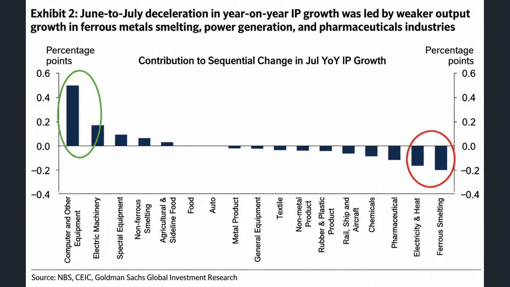

**逐字稿片段：** 有一個特別值得注意的訊號 就是鋼鐵產量的明顯下滑 7月份工業生產率 較6月份放緩 其中最大的拖累就是 黑色金屬的冶煉 就是鋼鐵相關產業 電力公認製藥 那鋼鐵產量的一個下滑 很明顯那就是基礎建設 製造業傳統需求 仍然在持續走皮當中 尤其是單月固定投資金額 年減幅12.8 比6月份的年減9.3% 還要來得更為差勁 所以從結構上來看 整個基礎建設正在緩步的倒下來

**話題推測：** 聚焦中國7月工業生產中的鋼鐵產量明顯下滑，可能切到鋼鐵或固定投資數據。

---

## 00:30:24

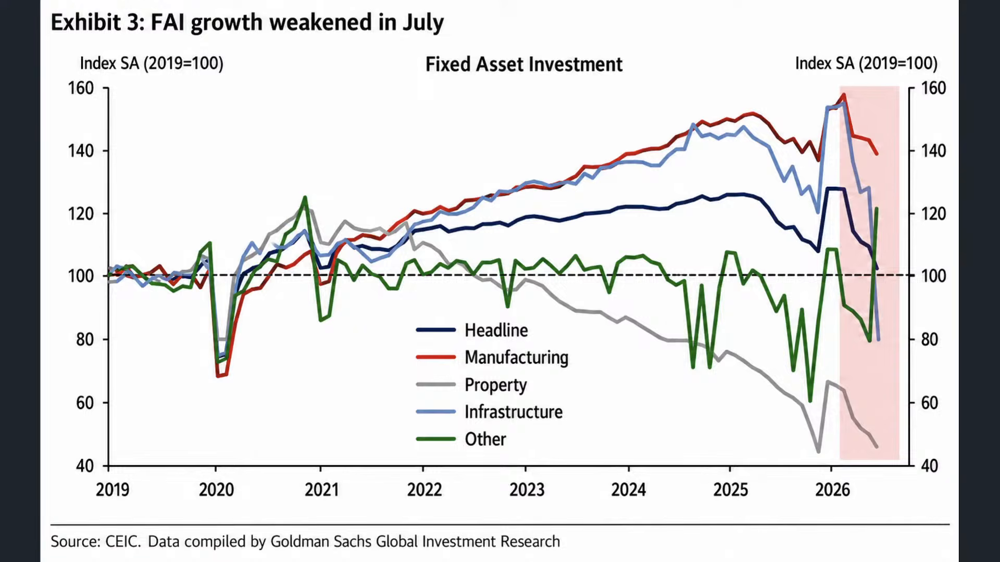

**逐字稿片段：** 房地產是做第一波的拖累 房價現在還在跌 7月份商品房的銷售面積 年減幅是13.5% 它已經連續衰退五年了 每年賣的坪數 就是越來越少越來越少 那代表著根本沒有 樓地板面積的一個開工情況 之前才看到 那網絡上講說 有人要買房 那買房的過程當中 難得去買房 那賣家出200萬人民幣 那難得就對房東說 我誠心要買 你給個成本價吧 成本價 那是450萬 很多房價真的在三四線城市 真的是腰斬 那的確它對於長期的投資壓力 就來得更大 那中國政府 這兩年又開始做一個 比較顯著的稅款的一個收集 讓整體經商環境 來得更為緊繃一點

**話題推測：** 轉入中國房地產拖累，提到7月商品房銷售面積年減13.5%。

---

## 00:31:11

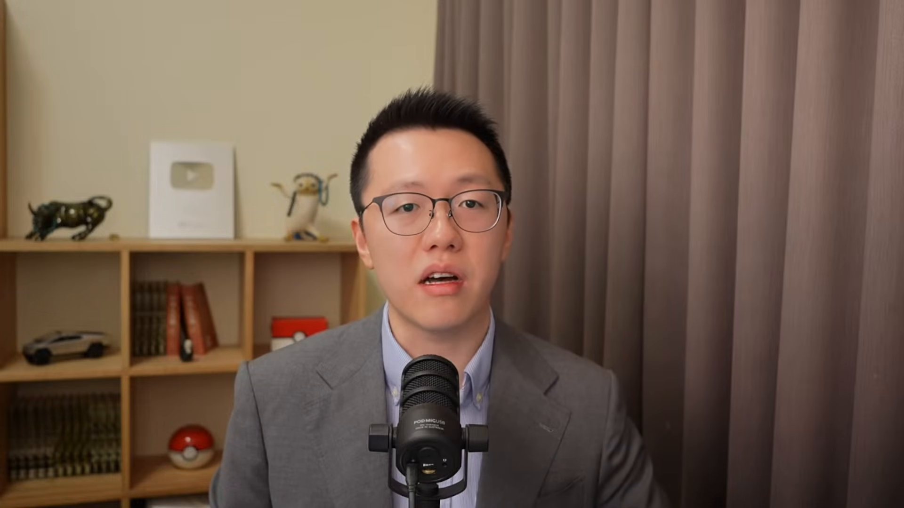

**逐字稿片段：** 我們舉例來說 中國政府在本週才正式宣佈 向海外資產稅款 進行大規模的追稅 目前是鎖定富裕人士 所持有的海外資產 最長回溯期 可以到2000年以前 超過25年 也就是中國銀行和金融機構 現在必須要主動去審查你的客戶 如實申報海外的房地產 股票 貴金屬或者加密貨幣 如果有的話 部分賬戶直接遭到凍結 補繳稅款和罰款之後 才能夠恢復使用 那你要知道 現在就是中國政府的財政壓力 來得越來越大 整個2025年 全國的稅收年減幅是1.7% 來到21.6兆人民幣 土地出浪也幾乎腰斬 2021年是8.7兆 現在只剩下4.15兆人民幣 說明中國政府 為了要補足這個稅款 開始採取了一定程度的追稅效果 那一樣在內部的整治也是如此

**話題推測：** 話題切到中國政府向海外資產大規模追稅，可能呈現追稅政策或財政壓力新聞。

---

## 00:32:01

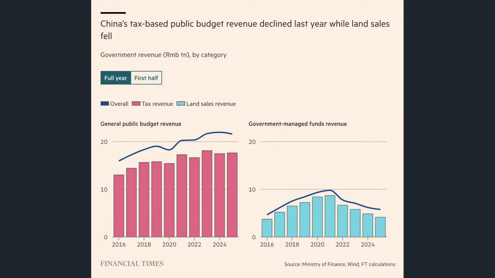

**逐字稿片段：** 我們看華爾街日報的報道 中國的反腐產業鏈 也開始採取一系列的行為 有些人是提前洩密 甚至拿來做交易 也就是如果有任何內部官員 有貪汙腐敗跡象 可以藉由不同方式 來向上游來進行申報 我們要知道這幾年 其實中國的反腐行動 現在從當時習近平打貪以來 已經12年了 每年貪汙人數是多少 這有點離譜 每年大概是60萬人 這個是中國政府的公佈數據 2024年已經衝入到90萬人了 去年是100萬人 今年不知道有多少人在貪汙被抓到 這說明已經高壓這麼久了 明明已經抓那麼勤了 還是有大量的官員挺而走險 堅持要探 那一方面在體制本身 軍隊和官僚系統掌握龐大資源 人事深遷不透明 都導致買官賣官的潛規則依舊存在 所以習近平仍然採取一定程度的 貪腐查緝作為 這個就是中國官方目前所公佈的數據 就是他們的確意識到 現在每年大概是100多萬人的 貪汙弊案正在發酵 目前抓取幅度越來越快 我常常看到有新聞講說什麼 因為貪官也有分男的和女的 就講說男貪官跟女貪官 兩個人還私下偷情 然後我還看了一下照片 長得也不是很好看 我就不理解 就是男的男的貪官 為什麼不去找一個年輕的女孩子 那女貪官為什麼不找個鴨子 那兩個人還搞在一起 我覺得不太理解 就感覺好像男女貪官 目前的生活作息都不是特別好 後來我聽到人家講 有一種觀點是這樣 好像是以前趙薇提到的 就是有一種觀點叫做禮貌性上床 什麼意思呢 講的就是如果兩個異性獨處的時候 有時候為了要肯定對方的魅力 為了要表示信任對方 那就出於禮貌 做一下 但這種上床 它並不是因為愛情 也不是因為喜歡 它是出於一種禮貌 就像握手一樣 是一種社交需要 那這個東西放到男女貪官也是一樣 因為貪汙腐敗 這麼隱秘重大的事情 我們兩個都知道了 氣氛都紅脫到這種程度了 那不做一下好像不太禮貌 我聽說 因為我看到很多那個報道 我想說 這兩個人怎麼會在一塊呢 那不是各自去找自己喜歡的 年輕男子或者年輕女子嗎 就兩個搞在一塊 所以很特別很特別 所以我們要講的事情就是

**話題推測：** 切到華爾街日報報導中國反腐產業鏈與貪腐查緝數據。

---

## 00:34:35

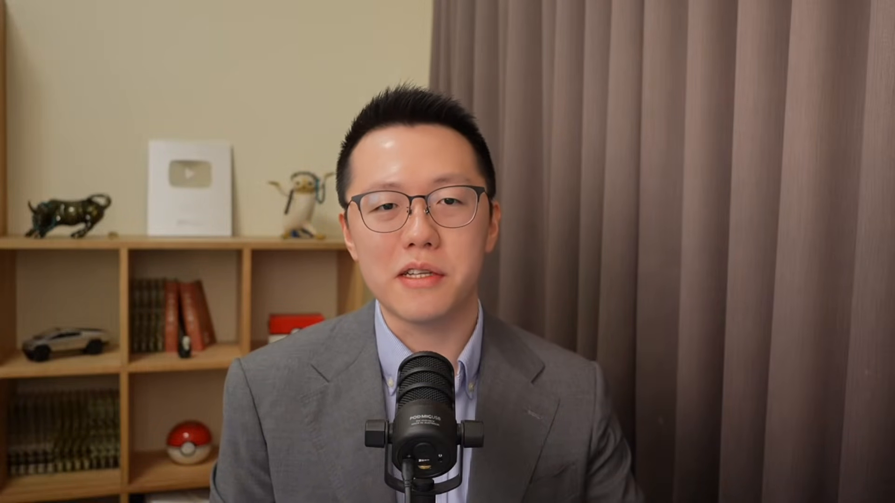

**逐字稿片段：** 整個中國市場 它的經濟好壞 跟對於外的輸出的競爭力 它是兩種不同的緯入 就以06分 我們先聊反而比較廣 我們一開始是聊 整個殖利率創高背後的因子 一方面當然是通膨因子 伊朗的戰事的原因 那另外一方面 當然來自於AI的融資需求 壓抑到了現在 國債的發行供給衝擊 第三層面是來自於 中國AI模型的不斷推出 還有向外所輸出的通縮角度 某種程度 它對於本土美國企業 還是會形成適度的估值壓力 所以最後形成三種估值的市場賣壓 第一就是中東危機所造成的通膨問題 第二就是融資需求所造成的債券拋售 最後形成股市的沉壓 第三中國的AI模型不斷推出之後 以價格戰逼迫你跟著降價 消耗你的利潤 這是目前巨頭們 受到估值削減最大的三大原因 也給投資朋友多做一些思考 那至於剛才講過了 這件事情發生 到底是一個投資的機會 還是一場危機的開始呢 我相信我們的態度很清楚了 也給投資朋友做一些參考 臺股小跌548點 收貸45308點 如果喜歡我們的節目 記得幫我們訂閱按贊加分享 我們就明天早上8點半 早晨財經速寫讀 再相見 祝各位投資朋友看盤順利 操盤愉快

**話題推測：** 進入全文總結，整理殖利率創高、AI融資需求與中國AI輸出三大估值壓力。

---
