# yutinghaofinance_ApykW90PQ58 — 關鍵畫面索引

- 來源逐字稿：`yutinghaofinance_ApykW90PQ58_FIN.srt`
- 影片：https://www.youtube.com/watch?v=ApykW90PQ58
- 截圖數：22

| 時間碼 | 畫面 | 說明 |
| --- | --- | --- |
| 00:00:35 |  | 開場轉入美股概況與市場等待美國通膨數據的總覽畫面。 |
| 00:02:55 | 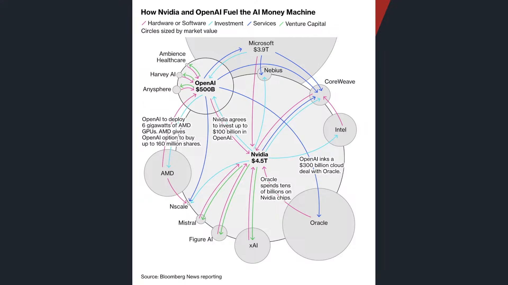 | 轉到2028年AI資料中心電力需求與缺口，可能顯示電力供需圖。 |
| 00:03:51 |  | 轉入為何要找金融業與SPV表外融資結構，可能顯示特殊目的公司架構圖。 |
| 00:06:23 | 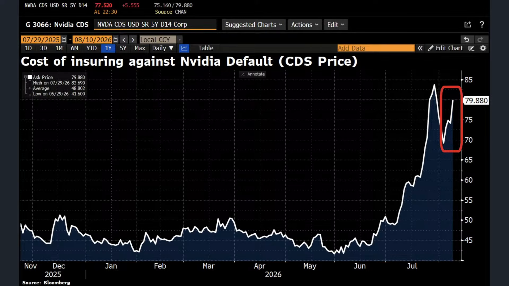 | 觀察CDS價格是否停止創高，可能切到最新信用利差走勢。 |
| 00:07:13 |  | 轉向甲骨文作為對照，說明其CDS仍持續走高，可能顯示甲骨文信用風險圖。 |
| 00:07:33 | 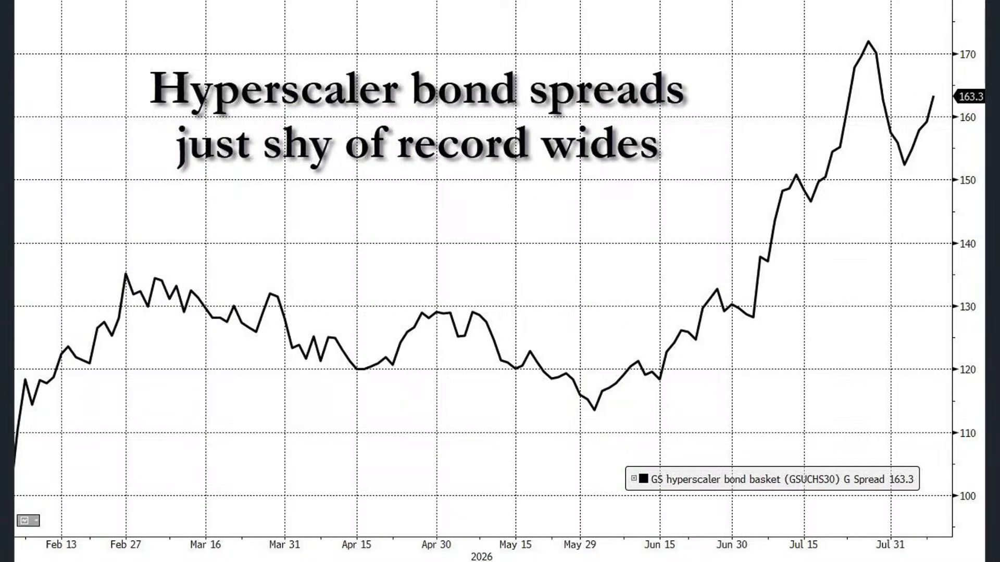 | 提出算力是否會成為2008年重演，可能切到GPU證券化與金融危機類比畫面。 |
| 00:08:43 |  | 強調GPU從折舊電子產品變成長期現金流基礎建設，可能顯示GPU租賃或資料中心收益模型。 |
| 00:11:49 | 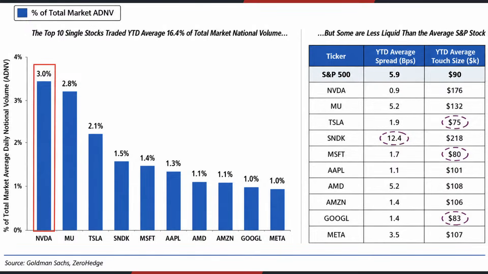 | 提出輝達成交金額已佔美股約3%，可能顯示個股成交量排名或市場占比圖。 |
| 00:13:01 | 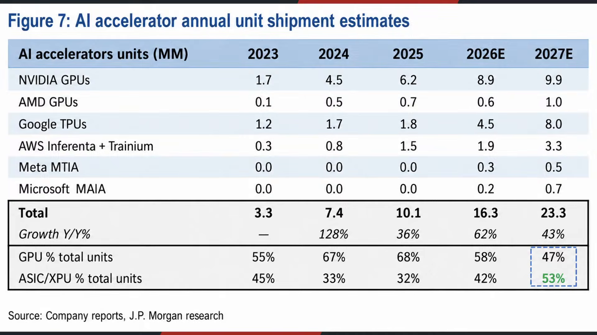 | 比較去年10月AI永動機與本次華爾街加槓桿的差異，可能顯示兩種資金循環對照圖。 |
| 00:14:20 |  | 轉到AI投資規模的歷史比較，可能顯示運河、鐵路、電氣化、光纖等投資占GDP圖表。 |
| 00:14:57 | 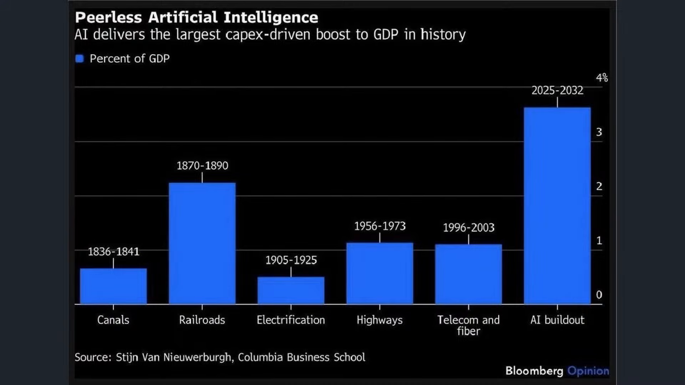 | 切入Intel增資從150億擴大到200億美元，可能顯示Intel股價或增資新聞。 |
| 00:15:41 | 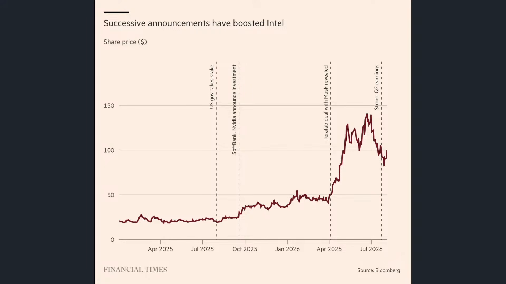 | 說明Intel資本支出與14A製程、愛爾蘭晶圓廠升級，可能切到資本支出或製程路線圖。 |
| 00:16:22 | 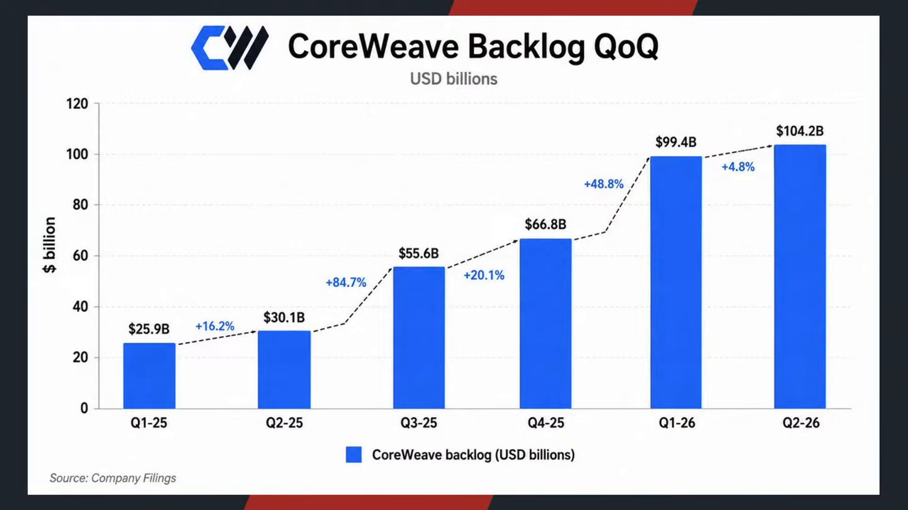 | 轉到CoreWeave第二季營收與未完成訂單，可能顯示雲端商財報數字。 |
| 00:19:03 |  | 轉入美股四大指數表現，可能顯示道瓊、標普、納指、費半行情表。 |
| 00:19:31 | 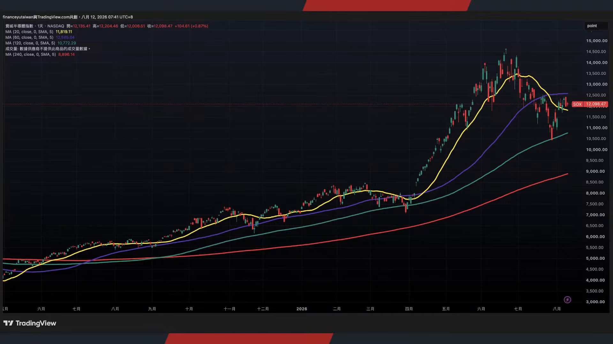 | 切入美中競爭如何影響AI政策與泡沫成長，可能顯示美中科技戰或政策新聞畫面。 |
| 00:21:20 |  | 轉到祖克伯對中國AI模型進入美國市場的看法，可能顯示祖克伯照片或Meta相關新聞。 |
| 00:22:04 | 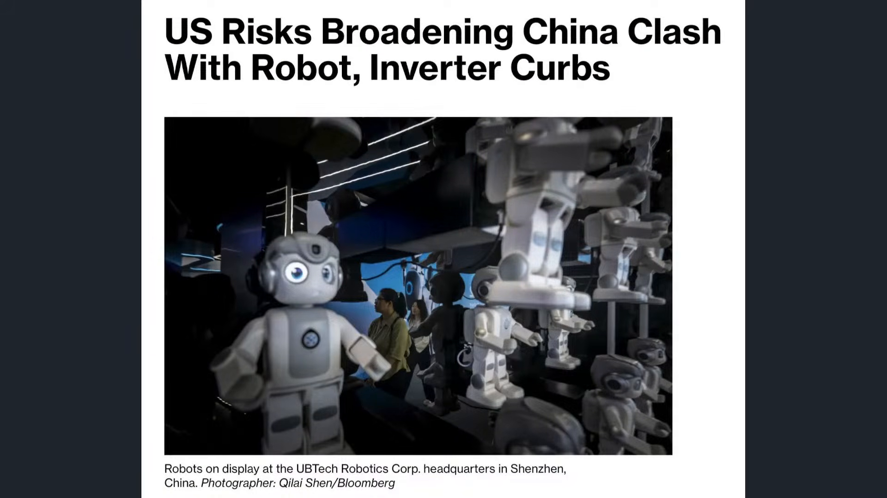 | 切入美國擴大限制中國科技產品，可能顯示FCC限制清單或中美科技限制新聞。 |
| 00:23:25 | 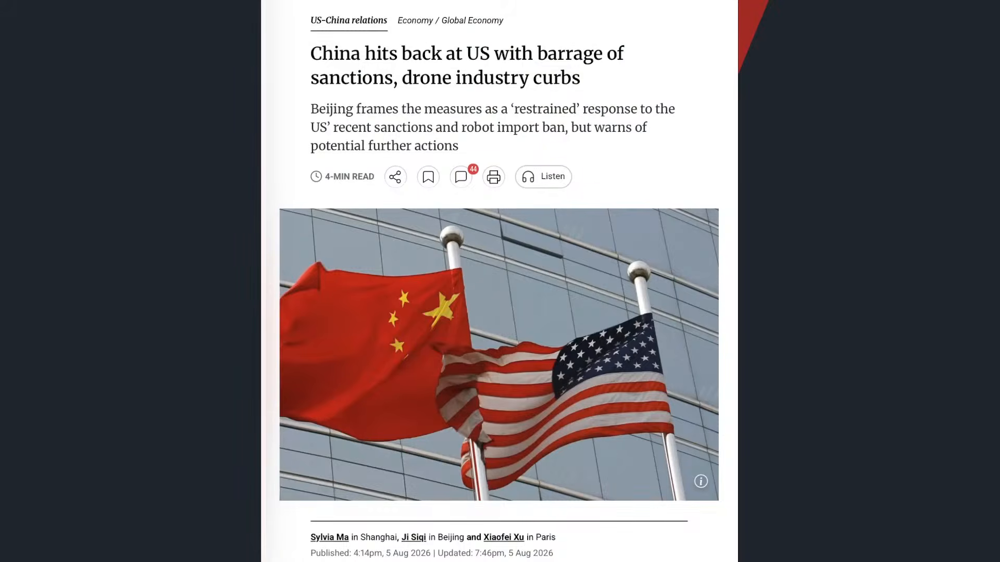 | 切入中國對美國科技限制反擊，可能顯示中國商務部出口管制新聞。 |
| 00:24:50 | 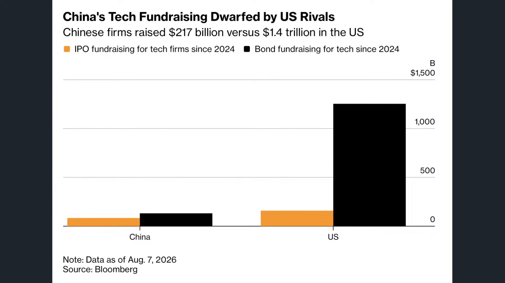 | 切入中國AI與半導體IPO浪潮，可能顯示中國資本市場或IPO名單。 |
| 00:26:00 | 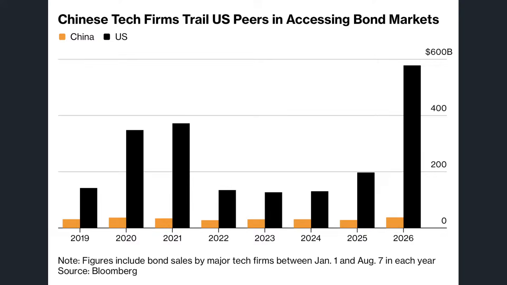 | 轉到記憶體與半導體企業陸續掛牌，可能顯示中國記憶體企業IPO清單。 |
| 00:26:58 | 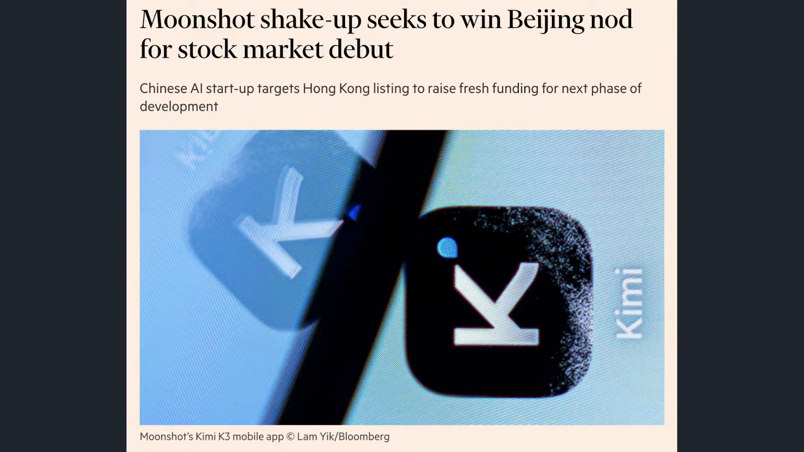 | 轉入美國對中鷹派與黃仁勳鴿派路線的政策分歧，可能顯示美中AI晶片政策對照。 |
| 00:28:28 |  | 說明中國面對高階AI晶片限制時以電力補算力，可能顯示中國AI算力替代策略圖。 |
