# yutinghaofinance_KS_BkfqfALI — 關鍵畫面索引

- 來源逐字稿：[yutinghaofinance_KS_BkfqfALI_FIN.srt](yutinghaofinance_KS_BkfqfALI_FIN.srt)
- 影片：https://www.youtube.com/watch?v=KS_BkfqfALI
- 截圖數：25

| 時間碼 | 畫面 | 逐字稿片段 | 話題推測 |
| --- | --- | --- | --- |
| 00:00:34 |  | 這一次美國7月份的通膨略微降溫 讓市場的升息預期 至少不要保持這麼強 美股股市在昨天也做 了比較顯著的反彈 費半是大漲了2.5% 納斯達克指數上漲0.5 標普則是0.26%那 現在隨著這樣的一個數據開出以後 難道8月份就安全了嗎 是我們最為關注的 因為它年增幅雖然是2.5% 可是核心消費者物價指數 的月增幅還是有0.2% 好這就代表著 雖然9月份的升息機率哦 已經越來越低了 但是10月份還有12月份是否能夠 一路過關斬將 到明年再說呢 那第二大方面呢 隨著財富效果的膨脹 你看標普五百指數現在 是逼近歷史新高嘛 納斯達克100指數則是在 大型晶片股的帶動底下 唉也創下了一個多月來的高點 微軟其實過去一個月 已經漲了快三成了 日韓股市期貨也跟著上漲 那這也說明著財富效果可能也 讓聯準會的降息空間沒有太多 那會不會就保持在這樣的 一個利率區間很長一段時間呢 但是另外一個角度來看呢 短期通膨降溫呢 也不一定會讓長期利率一起下來 美國10年期公債殖利率哦 哦這次通膨數據公佈之後 還在4.69附近左右 哦最新420億美元的10年期 公債的標售殖利率 甚至創下了07年的新高 30年期公債的標售也面臨 25年以來的最高的融資成本 好所以從這樣的角度來看呢 都說明這一個月的通脹數據 還不足以把市場的 降級預期通道給打開 我們還要細看一下 接下來能源價格的實質變化 好但至少可以承認呢 | 開場進入美國7月通膨降溫與美股反彈的總覽，可能切到CPI與美股指數表格。 |
| 00:02:15 | 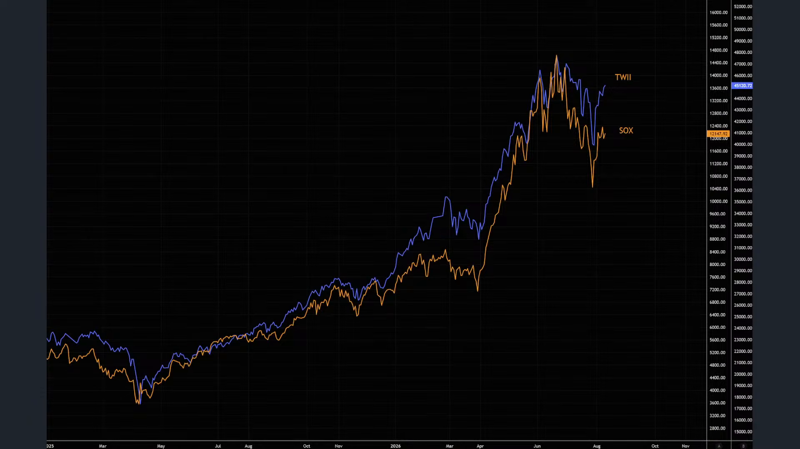 | 其實本輪臺北股市哦 持續上漲底下 我昨天夜盤又做顯著拉升 台股其實已經又要 重新逼近到歷史高點了 但這一輪美國的半導體股 卻比較顯著掉隊 接下來是要由誰來靠攏呢 值得大家來多做一些留意 但至少在軟體股的部分 今年從7月份以來 至少從7月中旬以來 平均漲幅已經來到11%了 和硬體股的費半還是 跌幅有接近4% 所以這一次半導體的 短線籌碼的確洗掉非常多 但資金沒有退場 反而擁擠到道瓊標普或者 軟體股當中持續做輪動 甚至連過去我們看到 在IPO行情泡沫破滅 受到市場承壓的SPACX哦 我最近也出現了很典型的軋空行情呢 從8月初的低點一路到現在 其實已經上漲了接近有40%了 那你要知道 因為現在Spacex哦 是正式進入到第一波的解禁期 照理來講哦 這代表的是到底這些股東或者員工 他到底對於Spacex有沒有信心 解禁了就代表可以賣了嘛 可是這些人呢 看起來大多數並沒有 選擇做顯著的賣出哦 反而形成了資金的軋空行情 好所以到時候就要來做觀察 因為在接下來 像是8月21號 9月10號 9月25號 10月10號 10月25號 陸續的解禁期就會開始做釋出 那8月6號是第一波的解禁期 現在看起來 大多數的員工都對於 自己的老闆有信心的哦 不願意在這個時間點呢 就順勢出脫 也有可能想要等股價高一點了 一個月前賣跟一個月後賣也差很多 但至少Spacex的軋空行情也正式開啟了 | 轉到台股逼近歷史高點與半導體股掉隊，可能出現台股與費半對比圖。 |
| 00:03:55 | 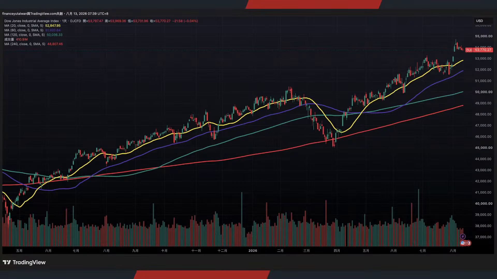 | 道瓊工業指數是下跌21點 0.04%收在53,770點 標普上漲0.26% 收在7,748點 納指上漲143點 0.54% 收在26,588點 哎突然之間你看 道瓊標普和那指 好像都突然進入了一個結界 突然走勢變得非常非常的平 就是 還在這樣的一個區間 那費半是稍微做了一些突破 上漲300點 2.49% 收12,399點 | 進入道瓊、標普、納指與費半收盤數字，可能切換為美股四大指數行情表。 |
| 00:04:27 | 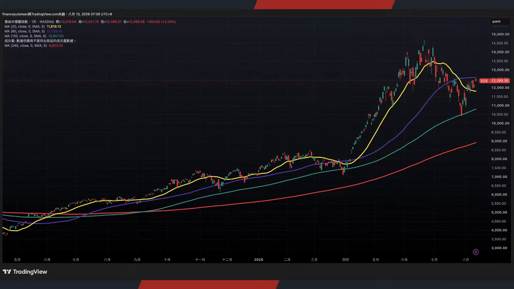 | 那當然了 如果有三大指數現在 都陸續創下歷史新高 或者逼近歷史新高 肯定風險偏好是有一點回來 7月份的科技股劇烈修正之後 其實市場並沒有全面撤退 反而有重新上杠杆的跡象 只是上杠杆的速度已經不 像是五六月份這麼快了 目前美國的掛牌的杠杆型 ETF總資產規模是1,800億哦 那從7月的低點以來 本來當時是砍了接近有500億左右誒 現在已經回300億了哦 所以你會發現第一杠杆型ETF 現在又重新被加倉了 只是資金量上升幅度沒這麼快 | 轉到三大指數創高後的風險偏好與槓桿ETF資金，可能顯示ETF資產規模與資金流圖。 |
| 00:05:05 | 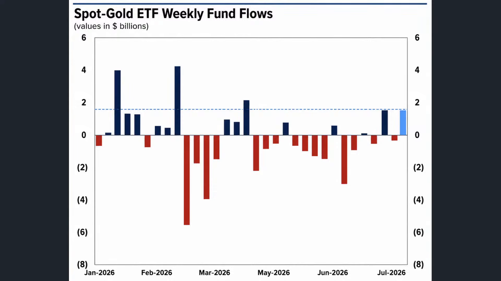 | 那第二呢 黃金或者礦業股重新的吸金 來對賭升息預期的打消 再來呢是整體ETF的被動買盤 非常非常驚人 好就是 這幾年台股美股都一樣了 下跌的時候買的特別重 上漲就輕輕的買 那這一波不一樣 這一波從7月份大買以後 8月份繼續大買 只要有部分ETF還沒有創高 資金流量的速度非常快 美國ETF今年全年的資金流向 大概已經接近兩兆美元了 基本上 已經是快要超越去年水準了 好這件事情都說明著 好市場的黏著度看起來是越來越高的 很難把大家給甩下船 所以這是第一個觀察重點 市場情緒的回暖 | 提出黃金、礦業股與ETF被動買盤吸金，可能切換到資金流向分類圖。 |
| 00:05:47 | 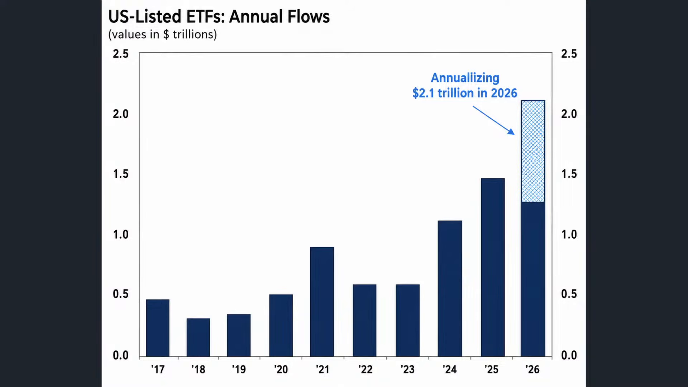 | 好那我們今天就從三個角度 從美國臺灣和中國的通膨數據 來做進一步的追蹤 來瞭解目前各大地區 區的通膨推演呢 它會如何影響到全球經濟在下半年 全球央行所採取的態勢 | 正式宣告今天從美國、台灣、中國三地通膨角度分析，可能出現章節總覽簡報。 |
| 00:06:02 |  | 我們首先看的是美國通膨 美國在7月份的通膨數據 這一次算是符合市場預期 CPI月增幅0.1% 年增幅3.4 好這比6月的3.5算低哦 也是今年3月份以來的最低水準 核心CPI月增0.2 年增幅也從2.6下滑到2.5 而且實際數字看起來 有持續走低的機會 因為核心通膨看起來有所鬆動 整體就是通膨並沒有大幅的下墜哦 可是方向還是很明確的哦 就是今年當時伊朗 戰事的高點就是高點了 價格壓力是在慢慢的往下走 但是真正麻煩的事情是 這比較像是能源端的暫時降溫 還不能夠代表通脹 風險已經完全解除 華許上一次的談話還是比較鷹派的 真正麻煩的事情就是 因為伊朗戰事沒有結束嘛 關稅的後續效應又重新出現了 AI的投資熱潮一定會導致在 科技通膨的部分持續受到承壓 這次最大的降溫呢 | 進入美國7月通膨數據細項，預期畫面為CPI、核心CPI數據卡或折線圖。 |
| 00:07:00 | 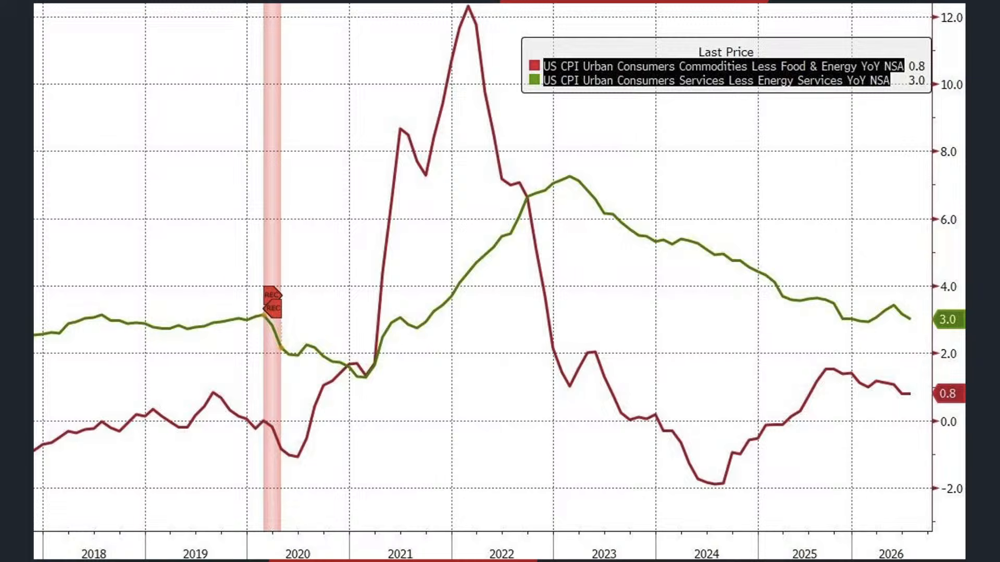 | 還是來自於能源 7月份的能源價格月減幅是1.5% 其中汽油價格是下跌2.9% 延續6月份能源價格 大跌5.7%的趨勢 這也是為什麼CPI可以維持溫和 就是因為油價的走疲嘛 那也就說明了油價只要不走疲了 通膨就會卡在這樣的一個區間 那服務通膨的部分呢 商品通膨年增幅只有0.8哦 哦所以現在幾乎 其實雖然科技通膨很嚴重 可是終端產品其實 並沒有想像中來的壓力大 服務通膨大概也降到3%左右 這代表現在美國剩下 比較粘的一些通膨 主要集中在房租醫療 機票或者其他服務類別 那7月住房成本月增幅0.1% 年增幅3.2% 看起來還是CPI最大的推升來源了 好所以更為重要的是超級核心通膨 也就是先把住房排除 之後的核心服務通膨 年增幅已經來到2.78 哦這也是2021年9月份以來的新低 所以其實現在的狀態哦 你只要沒有伊朗戰事哦 我真的覺得現在已經處於降息格局了 因為核心通膨其實軟化 的速度算是蠻快的照來講 僵固性最高的應該就是核心通膨了 可是連住房通膨的下行速度都這麼快 現在幾乎就是完全靠 能源通膨還撐著的 當然呢不同專案還是有不同的分化啦 醫療價格還是上漲了 月增幅有0.4% 醫院服務上漲0.5 機票價格單月大漲2.2 年增幅來到25% 那都是受到一些伊朗戰事的後續效應 或者本身在缺工問題 底下被迫一些保險費啦 醫院服務類 被迫一定要上漲 但是基本上 | 轉到能源價格與汽油價格下跌對CPI的影響，可能顯示能源分項通膨圖。 |
| 00:08:40 | 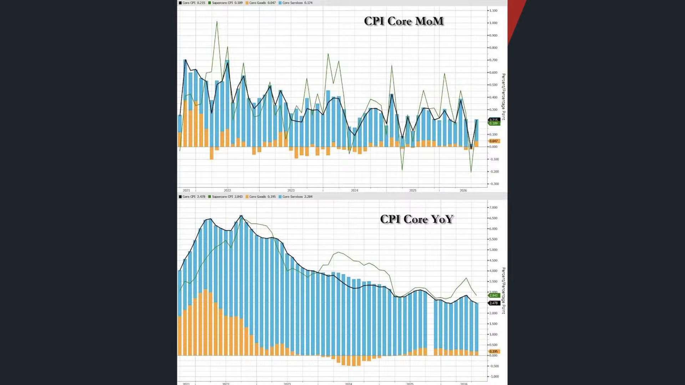 | 這份數據公告出來 它已經壓低了聯準會 立即升息的必要性 原本大家還在討論9月 份是否要升息嗎 但我們過去提過 很有可能 今年是無碼 就零碼了 沒有升任何的級 這個可能性我是預期比較高 我本來預估今年會降息格局打開的 但是伊朗戰事以後破壞了整條預期嘛 那現在沒關係 我還是有信心 9月份不升息 10月也不要 12月也不要 今年就保持當前的利率水準 好讓估值看能不能充分的 有進一步的拉伸空間 好這是給投資朋友做的第一層思維了 謝謝謝謝投資朋友謝謝 生日快樂 謝謝 謝謝 謝謝 對因為我看得出來我是獅子座嘛 因為獅子座通常都是那種 那種很自大 性欲很強 我看得出來看得出來 謝謝 那那許個願望好了 第一個願望就祝大家我們 財經號角的聽友們每天身體健康 開開心心 那第二個願望就祝大家天天暴富 發大財 第三個就留給我自己 就先不講了 講出來都不會實現嘛 不是不是 第三個願望是希望大家能夠 陪伴著我們財經號角一路聽到老 好不好 聽到我們財經號角聽眾最後一個離世 我們都要繼續 講下去 就讓我們的觀眾 從你出生到離開這個世界 都能夠每天聽我們財經號角 這是我們的目標 好給投資朋友做一些參考了 感謝各位感謝各位 | 轉到通膨數據壓低聯準會升息必要性與利率路徑，可能顯示Fed利率預期圖。 |
| 00:10:13 |  | 好剛才聊到說整個通膨數據的變化 它最後會影響到市場的利率預期哦 那現在看起來已經打消 一定程度的預期了哦 可是它的根本沒結束 什麼是根本 美伊衝突到現在還是沒有顯著的進展 雖然川普在幾個小時之前還發了文哦 說美國目前已經是完全 控制了荷姆茲海峽 甚至直言我們已經擁有它 哦這概念跟實際情況好像有點落差了 因為美伊雙方的談判 很明顯現在是陷入僵局 卡達和巴基斯坦還在居中斡旋 阿曼和伊朗談判部分 現在要恢復航運 伊朗又推提出了一些新的額外條件 包括美國要結束戰爭要 凍結的資產遭到解封了 那你要知道這條水道到目前為止 | 閒聊後回到通膨與利率預期，並轉入美伊衝突根本問題，可能切到地緣政治新聞畫面。 |
| 00:11:00 | 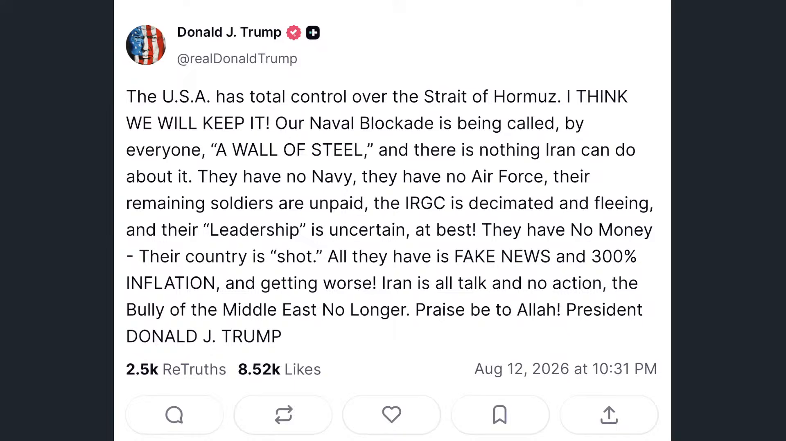 | 如果是從實值航運量來看 現在大概每天5艘了 你說有沒有 這個遊輪通過 當然有 那每天有5艘到6艘 所以從這樣的一個角度來看的話 霍爾木茲海峽幾乎 還是實質停擺的情況 本週一到本週三 平均一天大概就6艘左右 戰前一天是140艘 好所以這並不算是能源市場的穩定 只是當時短期內 在6月到7月的解封 一次性讓很多關在裡面很久的 水手們終於可以出來 但是 也再也沒有人進去過了 那當然了 你說荷姆茲海峽到底 是不是一次性武器呢 伊朗可以這樣子一路的嗯 拉下去嘛 或者說一路的僵持下去嘛 那其實 我們可以看到 | 開始用航運量數字說明霍爾木茲海峽實質停擺，可能顯示船舶通行量對比圖。 |
| 00:11:43 | 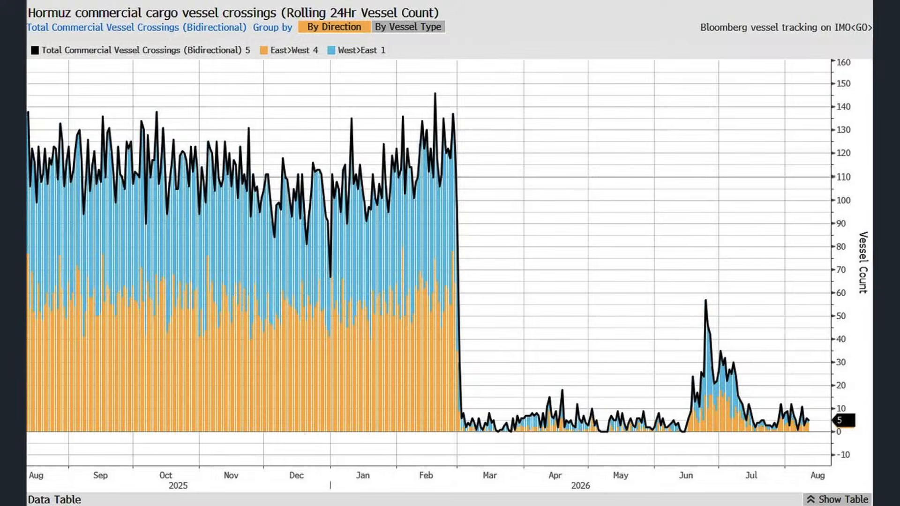 | 到目前為止 其實在中東管線部分呢 真的已經開始有預估常態化的趨勢 所以已經有非常多的管線 目前正在建設當中 從之前我們提到 沙烏地阿拉伯的東西向的管線呢 加強基礎設施了 來降低伊朗戰爭所帶來的衝擊 那另外一方面 我們看到 好在伊拉克阿聯酋附近呢 也開始增加陸地管線嘛 那當然了 現在主要還是靠卡車來運呢 就是不走荷姆茲海峽嘛 開車的方式哦 離開海峽 然後再把原油給運送出去哦 可是一條每天可以輸送 100萬桶原油的大型管線 平均每公里的造價也要500萬美元 也就是1,000公里就需要50億哦 如果改用卡車或者鐵路 同樣距離哦 成本也很高 所以更極端的情況就是那 也不代表建了路上管線 那就不會被飛彈給擊中 那壓力一樣更大好 所以如何緩解本輪的美伊戰事衝突 看起來在期中選舉之前呢 也很難處理了 事實上我們要知道 美國肯定是不希望再引起新一波的 地緣政治緊張所造成油價上漲了 | 轉到中東陸地管線建設與繞開海峽的替代方案，可能切換為管線地圖。 |
| 00:12:49 | 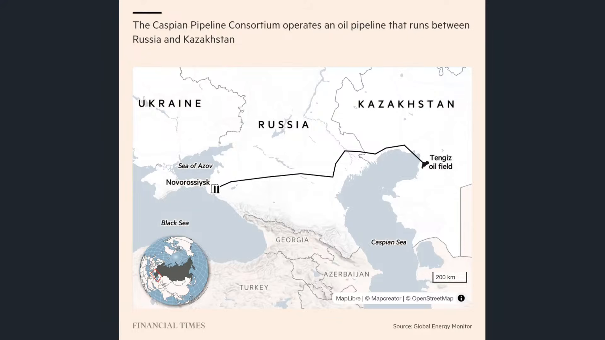 | 美國這一次 因為我們知道烏克蘭這 幾個月是大舉地攻擊 俄羅斯黑海的能源設施 以前都是專門襲擊軍用設施嘛 現在也不冷了有攻擊 貨艙的 攻擊俄羅斯的沃爾瑪 有攻擊俄羅斯的能源設施 那美方 這一次反而出手了 要求不要再炸油輪了 原因是什麼 因為俄羅斯已經解封了 什麼意思 就美國對於俄羅斯原油的制裁 其實今年中旬因為 美伊戰事已經解封了 所以是需要靠俄羅斯的原油出口 來持續的壓抑全球的原油價格 美國這裡當然產原油 它不影響 可是原油期貨價格不 能夠一路的往上漲 這個是市場上現在壓力最大的來源 美方當然不希望引起 進一步的地緣政治衝突 另外一方面 中國的我們講茶壺煉油廠哦 最近也準備要回補了 你看之前呢 中國山東的獨立煉油廠 因為在中東戰事少買油 所以它反而 讓需求的疲憊 能夠壓抑住原油價格的上漲 可是這一波庫存已經吃了一陣子了 在上個月開始做回補了 中國之前呢 因為累計了13億桶的 商業和戰略原油儲備哦 所以比美國還要來得高非常多 它可以慢慢耗 可是消耗了幾個月以後 上個月已經很明顯 感受到中國原油進口量 在原油價格下跌的過程當中 開始逐步做回補 如果開始回補 就代表著需求重新歸來 中國可能會重新成為 全球油價的重要邊際買家 哦那這對於原油價格的提振效果 可能又會開始出現了 哦所以不管怎麼說 這對於華許和川普來看 都是新一波的壓力 華許上任之後 他是刻意減少利率路徑的明確指引 所以大家只好猜 那你越猜 就會猜的越離譜 然後就會猜的越極端 最後美國10年期公債殖利率哦 當時是一路收到4.74.8%嘛 逼近三年來的新高 那現在這樣的一個情境哦 華許也沒有太多的表態 那可能市場上就要用極端的價格來 逼華許做適度表態 你說4.8你也不管 4.9 那我升到5%呢 難道你也認為聯準會會升到5%嗎 所以用這樣的一個角度 來逼華許展開談話 我們就後續看一下他的態度 可是我們也清楚知道 像是聯準會內部的官員 票委們 像波士頓聯准銀行的總裁柯林斯 他就表示 說伊朗戰事推升能源成本之後 聯準會可能會被迫打開 升息通道來抵抗通脹 的概念其實就意味著 華許雖然本人不願意做表態 可是內部官員所釋出的論調 會讓在短期內資產價格 過於暴漲的過程當中 市場上可能會有 內部的票委們 嘗試著用輿論 用前瞻指引的方式 來壓抑住目前的市場通脹情緒 | 切入烏克蘭攻擊俄羅斯能源設施與美方要求降溫，可能出現俄烏能源設施新聞畫面。 |
| 00:15:34 | 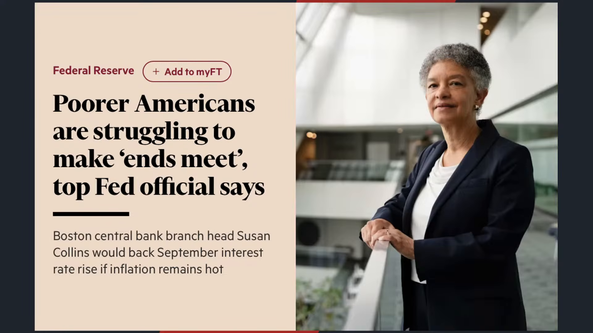 | 因為最近30年其 公債殖利率其實還在往上走哦 哦這說明那不管通脹數據好不好 看起來好像也不止反映通脹的問題哦 第一就是通脹雖然降溫了它的 現在的點位元還是比目標高很多 波動還是很大 那第二就是華許 其實已經刻意減少市場的前瞻指引 所以讓利率預期 表現得更為極端 那第三件事情 很明顯那就是美國 債券市場的信用壓力 因為現在是 投資等級在的信用 市場狀況也不是特別好 CDS價格也在創高 它一路的讓整個債券 市場體系遭受承壓 好所以這是三大因素的持續交疊 我們就看一下華許最後怎麼做了 因為過去華許哦 更像是貨幣政策裡頭 比較重視央行紀律 通膨和聯準會的公信力哦 但真正做到決策核心以後 你要知道 美國現在國債又突破40兆了 政府有龐大的融資需求 有債券殖利率的壓力 有金融市場經濟成長的壓力哦 每一項都比教科書 還要來得更為複雜了 哦所以重點不是他以前 說過多少鷹派的話 或者他被川普提名之後變得多孤傲 是當理想和金融現實碰撞的時候 他願意為了維持經濟和 市場穩定要退讓多少 現在看起來就是市場已經出招了嘛 你不做前瞻預期 那我就把那個直跌跌推到很極端 即便通膨已經降溫了 看華許怎麼接招 那川普也是同樣的道理 他只是舞臺 從貨幣政策放大到整個美國 包括之前講的製造業回流 能源的霸權 但是最後變成了原油價格大漲 通膨拉升的時候 直接口頭叫烏克蘭不要再炸人家 煉油設施了 我們快撐不住了 好所以政治人物可以靠 理想來動員選民了 但最後要靠現實來治理國家 華許跟川普相似的地方就在於 當他們位置坐得越高的時候 有時候原本的理念呢 信念呢就要稍微放棄一下 就嘴巴當然是一整套宏大的理想 華許難道公債殖利率到5% 他都還不發表談話 不做前瞻指引嗎 不可能吧 嘴巴上是一套宏大的理想 最後還是要回到利益和現實 那我看到人家講的嘛 小時候我們不是讀三國 小時候最喜歡的就趙雲嘛 覺得一身是膽才叫男人 那學生時代 最喜歡曹操 有野心才能夠成大事 哎出社會之後 特別喜歡司馬懿 才知道能夠忍到最後的才是贏家 活得長才是贏家 現在長大了 最喜歡的反而是貂蟬 大喬 長得真好看哈 但所以人生呢 他會隨著自己的年紀偏好 從理想主義一路走向現實主義哦 川普從剛開始上任之後 他的關稅戰 他的製造業回流 他對於種種體系的改革 政府效率一部裁剪 美國的裁員 誒結果過了一年以後 那美國的財政赤字創下歷史新高了 美國對於臺灣的逆差創下歷史新高了 好這就是不得已的現象 好這是美國的部分 | 開始整理30年期公債殖利率上升的三大因素，可能顯示債市壓力拆解圖。 |
| 00:18:33 |  | 再來我們聊一下臺灣市場 臺灣通膨是已經連續 三個月突破警戒線了 油價和外食生產成本開始做顯著提高 我們知道在前幾年呢 因為臺灣市場大概就跟 整個大中華市場差不多了 這個通膨是僅次於中國的通縮了 但現在呢 已經陸續超越香港新加坡和日本了 整體通膨水準已經來到2.59%了 逼近歐元區和南韓的水準 那民生的壓力也沒有顯著的改變了 因為7月份外食費用是 真的漲得有點誇張了 年增幅3.05% 重新突破3%了 房租年增幅雖然降到1.73% 但是維持上漲 那生產者物價指數就很離譜了 生產者物價指數在7月份是10六% 暴增 但但這個暴增呢 不代表民間體系的失控了 因為臺灣有很多記憶體要進口 而記憶體長的很誇張 那我們記憶體進口以後 主要是出貨 賺錢嘛所以 某種程度而言 生產者物價指數 是少數在臺灣的通膨水準當中 形成嚴重失真 這怎麼可能廠商的成本這麼高 民間通膨 它現在才 2.59%不太可能的 但根本原因還是來自於 主要是GPT價格的上漲所推動的 那當然這也代表著臺灣雖然在2.59 可是內部壓力其實很大 我們過去提過 其實應該要更高一點 因為台電其實吸收了 相當多的通膨水準 | 正式切換到台灣市場與台灣通膨突破警戒線，可能出現台灣CPI與區域通膨比較圖。 |
| 00:19:53 | 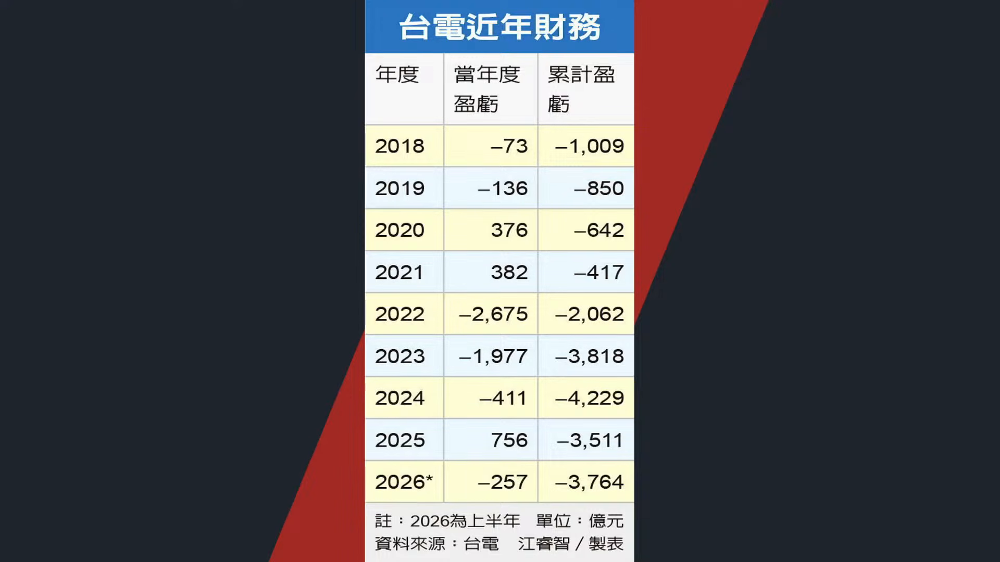 | 2026年上半年 台電已經虧損了257億 原因是什麼 就是進行全面性 天然氣價格和電價的補貼 按照台積電的估算 電價今年至少要漲7.3%哦 才能夠打平今年的虧損哦 不過我現在至少可以確認 在11月以前應該是不太可能漲價的了 應該至少要凍漲 等到11月份以後再說了 所以這代表著 11月份以後會不會有 報復性通膨的出現 一旦台積電開始鬆綁 目前補貼的態度 這個值得觀察 那另外一方面 臺灣的薪資缺工壓力的 人工騰通膨水準來得更大 我們到現在市場上最大的通膨水準呢 對於店家來看了 不一定是租金 以前大部分時候都是租金 是最大來源哦 現在人力成本呢 已經慢慢的超越了租金成本了 甚至人力成本它最大的 問題是根本找不到人 還不是薪資漲的問題 真的找不到人 臺灣實在是太太缺工了 好這一次我們看到臺灣的 薪資成長加速以後 實質薪資已經創下6年來的最佳了 2025年調升經常性薪資的 廠商比例是34.8%哦 好這個是本世紀新高哦 好所以如果你居然這兩年沒有加到薪 那要稍微檢討一下自己的老闆哦 大多數時候是不好檢討了 好但是這個時候 市場上這麼缺工 稍微檢討一下那是很正常的 尤其我們看到哦 最近主計處最新所公佈的 臺灣月薪已經來到4.9萬塊 不過有超過7成人是領不到的 所以 也必須承認了 這個市場的貧富差距 還是比較極端的擴大 但至少了 缺工是真實的 現在臺灣的每個月 經常性薪資是48,981塊 年增幅是2.88%那當然 其中我們看到實質薪資 因為上半年物價是漲1.69嘛 所以實質薪資現在 還有1.16%左右的成長 也是創下九年級的新高 好這就給投資朋友做些參考了 那當然這也就說明了 可是其他產業其實蠻疲憊的 如果貿然升息 可能會加重傳統產業 或者低所得家庭的負擔 而且還有房地產市場的問題要顧 現在房市也並不是特別的好 貿然的升息也是有壓力的 不過市場的投票已經 看出端倪了 | 轉到台電虧損、天然氣與電價補貼，預期畫面為台電財務或電價調整表。 |
| 00:22:26 | 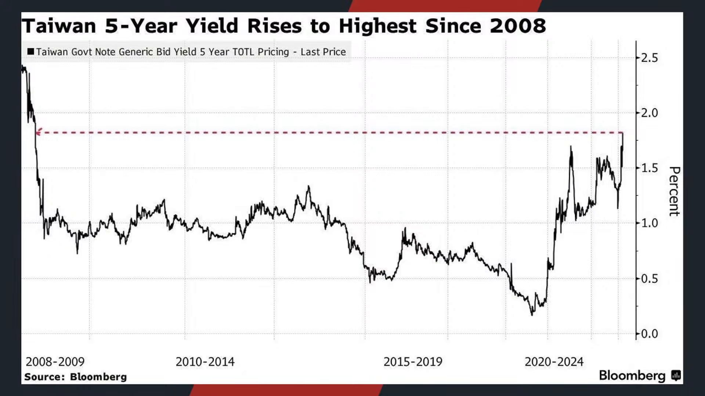 | 我們看最近臺灣債券市場 是明顯的轉弱 5年期公債殖利率 單日大漲1.82% 創下2008年以來的新高 10年期公債殖利率 已經衝高到1.93%了 什麼意思 臺灣債券價格正在暴跌 那為什麼暴跌呢 很明顯嘛 一方面當然是公債標售相對疲憊哦 另外一方面呢 就是來自於短期內 大家預估準備要升息了 大家正在投票對賭 楊金龍總裁 臺灣的臺灣GD Gold Dragon 楊金龍總裁先生呢 很有可能呢 在下一次聯準會理監事會議當中 被迫要升息 因為通膨物價的預期實在太高了 那這很快的就會往下傳導 第一個傳導當然是 實業者金融業所受到的影響 金融業當然會因為利差的 擴大而有新一波的獲利嘛 可是呢對於一些金融投資者而言呢 利率成本的上升壓力就來得更大了 | 轉到台灣債券市場轉弱與公債殖利率創高，可能切換為5年期、10年期公債殖利率圖。 |
| 00:23:18 | 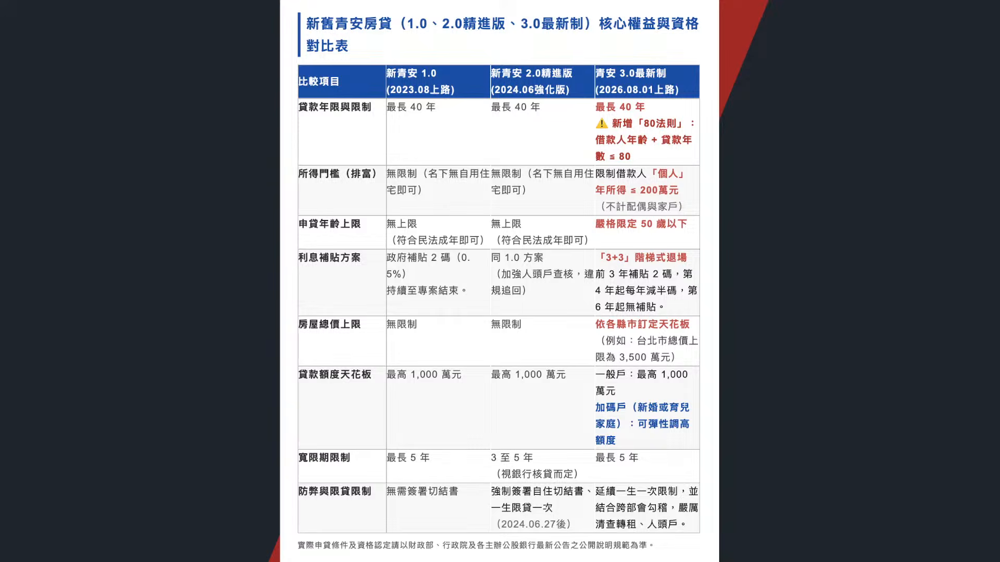 | 第一個當然是房地產市場 房地產市場其實已經疲憊一段時間了 | 開始說明升息對房地產市場的傳導影響，可能切到房市或房貸利率圖。 |
| 00:23:22 | 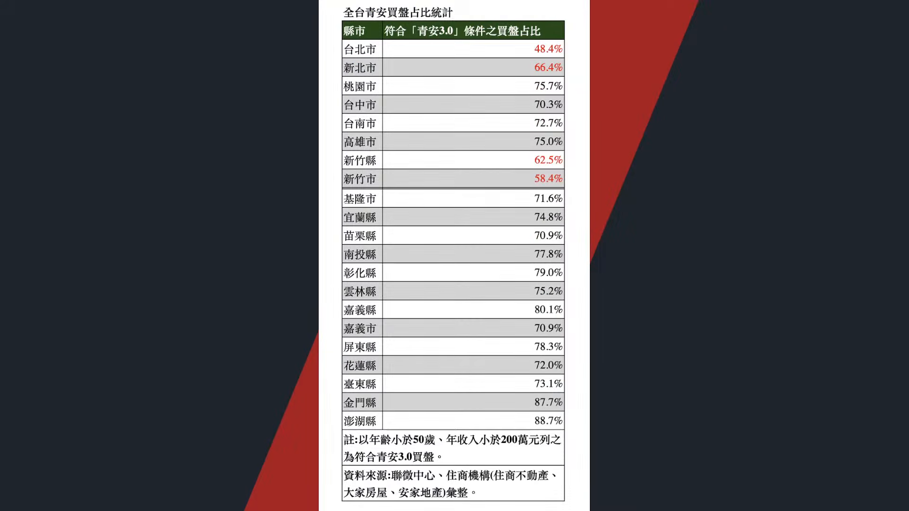 | 那8月份開始 由於清安3.0已經正式上路 我們知道 金安3.0不能夠把它當成財政刺激政策 為什麼呢 原因很簡單嘛 它幾乎所有政策都在限縮嘛 以前貸款年限1.02.0都是最長40年了 這一次雖然還是最長40年 可是有八零法則 就是借款人的年齡加上貸款 的年數必須要小於等於80 所以如果我30歲 那最多貸款呢 50嗎 哎不是哦 基本上你還是要 取決於最高的年齡上限嘛你像小 我們小編18歲嘛 那他可以貸62年 唉不對哦 其實最多也就只貸40年哦 所以你必須瞭解哦 基本上80法則一方面是 把借款人的年齡 做適度的限縮 讓你年齡太高 不能夠借太多年 另外一方面呢 它也嚴格限制年齡上限 必須要在50歲以下 而且個人的年所得 必須要小於等於200萬哦 所以不管是在所得 在年齡上 在年齡和貸款年數上 進行顯著的限制 其他我們看到 甚至連房屋的總價都限制了 哦這個是一個極大壓力為什麼因為 基本上臺北的總價上限是3,500萬嘛 我我們假設了 3,500萬 假設你真的有那個生小孩的需求 在臺北市3,500萬 你你生一個還勉強 你想生兩個為國家貢獻 那就買不到了 就不能用青安了 哦所以這個政策就有 可能會因此失去它的效果 那就要往婚育宅的方向來做配置哦 所以某種角度來看呢 這一次的青安3.0呢 全部都是政策上的線索 根本就不算是刺激政策 那再加上利率預期的升高 如果升息了 對於房地產市場肯定 又是新一輪的衝擊 事實上我們知道 | 轉入青安3.0政策上路與貸款條件限制，預期畫面為政策條件整理表。 |
| 00:25:05 | 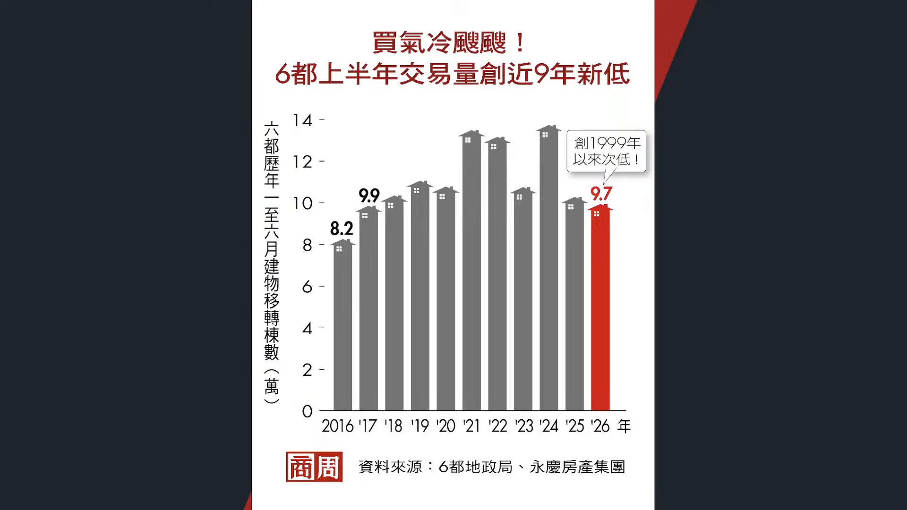 | 房地產市場現在是一個 新一輪的買方市場了 因為6都上半年的交易量 已經創下了9年來的新低哦 好甚至我們如果細看呢 1-6月份的建物已轉棟數哦 它大概是1999年以來的次低 好所以在過去幾年當中 我們看到房地產榮景在 疫情見到了高峰以後 目前仍然在持續收縮 價格跌幅雖然比較有限 可是還是可以看得出來 資金鏈並不是在房地產這一邊 當然了另外一方面我們也看到 市場的交易結構也做 一個比較顯著的改變 那就是女力的崛起 我們知道臺灣房地產市場結構 這幾年男性的生貸量其實 下滑幅度是越來越快了 那男性申貸量在去年是50.6 女性已經衝高到49.4了 幾乎是占了一整半 尤其在臺北新北台中 都會地區 女性已經超過了50% 也就是現在每兩間房子 在都會地區 至少有一間都是女生來購買的 這必須我們過去講嘛 男生會背叛你 但是房子不會 那尤其我們看到在各大年齡層當中 | 切到六都房市交易量創低與買方市場，可能顯示建物移轉棟數或成交量圖。 |
| 00:26:12 | 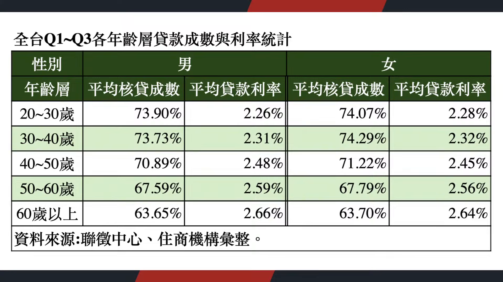 | 現在女性購物的房貸金額大概 已經平均來到1,000萬元以上 創下歷史新高 其中臺北市的平均房貸是1,790萬 新竹縣是1,221萬 新北市是1,166萬 新竹市是1,147萬了 所以這就代表著市場 上這種分割趨勢底下 很多女孩子她可能買房 以前可能是一房或者兩房不好貸嘛 但是現在呢 其實房貸市場已經 稍微比較緩和一點了 已經比較好貸了 那另外一方面 她可能也沒有要跟 另外一半相處的規劃嘛 她就以自己為核心的 所以坪數小一點 一房兩房也可以接受 那貸款條件也越來越好了 這個時候女性房貸的申請比重 在都會地區 大多數已經超越男性了 我們必須承認了 最近不是才公佈 那個7月份的出生人口 不是7,000多人嘛 這通常啦 你把很多條件互相對比以後 會發現真正 生育率比較低的 你說幹跟那個生活環境 壓力都有關 但根本原因就是通常 女性經濟地位越高 她就會越想要為自己 的生活來做掌握 所以通常生育率就越低嘛 好所以的確在這樣的一個角度底下 臺灣生育率低哦 她其實就可以理解 因為女性經濟地位台很高嘛 她不需要依靠男生 以前那種 長得很醜的 你知道嗎 有些男人長很醜 想要靠自己的經濟地位 或者一些才華幽默感 去追妹子的那種人呢 那優勢正在快速的消退為什麼 因為女生呢 現在很多真的是經濟地位不止比你好 外表打扮也普遍比男生好看嘛 那平時還每天做普拉提斯 練體能體力都比你好 有時候甚至還比你好笑 對幽默感還比你厲害 對我就是說Jenny 不是 人家那麼優秀 Jenny很幽默的 雖然節目正經了一點 她以前也常發一些笑話 那些笑話我到現在還不敢講 實在太恐怖了 所以你看到 | 開始列出台北、新竹、新北等女性平均房貸金額，可能顯示城市房貸金額排行。 |
| 00:28:11 |  | 我們看到的 市場的概況改變了 它能不能形成臺灣市場新一波 蛋黃區的房地產買盤的助力 這值得觀察 這可以解釋為什麼 因為女生很多不開車嘛 也不喜歡騎車嘛 所以很多都是要住蛋黃區的 就變成那種 蛋黃區市場買盤 在全台各地還是有 比較顯著的買盤支撐哦 那就是一個時代買盤的一個變化 那男生也是 男生心裡的狀態也要稍微做調整 對不對何必單戀一根花 一枝花嘛對不對 人人家講說那男生現在的心理狀態哦 20歲 沒什麼成就就不要耽誤別人了吧 到30歲 工作這麼忙就不要耽誤別人了吧 40歲還沒買房就不要耽誤別人了吧 45歲 父母還要照顧 就不要耽誤別人了吧 50歲 房貸還沒繳完 就不要耽誤別人了吧 60歲一生就這樣子了 還是不要耽誤別人了吧 70歲 年紀差好多 還是不要耽誤別人了 到80歲他都已經住養老院了 下輩子再說吧 時代變了 你不用再強調自己有多少才華 有多少幽默感了 男生也是一樣 顧好自己就可以了 這沒辦法 時代的浪潮那個 羅蘭 就那個日本的男公關 最收入最高的男公關了 他有講過 他說男生呢 如果你去要求AA 其實很可恥的 因為他都是女生要付錢 他才肯跟女生出去的 所以真正強者是從不討論AA的 以後都讓女方全包 這就是一個社會地位 經濟地位的一個轉變 那看一下能否成為市場買盤的變化 但是呢在大環境不樂觀的情況底下 現在看起來 利率預期的升高 它就會對於其他產業形成抑制效果 這是值得觀察的重點了 好 9點鐘 台股上漲626點 哇已經4萬6了 好莫名其妙就漲到這樣的一個區間了 好台股 真的是每一輪的乖離回檔 時間都來得更加短 短暫好最後 我們再聊幾分鐘的中國市場好了 中國的通膨數據 這一次也公告出來 是3點0.5% 3.5是 這個中國的PPI物價指數 所以可以看得出來 生產者物價成本很高 可是內部的通脹壓力哦 哦看起來還是沒有太顯著的增長 中國現在是大多數經濟體當中 還保持在偏通縮格局的 那當然了 | 回到女性購屋與蛋黃區買盤支撐，可能顯示都會區小宅或蛋黃區房市買盤分析。 |
| 00:30:33 | 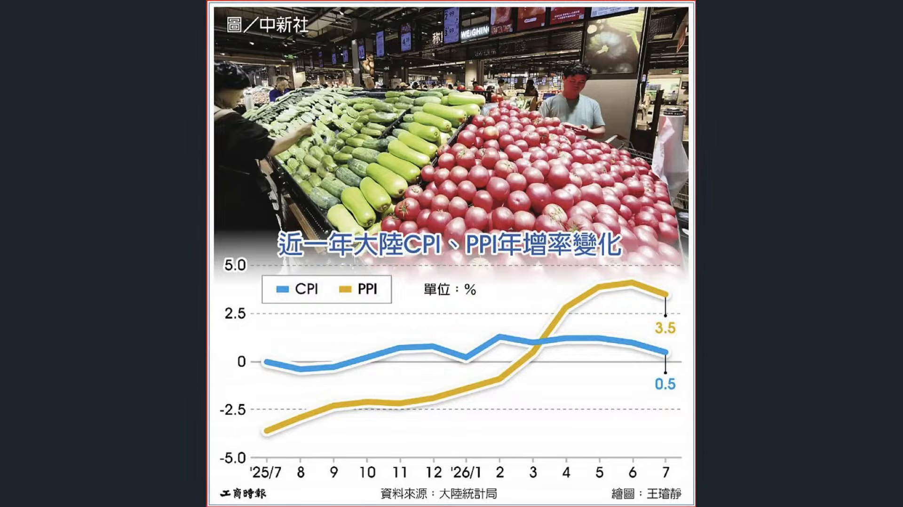 | 這一波大家更為關注的是 中國的長期跌價已經有多久了 我們把23年到整個25年年底 中國的商品與資產 價格的跌幅來做同整呢 那跌最重的是梨子 水泥價格已經跌了31% 長城牌紅酒跌了29% 比亞迪汽車平均跌價是二成七 房價跌27% 黃瓜跌18% 馬鈴薯跌17% 五糧液白酒跌15% 牛肉跌14% 茄子價格跌14% 雞蛋跌14% 西瓜跌9% 微波爐跌8% 所以你看這個跌價 它不是集中在房地產的 它是一系列的物價 水準的快速的收縮 | 開始整理中國商品與資產長期跌價排行，可能顯示各品項跌幅表。 |
| 00:31:12 | 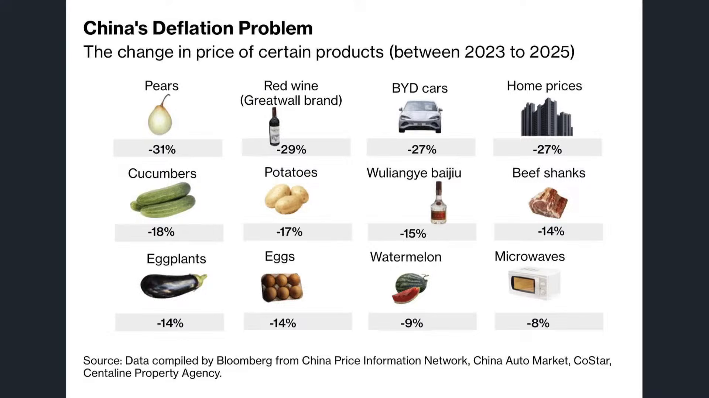 | 車市就是一個非常標準的例子 其實從今年開始 我們看到中國的BMW 從入門款到旗艦款 普遍降幅都是超過一成 以電動車I7來看 售價是從189萬台幣 應該189萬人民幣哦 下滑到159萬人民幣哦 其他我們看到1系列像7系列 7系列是從91萬人民幣下滑到80萬 那其他我們看到像是IX one 就是最小台的那個SUV嘛 從29萬人民幣下滑到22萬哦 新臺幣大概就100萬 降幅也是兩成4哦 全面性的降價就代表著連歐洲車廠 被迫在中國市場的銷售 都必須要有所鬆動 事實上德國車今年在 中國算是兵敗如山倒 新式CLA 今年今年上半年 你要知道 現在麥當勞聯名款的 全新純電CLA在中國還 加入了AI語音系統 賣到22.9萬人民幣 比歐洲版本已經便宜了4成了 結果上半年賣1,000台 同款同價位的小米的速7賣了8萬台 哦所以整個歐洲車廠 不管是BMW還是賓士 奧迪一系列車廠都受到 了非常顯著的壓力 所以中國是少數仍然 在持續輸出通縮的 這種內卷化的跡象 壓力就來得越來越大 其實我們從過去幾年 電動車太陽能到電商到AI 甚至是人形機器人 都是大量企業一起進場 然後透過不斷的降價 不斷的擴產不斷的融資 然後再淘汰再競爭再淘汰 那中國最強的地方 就是可以把一個產業瞬間 塞進數十家數百家公司 中國今年 上半年500台新車款出來呀 好這你把所有歐系車廠加起來 有沒有15台的車款做集體改革 這個 新車款的推出 好像在臺灣都不是特別明顯 所以有時候我們這樣講 這種靠龐大市場工程師所 進行的資本殘酷篩選的 問題就出在這裡 就是大家聚在一起 這種通縮的力量 對於全球通膨它是有 一定的沖銷作用的 壓力很大 但這也說明了內卷競爭淘汰 再內卷再競爭再淘汰的壓力 在中國市場其實壓力真的是蠻大的 之前看到那個 一對師生的對話嘛 那老師說 你們長大就要做社會精英 那同學就問了 什麼是精英呢 老師就說 精英就是把所有人聚在一起 過濾篩選 篩選過濾 過濾再篩選 然後最後選剩下來的 那這時候就有同學問了 老師 那不是人渣嗎 所以我們講說內卷最吊詭的地方 就是它的確為中國篩選 出了世界級的企業 | 轉到中國車市降價，尤其BMW各車款降幅，可能切換為汽車價格比較圖。 |
| 00:34:00 |  | 那比亞迪的利潤呢 現在正在瘋狂的往下掉 好今年已經年減接近有三成左右 最後留下的公司 很有可能是世界頂級企業 但是利潤率極低無比的企業 好這是很神奇的事情 好這個是中國製造業最可怕的地方 好 我們今天主要跟投資朋友稍微分享 三大地區的通膨 美國臺灣和 中國正在面臨三種不同的物價問題 美國通膨正在降溫 核心看服務價格的壓力正在逐步下滑 但是呢聯準會的升息的必要性降低 不代表降息格局的打開 可能要維持一陣子 那臺灣剛好相反 臺灣是能源外食生產成本同步上升 AI景氣又好得不得了 股市財富效應在支撐呢 央行現在已經有人投票 它可能要升息了 可是問題在於 央行內部理事還是 意識到房地產市場的疲憊 傳統產業的疲憊 如果這樣子貿然升息 臺灣已經有慣性的那種低利率的預期 如果這樣升息 可能會形成進一步承壓 也很尷尬 中國就走向比較極端的了 就是幾乎所有看得到的 商品價格全部都在跌價 好這也是企業缺乏定價能力 內需疲弱和激烈的內卷所形成的結果 美國煩惱的是通膨降得夠不夠快 臺灣煩惱的是通膨會不會重新歸來 中國在煩惱 那怎麼樣讓通膨歸來 同樣是物價 三個經濟體 真實面對的是三種不同的疾病 也給投資朋友做一些參考 如果喜歡我們節目 記得幫我訂閱按讚加分享 我們就明天早上8點半 早晨財經速解讀再相見 | 提到比亞迪利潤年減近三成，預期畫面為比亞迪財報或利潤率走勢。 |
