# yutinghaofinance_OJ5vxmwQrE0 — 關鍵畫面索引

- 來源逐字稿：[yutinghaofinance_OJ5vxmwQrE0_FIN.srt](yutinghaofinance_OJ5vxmwQrE0_FIN.srt)
- 影片：https://www.youtube.com/watch?v=OJ5vxmwQrE0
- 截圖數：32

## 00:00:35

**逐字稿片段：** 上禮拜五 美國最新的零售銷售數據和消費者 的信心還是有非常明顯的降溫 但至少把升息的警報給解除了 看看有沒有機會在今年呢 沒有任何升息一碼的機會 當然回過頭說 如果按照目前的財富效應呢 要馬上打開接下來的 降息通道也有所難度哦 這一次7月份零售銷售數據的下滑 能不能至少為降息的 方向來奠定基礎呢 雖然鮑威爾一直說他不 願意做任何的前瞻指引呢 但至少在接下來的FOMC 應該要適度表態了 回過頭說 標普500指數到目前為止 財富效應呢 還是撐住了整體的經濟概況 標普現在是接近有8,000點了 距離200日移動平均線 我們把它當做年線了 還高出了接近有10%哦 距離50日均線也高出了3.7% 有72%的成分股目前已經站上了年線 市場廣度依舊還是很健康的

**話題推測：** 開場後切入美國零售銷售與消費者信心降溫，可能顯示經濟數據或新聞摘要。

---

## 00:01:33

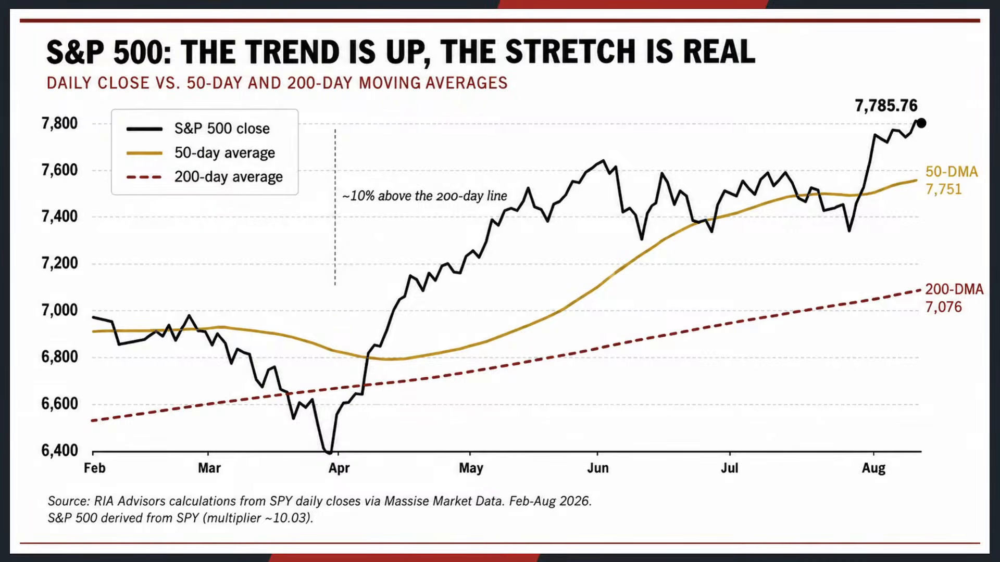

**逐字稿片段：** 那基本面也確實有支撐 這一次第二季的企業獲利年增幅 就算不看AI巨頭 整體增長幅度大概都有33% 未來預估本益比哦 10月份去年呢 AI永動機當時的高點還有23倍 標普500現在的本益比只剩下20倍了 所以你就清楚知道這一波的上漲 它不是靠估值膨脹是靠 基本面的推動 其實基本面上升的速度比 資金買盤還要來得更為快速 那重點在於 整個7月份 你不要看風聲鶴唳 韓國股市散戶 我我記得有30萬戶爆倉 120萬人呢 受到市場顯著承壓不過呢 在7月份 美國的家庭單月的ETF流入 金額高達了3,500億美元 今年已經高達1.6兆了說明 雖然短線上這個 來客自如 就是有些乘客上車 有些乘客下車 可是從長線上 幾乎所有存股族都在7月份加大扣款

**話題推測：** 開始討論第二季企業獲利與本益比，可能呈現標普獲利成長與估值比較圖。

---

## 00:02:32

**逐字稿片段：** 好那高盛的年終目標是8,000點嘛 距離現在的點位大概也只 剩下3%左右的幅度 所以從這樣的一個角度來做觀察 的確標普五百指數 在上禮拜所創下的歷史新高仍然是 讓美國股市保持在 高強度多頭的根本原因

**話題推測：** 提到高盛標普500年終目標8000點，可能切換到券商目標價或指數目標圖。

---

## 00:02:49

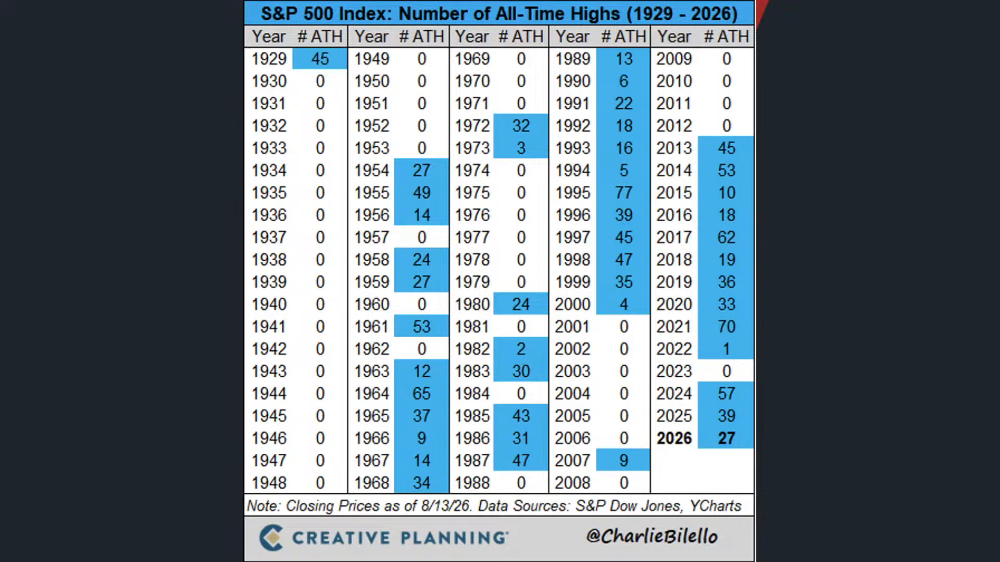

**逐字稿片段：** 標普上禮拜已經 第27次創下歷史新高了 如果從13年來看 已經是470次了 你有沒有發現 過去十年除了2023年沒有創高以外 大多數的年份幾乎都在創高 哦所以美國股市的三代 牛慣性還是很明顯的 不要跟著它對做哦 就連過去最為疲憊沉積的微軟 哦最近都已經硬起來了 準備要往歷史高點來做邁進了 你看當時它的頭部打了多久 哎結果這一段時間財報季之後 個股價大漲 嘗試的要把過去的 市場賣壓一舉的殲滅

**話題推測：** 開始講標普500創歷史新高次數，預期畫面為歷史新高統計或長期指數圖。

---

## 00:03:23

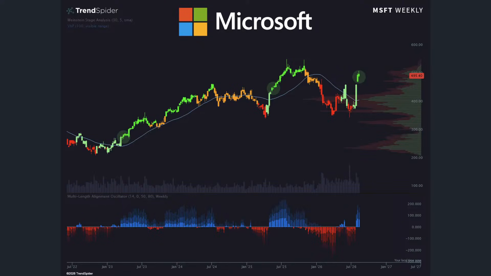

**逐字稿片段：** 軟體股也是如此 大家還記得今年年初 其實股價也在跌哦 只是當時的跌法跌幅主要 都是集中在一些軟體股 我們講的SaaS末日 因為這些軟體股會被agent AI 被agentic AI給取代 可是呢我們看到一個月前 軟體股還是市場最討厭 最放空 然後最擁擠 估值也最便宜的族群 現在的高強度反彈 你發現呢 IGV軟體型ETF 一個月它已經漲兩成了 如果從4月的低點來 看其漲點 已經漲40%了 距離歷史高點 它漲幅也不到10%了哦 所以就連過去最為疲憊的 軟體股都開始蠢蠢欲動 我們很明顯感受到 只要讓金片股稍微休息一下 資金就開始回流到科技巨頭 或者這些軟體型ETF當中 當然呢很多人會說

**話題推測：** 轉到軟體股與SaaS族群反彈，預期畫面為軟體股ETF或族群表現圖。

---

## 00:04:13

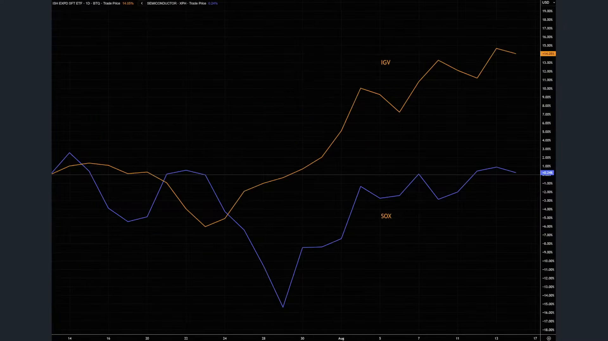

**逐字稿片段：** 可是距離期中選舉越近呢 好像也不宜股市持續走高 的確按照過往經驗呢 VIX指數的確在8月到9月 通常會創下當年度的波段低點 在期中選舉年 可是呢當9月來到10月之後 會有慣性的走高所 引起的進一步中期回檔 主要來自於 有時候選情會相對比較膠著 所以會讓政策的不確定性大幅提高 我們不確定這一次期中選舉之後 川普會不會就會有被彈劾的壓力哦 所以在這樣的一個效果底下 等同於哦 雖然今年已經經歷了 兩次比較大的中期回檔 時間線不長了 但有沒有可能出現第三次呢 也許還是有一段的時間 至少呢我們從現在來看 整體美國股市 其實從7月份以後 它還是一個標準的類股的輪動 只是有些類股輪動大了一點 看起來就變成進入到 熊市或者中期回檔了 但你不要想說 那晶片股現在就很慘了 不要碰晶片股了 晶片股的反彈其實也很快了 我們必須承認 晶片股即便今年跌這麼重 仍然在漲幅當中是名列前茅的

**話題推測：** 開始討論期中選舉年VIX季節性與回檔風險，可能顯示VIX季節性走勢。

---

## 00:05:16

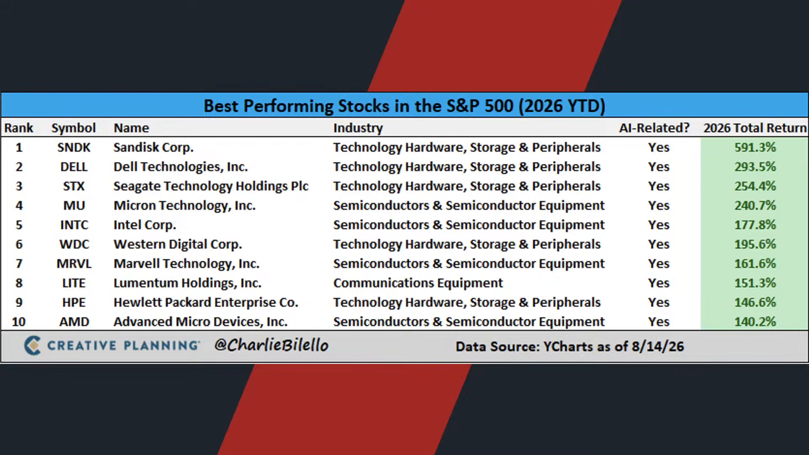

**逐字稿片段：** 我們以標普500指數來看 今年漲幅最亮麗的股票 幾乎還是AI基礎建設概念股 sandsik你不要看前陣子跌這麼重 今年是漲了591% 戴爾漲了294% 希捷漲了254% 美光241 Intel178 威騰196 AMD140% 這都是今年漲幅 低於100%都算輸 而且在這一些股價上漲的過程當中 它並沒有導致科技股嚴重的估值失真 因為獲利成長的速度更快

**話題推測：** 轉到標普500今年漲幅最佳股票與AI基建概念股，預期畫面為個股漲幅排行榜。

---

## 00:05:50

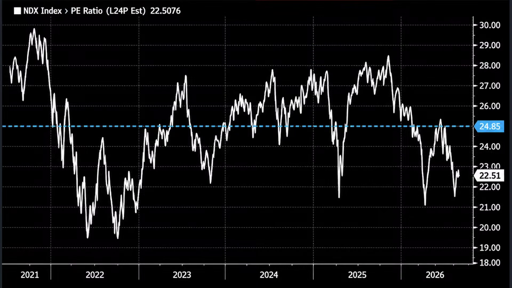

**逐字稿片段：** 所以如果我們看納斯達克100指數 從7月份低點這樣子彈上來 大概彈了12% 站上了50日均線 可它距離歷史高點隻剩下2% 可是你看它的本益比 如果是以前瞻本益比來來看 現在大概是22.5倍哇 這個水準是比過去5年都低耶 你看去年高點10月份AI永動機是28倍嘛 2024年的高點是27倍 2023年也有27.5倍 所以現在的基期 跟大家分享 跟烏俄戰事差不多 納斯達克指數 你願不願意在烏俄戰事有可能 開打之後可能價格修正更大 你願不願意在2022年買進股票 你現在就願不願意在2026年買進股票 當然了我們是保持左側邏輯嘛 最好等市場相對悲觀 可是你至少可以看得出來 從基期角度而言 2026年的股票 比過去23年24年25年都要便宜 那便宜的程度呢 差不多等於2022年的平均值 這就是真實市場的概況 而且本輪的上漲也稍微比較健康了 不像過去那麼極端 以前是如果你買個股 你只要沒有買到7巨頭 你大概就跑輸大盤了 現在不一樣

**話題推測：** 開始分析納斯達克100反彈、均線與前瞻本益比，可能切換到納指估值與走勢圖。

---

## 00:06:57

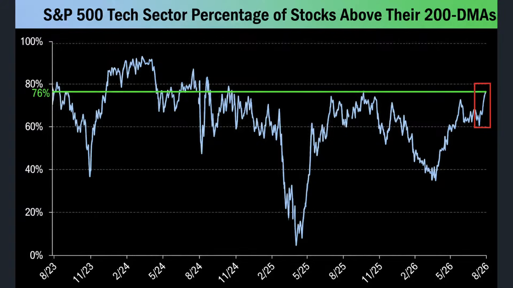

**逐字稿片段：** 現在已經有75%的成分股都 已經站上了200日的移動平均線 創下2024年10月份以來的新高 所以這一次是廣泛性的上漲哦 沒有漲幅這麼極端了 那當然了 現在從7月份的去杠杆 現在重新加杠杆 有沒有可能重蹈覆轍 這很難說 有沒有可能五六月份 大家的信心又重新歸來 然後又上杠杆 這個要繼續觀察資金流的變化 但至少可以承認 本輪的上漲 相對於以往幾年比較健康 第一本益比低 第二上漲的寬度正在明顯的擴散 如果你把AI拿掉 的確好像美國企業的獲利沒這麼強 可是美國企業獲利 已經連續3年翻正了 現在就是如果有AI這個 基礎建設概念股的拉升 大概整體成長 今年第二季財報是54% 越成長越誇張 那如果你把這個基礎 建設概念股給拿掉 那大概就剩下14% 那你說14%很差嗎 其實還是過去6個季度以來的最高哦 好所以從這件事情呢 都看得出來

**話題推測：** 提到75%成分股站上200日均線，預期畫面為市場廣度指標。

---

## 00:08:00

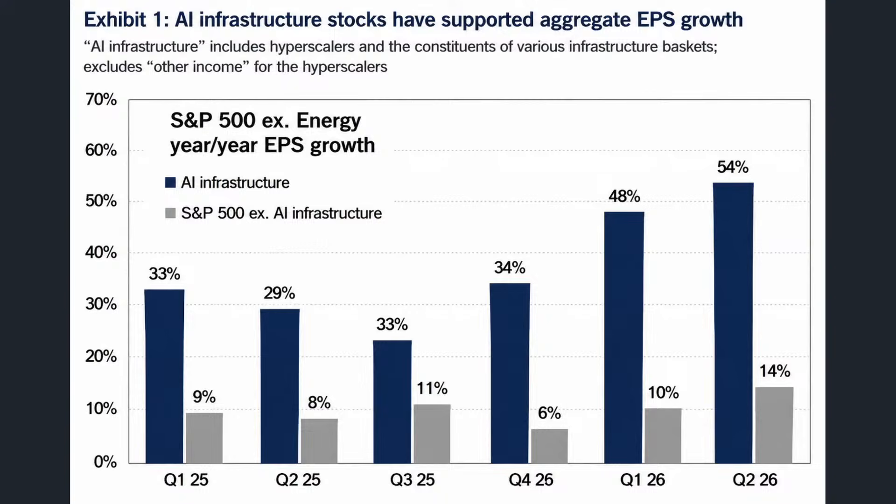

**逐字稿片段：** 為什麼伯克夏這次所公佈的13F 願意開始採購 一方面當然是巴菲特交棒了嘛 所以現在是阿貝爾主導 他有自己的投資風格 那這一次 大幅的買入股票200億 創下現金部位從2022年 以來最快的下滑記錄 那買最多的第一個就Google嘛 因為本益比真的偏低嘛 已經變成波克下的第三大持股了 其他像是達美航空 或者一些房屋建商等等 這些持續性的投資都說明著 波克夏的價值投資 思維已經開始套用了 對他們來講 基期已經逐步到位 也許整個大盤他覺得可以更便宜 但很多個股 已經吸引他持續的來做買入 所以有時候我們自以為聰明 往往比無知更危險 這句話在投資市場當中 就是讓我們瞭解 至少自己不懂的話 反而會保守一點的 最危險的就是誒 你好像看懂了一些財報 總體經濟資料 就覺得自己好像完全看懂了市場 有時候你覺得你早知道了 但是有時候市場上在 不同的資料當中 你經由數據 比對之後 反而得出了一個比較鮮明的例子 就是股價雖然現在是高強度牛市 可是從所有指標來看 你似乎都看不到嚴重的 極其失真 這就是真實概況 你真正擔憂的 都是擔憂那個錢投太多 回不回來的問題哦 這的確值得擔憂 可是呢你擔憂現在股票很貴 哦那就不一定了 所以這是從不同角度來做思維的 當然呢回過頭說現在在

**話題推測：** 開始討論伯克夏13F與買入Google等持股，預期畫面為13F持倉或買賣清單。

---

## 00:09:29

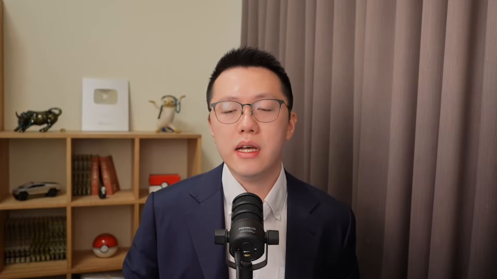

**逐字稿片段：** 各大資產當中 漲幅來的最多的 第一名仍然是大宗資產 34.2% 漲幅第一名 小型股漲24.5 今年以來價值股漲23% 可轉債20.6 中型股19.4 納斯達克100有19.3 成熟股市現在14.9% 成熟市場了 標普五百14.5 瑞馳漲13了 好那 大部分都還是掙報酬了 少數真的表現相對比較差勁的 一個是長天期國債 不過它跌3.3 也不算特別重 領息搞不好這幾年領的回來 投資等級債是下跌1.1%

**話題推測：** 切換到各大資產今年漲幅排名，可能顯示跨資產報酬排行榜。

---

## 00:10:03

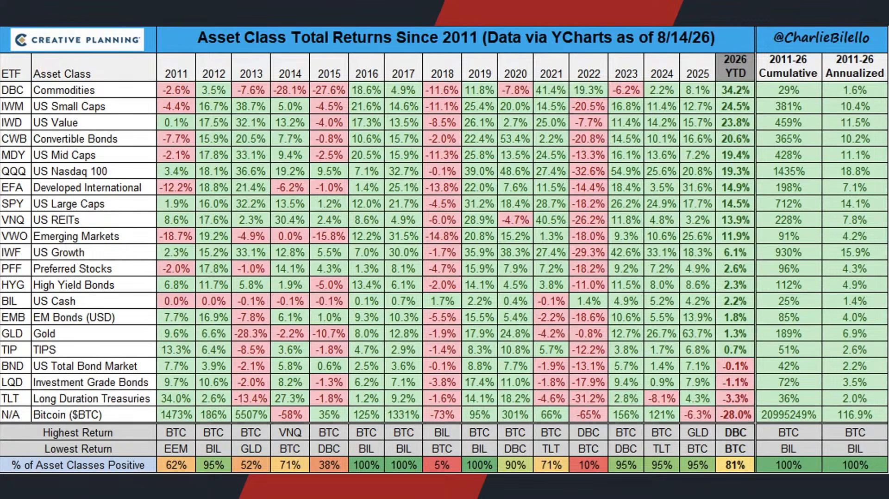

**逐字稿片段：** 好深圳跌最重的又是你比特幣 跌幅是28% 好比特幣這兩年確實比較慘一點 那波動也比 有時候比股票比債券市場 傳統資產還要來得更為劇烈 但如果把時間拉長 我還是相信比特幣最終還是 會反映全球貨幣的供給和 流動性長期擴張的趨勢 我其實沒有這麼悲觀 其實不止比特幣啦 大多數具有生產力 有稀缺性 抗通脹的優質資產 只要你不是單一個股 單一標的 你只要經經濟繼續成長 大多數資產貨幣量 長期增長都能夠創高的 這是我的看法 你最後比的是資金流嘛 比的是貨幣總量 投資到最後 其實這就變成了你其實是在比時間哦 就你能不能熬得過去哦 好即便它跌那麼重 我也不認為它一路就這樣跌下去了 畢竟它還是屬於定量資產嘛 最重要的是 你還是要顧好自己的身體 你知道嗎 因為複利需要的不是幾個月 你要10年20年 甚至更久 只要資產配置做對 不要在中途被淘汰掉 不要被洗掉 剩下最大的關鍵就是身體健康 所以大家一定要活得夠長 一定要活得夠久好不好

**話題推測：** 轉到比特幣表現與長期流動性觀點，預期畫面為比特幣走勢或資產比較圖。

---

## 00:11:13

**逐字稿片段：** 最因為最近有很多 不是很厲害的一些前輩們呢 陸續離開 從以前黃董 後來我一想到哦 看人家在講 你像張忠謀先生已經95歲了 魏哲家先生 魏董已經73歲了 然後陳泰銘69歲 施振榮81歲了 曹董79歲了 郭台銘也75歲了 不是不禮貌 就是如果我們要看到AI的大爆發 你甚至都沒辦法期待 這些人陪伴著我們一起大爆發 因為畢竟 壽命是有限的 可是你像黃仁勳才幾歲 他才六十幾歲 潘董潘建成 才52(口誤) 這些人就可以陪伴我們20年30年了 所以有時候我們要講說 時間拉得越長 你就要越瞭解 那Jensen每天在說的話是什麼 因為他還要活很長 他要對自己說的話負責 但有些人 其實他早就可以享清福了 我們要回過頭來看呢 我們的年輕 我們的時間線呢 其實要比想像中還要來的拉的更遠呢 讓複利效果發揮它的效果 在AI的浪潮當中 我們也許是有機會因為 z世代和y世代我記得是比 前一代還要更為貧窮的 體感上貧窮了 物質上不一定 體感上比上一代更貧窮的 也許我們有機會在這一代產生 明顯的轉淚點呢 如果搭上AI行情的話哦 這我的看法 因為時間只要拉得夠長哦 因為真正能夠留在贏家 榜上的公司也非常少了 但是哦如果它已經待了好幾十年 而且已經用事實來證明它的厲害 也許我認為那就值得相信他的話 所以我是相信Jensen說的話 為什麼這樣講 因為如果你是從過去五年 過去十年 過去15年來看看輝達的報酬 他是少數一直在榜上的 輝達過去五年的總報酬是1,019% 十年大概是14,468% 15年是76,248% 20年是63,261% 不管是在過去5年10年15年20年 它都是榜單當中漲幅第一 所以他就是過去20年 一直漲一直漲一直漲 那當然中間會有非常多的波動 你要能夠留在市場當中 那這些人都已經證明了 不管是在以前在做顯卡做遊戲 到後來的AI浪潮 他做的事情 好他其實也早就已經可以享清福了 但他仍然在第一線鼓勵大家擁抱AI 好這是非常值得大家關注的重點 好那這是第一個 角度我們看待一下 股票市場在過去一周的表現

**話題推測：** 話題轉為企業家年齡與投資時間線，可能顯示科技業領袖年齡列表。

---

## 00:13:43

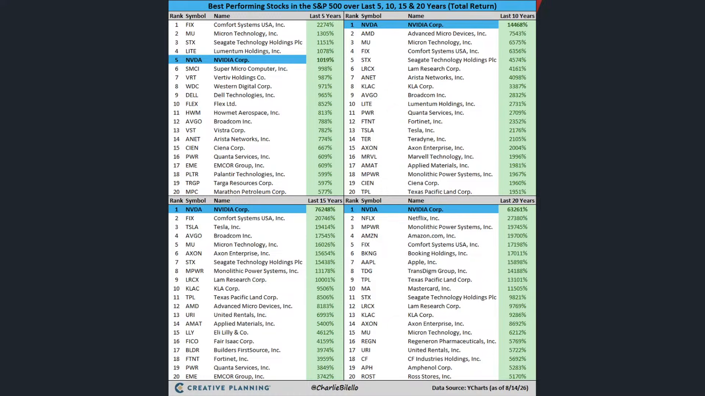

**逐字稿片段：** 第二個角度是市場上 的壓力仍然存在 是什麼原因導致我們 希望股票可以創高 可是本益比又不願意給他高評價呢 這肯定跟利率環境有關 因為在上禮拜 原油價格周漲幅又 高達了接近有6% 布蘭特原油現在是每桶收在88塊 西德州大概82塊 哇就卡在這樣的一個區間 雖然呢相對於今年3月到5月好很多 可是相對於去年一整年呢 大家看一下基期 去年的平均油價真的就是五六十塊 現在就一直維持在80 那也是一個極大的通脹壓力

**話題推測：** 進入第二大主題：利率壓力與油價上漲，可能切換到原油價格或利率環境圖。

---

## 00:14:17

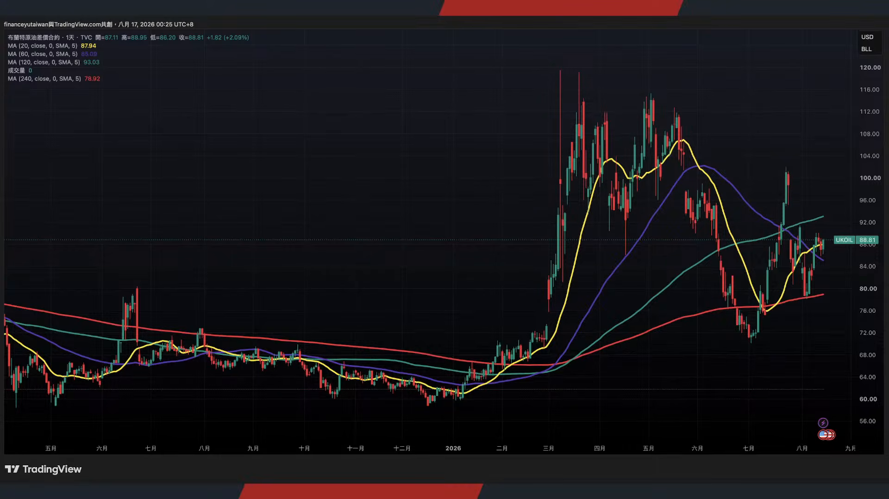

**逐字稿片段：** 雖然上禮拜 公佈的美國PPI算是明顯降溫 月增幅是0 可是我們還是要必須瞭解到 這種通脹的外溢效果 它會導致利率環境無法鬆綁 那會讓接下來這些7巨頭的融資 預期融資規劃遭受到極大的承壓 我們從目前通脹資料來看也是如此 目前每加侖汽油價格大概4.07塊 跟2022年差不多 但是還是明顯比23年 24年25年都還要來得高 所以通膨它一直以來都是 一個明顯的年增作用 而且我們必須承認 這次通膨到底有沒有外溢效果 一個月沒有 兩個月沒有 3個月沒有 超過4個月差不多就要有了啦

**話題推測：** 提到美國PPI降溫但通膨外溢仍在，預期畫面為PPI或通膨數據圖。

---

## 00:14:56

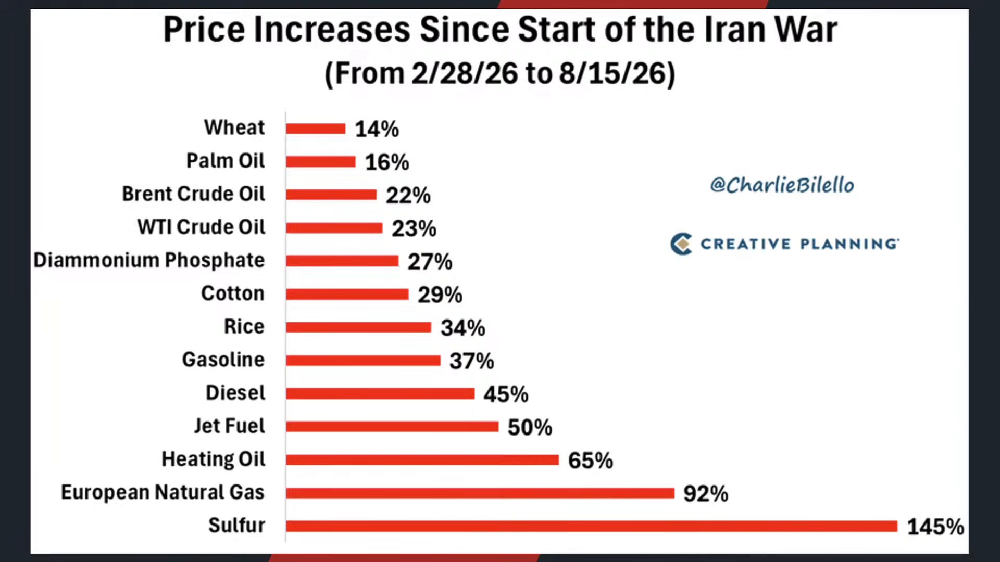

**逐字稿片段：** 其實從伊朗戰事爆發以來 各大大宗資產的上漲幅度其實不小哦 所以不能夠 僅僅說因為石油價格只有它漲 所以其他沒問題 其實大多數資產價格都 有非常明顯的外溢 漲最多是硫磺價格145% 歐洲天然氣價格從228 到現在漲了92% 取暖油65 航空燃油50% 柴油45 汽油37 稻米34 棉花29 好那一系列聚酯纖維也受到這種 油料耗材的一個損失或者 供應的衝擊而進一步上漲 棕櫚油也上漲了16% 小麥上漲14% 當然了如果你是用年增幅來看 就直接用去年來進行對照哇 漲幅有的就更為極端了 取暖油是漲了92 白銀漲了72 汽油52 銅價也漲了47%白金32 金價漲了32% 黃金32 小麥29 鋁價27 棉花26% 玉米23 黃豆15% 哇都是雙位元數字成長 你說有沒有稍微好一點的資料 有咖啡只漲兩% 活牛跌了兩% 木材跌了7% 可哥跌了34% 可是你要知道 目前你看到這些在跌價的 很多都是這幾年已經漲很多的 然後現在開始稍微回檔而已 它其實從體感上根本 感覺不出來價格下跌 比如說咖啡豆 木材價格 前兩年那個飆到很離譜 甚至像是美國牛肉價格 疫情以來價格都已經翻了三倍了 以前我們臺灣 就是以前吃美國牛還有點顧忌嘛 剛開放的時候 現在美國人自己都不夠吃了 還要跟阿根廷進口 餐飲成本現在也被迫抬高 其實臺灣已經有很多人吃牛肉 已經習慣吃美國牛了 像我自己也慢慢開始習慣了 不管是牛排還是牛肉麵 像有時候我也是半夜兩三點 突然很想要吃一碗熱騰騰的牛肉麵呢 好險我都自己煮 但是重點是哦 這種價格的外溢效果 它所形成的通脹僵固性 的確會讓聯準會接下來的 降息通道產生極大挑戰

**話題推測：** 切入伊朗戰事以來大宗商品全面上漲，可能顯示商品漲幅表。

---

## 00:17:03

**逐字稿片段：** 尤其美伊戰事到目前為止 仍然沒有十足的進展 這一次美伊之間的衝突 已經從短期的軍事行動 變成了長期的消耗戰 當時在去年6月的時候 大家還記得午夜之錘嗎 37小時向伊朗核設施 投下了42萬磅的炸彈 結果短短幾天就結束 當時的一個軍事行動 結果現在誒 2月打 打到現在已經打半年了呢 所以華許我們講說 雖然上任之後 嘗試的減少對於利率 路徑的明確指引 讓市場自行判斷但是 美伊戰事又沒有一個明顯的終局 難道你要認為我們 借由利率預期來逼你就範嘛 所以我很好奇 華許會一輩子都不願意做前瞻指引嗎

**話題推測：** 轉到美伊戰事從短期軍事行動變長期消耗戰，可能顯示戰事新聞或時間線。

---

## 00:17:49

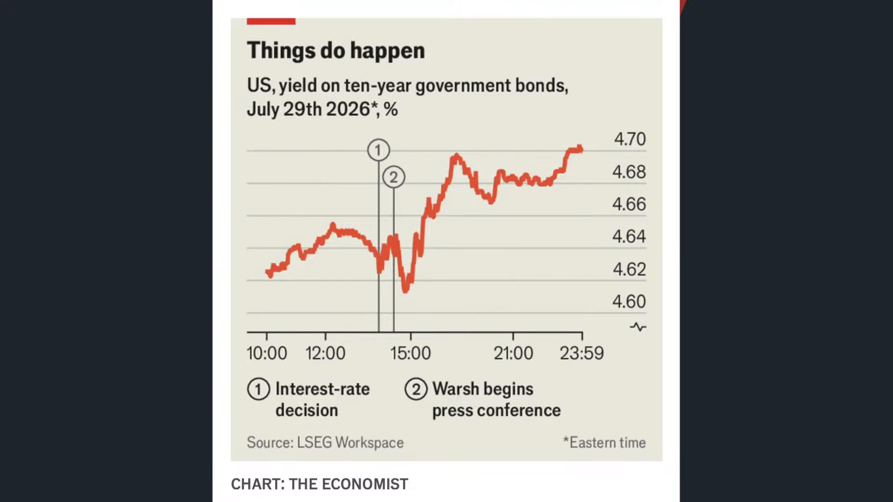

**逐字稿片段：** 那假設我們把10年 期公債殖利率做多到4.8 4.95%呢 你都不喊話嗎 你都不會採取一定的措施 或者一定的回應嗎 這是很重要的 因為2026年的通膨問題 它已經不是 單一各國問題哦 它是有明顯的全球同步正在加速哦 你看美國CPI現在3.4 其他我們看到像是 日本的部分 法國的部分 臺灣的部分 歐元區的部分 波蘭的部分 幾乎通膨都開始重新回到上行路徑了 那央行的表態其實就來得更為重要了

**話題推測：** 開始討論10年期公債殖利率可能升到4.8至4.95%，預期畫面為美債殖利率走勢。

---

## 00:18:22

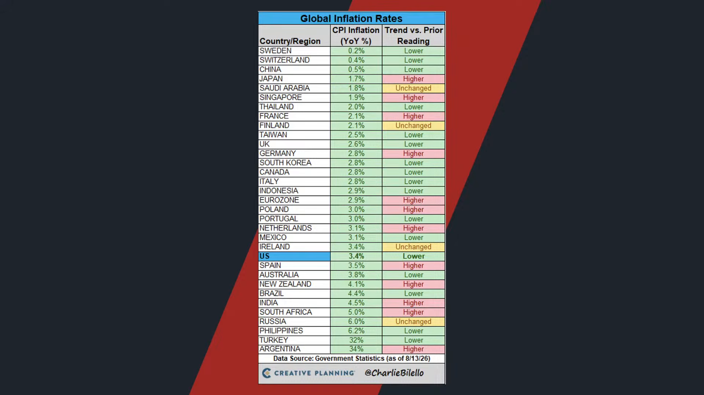

**逐字稿片段：** 更何況美國長天期殖利率 上行情況它不止反映通膨 它其實也反映的期限 溢價正在快速的上升 從7月份連 聯準會FOMC會議以來 30年期的殖利率淨升幅 超過100% 幾乎都可以用期限溢價來解釋 因為市場對於長期利率 的預期反而還略下降嘛 說明什麼 說明現在大家不只是 單純怕利率更高 而是所有債券投資人都要求更多的 補償來承擔10年20年30年的政策路徑 原因很簡單第一 就通膨降溫了 但是有外溢效果 壓力很大第二 華許刻意減少聯準會的市場前瞻指引 那我就把 把實值的期限溢價同步地做高 所以在這樣效果底下 你就要看華雪到底願不願意做表態了 要不然這種環境呢那利率 其實很緊繃的 應該是沒辦法讓科技 巨頭能夠放寬心的去發債 當然回過頭說

**話題推測：** 開始分析美國長天期殖利率與期限溢價上升，預期畫面為期限溢價拆解圖。

---

## 00:19:15

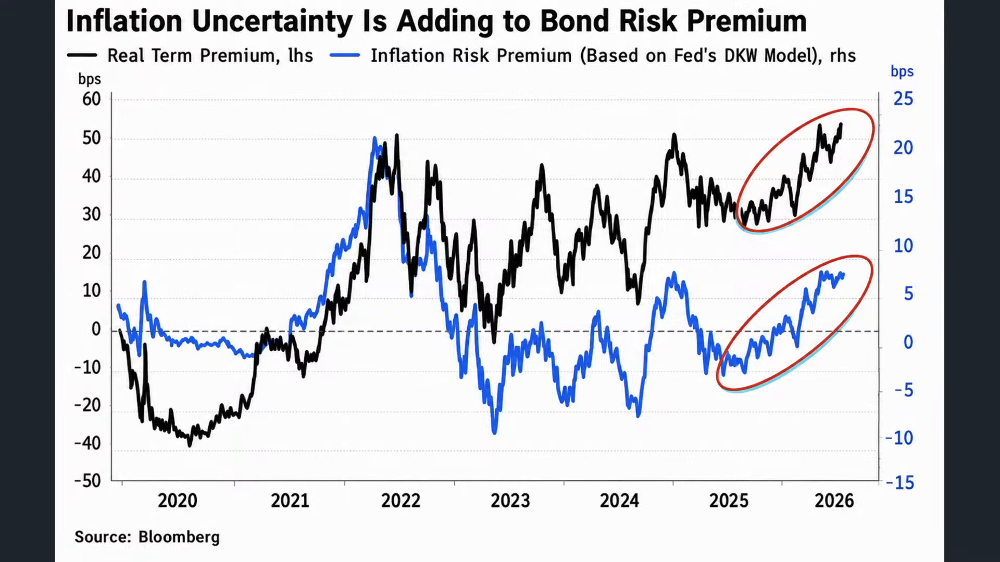

**逐字稿片段：** 地緣政治的緊張也是讓通膨 保持在高位的根本原因 我們這一次知道 伊朗戰爭加速了消耗庫存 五角大廈在上禮拜已經 要求軍火商進行全面的擴產那 不只是中東問題哦 烏克蘭最近跟俄羅斯的衝擊 尤其是無人機的攻勢也創下新高了

**話題推測：** 轉到地緣政治與軍火商擴產，可能顯示國防供應鏈或戰爭新聞畫面。

---

## 00:19:34

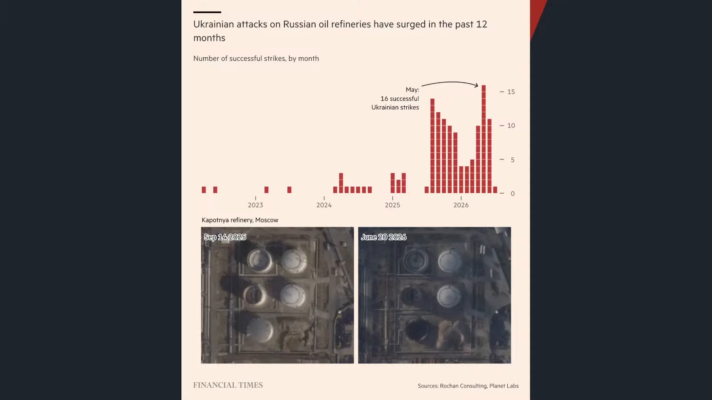

**逐字稿片段：** 如果我們細看圖表哦 光是5月到6月 烏克蘭就已經成功攻擊 了俄羅斯的煉油廠16次 創下單月的新高 嚴重到美國希望烏克蘭可以 停止攻擊俄羅斯的煉油廠 哦這我以前都是 烏俄羅斯不要做太過分 不要攻擊民用設施 尤其是烏克蘭的 現在美國人叫烏克蘭人不要 再打俄羅斯的煉油設施了為什麼 你再打上去 油價就壓不住了 所以打其他的 打軍用設施就好 俄羅斯的煉油廠至少 已經遭到了194次的攻擊 相對於去年同期已經增加了11倍 光是在6月份呢一個月 俄羅斯就已經擊落了32,000架的無人機 嘗試的要攻擊煉油廠 好從這件事情就說明了整個 俄羅斯在7月份的原油加工量 大概已經比平常少了1/3 對於全球通膨的外溢 效果也在陸續的增高 另外一方面

**話題推測：** 明確提到細看圖表，切入烏克蘭攻擊俄羅斯煉油廠次數，預期畫面為攻擊統計圖。

---

## 00:20:25

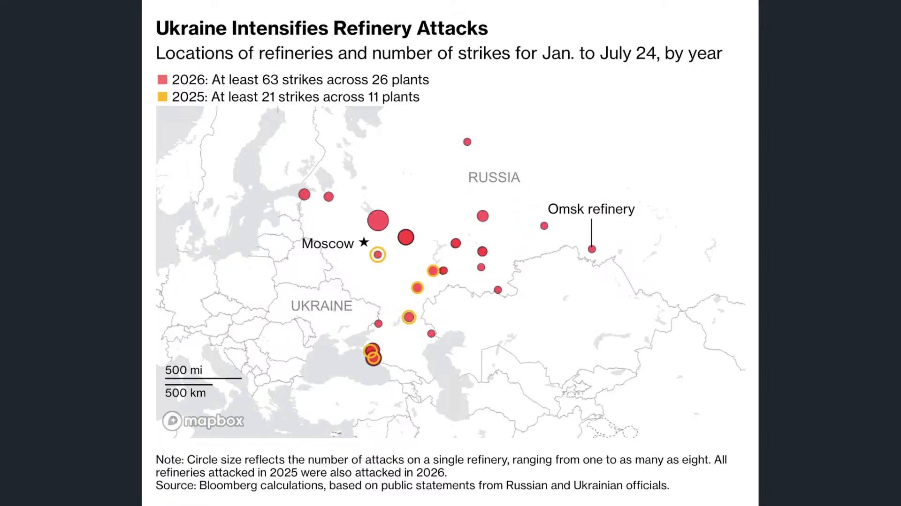

**逐字稿片段：** 黑海的航運風險也在慢慢的升高 最近 烏俄戰事因為一直攻擊黑海的商船嘛 土耳其籍的船隻也遭受到波及 最後呢土耳其 已經宣佈收緊達達尼爾海峽的通行 多艘原本要前往俄羅斯 的重要油品和穀物 被告知暫時不合發通行許可 必須要更長時間的一個審查 來向烏俄兩國來施加壓力 你不要打到我的船 好這個是屬於中東的問題 還有屬於烏俄戰場的問題 嚴峻局勢的確 比想像中還要來得更為緊張 那在太平洋的另外一端

**話題推測：** 轉到黑海航運風險與土耳其收緊海峽通行，可能顯示黑海航運或地圖。

---

## 00:21:01

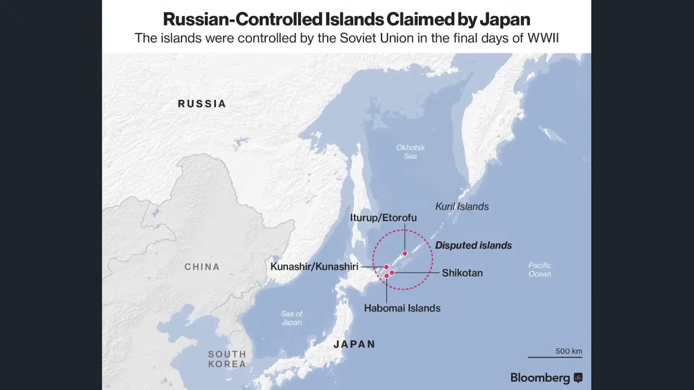

**逐字稿片段：** 我們看俄烏局勢最近也開始升溫了 普京上禮拜哦 因為是踏上了俄烏的爭議領土叫做 擇捉島那高市早苗在上禮拜 就隨即公開抗議 說此舉傷害日本的國民感情 完全無法接受 這個擇捉島 它是在南千島群島 日本叫做北方領土了 除了擇捉島以外 日本也主張國後島色丹島 上面這幾個島 由日本來做領土的實質管轄不過呢 真實的控制目前看起來是俄羅斯 那這項領土已經爭議很多年了 雙方無法簽議和平條約 但是呢至少雙方都不願意登島嘛 至少可以了解說 還有可以溝通的空間 不過這一次普京呢 就直接登島了 他先前還視察俄羅斯太平洋的艦隊 當然你說現在兩邊作戰 那不太可能 難道日俄戰爭又蠢蠢欲動了 不太可能 可是雙方一邊說談和平 一方面都在強化軍事和政治立場 所以導致整體在日本海 到北太平洋 局勢再度緊張 高市在上禮拜哦才剛剛 正式成立日本國家情報局 叫日本CIA 由首相親自領導的國家情報會議 因為日本以前呢 它是沒有國家情報局的好 在二戰以後 那長期都分散在外務防衛 或者法務員警不同部門 那高市這一次 一攬大權 將整合各部會的情報 來提出綜合分析 主要推動日本改變的 就是周邊環境不一樣了 中國的壓力 俄羅斯的壓力 北韓的壓力 帶來的軍事和情報威脅持續升高 那日本以前都是靠CIA來供應情報嘛 那就很擔心未來總不能把情報 跟國家安全完全外包給華府嘛 最後呢還是得自己解決 所以在上禮拜 高市早苗正式成立了國家情報局 那當然回過頭說

**話題推測：** 切換到日俄北方領土爭議升溫，預期畫面為南千島群島地圖或新聞。

---

## 00:22:46

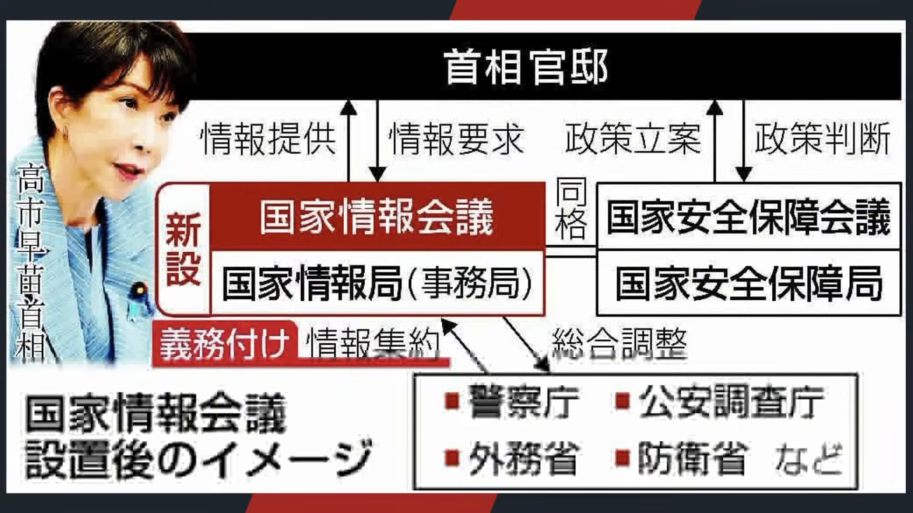

**逐字稿片段：** 整體而言在 中太平洋 就是臺灣的部分 這緊張局勢也一直都沒有緩下來過 臺灣局勢就是臺灣人自己不是很緊張 而國外就一直做專題很緊張嘛 那的確中國對台的灰色地帶行動 正在從西側一路向東擴張 這是天下做的一個專題 來瞭解到底五六月份 我們看到的即時 臺灣海峽周邊情況為何 那看得出來 中國海警的確已經把 圍台變成了執法的常態 威脅可能比軍演還要來得更為嚴重 因為你看在金馬海域哦 幾乎頻率哦好 一天大概就4艘到5艘 就每天就在那邊一直繞 繞進來趕走 又繞回來 差不多就是這樣的一個態勢 那當然這會形成進一步的市場壓力 最終我們看到 整體無人機的發展 就在這種 這種地緣政治緊張的局勢底下 被迫推波助瀾

**話題推測：** 轉到台海灰色地帶行動與中國海警常態化，預期畫面為台海周邊示意圖。

---

## 00:23:37

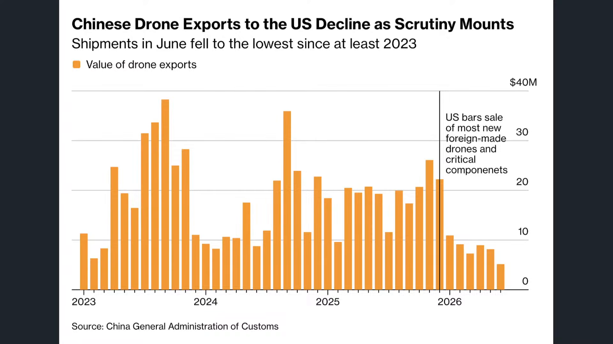

**逐字稿片段：** 川普呢在上禮拜也正式宣佈 對無人機課徵100%關稅 好這說明美中的科技戰 已經完全延伸到低 低空經濟了 川普政府宣佈對於進口無人機 還有零組件直接課徵100%關稅 其中重量超過25公斤 有特定敏感能力的無人機 直接適用最高稅率 一般小型無人機如果是 商用的就課25%就好了 但是呢有排外 歐盟日本瑞士臺灣 不用課這麼高的關稅 只要課15趴就好 英國是10% 那你要知道哦 現在美國商用無人機 市場最大的廠商是誰 就是大疆嘛 所以大疆占了70% 現在直接被課徵接近100%的關稅 那這一次要賭的就不是整機了 就賭中國零部件 如果臺灣用中國零部件 照樣要課一樣的關稅 按比例來課徵 所以在這樣的一個效果底下 等於無人機大戰已經正式開始了

**話題推測：** 切入川普對無人機課徵100%關稅，可能顯示關稅政策新聞或無人機產業圖。

---

## 00:24:29

**逐字稿片段：** 那中方 其實也主動宣佈 也要進行無人機的管制出口 哦雙方很明顯 都在控制自己的籌碼 甚至在稀土戰層面呢 又開始蠢蠢欲動 美國當然是跟歐盟日本 來投入數百億美元 建立自己的關鍵礦物產業 可是中國最近又開始逐步 的收緊供應鏈政策 最近導致中國各類型的 關鍵礦物價格開始水漲船高 像種種現在從25年以來 每公斤已經突破2,800塊了 誒 2022年它才500塊 鎢的價格現在 因為中國已經幾乎 停止供應給日本了嘛 日本只好跟美國買 現在已經突破3,000塊了 哎之前也才1,000塊 所以從一系列材料價格的大漲 都已經看到美中之間的稀土戰呢 已經開始影響到臨近的 一些中小國家 那當然無人機產業的推行呢 就已經是勢在必行的 現在美國有大量的訂單 向韓國向日本向中東向 烏克蘭來進行採購不 不過雙方的量體差距還是非常大

**話題推測：** 轉到中國無人機出口管制與稀土戰，預期畫面為稀土供應鏈或礦物價格圖。

---

## 00:25:30

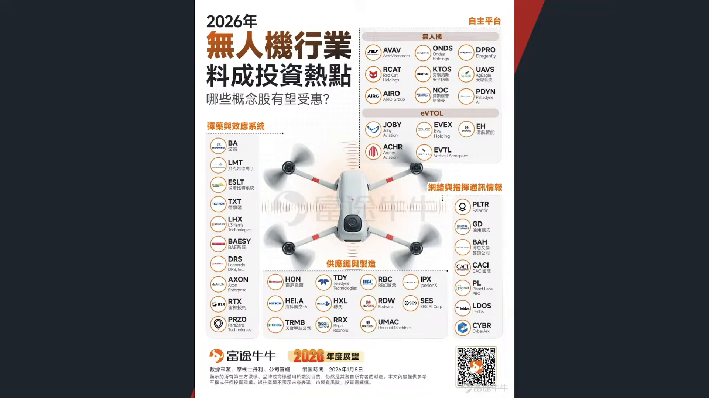

**逐字稿片段：** 如果我們就只看軍用無人機 現在中國的無人機 軍用無人機年產能呢 大概是300萬到800萬架 取決於有沒有出口到烏俄戰場 俄羅斯大概是500萬架到700萬架 烏克蘭是200萬架到500萬架 那必須承認了 就算是烏克蘭 其實大部分有一半以上 也是中國運過去的 中國無人機其並沒有 特別只供貨給俄羅斯 看起來是雙邊押注哦 那相對之下 臺灣是多少 臺灣也很多 臺灣大概12萬架 在撇除 正在打仗的幾國 撇除中國 臺灣已經產量算高的哦美國大 大概10萬架 土耳其12萬架 伊朗15萬架 日本就很誇張 日本大概只有1,000架而已 跟臺灣甚至不是一個級別哦 這也點出現代戰爭的新現實 就是過去軍工比的都是誰能夠 造出最先進的戰機飛彈還有軍艦 現在比的是誰能夠用最低成本 最快的速度大量製造 可以消耗的無人機 無人機一架很便宜 但是可以摧毀數十倍甚至 數百倍價值的裝備的時候 現在大量的生產能力已經被 美國視為重要的國防能力了 所以有時候我們要這樣想 的確從這個資料來看 那真的是落差很大 難怪美國這麼敢呢 這個也不商量 也不做逐步的關稅抬高 就直接就課徵00%了 直接要停止 任何中國的零部件進入到美國 開始瘋狂的跟臺灣跟日本 或者跟其他國家來進行採購 原因很簡單 因為有時候我們容易犯的錯 不是低估一件事情呢 是拿自己的尺度去衡量別人的世界 那投資世界也很一樣 就有些公司可能成長30倍 你就很驚人了 一個國家一年可以 生產10萬架無人機哦 臺灣都已經生產的比美國多了可是 換一個競爭對手 換一個產業尺度 你才發現 原來自己眼中的極限 只是別人的基本盤 所以你看那個數量就知道 哦的確 臺灣美國那個生產 無人機的數量跟中國的確 它是不是同一個量級 臺灣已經創高了 對自己來講哦 但是跟中國目前的產量比較起來 非紅供應鏈呢 仍然有很長一段路要走 最後還是取決於大家 的尺度看的不同 這個時候要瞬間來進行調整 最近網路上看 他講說有一個非洲男人 愛上一個白人千金呢 那女生的爸爸他看不起他 你想娶我女兒 你先去哈佛拿學歷吧 哎結果男生真的去讀 半年之後 那非洲男真的拿到學歷了 他爸爸又說 那你一個月可以賺1,000萬嗎 哎結果他真的去炒股票 炒到一個月可以賺1,000萬 爸爸沒有招了嘛 最後說那最後一個條件 你那邊要有一公尺長 那男的沉默了一下 為了你女兒 我剪！ 所以人最容易犯的錯 不是低估一件事情 而是拿自己的尺度去 衡量別人的世界 更進一步的來看 現在一個國家它的武器 夠不夠先進 另外一個國家想的可能是 我現在可以生產 幾台無人機 夠便宜夠快就可以了 現在投資尺度 對於軍事策略 都是如此 所以你才可以看到為什麼 現在改變的速度來的這麼快 突然之間關稅就已經課徵了 突然之間貨源就大量的來做拉抬 這是一個我們可以觀察到 的一個世界的大變局哦 感覺這個世世界的變化越來越快了

**話題推測：** 開始比較各國軍用無人機年產能，可能顯示中國、俄羅斯、烏克蘭、台灣等產能表。

---

## 00:28:49

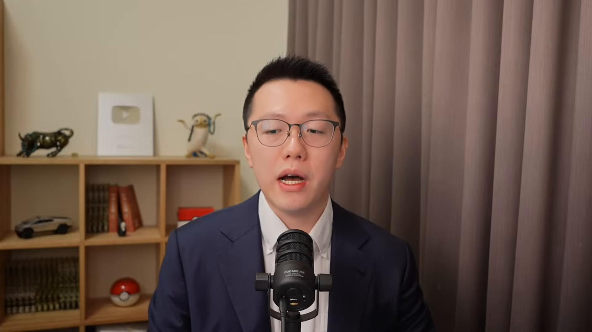

**逐字稿片段：** 那事實上我們看到這一次 前陣子我們不是看那個top gun two嘛 第六代戰機哦 上次拍電影還是第五代 現在第六代戰機已經陸續推出 而幾乎第六代戰機預估 都會採取無人僚機作戰 我們正常都是兩台飛機要一起飛 要有僚機嘛 那現在預估 僚機會大量的使用 AI感測和資料系統 美方層面呢 已經採取了新一代的一個更換思維 臺灣也是也是如此

**話題推測：** 話題轉到第六代戰機與AI無人僚機，預期畫面為戰機或無人僚機示意。

---

## 00:29:17

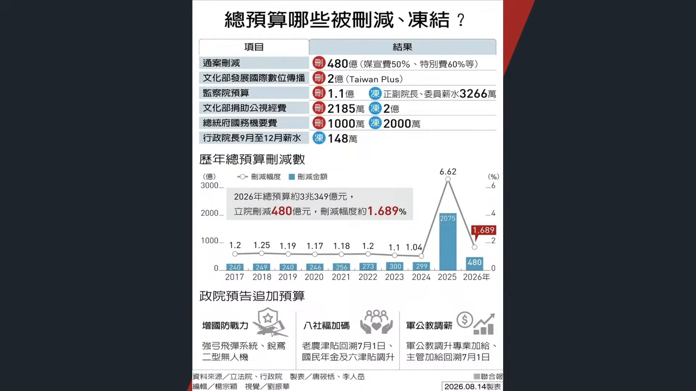

**逐字稿片段：** 臺灣最最值得觀察的 就是中央總預算 上禮拜終於過關了 刪了480億 刪減幅度從6%降到1.68% 最重要的是什麼 是經濟部的無人機統籌計畫 80億預算全數過關了 與此同時 有634億哦 接下來還會做細節探討不過呢 通過應該不會有什麼太大問題 上禮拜消息一出來 雷虎和翔合誠亞航 軍工概念股是全面漲停 因為正式過關了 那一旦過關以後 代表著國防採購很快就會出來 有沒有機會能夠養出 下一座的護國神山呢 我們當然不能說每一次都這麼樂觀了 臺灣有很多國家隊的一個興建 以前有那個生技國家隊 有那個風電國家隊 必須承認呢 生技國家隊的效果沒有 想像中來的這麼好 風電國家隊哦 效果也許沒有達到非紅供應鏈 不過臺灣是全球第五大的 風電大國了 如果是從建制量來看的話 所以必須承認 一個新的國家隊的成立過程當中 難免會有一點質疑 不過既然朝野已經有共識 陸續過關以後 有兩個條件 一個就是產業的興起 各大縣市都開始搶錢了 那第二大呢 就是看一下接下來美國的 貨源和訂單量幅度會有多大 因為人家是真的有需求 我們都不用靠自己去爭取訂單的 人家的訂單只要你有貨 現在正在瘋狂的下單 行政院這一次是大概投了600億左右 那中央資源會落腳何處 已經引發各地政府的競爭了 嘉義現在是有亞洲 無人機人工智慧創新研究中心 也是政府最先投入的國家基地 我們預估可以拿到最多錢 那地方政府爭最多的 主要還是來自於一些 包括2,000億的國防 自主的無人機採購 或者無人機無人艇的21萬架的訂單 會由誰來拿 嘉義現在就是有基地優勢 那台中呢 是精密製造和產業的聚落 桃園有航空 有電子和物流條件 那現在預估 應該是比照AI伺服器模式 各地都會拿到一筆資金 讓各地依照研發製造測試和出口 分工來打造臺灣無人機的供應鏈 可現在就不分藍綠了哦 所有縣市都在申請資金 好希望可以獲得訂單 來扶持內部的企業 那的確臺灣無人機 現在最大的買家 去年大部分都是捷克了 那捷克很明顯買到 之後馬上就進烏克蘭了 那今年呢 在6月到7月 最大買家突然變成了沙烏地阿拉伯 這個單月採購金額就高達4,720萬 這是二三年以來的最高 一次就買了3,000架 而且一架花很貴哦 一架買了1.45萬美元 是臺灣出口到其他 國家同類產品的10倍 所以臺灣莫名其妙 整個今年中旬無人機產業大爆發 因為中東正在瘋狂的採購 前兩年都靠烏俄戰場在撐 現在靠中東戰場了嗎 以後有什麼戰場哦 看起來打越多 臺灣無人機出口速度來得越快

**話題推測：** 切到台灣中央總預算與無人機統籌計畫過關，可能顯示預算數字或軍工股新聞。

---

## 00:32:14

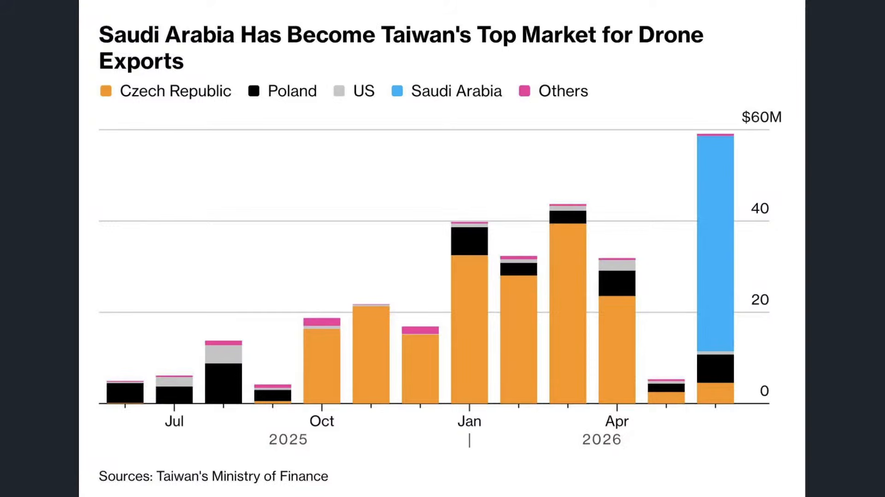

**逐字稿片段：** 那國防部大概也啟動了為期兩年 這 我說講是美國國防部 大概有11億美元 大概是360億美元的無人機的採購計畫 也就是在全球 以美系訂單為准 預估會有數百億 資金鏈會投散到全球各地 我們到時候就要看一下 臺灣能夠搶到多少訂單了

**話題推測：** 提到美國國防部無人機採購計畫，預期畫面為美系訂單或採購金額圖。

---

## 00:32:34

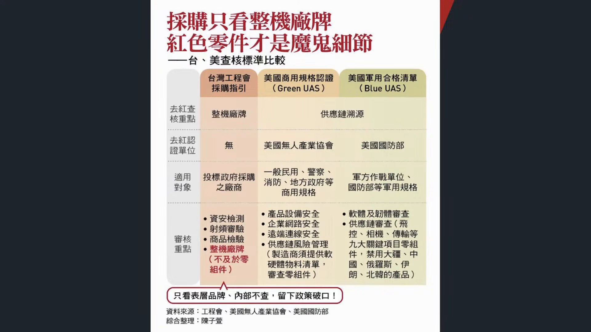

**逐字稿片段：** 那當然我們做的不只是無人機啦 無人艇其實也是如此 臺灣大家知道 軍艦的確有高齡化的問題 現在臺灣95艘的軍艦當中 超過服役50年以上的 唉已經有非常多了 大概有十幾艘 部分兩栖或者後勤艦呢 甚至可以追溯到二戰下水時期 二戰打到現在都還沒有退役 好所以面對艦隊老化目前嘛 到底是要 更換新一輪的新艦 還是說可以把預算撥 去採購大量的無人艇 誒這也是未來可以觀察的幾大方向 好但不管怎麼說 一個新的時代已經開始了

**話題推測：** 切換到無人艇與台灣軍艦高齡化問題，可能顯示艦隊年齡或無人艇替代方案。

---

## 00:33:10

**逐字稿片段：** 我們今天聊的範圍比較廣 台股上漲339點 收在46,156點 一方面我們先聊美國股市 漲到這樣的一個位階以後 市場的擔憂和他的信心在哪裡呢 擔憂當然是利率環境 仍然不利於這些企業繼續的融資 可是信心來自於他真的賺那麼多錢 所以他的本益比其實並不高 他沒有想像中這麼貴 那第二件事情呢 看的是整個通膨的傳導 在美伊衝突持續僵局底下 原油價格是按在80多塊左右 可是已經外溢出去了 大量的大眾資產價格 今年已經外溢下去 可能會導致通膨下行 路徑沒有想像中來的快 它不至於升息 你要讓它降息哦 其實也是困難重重 必須承認 那第三件事情呢 來自於地緣政治的動盪 它雖然對於利率環境有影響 它的好處是什麼呢 它的好處是 全球無人機產業鏈已經逐步到位 而臺灣現在是 非中非厄非烏體系當中 產量第一名的經濟體了 目前整體甚至領先於南韓日本市場 看其他土耳其市場 這就說明著 一個國家隊的成立 我們當然知道 大家給他比較高的一個檢視標準 但是也許一個新的商機 也會因此而出現的 給投資朋友做一些參考 如果喜歡我們節目 記得幫我們訂閱 按讚加分享 我們就明天早上8點半 早晨財經速解讀再相見 祝各位投資朋友看盤順利 操盤愉快

**話題推測：** 進入節目總結，回顧台股上漲與三大主題，可能顯示台股指數或重點整理投影片。

---
