# yutinghaofinance_aRPmzQfTLFc — 關鍵畫面索引

- 來源逐字稿：[yutinghaofinance_aRPmzQfTLFc_FIN.srt](yutinghaofinance_aRPmzQfTLFc_FIN.srt)
- 影片：https://www.youtube.com/watch?v=aRPmzQfTLFc
- 截圖數：22

## 00:00:35

**逐字稿片段：** 在昨天美伊60天的談判大限已經到了 大家都忘了60天前曾經有這樣 的一個談判時間線協定 結果到期以後 看起來美伊雙方的談判條件呢 仍然無法到位 這一次反而大家關注的是 國際油價又漲了兩% 30年期國債殖利率已經衝 高到19年以來的新高了 那當然了 我們也知道股票市場好像對於 債券市場的反應也不是特別大 照理來講哦 殖利率的顯著衝高應該會 回過頭來壓抑一下股市哦 但股市似乎也沒怎麼回跌 只是停止上漲而已哦 當時美伊在6月份所 簽署的諒解備忘錄 原本預估60天內就要停戰嘛 那會有很多細節要做探討 比如說伊朗的核計畫 霍爾木茲海峽的開放問題 或者海外的資產解凍等等 結果川普表示的 由於目前幾乎看不到對於 伊朗戰爭快速結束的可能性 所以呢很有可能是阿曼在 霍爾木茲海峽談判過程當中從中作梗 所以美軍即將發動進一步的轟炸 好那就聽聽就好 但布蘭特原油價格昨天已經正式 突破了九十美元呢 市場的壓力 我們就看看什麼時候會從債券 市場回過頭來壓抑股票市場 至少現在股市也不是說就因此而下跌 只是盤在這樣的一個區間 等待進一步的訊息 那事實上這一次的AI 重新接棒 大家會重新聚焦到 因為Anthropic預估可能 在10月份就會上市了 市場上正在預估 吸納如此龐大的資金IPO 你要知道Anthropic現在的 市值已經超過了1.5兆 基本上比Openai市值還要來得大 那資金量是否能夠成功的去吸取呢 值得觀察 但是各大指數的確在這一段的 反彈當中已經來到了一個瓶頸位階

**話題推測：** 開場後切入美伊60天談判到期、油價與長債殖利率上升的國際政經主題。

---

## 00:02:20

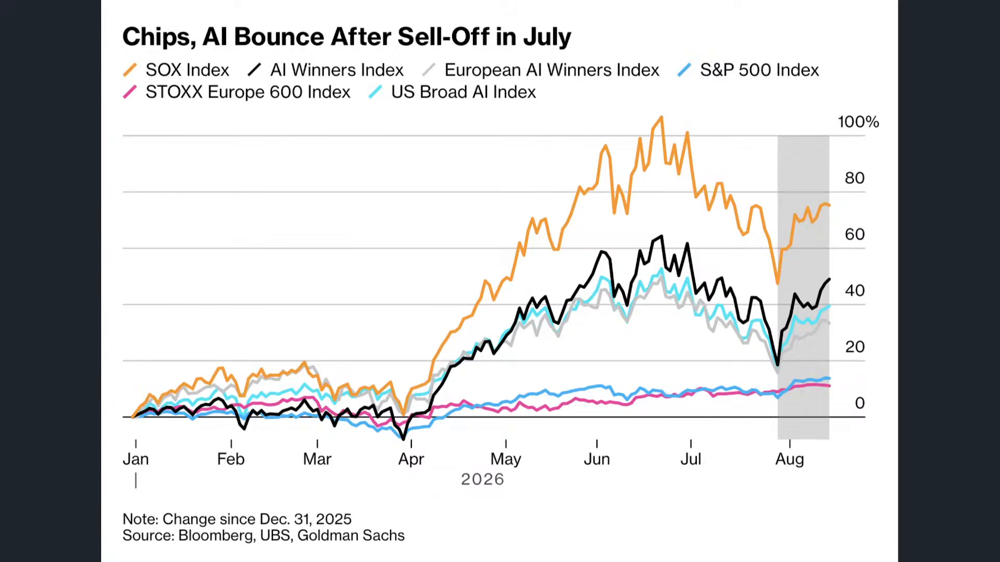

**逐字稿片段：** 以道瓊指數來看 昨天下跌272點 0.51% 收在53,459點 連續幾天開始回檔了 標普五百指數下跌40點 0.5% 收在7,745點 它就盤在這樣的一個區間 好像碰到了一種結界一樣 幾乎就是180度水準的 納斯達克指數下跌84點 0.3% 收在26,644點 一樣開始進入到盤整區間 費半反而昨天大漲203點 1.64% 收在12,621點 如果是從技術線性角度來看 反而費半的基期是偏低的 不過它還是今年漲最多的資產 現在有點類似那1940年希特勒 著名的暫停命令嘛 然後就是那個德軍裝甲部隊停止向 圍困的那個敦克爾克的英法聯軍進攻 突然就停了 然後股市就盤在這樣的一個水位 標普納指道瓊都是如此哦 所以未來能不能創造一個 敦克爾克大撤退的歷史奇跡呢 值得觀察 不過就感覺好像碰到了某種結界

**話題推測：** 開始逐一檢視美股主要指數，道瓊、標普、納指與費半表現。

---

## 00:03:25

**逐字稿片段：** 反而是記憶體股 開始陸續做反彈 我們看昨天記憶體族群 美光強漲了4.13% 威騰漲了5.3% Sandisk漲了8.8% 希捷2% SK海力士ADR有3.04% 陸續都已經突破了 過去幾周的下行循環 那現在大家很明顯了 有一點在等回檔的感覺 就是再長高也不太願意追了 每個人都在等股票市場 何時會有進一步的回檔

**話題推測：** 轉到記憶體股反彈，美光、威騰、SanDisk、希捷與SK海力士漲幅。

---

## 00:03:51

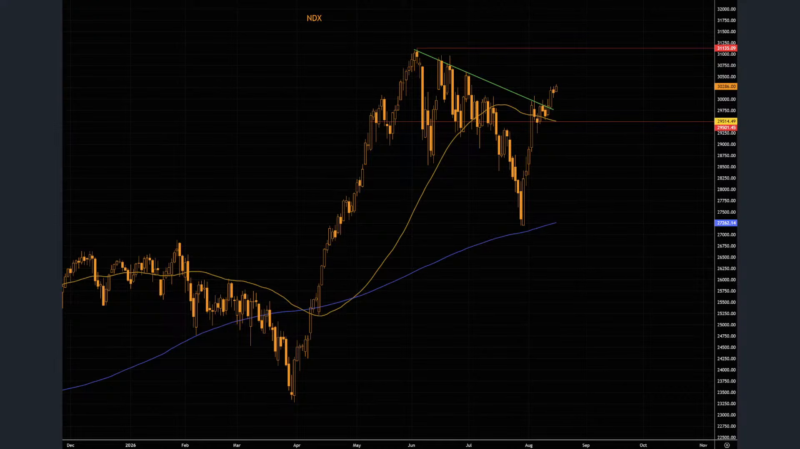

**逐字稿片段：** 因納斯達克100指數哦 這一輪其實下修相對 比較堅挺一點的 但它從低點也反彈了接近10% 重新站上50日均線 而且它距離歷史新高也不遠了 因為道瓊標普在上 禮拜都已經先創高了嘛 大家會觀察這一周納指 是否有機會能夠把追下行情 把行情給拉上去 不過呢市場上很明顯呢 保持在這樣的位階 一天兩天 來到5天 很明顯就有那種等下 一次回檔再買的意願呢 唉結果回檔就遲遲不來嘛 好所以納斯達克100指數 放在過去20年的週期來看 估值是偏高的 可是放在過去5年 它的基期由於股價並沒有產生暴漲 尤其在今年 所以它的本益比 就慢慢慢慢的往下蕩 那韓國股市 一周內也暴漲了13% 那這一次你說是單純軋空嗎 再往上漲 就不一定是軋空了 就是資金慢慢重新歸來了 這也是很有意思的一點 因為如果是從 韓國股市目前去杠杆 情形的話來做觀察 會發現其實去化杠杆還是蠻明顯的 但是在8月份呢 雖然去化杠杆資金 沒有說完全的加杠杆回來 可是整個8月份到目前為止 整個韓國股市的現貨型 買盤其實也是異常堅挺的

**話題推測：** 切入納斯達克100指數反彈、50日均線與估值位置。

---

## 00:05:07

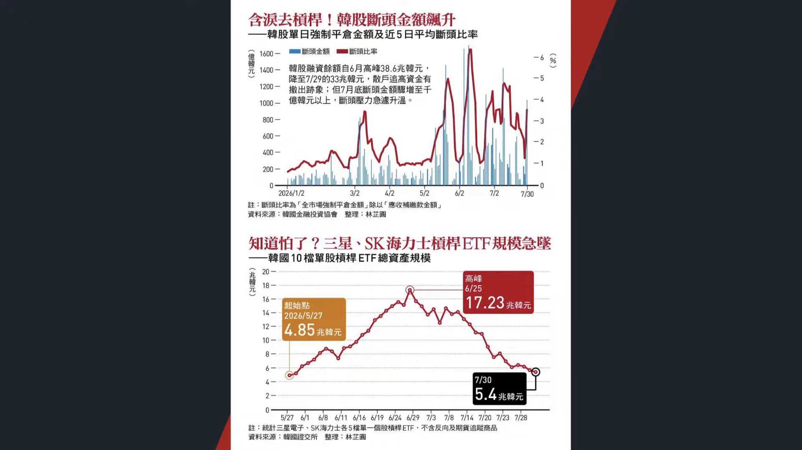

**逐字稿片段：** 你看當時的韓股融資餘額從6月份 的38.6兆韓元一路降到7月底的33兆 現在就算有回溫哦 大概也是34-35兆 說明散戶的追高資金早就已經撤離了 可是在韓國的現貨型買盤 尤其是針對整個KOSPI指數哦 整個8月份幾乎都在顯著的放大 總資產規模還在慢慢的拉升 所以他只能說 玩杠杆的人離開了 可是存股的人看起來從來沒有離開過 所以只能說本輪的杠杆ETF 規模進入到極衰以後 他等同於把整個7月 份視為一種去杠杆 但是市場上並沒有出現那種集體性 所有散戶同時出現的恐慌 所以大家還是要觀察 如果7月份不能夠把它 當成一個比較中期回檔的 普遍性恐慌 它只是一個上杠杆的這些投資人 被迫離場 那也許今年還是有機會來 做進一步的中期回檔的 這個也是當然 也是個人比較期待的 要不然每次回檔都越來越短 以前都想說你回檔3個月 那如果真的要縮短 那回檔一個月嘛誒 都回檔兩周的 很常這樣出現的 那你說只回檔兩周3周 那至少來個深v吧 結果每一次都是淺v 那我個人是比較偏好深v 誰討厭深v呢 但是你發現很多指數 它基本上都是屬於淺v 比如說像納指像道瓊 標普你其實也沒有太多空間了 除了少數晶片股之外 好所以這件事情也就說明著

**話題推測：** 進一步展示韓股融資餘額下滑與KOSPI現貨買盤擴大的資金結構。

---

## 00:06:36

**逐字稿片段：** 未來有沒有可能整個大盤 在遭受新一波的估值賣壓呢 實利率預期其實就 很重要的觀察重點了 因為科技巨頭這一次為了蓋資料中心 買GPU和電力設備來借錢了 已經開始跟美國政府 搶債券市場的資金了 美國政府要一直發債嘛 所以它一直在吸納債券 市場的投資未納量

**話題推測：** 轉向大盤估值賣壓與實質利率，討論科技巨頭借錢蓋資料中心。

---

## 00:06:56

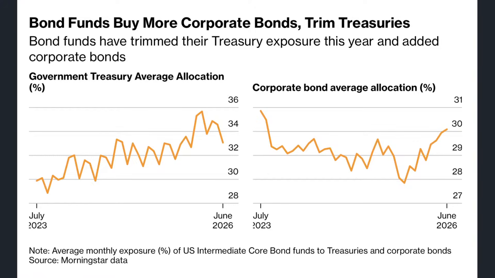

**逐字稿片段：** 結果美國投資等級在企業 今年已經發了1.5兆美元的公司債了 年增幅大增了三成六 光是大型科技公司就 借款借了2,000億 所以你說他把投資 等級債都不斷的發行 把資金全部給吸走 那美國政府的問題該怎麼解決呢 以前都是你們買我的債券 結果阿發貝現在30年 期公債殖利率大概是接近6.7% 比同期的美債高出了1.15個百分點 Meta的部分呢 哦最近已經 實際利率已經上升到7.5%了 我這越發越高 你要說今年年底有碰到8-9% 搞不好都會遇到 如果更長天期的話 那就意味著市場上投資等級債正在 瘋狂的跟美國國債來搶購資金呢 那會不會形成利率預期的反壓 這是值得觀察的重點呢 另外一方面呢 全球的套利模式 空間也受到日元這一波 直利率升息的影響而受到壓制 我們但按照日元呢 到底能不能持續走升呢 這個還是要取決於市場 上針對國債壓力的變化 可是至少可以看到哦 美日之間即便有所聯手 仍然無法阻擋10年 期公債殖利率的持續創高 昨天又創下歷史新高了 應該講本世紀歷史新高 30年期殖利率已經衝高到4.07了 不知道有沒有機會在未來幾年 我們看到 日本國債的利率比美國高呢 誒如果按照這種升息態勢 搞不好未來5年到10年就可以看到了 30年期它都已經衝高到4.07%了 這個時候投資日本國債居然 可以有這麼大的一個回饋報酬 值得觀察 10年期的部分大概是在3%左右 那這件事情就意味著接下來 的借錢壓力會來得越來越大 尤其又有anthropic的IPO 所以市場進入到搶錢大作戰了

**話題推測：** 提出美國投資等級企業債發行1.5兆美元與大型科技公司借款數字。

---

## 00:08:40

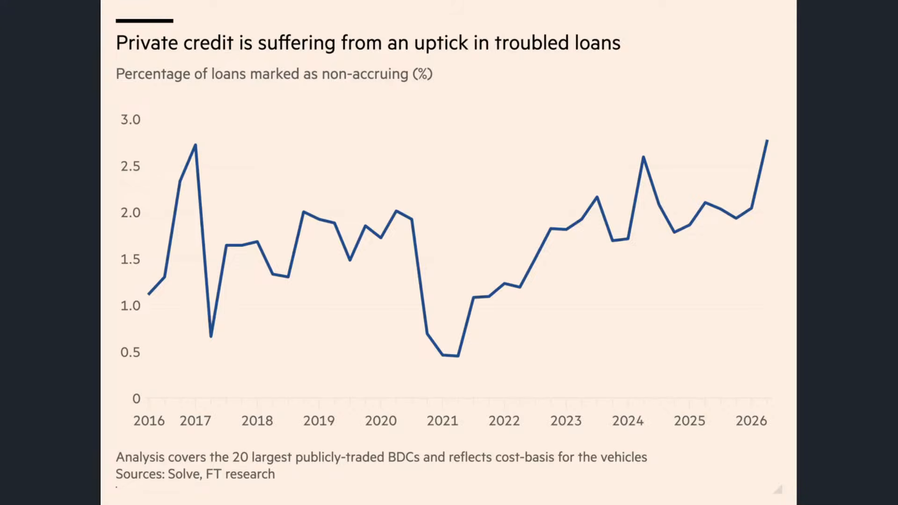

**逐字稿片段：** 事實上私人信貸現在 的壓力也蠻高的 我們根據美國20家上市 商業發展公司第二季叫停止 計息貸款占貸款成本中位數 已經上升到2.8%了 這個比例是什麼呢 就是停止計息貸款嘛就是 這個貸款代表借款人他 已經停止付你利息了 那就是說他準備要違約了嘛 好他有可能後來會還你了不過呢 至少他違約風險是偏高的 目前這個比例 大概已經上升了接近一倍 那私人信貸違約在7月份的 比例也創下歷史新高 所以這說明著有些人呢 當時因為兩年前三年前嘛 那個時候利率跟現在差很多 真的借了非常多的債 那現在利息升到這種水位哦 又是浮動利率哦那乾脆 倒一倒算了 微微不願意付你這麼高的利息了 所以從資金流向來看 我們今天就要從三個角度來看 一個是美國目前的資金流向 我們當然知道美國把龐大的 資本投入到AI和科技基金 那臺灣呢 又把這一些零組件 伺服器的投資變成出口和現金流 中國則是面臨供應鏈轉移 還有資本重新配置的壓力 所以就要看一下全球 的錢正在往哪裡走 而這是我們今天要觀察的重點 首先看的是美國 美國的部分 因為我們知道現在是財報季尾聲嘛 我們就等輝達公佈財報 差不多就有一個圓滿了 那之前我們看到Meta 微軟阿發貝亞馬遜蘋果接連公佈財報 其實營收和獲利都是比 市場預期還要來得高的 但當時市場出現了比較明顯的分化 主要原因就來自於 市場針對現金流預估的 變化以及當下情緒的演變 什麼意思呢 就是公佈財報的時候 剛剛好在去杠杆 所以呢通常是以負面解讀 不過呢回過頭來說 它似乎在自由現金流層面呢 仍然沒有那種很明顯的直觀聯繫 說你只要自由現金流是翻正的 股價就可以一直漲 翻負的就得一直跌 它還是取決於市場給予 你的護城河預期表現 那現在大家的觀察重點就來自於 重點是整個市場上 有沒有意識到這項風險 如果有的話 那其實沒有想像中來的大壓力 但如果市場上都沒有意識到 這個債券市場不斷的膨脹所形成 資金流的吸取壓力的話 那麼當然就會有所緊張 那現在好處是什麼呢 就是到處都是風險 這可能也是目前美股 不願意追高的主因

**話題推測：** 切入私人信貸壓力與停止計息貸款比例上升。

---

## 00:11:00

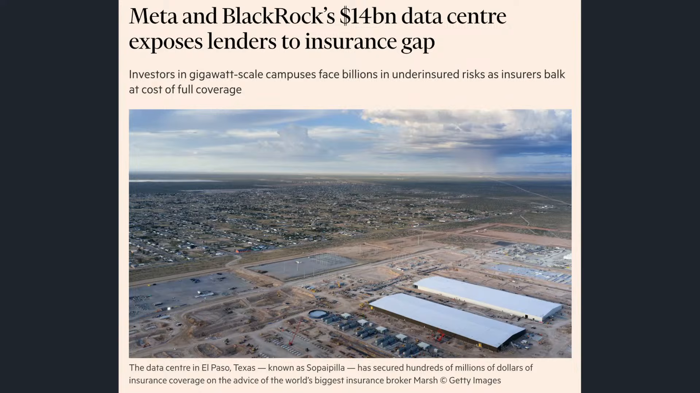

**逐字稿片段：** 我們看Meta這一次跟貝萊德在德州 埃爾帕索新建的新一輪治療中心 總投資已經高達140億 但最大問題是什麼 最大問題是 沒有保險公司想要幫你保了 哈就是這座AI資料中心呢 現在保險市場 不願意提供完整保證 它裡面有很多細節理賠嘛 金融時報的報導是最高 理賠只願意投給你4.2億哎 我投資是140億耶 你最高理賠金額是4億 那有保跟沒保一樣嗎 恐怖攻擊最多給你6億 一般責任險最多只有5,000萬美元 所以面對一個140億美元的專案 主要財產的保險額度只有4.5億 這說明著市場上很明顯 對於這項計畫 承保人的意願呢 其實相對比較謹慎一點 那第二個角度來自於 我們過去所提到 市場上市場上會更進一步關注這 一種CDS或者債券利差的顯著升高 你必須要付出更多的風險溢酬 所以才會導致過去 一段時間CDS價格的持續反震呢那當然 我們後續要做進一步觀察 那就是這一輪到底最後能不能如我們 所預期的自由現金流能夠順勢翻正 解決本人的困境呢 那你之所以會擔心 就是覺得他口袋沒錢了 而且會一直沒錢 所以債券市場壓力越來越大 債券市場把資金都吸走以後 股市就漲不動了 這是大概邏輯 可是我們真實所看到的概況上 他這樣子的利空消息 頂多也不過是中期回檔的理由 仍然不是泡沫破滅的藉口

**話題推測：** 切到Meta與貝萊德德州AI資料中心投資及保險不足問題。

---

## 00:12:31

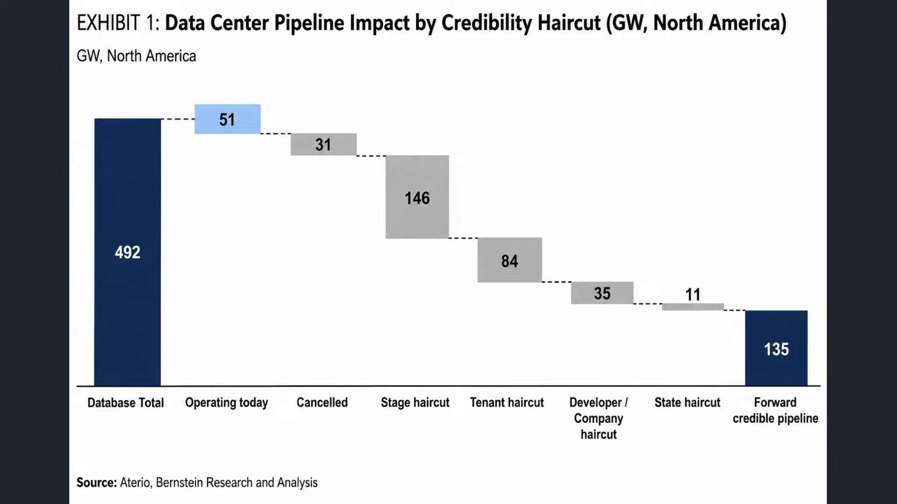

**逐字稿片段：** 泡沫破滅一定要供給過剩而現在 根據高盛的預估 美國AI資料中心 最後有可能在2029年之前 第一波的資料中心新建呢 大概是只有70%到80%能夠 正式的新建完成了 那這是一個恰到好處的一個 新建量為什麼 全部完成 然後發現根本沒有那麼多的算力需求 那就算力過剩嘛 這在當當有風險 到底過兩年三年我們的 需求到底有沒有這麼多 這是一個觀察重點 或或者到時候在物理 世界發現無法推進 那也是一個技術風險呢 可是另外一方面如果呢 你一定確保在2029年幾乎完全蓋不夠 而且電力設施按照目前 的預估完全跟不上的話 那就是會有部分的資料中心新建完成 然後會有部分的自由現金流開始翻正 但是呢有部分的還沒有蓋完 所以就變成了他沒有 立即泡沫破滅的風險 因為他不會算力過剩 可是他也蓋了不少的資料中心 最後呢這些資料中心一運營 當他蓋完的那一刻 錢就可以開始回收了

**話題推測：** 轉向AI資料中心是否泡沫化，以及高盛預估2029年前建置完成比例。

---

## 00:13:32

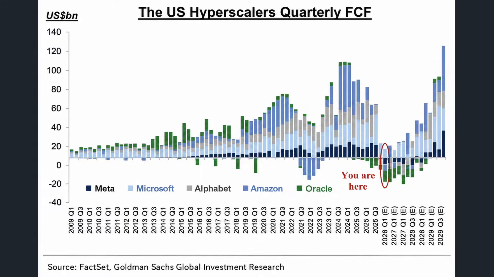

**逐字稿片段：** 所以我認為我還是比較樂觀的預估 在明年年底到後年年初 超大型雲端自由的現金流就會翻正 到時候財報就變成高強度獲利成長 並且 高自由現金流 這個是我比較大膽的一個預估了 我相信這些巨頭 他總有辦法把錢給收回來 只要蓋完 他現在就是因為沒蓋完 所以蓋不到嘛 現在就是一個提前佈局的重要性的 投資也是如此 真正有價值的佈局都不是等 到時候錢投出去都已經收回來了 然後大家才意識到哦 那是多投 那我可以買股票 那都得多晚了

**話題推測：** 提出明年底到後年初超大型雲端自由現金流可能翻正的預測。

---

## 00:14:06

**逐字稿片段：** 晶片越多 你就需要越多的資料中心 資料中心越多 需要更多的電 電不夠就需要天然氣核能了 當所有人都意識到這件事情 開始在旁邊配置一個發電站 這個時候 你才可以了解說提前佈局的重要性 你說一定要等到他們蓋完錢拿到 你才決定 哦我相信AI行情 我要買股票了 我相信到時候點位 你大概也買不下去 所以提前佈局 我認為還是打贏本場大戰的重要關鍵 也是沒有任何一家巨頭願意放棄在 這個時間點增加資本支出的根本原因 有些人 都清楚知道 提前佈局才是影響到 接下來打勝這場大戰的關鍵 你像Kobe Kobe 他永遠都是淩晨3點在洛杉磯練球 村上春樹大家知道 永遠都是淩晨3點提前起床寫稿 庫克永遠都是淩晨3點起來先運動 馬斯克經常淩晨3點提前 起床在工廠處理產線問題 只有你淩晨3點起來吃牛肉麵 還不自己煮 所以真正拉開距離的 往往並不是比別人更會追 你只要比別人更早準備 這些巨頭 大家都會 有時候會嘲諷 他投那麼多錢 收的回來嗎 他之所以現在自有現金流翻負 就是因為他還沒蓋完 他一旦蓋成 我相信錢進來的速度會 比想像中還要來得快哦 這些方向哦 你要知道資料中心的缺電 記憶體的漲價 有時候你落後一拍 你發現你就已經錯失過行情了 你等機體漲價 你才來研究記憶體 等合約價漲價 你才開始研究股票 等資料中心告訴你缺電 你才開始研究中電股 那不是永遠都慢一拍嗎 本來就是有這樣的一個提前作為 這給投資朋友做的一些觀察和思維了 當然了我們回過頭說 市場上現在就會有 不同的一個操作邏輯 像是美銀的哈奈特 他過去的確有提醒過今年 可能在中旬左右會有一個 比較大的中期回檔風險 那針對下半年呢 他一樣 跟我看法差不多 屬於中期回檔的再次展現 原因很簡單

**話題推測：** 由晶片、資料中心、電力與天然氣核能串起AI基建供應鏈投資邏輯。

---

## 00:16:09

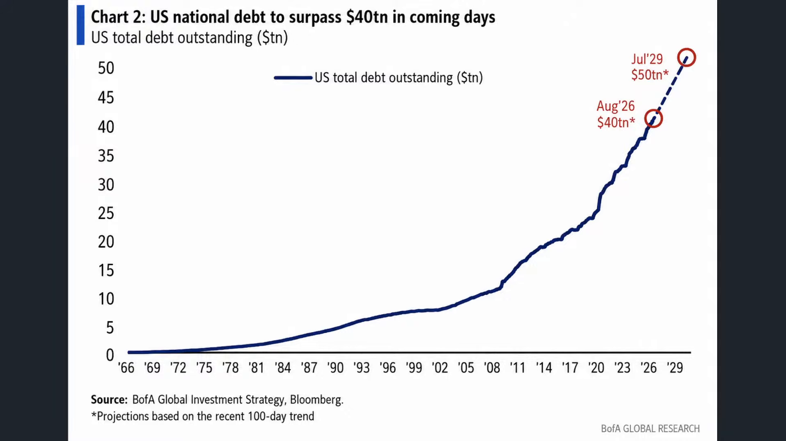

**逐字稿片段：** 第一是美國國債現在 已經突破40兆美元 在未來的速度可能在29年會突破50兆 這麼快的利息支出的上升呢 會導致長天期 國債殖利率上行速度加快 最近美國30年 期公債殖利率也飆售到5.126%了 哦這也是本世紀以來的新高 所以AI投資熱潮 也讓這項問題持續的雪上加霜 企業債的供給年增幅高達61% 剛才提到 光是這幾家巨頭 他融資規模今年已經2,600億了 把錢全部給搶光了 所以他認為 始終會形成股價的估值回檔 可是重點是估值回檔哦 不是泡沫破滅哦

**話題推測：** 展示美國國債突破40兆美元、30年債殖利率與企業債供給擴張。

---

## 00:16:47

**逐字稿片段：** 所以他現在把投資濃縮成四個縮寫 一個叫ABB anything but bond 避開債券就好 就你什麼都可以投 看好電力 看好什麼 唉不 先避開債券為什麼 因為市場上的借貸量還是很高 你不確定它會市場承壓多久 這個叫做ABC anywhere but China 你什麼都可以投 但你要避開中國 他的看法其實也有他後面的道理 他認為 很明顯 你可能買到中國市場 即便他最後能夠勝出 他的利潤率不一定表現特別好 從過去好在太陽能在 面板的經驗是如此 他有可能成為贏家哦 但他通常成為贏家的那一刻 他的利潤都不是特別的好看 那第三叫做Abd 叫anything but dollar 就什麼都可以 你要避開美元的 因為這個是川普政策 在過去一貫的立場 基本上是保持的相對弱勢美元 最後呢叫做AI all in AI 全押AI 所以它的方向其實 還是有所明顯態勢哦 避開債券 避開中國 避開美元 全押AI大概是現在的邏輯啦 當然投資做久就會發現哦 真正拉開距離的並 不是誰知道的最多訊息誰知 預測的最准呢 是誰能夠把一套正確的方法練成習慣 新手 有時候看到機會就很急的出手哦 行情一動就想追 而風險出現你又急著跑 那經驗越多 你反而要知道 稍微先觀察先判斷 先確認自己承受的風險是多少 然後等到指標到了 你覺得差不多了 就決定採取行動 成熟的投資 不是每一次都 可以幫助你買在最低 賣在最高了 讓你知道什麼時候該踩油門 什麼時候該踩刹車 其實就可以了 我們常講說怎麼看出一個人 開車的那個水準的高低嘛 第一是什麼 就是能夠快速的找到車鑰匙孔 就老司機哦 他可以在黑暗當中 直接就把鑰匙插進去嘛 那新司機你那摸半天你還找不到孔 那第二就是觀察 新司機通常 新車嘛都迫不及待的就想要上車 然後立馬就啟動 然後想要開車 老司機都會先環繞一周 觀察一下車 感受一下質感 才讓車跑起來更加絲滑 最後就是後續的保養嘛清洗嘛 尤其是車的那個大燈 還有車屁股 因為有時候會有蚊子 灰塵粘到 所以時常清洗很重要 我講的是投資 所以投資很重要的一點呢 就是你要能夠了解說 你原本所設計的初衷 原本所設定的原則 你最後能不能套用在每一次的 不管是乖離修正 中期回檔 你先有了立場以後 你再來做你的投資 而並不是根據每天的訊息來做改變的 好這給大家做的一些 警示了好 那我們會往往下看 看一下臺北股市的變化 台股剛才我們講到 現金流的來源呢 其實來自於晶片股的獲利營收 這一波台股的創高 它不是單純資金行情 跟美國這種由資金需求鏈所 帶動的信貸擴增又不太一樣 美國人是在瘋狂的借錢來蓋一個 還沒有確切營收大幅回饋的資料中心 臺灣是一直賣資料 中心裡頭的GPU和伺服器 所以呢錢真的進來了

**話題推測：** 切到Hartnett四個投資縮寫：避開債券、中國、美元並全押AI。

---

## 00:19:55

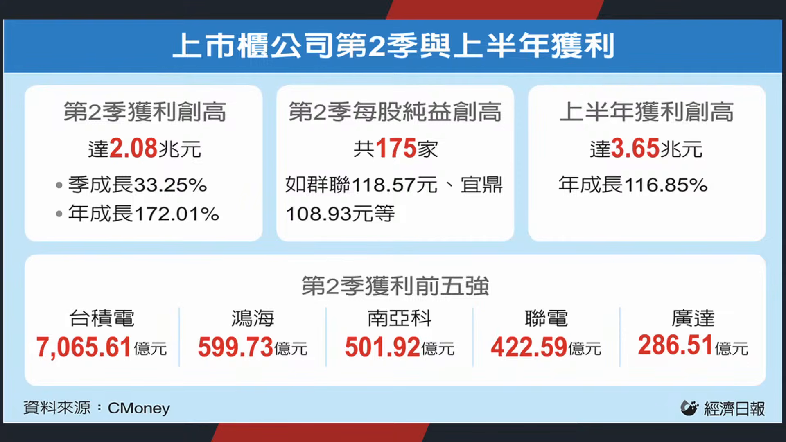

**逐字稿片段：** 整個26年第二季上市櫃公司 稅後純益已經突破了兩兆元 來到2.08兆 季增幅是33% 年增幅高達172% 累計上半年 3.65兆這麼龐大的一個資金規模 從哪裡來的 主要都是從美國來的 美國現在在AI伺服器相關的 貿易利差已經高達4,000億美元了 這是兩年前的三倍 臺灣人現在真的在暴賺美國人的錢 那現在好處是什麼呢

**話題推測：** 提出台灣上市櫃公司第二季獲利突破2兆元與上半年獲利數字。

---

## 00:20:23

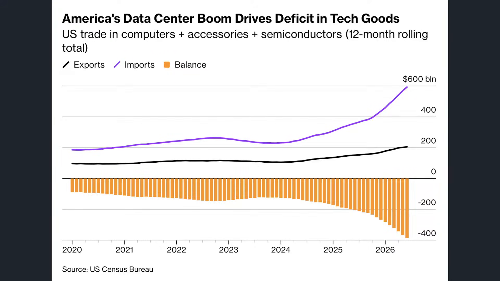

**逐字稿片段：** 好處是臺灣的傳產也開始陸續復甦了 我們舉例來說 你像台塑四寶 全年獲利 這次法人預估可以來到 2,380億到2,400億左右 以前我們知道四寶的確 受到市場承壓很長一段時間 今年一方面呢 是傳產景氣的復甦 另外一方面是 美伊戰事 稍微把油價給拉起來了 另外一方面 好這些巨巨頭 這些四寶 在AI電子材料成長也 開始有明顯的爆發 好這也是為什麼 今年是有機會可以 挑戰EPS的歷史高峰 好這是值得觀察重點當然了 股價的波動這個 每天行情當然會有炒作的疑慮 可是至少可以看到它的本業在哪裡哦

**話題推測：** 焦點轉到台塑四寶與傳產景氣復甦、AI電子材料成長。

---

## 00:21:04

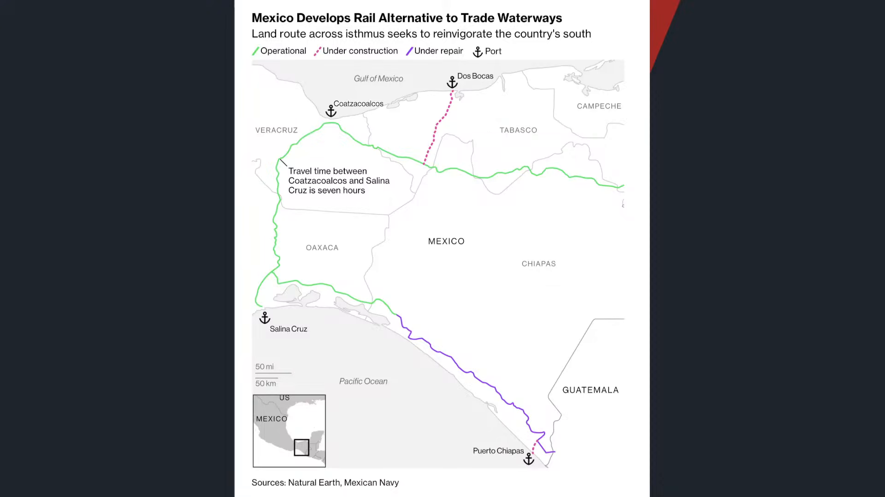

**逐字稿片段：** 航運股也是哦 航運股最近運價連三漲嘛 外資又回補 長榮目標價陸續做調升 原因也很簡單嘛 那但是馬士基在全球航運呢 開始帶頭衝 另外一方面呢 背後還是有一些供給的稀缺原因 一個是墨西哥 最近想要打造路上的巴拿馬運河 為什麼 因為巴拿馬運河現在受到乾旱影響 部分船隻 本來要等3天的 現在等3周才過得了 整個航班大亂 另外一個就是歐洲 歐洲現在因為屬於乾旱期了 又很熱 西歐6月七月本來就是最熱的時期 那現在呢 由於氣候問題的原因 萊茵河關鍵水位 已經跌到有史記錄以來的最低 好之前那個多瑙河也是多瑙河 水低到連那個德軍以前的艦艇 二戰的艦艇 還有一些甚至不管是羅馬帝國 一些古的遺 古老的遺跡都露出來了 就水這麼低 百年一見 就發現市場上 針對傳統的運量 都產生進一步的稀缺 所以導致運價的顯著攀升 有利於航運股 資金的一個拉抬 所以不管怎麼說 你看到傳產似乎也開始動起來了 那最後所造成的結果就是 台股內部的超額儲蓄 快速暴增 23年臺灣的超額儲蓄 就出口減進口 也不過3兆 25年是5.6 今年已經8.4兆了 明年搞不好就突破11兆了 2020年五年前 我們的人均GDP也 GDP也不過2.8萬塊 今年我們已經突破4萬了 等到明年年底 搞不好就5萬了 按照目前總基數的預估 看起來明年年底到後年年初 臺灣人均GDP莫名其妙5年 內就真的要完全翻倍了 來到5萬 那等同於人均GDP是150萬台幣 那一樣 我們講的是 不一定是你的薪資150萬呢 可是你老闆平均一個員工 他可以貢獻150萬的產值 好所以為什麼現在這麼缺工 因為人實在是太昂貴了 人的產值非常非常的高 這個現象

**話題推測：** 切入航運股，討論運價連三漲、外資回補與長榮目標價調升。

---

## 00:23:05

**逐字稿片段：** 你看超額儲蓄和超額儲蓄率 它是同步創高 不是大家把錢都拿去炒股了是 錢太多被迫要挪一點資金到股票市場 因為超額儲蓄率也在瘋狂的上升 從15.8%5年前到現在預估是28-29% 它不是 把錢拿去炒股而已 是定存太多了 只好解一點定存做一些股市配置 哎這才是根本原因呢 它並不是存量轉移 是整個增量市場 那句話怎麼講的 我知道你們還有錢 這是一個真實現象 如果你身在臺灣哦 你發現你每天接觸的 是出口突破兆元 超額儲蓄的這種數據 國民儲蓄率超過20兆元 你看到這些數據 你會發現很現實的結構 就是錢真的一直在進來 而且多到 實體國內的投資都未必吸收的完 現在最大問題是什麼 兩年三年以後 臺灣政府最大的問題 絕對不是沒有錢的問題 兩年後是11兆的超額儲蓄要去哪裡 要去海外投資嗎 要流到股市嗎 要流到房市再漲一輪房價嗎 還是轉化成新的產業投資 臺灣有這麼多東西可以投資嗎 臺灣土地那麼小 這麼龐大的一個資金量 你錢要去哪裡呢 這是政府未來的挑戰 那你說未來有沒有錢 那根本就不是政府挑戰 你已經知道他多有錢了 好所以這個就是我們看到 你身邊的一個吸收的資訊 會影響到你對於臺灣的宏觀視角 我們以前常講嘛 說你的財富 通常是你身邊5個朋友的平均值嘛 你每天就接觸這些資訊呢你 喂給大腦什麼 大腦最後就會用 這套世界來替你做決定的 這麼多年 我們都是看這些數據 來幫助我們做決定的 你說體感溫度有沒有落差 老闆怎麼可能給我薪資150萬 當然是如此 體感溫度每個人不一樣 我們當然知道貧富差距的問題 可是你要 客觀公允的看待臺灣經濟哦 這些數據 我相信他也不是這個月才公佈 他每個月都公佈 陸續公佈以後 你大概就可以瞭解真實的環境了 你的財富就是你最常接觸的 5個Youtube頻道的平均值 5個朋友的平均值 真正要講的其實不是朋友多少錢 是環境會影響你 什麼叫做正常的 投資觀念 如果你身邊討論的 這是買什麼 去哪裡玩 如何分期 那你當然會把收入拿去做提前 提高消費嘛 那你身邊的人都是談投資 現金流創業 宏觀資金 哎那你發現了 生活的一部分呢 你就有方式可以把自己 的投資績效拉得更高 所以你長時間花在什麼樣的資訊呢 最後就會形成那個環境當中的平均值 負面的也是一樣 如果你一群同事每天都在抱怨公司 久了你還沒離職 心態搞不好已經先離職了 那一群人如果 天天都在刷卡分期貸款買名牌 那你就覺得哦 這是現代人的正常生活 月光是很正常的 月光不是很正常 現在超額出去這麼多 大家手上都是一堆錢 月光是不正常的 對不對你一群男人 禮拜一清晨 到機場飛去越南 那能幹什麼正經事 所以環境會影響你 難道吃個河粉聊聊天嗎 不可能嘛所以 你身邊的人呢 他最後就會影響到你未來的投資環境 生活環境 這是很重要的 所以吸收對的財經資訊是很重要的 那結論是什麼 結論就是上半年的稅收 目前看起來已經暴增80%了 今年上半年全臺灣稅收 已經來到2兆5,876億 這是歷史新高 那尤其成長速度最快的 那肯定是鄭交稅 成長了188% 好這很神奇 像一兆以下都叫量縮 那當然在這樣的一個效果底下 等同於中央稅客收入預算案 整體稅收數 今年一定是創高的 那某種程度就說明著一定超徵 超徵比較 非正規用詞 叫做收入達成率超過100% 目前是中央和地方 已經全數達標 光是半年的一個增長 幾乎都不用預測下半年有多少了 只要下半年跟去年一模一樣 基本上臺灣的稅收今年一定超過100% 甚至中央政府已經衝高到136%了

**話題推測：** 展示超額儲蓄率同步創高，說明資金過多推動股市配置。

---

## 00:27:06

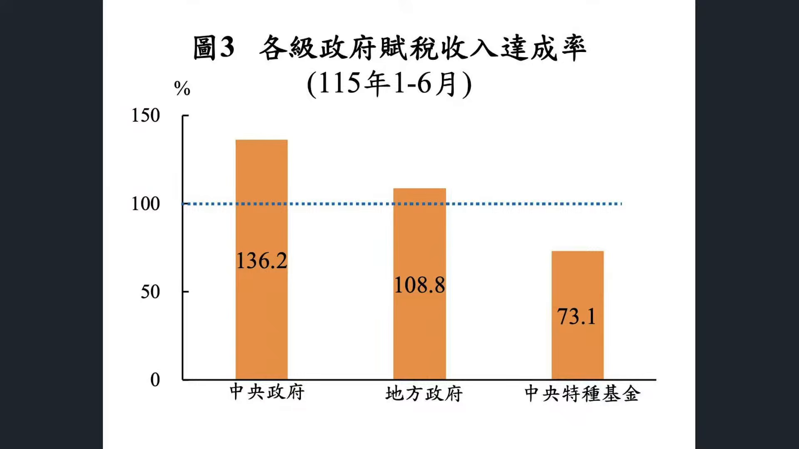

**逐字稿片段：** 這也是為什麼昨天賴總統 正式宣佈 又普發了 這次是增列2,357億 好在維持收支平衡不變的情況底下 基本上一定是維持的了 因為現在已經超徵了嘛 27年每人會普發現金1萬塊哦 那這一次政府是把 普發現金定調成AI紅利 全民共用 說很大一部分的成長都來自於AI 那現在回饋給稅收和 經濟紅利的重新分配 這也說明著 有時候全民普發 我們要開始把它視為一個新常態政策 每年就是會多出這麼個1萬塊2萬塊 發到你的口袋當中 那另外一方面 當然也就意味著內部的 補貼速度會來得越來越快

**話題推測：** 切入總統宣布普發現金與AI紅利全民共享。

---

## 00:27:46

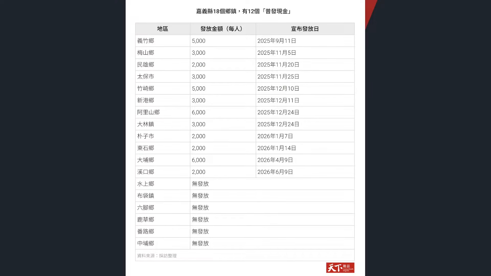

**逐字稿片段：** 其實地方政府現在補貼也很凶 全臺灣已經有超過30個鄉鎮市在 今年進入到普發現金的行列 占所有基層公所超過一成 有些地方一次發5,0006,000甚至更多 表面上6都以外的198個鄉鎮呢 目前沒有法定債務 但也不代表財政真的很健全 所以中央是真的有錢 但是地方發這麼多錢 你要知道鄉鎮自籌財源比例已經 從最近3年30%下降到27%了 所以一方面你越來越 依賴中央縣市的補助 一方面你又跟 又拿現金 然後跟選民來做發放 就大家現在已經普發 現金變成一種新常態了 我舉個比較標準的像嘉義 嘉義18個鄉鎮市哦 一年內已經有12個普發現金了 金額有發2,000的 也有發到6,000的 人口最多的是民雄 相關一次發 2,000元 就花掉了1.3億哦 那其他有像那個之前有丹娜絲颱風嘛 以災後疏困為理由 那也有說 誒你發我也得發這種福利競爭 所以到處都在發 你看嘉義縣政府 現在已經負債35.8億了 到處都在發 所以你可以觀察到一個實質現象 就這一種經濟的高強度發展 有時候政府也是 也不知道該怎麼做 能夠消減這種 貧富差距的短期內快速擴大 那現在最直接的 與其搞什麼補貼 搞什麼運營政策 先趕快讓你最勇敢 你先趕快拿到錢 錢趕快拿走 所以這也是我們看到 臺灣稅收的一個大變化

**話題推測：** 轉到地方政府普發現金潮與鄉鎮財政壓力。

---

## 00:29:13

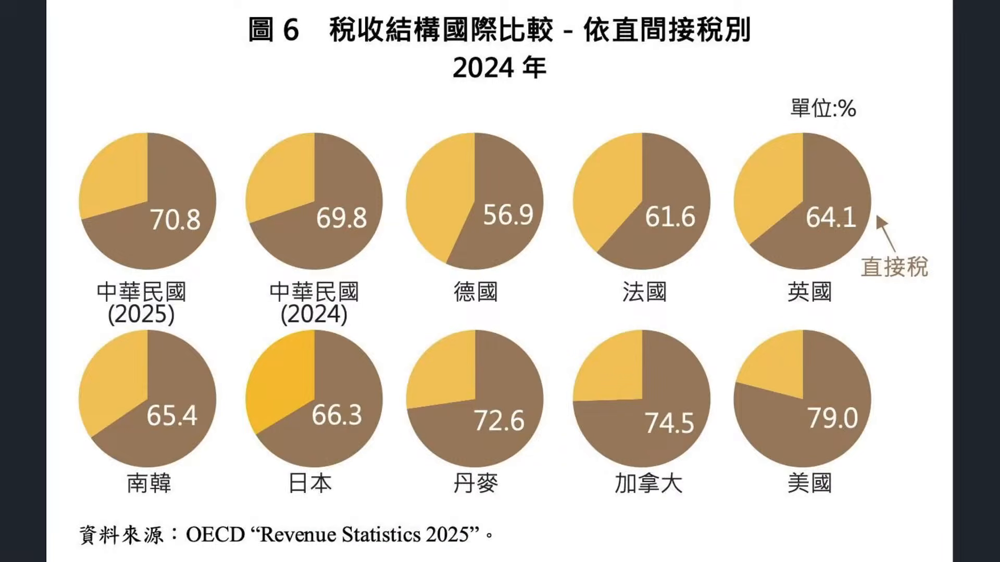

**逐字稿片段：** 事實上臺灣的稅收結構 一直以來都有比較鮮明的特點 然後就是比較高度偏向直接稅 2025年直接稅比重是70.8 不只是首次突破7成 也明顯比日本韓國英國 法國主要經濟體來得高 那從租稅理論來看 直接稅無法轉嫁 政府可以直接針對 所得稅和利潤來課稅 有利於調節收入的分配 所以達成租稅公平了 但同時納稅人的感受會比較直接 痛苦感比較高 那現在就借由 另外一部分普發現金的方式 降低這種痛苦感呢 那當然了 很多人對於直接稅或者 間接稅的看法本來就不太一樣 各自有偏好 那有些人問我說 那我偏好直接稅還是間接稅 我比較偏好直接睡 因為我都比較直接嘛 我連牛肉麵都不用煮 不是 那所以我們觀察到的實質現象就是 現在整個臺灣的經濟的一個爆發 資金流的一個流入 它背後的那個資金流原理 跟我們看到美國借由信貸 擴增所造成的資產膨脹 其實又不是同一個邏輯 好那因為時間因素 我們今天就稍微不聊中國的資金流 但明天繼續聊

**話題推測：** 新話題說明台灣稅收結構高度偏向直接稅。

---

## 00:30:17

**逐字稿片段：** 可是今天要觀察的重點是什麼呢 就是如果我們把美國 臺灣中國 放在同一份的資金流上面來看 現在最值得注意的 不是說今天哪個市場漲 哪個資金跌哦 而是說全球資本 正在重新選擇它願意長期停留的方向 美國的優勢就是它一直吸資金 讓你相信它能夠造夢所以 最後這些錢變成了實體的治療中心 臺灣呢則是靠資料中心當中 的零組件私服器 換取了龐大的外匯收入 那現在問題就是臺灣錢很多遊資亂 氾濫可是美國缺錢呢 快要沒錢蓋資料中心的 antropic比還要IPO 那最後所形成的邏輯會是什麼呢 我想很明顯的 那就是臺灣人對於美國 市場的投資只會加大 不只是初級市場產業投資 次級市場一定會有越來 越多的臺灣人意識到臺灣 沒有太多可以投資的環境了 本益比也稍越越越來越高了 最後只能讓臺灣人 就像當年的日本人一樣 我們一起去 進攻紐約 唉這是最後的一個結論呢 這給投資朋友做些思考了 好台股小漲四四點 收在45,905點 今天稍微開了一點玩笑 每天都開呀 這年頭大家開玩笑 還是要掌握一下尺度 最好還是不要針對個人了 如果要還是要弄公允或者社會事件呢 比如說你對身邊的親人同事老闆 哦那其實現在因為環境不一樣了 還是儘量不要開了

**話題推測：** 總結資金流視角，將美國、台灣、中國放在同一框架比較。

---
