# yutinghaofinance_oLPxNHRAPEI — 關鍵畫面索引

- 來源逐字稿：[yutinghaofinance_oLPxNHRAPEI_FIN.srt](yutinghaofinance_oLPxNHRAPEI_FIN.srt)
- 影片：https://www.youtube.com/watch?v=oLPxNHRAPEI
- 截圖數：26

## 00:00:35

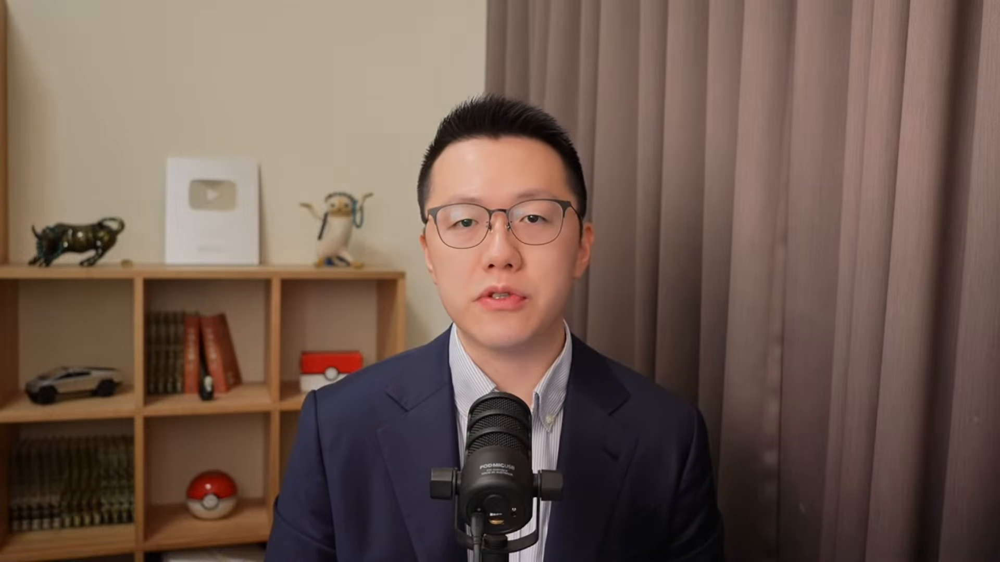

**逐字稿片段：** 昨天7月份的PPI生產者物價指數 算持平 稍微緩解了美聯儲9月份升息的擔憂 現在大概已經延到12月份左右了 不過好在昨天美國股市標普五百指數 也算是首度突破了7,800點 創下歷史新高價了 那到底是由於PPI的數據原因 算是符合預期持平 所以導致股市的創高 還是說行情就在不斷的反彈過程當中 逐步的拉高 那最後會不會讓已經估值削減已久 的晶片股有重新歸來的可能性呢 今天來跟投資朋友做細一步的觀察 同時還瞭解 目前似乎市場的焦點擔憂 都主要集中在債券市場 而並不是股票市場了 因為第二季財報其表現還是很強勁 標普百有90%的企業公佈企業財報 其中64%的公司獲利至少高出預期 像一個標準差 所以這一次其實表現算非常不錯 尤其現在有 已經是財報的高峰期過後了 大部分財報都開出來了 這也帶動了2027年的獲利預期 已經上修兩%了 那最大的問題就是 其實本輪市場上 由於剛好面對7月份的股價下修 那代表從均值來看就是 從整個7月份統計以來 大多數的企業公佈它的財報之後 並沒有那種大力獎勵的好消息哦 而市場上 財報大幅超預期的公司 隔天對於標普百平均只有漲零點 點三三個百分點 遠遠低於10年以來每年 0.95個百分點的水準 科技股反而落後0.99個百分點 好那9月份連准會現在變成 就算9月份升息好像也不會怎麼樣 不升好像也不會怎麼樣 就利率預期的變化也 沒有來得這麼嚴重 市場上很明顯知道 就是AI多頭行情還沒有結束 是閉眼買都漲的階段正在過去 那這是第一種論調 好不管是財報的好或壞 或者聯準會利率預期的變化 短期內似乎不太有顯著的影響 因為就算PPI算是持平 可是長債殖利率也 沒有因此而下彎的 那AI交易當然也出現分化 從7月份當時 7月下旬開始下跌的時候像是 光通訊資料中心計一體電力雲端算力 幾乎都是一起被賣 可是這一波反彈也不是大家一起漲 你像光通訊資料中心或者 新型的雲端業者表現比較強 那記憶體AI電力也有反彈了 但是還是相對落後一點呢 所以從這件事情都看得出來 市場上在本輪的反彈格局 來得更加謹慎

**話題推測：** 開場切入7月PPI數據與美聯儲升息預期的總覽圖。

---

## 00:03:07

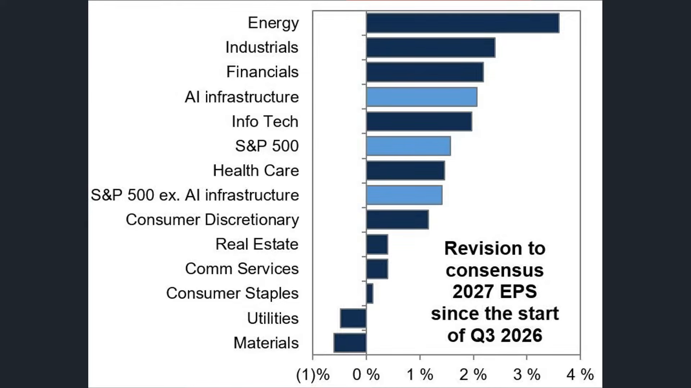

**逐字稿片段：** 包括美國半導體的杠杆型ETF 從當時6月底的高點1,570億美元 現在大概在990億美元 8月份有沒有反彈有 但大部分是股價上漲帶來的帳面增值 整體ETF的申購金額 並沒有想像中還要來的多 整個道瓊指數在昨天上漲69點 0.13% 收在53,839點 標普上漲50點 0.65%收在7,798點 算是創下歷史新高了 納斯達克指數上漲214點 0.81% 收在26,803點 誒持續創下本輪波段新高 距離歷史高點現在就 不到2%的距離了 倍半上漲56點 0.46% 收在12,456點 誒稍微碰到季線了 看一下是不是假突破 那如果成功的讓季線跟 月線在未來一個月度 能夠重新的黃金交叉 那對於美國股市的多頭 提振效果會來得更加顯著

**話題推測：** 切到美國半導體槓桿型ETF資金規模變化圖。

---

## 00:04:05

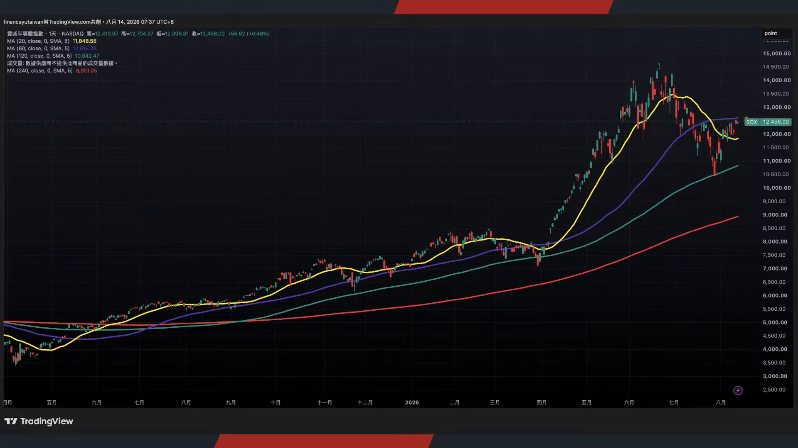

**逐字稿片段：** 事實上我們看到這一波 Sandisk在昨天大漲了13.7% 主要是昨天在整體 2030財年的預估過程當中 美年會預估與15-19%的財測預估成長 調整之後的毛利率是80% 好所以即便我們知道GE提股 這一波行情有杠杆炒作的成分 按基本面是真的很不錯 毛利率80% 哦那得多高 那當然了 這也說明著 AI賣鏟子的供應鏈 它其實 更多是杠杆的堆砌而成 所造成的股價回檔 它並不是基本面的顯著鬆動 那科技業針對科技巨頭這些 高資本支出的擔憂 反而真的壓力比較大 雖然其實最後這些七 巨頭股價也陸續漲回來了 但是從年初到現在為止

**話題推測：** 切換到Sandisk大漲與2030財年財測、毛利率預估。

---

## 00:04:52

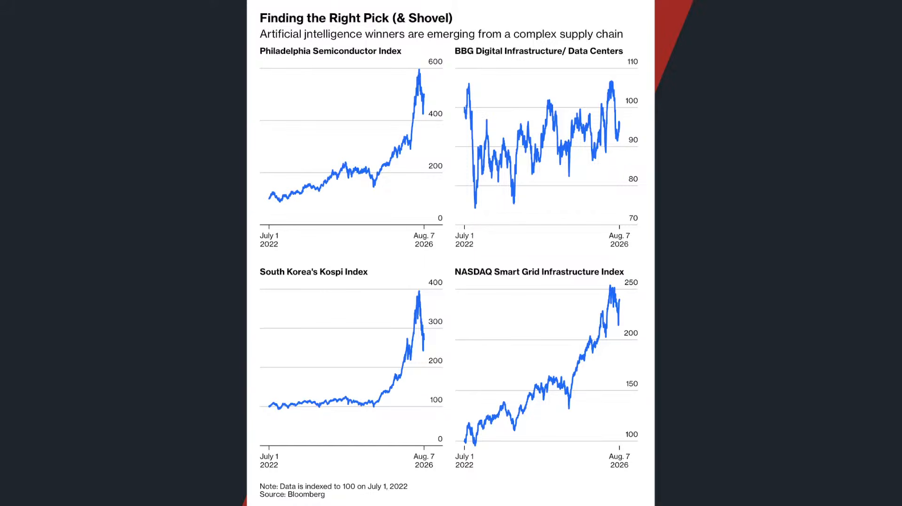

**逐字稿片段：** 當然漲最多的還是費半嘛 其實從整個22年 7月份來看 就我們把當時的股價的回檔的低點呢 一路到現在的高強度牛市 來到2026年的8月份了 費城半導體指數 是漲了大概有5.5倍 南韓Kospei指數漲了3.8倍 那智慧電網基礎建設大概是2.4倍 純資料中心指數大概 是90%到100%左右 這說明呢 AI的投資是從GPU向外擴到 記憶體晶片設施電力 那大家漲幅各不一 可是賣鏟子的企業還是有十足的獲利 韓國股市這10天 你不要看說它距離 高點還有一段距離哦 相對於台股的確落差很大 可是韓國股市這10天已經漲了22%了 高強度牛市 從低點上來又算是 進入到技術型牛市了 8月13號當天又大漲了3.6% 三星和SK海力士都成為主要的推手哦 所以記憶體的供需仍然十分緊繃

**話題推測：** 轉到費半、韓國KOSPI、智慧電網與資料中心指數自2022年低點以來漲幅比較。

---

## 00:05:51

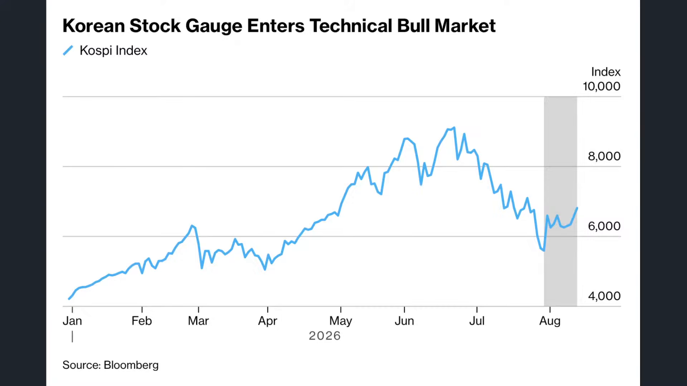

**逐字稿片段：** 中國市場也是如此 中國資本市場也出現了 比較象徵性的權力交替 因為長鑫存儲上市之後 市值是5,240億美元 哇它已經超越騰訊的5,100億美元了 莫名其妙 長鑫存儲居然變成 中國市值最高的公司了 這很神奇 這以前都是阿里騰訊 或者BAT我們看到這些網路科技巨頭 壟斷呢誒 結果現在長鑫存儲竟然 變成首屈一指的企業 好所以這個超車最值得關注的 就是市場的偏好正在改變嘛 騰訊它也有微信 也有AI 有a遊戲 而且有龐大的網路資產就我我 騰訊今年股價已經跌26%了 好所以你從這件事情都看得出來 市場的週期輪替 正在往賣鏟子的方向來做集中

**話題推測：** 轉到中國市場權力交替，長鑫存儲市值超越騰訊。

---

## 00:06:39

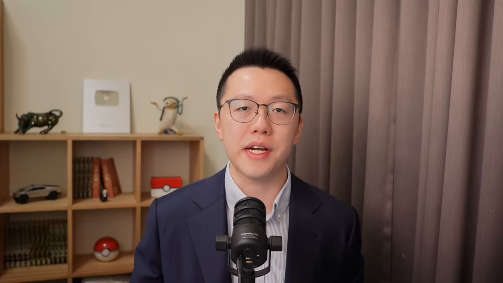

**逐字稿片段：** 那台股就比較另類了 台股沒有科技巨頭嘛 台股科技巨頭就是做硬體的 就是賣產值的所以 就變成臺灣整個AI伺服器代工廠在7月 份的營收年增幅是高達64% 今年累計已經暴增了74% 以台積電為首 受惠於本輪的AI資料中心的擴建 還有輝達新一代的平臺持續放量之後 現在根據SEMI analysis的先前預估 臺灣的伺服器代工和生產數據 顯著放量以後 保持雙位數的成長 可能至少到2029年 哦這種 高強度的拉升哦 你看你把它拿來跟23年22年哦 當時其實也算是半導體爆發 因為是疫情之後的3C電子需求潮嘛 結果呢 現在大概又比23年24年呢 高了兩倍到3倍左右的量級哦

**話題推測：** 切換到台股AI伺服器代工營收年增與台積電受惠資料中心擴建。

---

## 00:07:29

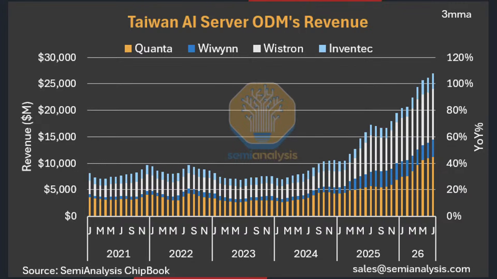

**逐字稿片段：** 好那就在這個市場高位盤旋之際哦 我們知道antropic最近事出新論調 真的準備要上市了 目標估值是兩兆美元 在10月份就會上市 如果呢估值是兩兆 唉那他就會超過Spacex 等於今年我們會陸續看到超越Spacex 史上規模最大的公開募股 本來想說6月份 5月份已經是第一次 史上最大了 結果10月份還有一次 當然Anthropic在今年5月份公佈 年化的營收已經突破470億 市場預估可能到年底 就會衝高到1,000-1,200億 相對於年初會成長超過10倍 那當然兩兆美元的估值 如果現在市場論調已定的話那說明 其實大家錢還蠻多的呢 還可以以極高的成長來支付極高價格 Anthropic現在面臨中國人工模型 人工智慧模型的追趕 然後美國又監管政府 他跟川普關係其實也不是很好 跟政府 關係之間的緊張 而且企業客戶現在 很明顯對於AI的支出壓力哦 有比較高的評價 但不妨礙它有如此高的高估值哦

**話題推測：** 進入Anthropic可能上市與兩兆美元估值的新話題。

---

## 00:08:37

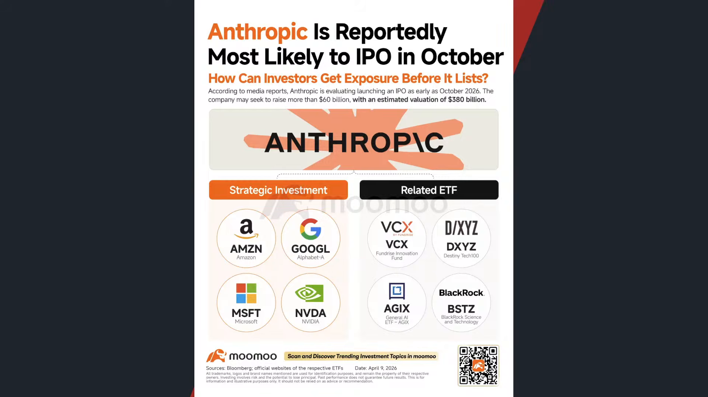

**逐字稿片段：** 當然了基本面爆發 為什麼大家如此關注Anthropic 第一個就是它的收入真的成長很快 它的經營效率看起來 是比Openai好非常多 很多企業端願意採用 年化收入現在超過300億 年底可能直接到1,000億 那個速度有多快 第二個就是計算的護城河 恩佐比現在主要合作的交易夥伴呢 主要是博通和Google 那這三家公司已經擴大了戰略合作 確保在2027年會獲得 3.5千兆瓦的計算能力 那第三個就是它的 深度的技術優勢就是 之前我們看到Anthropic不是 有很多超級人工智慧模型嗎 它公開之前還被美國政府先按住了 先不要公開 就讓他意識到 他有非常多的計畫 雖然跟川普之間有所嫌隙 可是美國軍方跟他的合作 恐怕只會持續性的加強 那也說明著 新一代的 這個不管是Spacex哦 還是Anthropic或者明年的Openai 是陸續的上市潮 它會讓華爾街 開始有大量還沒有拿到錢的富豪 紙上富貴快速拉升 你看Openai的部分呢 它在24年25年就已經發了 110億美元的員工股票報酬 員工只有8,000人哦 如果是一家上市公司員工 股票報酬甚至可以排行到全美第七 Spacex也示範了這種財富效果 因為有很多人是持有Spacex的股票嘛 就內部員工 所以人工智慧的工程師哦 現在就是暴富了 好就是大家都清楚知道 好在未來一段時間呢 這一群工程師到底要 繼續留在公司體系 還是就直接成為億萬富翁 就兩個選擇嘛 那就會形成股市可能 進一步的買盤或者賣壓 那當然Spacex已經證明了 大多數工程師都願意 持續留在這套體系當中 也有可能嫌股價不夠貴了 因為前一個月更高嘛 等到股價高了再賣掉也是一種選擇了 但至少可以看得出來 現在整個AI巨頭的隱形帳單 包括工程師的帳單 包括資本支出 未來的採購金額仍然在飆高 目前最為受惠的當然

**話題推測：** 切到Anthropic高估值支撐因素，包括收入成長、計算護城河與技術優勢。

---

## 00:10:40

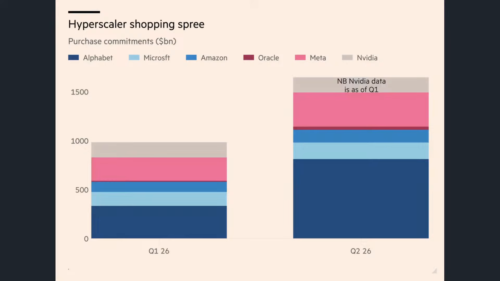

**逐字稿片段：** 還是賣鏟子的這些企業 一季合計 目前大型雲端公司的採購 金額已經來到9,820億美元了 如今現在 應該講說第一季原本 預估是今年全年是900 9,800億 現在可能今年年底要標高到1.5-1.6兆 而且不知道第四季 還會不會快速的調高 那這就形成一股壓力 就是你要借的錢這麼多可是 現在就業數據的軟化 還有CPI PPI的降溫 似乎沒有讓大家的利率預期 你的融資成本下滑太多

**話題推測：** 切換到大型雲端公司AI採購金額與全年資本支出上修。

---

## 00:11:14

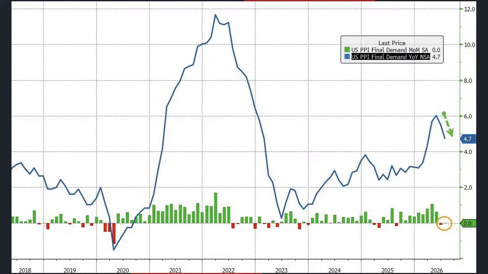

**逐字稿片段：** 我們舉例來說 唉昨天PPI公佈出來 最大的亮點是月增幅 0 居然是0 居然沒有成長 居然7月份的生產者成本 相對於6月份還沒成長 哦這真的很意外哦 年增幅也從5.5% 下滑到4.7% 然後這算是比市場預期低非常多哦 那當然呢 最直觀的意義就是 那聯準會短期內肯定 沒有急著要升息理由 至少9月份不太可能升息了 先延到12月份再說了 甚至我們比較大膽嘛 我們相信今年可能完全不會升息 但是從這件事情就說明著 照理來講哦 那應該利率預期要下滑 可是我們看到最近 美國政府最大的麻煩呢 那就是 最新一場250億美元30年起的美債標售 在昨天得標利率 居然是5.22% 這個是本世紀以來的新高 好更遠高於川普第二任 任期開始的4.9% 這個市場的 不管是實質利率 還是公債利率 投資等級債的發行利率 全部都在衝高 都是25年來的新高 這麼高強度的利率預期 跟現在那種升息預期打消的 思想好像有一點互相違背 那不是沒通膨了嗎 壓力沒這麼大了 那為什麼利率這麼貴呢 好所以其實還是看得出來 債券市場是比股票市場 更早聞到風險了 一方面當然是融資需求太高 你搞不好未來自由 現金流就會完全花光了 你要發這麼多債 那我要買債券我就 省著點買 債券價格的賣壓導致了 債券實際利率的走高 我們看AI的軍備競賽 如果是單純從現金流來看 2024年那個時候單季高峰還有1,200億 這些雲端巨頭然後到 120億 應該講1,200億 然後到1,000億 然後到800億 然後到600億 然後到現在大概是300億左右 因為Meta第二季 自由現金流已經翻負了嘛 然後Google自由現金流也跟著翻負 現在就靠幾隻企業稍微勉強撐著 大概還撐的是微軟 微軟大概還有200億的現金 然後Amazon已經是-100億了 甲骨文已經負很久了 然後Google Meta都是翻負哦 所以微軟稍微一鬆動哦 那大概整個7巨頭 手上就真的完全沒錢了好 這就會形成比較大的一個市場壓力 那當然了

**話題推測：** 重新聚焦PPI細項，月增幅為0與年增幅降至4.7%。

---

## 00:13:29

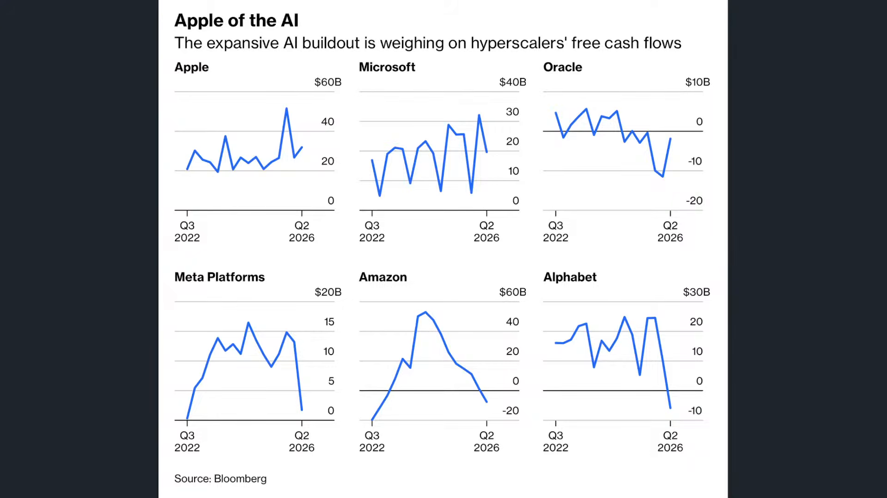

**逐字稿片段：** 輝達在本周當時 採取了一定性的做法 把GPU變成金融資產 來向華爾街私募機構來做融資 也替這些交易 因為輝達本身它其實是做擔保 不是它要借錢 英偉達自己又不蓋資料中心 英偉達是賣GPU讓你蓋資料中心的 以英偉達來掛保證來讓他 的客戶可以用到這筆錢 來借錢去蓋資料中心 那你記得買我英偉達的貨就好了 所以這一次的5,000億的融資計畫本 本身就是輝達為自己的企業 為自己的客戶來做保證 那這會使得信貸擴張比 想像中還要來得更大 我們過去提過

**話題推測：** 轉到輝達以GPU金融資產化支持客戶融資的5000億計畫。

---

## 00:14:06

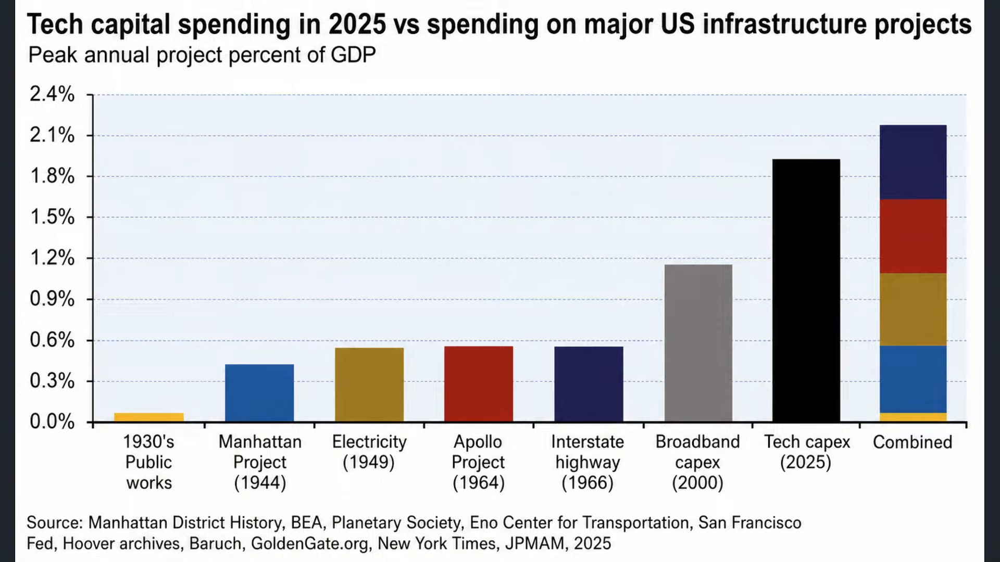

**逐字稿片段：** 現在在AI資料中心的資本投入 占整體GDP 相對而言至少已經來到1.9-2.1%了 相對於過往幾次 比如說曼哈頓計畫 阿波羅計畫就那個 上月球的 然後洲際公路系統 大概都0.4-0.6 兩千年的寬頻光纖 建設也不過是1.2% 好所以現在的確是一個史上最大 的國家級的基礎建設工程 那當然市場上會有進一步的擔憂 第一個就是算力的金融化 它會不會從概念 變成真正的債務市場 23年美國以GPU或者以AI 晶片作為支撐債務規模 大概只有數十億美元 到25年就150了 你看一下圖表 26年直接莫名其妙飆升到700億 就是以前GPU 這很難想像 你拿iphone可以去 當鋪典當嗎 好像可以哦 哦那你拿一台電腦 你拿一個隨身碟去記 去那個當鋪典當 這在過去是很難想像 可以當到多少錢呢 但越當越多 企業把GPU拿去做抵押 拿算力拿去做抵押 再把資料中心也拿去做抵押 這當然跟當年房貸 金融化的概念有點相似 但成長金額是有一點快 這是有點壓力的 其實金融化沒什麼問題了 但速度是有點快的哦那當然

**話題推測：** 切換到AI資料中心資本投入占GDP比重與歷史大型基建比較。

---

## 00:15:28

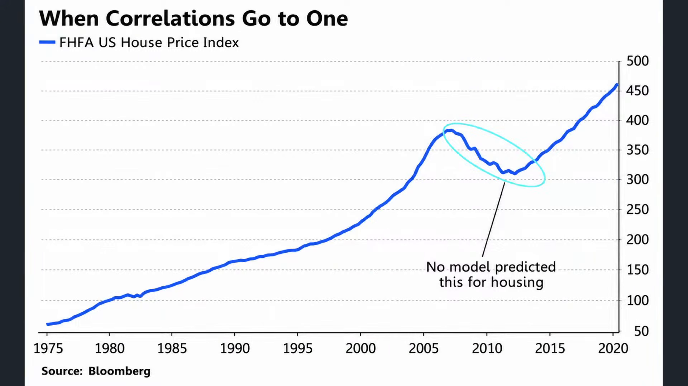

**逐字稿片段：** 金融危機哦 最危險的時刻 往往都不是模型算錯 而是模型假設的世界突然不存在了 08年以前 美國房價長期向上嘛 那市場也相信那城市 尤其是蛋黃區 房價不可能同時大跌 那大量的房貸被打包之後 看起來是分散 可以降低風險的 結果06年房價下跌了 所以原本彼此相關性不高的資產 突然危機就變得集中 所以這的確是有點 有一股風險 不過當時也是花了接近有 4年到5年的時間所累積起的一個泡沫 那我們就要細看哦 本輪的融資計畫到底你會 用什麼樣的一個角度來看 它金融化某種程度可以幫助你 航海大發現 你有了資本才能夠去探索這個世界 做更多的資本支出 資料中心的研發 但相反的 AI金融化也就代表著風險正在提升 也許市場會有一個臨界點 我相信在28年到29年 第一批的資料中心蓋完以後 能不能快速的把自由現金流給拉回來 是一個大家值得觀察的重點 如果資料 你要想看 資料中心沒蓋完 錢怎麼收回來 他至少要先蓋完再說嘛 蓋完那一刻 他就可以開始收訂閱費了 他就有更多的算力可以做出租了嘛

**話題推測：** 用2008金融危機房貸金融化作為風險類比的新圖表或歷史案例。

---

## 00:16:40

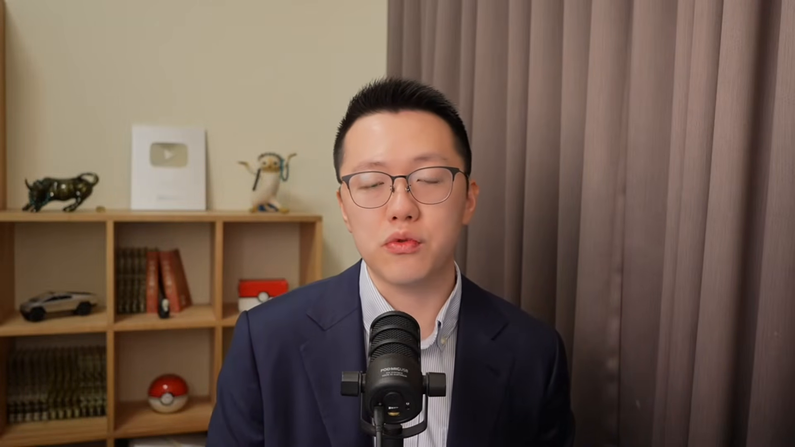

**逐字稿片段：** 不過呢剛才聊到 正由於市場擔心這件事情呢 所以債券市場是現在真正的壓力所在 票市場反而不是 我們看CDS的交易量 最近還在沖高哦 價格雖然並沒有持續噴發了 可是大量的人正在進行交易

**話題推測：** 轉到債券市場壓力與CDS交易量升高。

---

## 00:16:55

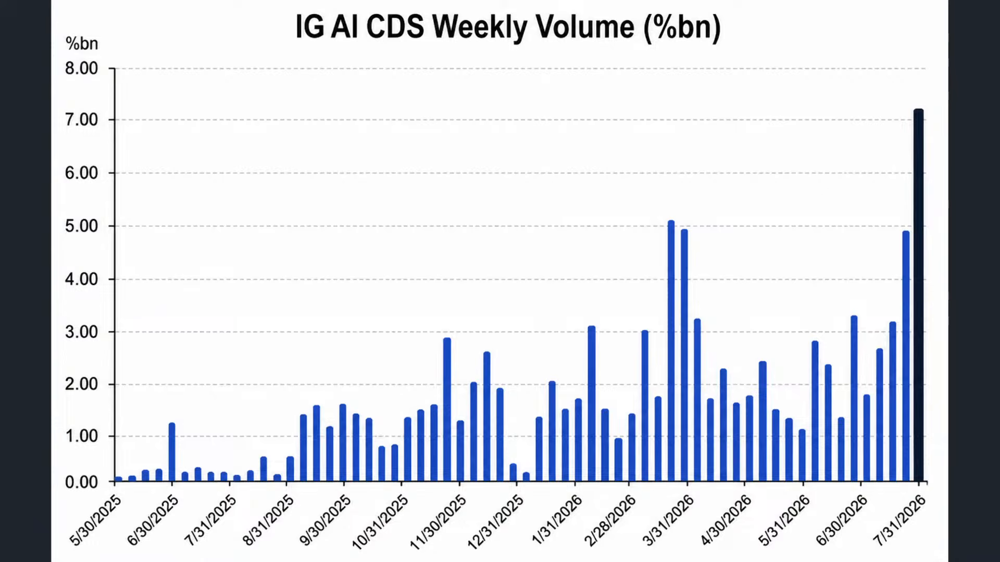

**逐字稿片段：** 我們看CDS的實體交易量 像輝達AMD博通 最近一個月哦 大概已經增加接近有10倍了 那主要就是因為市場上 一直在討論賣方的融資 客戶擔保 融資循環等等問題 他也不一定是看空哦 他有可能就是哇 他要發那麼多債哦 那是不是有點風險呢 那股價反正在漲嘛 那我就做一些避險 股價漲越多 CDS就買得越多 那重點是不是對賭股價的崩盤 是擔心債券市場有沒有可能讓我虧損 很多人手上也有很多投資等級債嘛 這可能是目前所採取的做法 因為雖然整個AI市場並沒有 爆發真正的信用危機 甲骨文這麼慘 它也沒有爆發問題 但問題是

**話題推測：** 切換到輝達、AMD、博通CDS實體交易量近月增加約10倍。

---

## 00:17:35

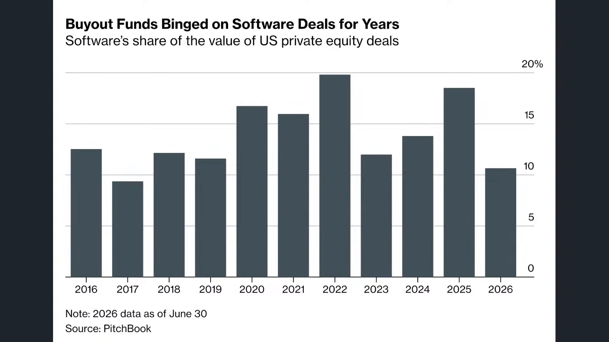

**逐字稿片段：** 前陣子大家比較擔心的軟體股 其實目前已經有開始產生壓力了 舉例來說 我們今年一二月份呢 當時股價在做比較顯著修正的時候 軟體股有一股那種 服務末日的感覺嘛 就是因為以前軟體股 都是低利率嘛 私募股權基金特別喜歡買軟體公司 那訂閱收入很穩定 成本又很低 毛利又很高 加上很適合大量的去杠杆 私人信貸就借大量的錢給這些公司 哎結果呢 今年股價有很多都跌4成跌5成 壓力很大 而且他們還是有可能被AI代理 第一波取代的軟體公司 所以這就形成進一步的壓力 我們看到在整個軟體業當中 私募股權的虧損呢 是來得最為嚴重的 因為他們是主要的資金的提供者

**話題推測：** 進入軟體股受到AI代理與私募信貸壓力的新段落。

---

## 00:18:21

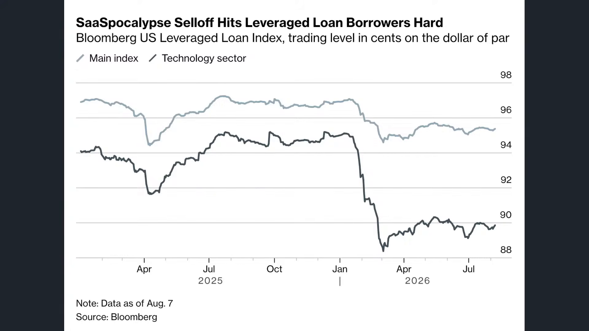

**逐字稿片段：** 那如果細看 你像是過去所看到的SARS末日 它的股價跌四成五成的還不是最嚴重 最嚴重是信用市場 26年美國科技業的杠杆貸款 價格從95美分暴跌到88美分 目前大概是90上下 相比之下整體杠杆貸款 指數大概在95美分左右 這說明債券投資人是很擔心的 以前那個軟體業的護城河和現金流 那我們又幫助你加大杠杆你的PE 你的本益比又非常高 那股價跌只是股東受傷 你貸款價格也跟著跌 那就是代表有人懷疑你 到底還不還得出債券 變成信用問題 所以私募股權呢 這一股的投資反而壓力是很大的 你看你想想看 幾年前了 我們講5年前 疫情以前好了 我們都一直覺得軟體業才是 世界上最迷人的投資生意嘛 為什麼它不用像台積電 不用像三星一樣 每隔幾年就要砸幾百億蓋廠買設備 一群工程師在車庫裡頭 然後打打電腦 然後發揮你的創意 一家百億美元的公司就這樣子創新了 產品做錯了 快速的改版 做對了又能夠有幾乎以0 邊際成本來賣遍全世界 毛利又高 訂閱收入又很穩定 工程是一個好的點子 他可能就一夜翻身了 這個就是科技業最浪漫的夢想 而結果AI出現以後 以前軟體業最大的 優勢就寫程式很便宜 現在最大的威脅是寫程式太便宜了 讓AI的開發能力複製能力 直接有取代你的可能性 你本益比又特別高 私募現在又偏好借錢給你們這些人 本身有龐大的債務 最後市場的壓力就因此而出現 那股價跌4成5成 到現在為止 今年成可能最慘的 不是投資科技巨頭的 不是投資記憶體的 不是投資純晶圓代工的 很有可能軟體股到目前為止 還是市場壓力來的最大的 之前在網路上看到嘛 那剛開始炒股票的時候 把它看作是一場投資 後來意識到 感覺是 感覺是一場投機 再後來又覺得 感覺有點像是賭博 隨著時間推移 才懷疑這是詐騙 然後到現在股價腰斬了 才發現根本就是搶劫 後來遇到前輩前輩說 我的覺悟和格局不夠高 其實我們是在捐款 好所以你要知道 這個軟體業的一個市況 它可以作為前瞻的一個預期 來看待目前輝達的5,000 億的融資計畫 好這個就是後續所影響的規模 也是市場給予的壓力 當然呢這也就說明著

**話題推測：** 切到美國科技業槓桿貸款價格自95美分跌至88美分的信用市場圖。

---

## 00:20:51

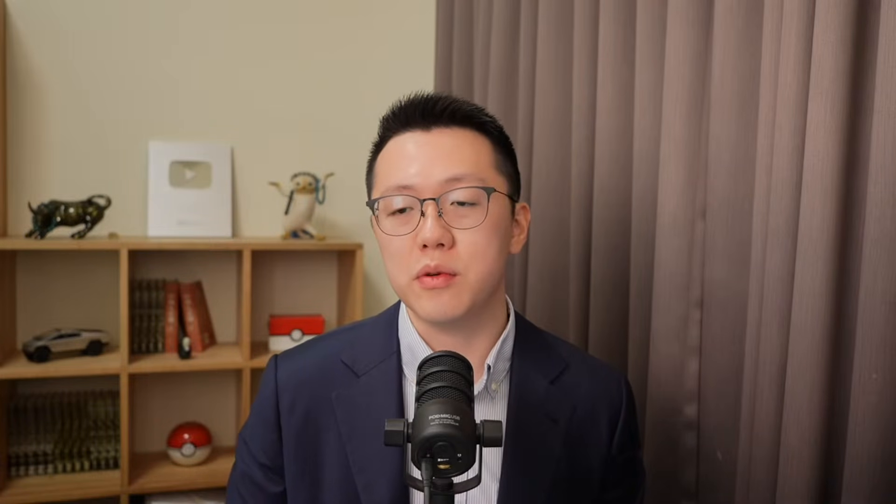

**逐字稿片段：** 整個AI遊戲 它的確某種程度 撐起了龐大的經濟體系 但AI一破滅 它對於經濟的傷害肯定是大的 現在超大規模科技公司的資本 支出占GDP的比值正在快速的膨脹 19年是0.3% 24年到0.825年到1.4 今年大概已經標高到2.4了 到28年就會來到3.2%了 所以光是一個資本 支出就超過GDP3%了 美國經濟對於AI的投資依賴 程度也會來的越來越高 我們過去提過 如果你把AI拿掉以後 美國的經濟成長 現在大概還有1.8嘛 你拿掉就連1%都不到了 這就是市場上真正的壓力 所以本來就是正面和反面的 都會有各自的看法 大家可以有自己的 原則和中心來看待 你說AI需求大爆發 算力供不應求 科技巨頭瘋狂的蓋資料中心 這是一種正能量 這是一種正面的一個評價 但反問嘛 那那麼多公司在舉債 在私募信貸在SPV 而且資金大到這種規模 感覺好像又變成一種負面評價 但兩件事情有時候可以同時成立 AI可能真的是一個 20年來最重要的科技革命 但市場也有可能在革命初期投太多錢 加了太多杠杆 把太遠的未來提前算進現在的股價 所以真正成熟的觀點呢 不是說AI融資你就認為泡沫要破 也不是相信AI的前景 所以AI所有價格都是合理的 好你要有 了解說科技的發展跟股價 估值的高低來做好你的鋪線 這是最好的一個做法嘛 那昨天才看 一部電視劇嘛 老師 今天電視上又播報抓到多少 貪污腐敗的官員 老師說很好很好 你是一個心中有正能量的孩子 那老師 那為什麼這個社會有 這麼多貪污腐敗的官員呢 唉你這個問題就很負能量 所以 現在AI行情就是這樣子 你問AI會不會改變世界 大家都覺得你正能量嘛 科技樂觀論者 那你多問一個 那這些錢誰出呢 這些錢如果還不出來 會造成什麼樣的後果呢 哦你很負能量 太負面了 好這本來就是看好AI產業 不代表無條件看好AI投資 大家還是要有所區別 當然呢我們就必須從實體產業來看 有沒有一步一步在改變這個世界 我們看之前Openai就曾經提過嘛 AI發展的五個階段呢 描繪人工智慧從工具走向 自主系統的演進路徑 第一個階段是單純 自然對話的聊天機器人 第二個就是有人類水準的推論者 第三個階段呢 是能夠自主規劃執行 任務和外部環節的AI agent 現在大概在第三個階段呢 再往上走就是AI具備顯著的創新能力 它可以提出新的技術新的解決方案 第五個就是管理複雜業務 協調多個AI和人類共同工作的AI組織 AI跟AI自己互相工作 然後創造伊甸園 有這樣的一個感覺 那當然了

**話題推測：** 轉到AI資本支出占GDP比值快速膨脹與經濟依賴度。

---

## 00:23:49

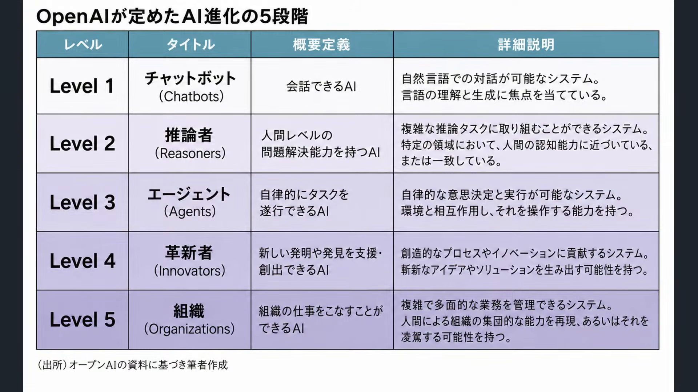

**逐字稿片段：** 為了要達到這樣的一個需求 現在最缺的就變成數據了 因為網路上能夠找到數據 他都已經拿走了嘛 現在呢我們看到印度勞工哦 有數百萬名員工哦 不能講數百萬 預估要數百萬 現在大概有數十萬名員工哦 在頭上都會帶一台 手機或者帶一台設備 為什麼呢 因為美國的公司 希望可以借由 因為機器人遲早要進入工廠嘛 到底人是怎麼動手做事的 好所以呢 印度現在有數萬名的員工 把手機攝影機就綁在自己的頭上 不管是做分類塑膠啦 縫鞋子啦焊接啦包裝啦 各種角度 印度變成全球最重要的 實體人工智慧的數據庫了 因為很多工作還是要靠人完成嘛 那這個時候呢 用 付你一些錢 頭上戴一個攝影機 儘量把你能夠做的 手工技巧全部給學走 所以這些員工壓力也很大 但不重要 重點是如何獲取更多的 物理世界的AI數據是很重要的

**話題推測：** 轉到AI缺乏實體世界數據與印度勞工頭戴攝影機蒐集資料。

---

## 00:24:47

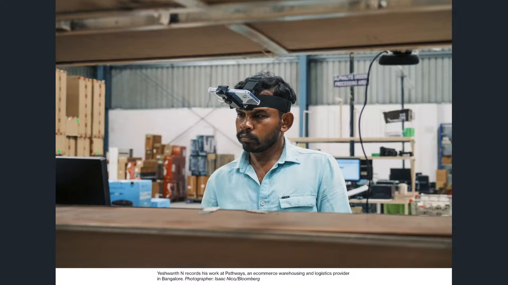

**逐字稿片段：** AI到底有沒有賺到錢呢 賣鏟子的當然有賺到 但是其實賺錢的規模正在往外擴散 我昨天才看到AI到底能不能賺到錢呢 AI其實可以賺到錢的 好最近公佈五六月份的特別獎嘛 1,000萬的特別獎 其中一個就是Openai chatgpt的訂閱費花690塊 你就賺到1,000萬 所以AI到底能不能賺到錢 當然可以賺到錢了 而且大部分好像都在信義區消費了 但重點是 我們看得出來 AI其實是有外溢的擴散效果的 我們舉幾個例子來說

**話題推測：** 切入AI是否能賺錢與ChatGPT訂閱發票中特別獎的輕鬆案例。

---

## 00:25:20

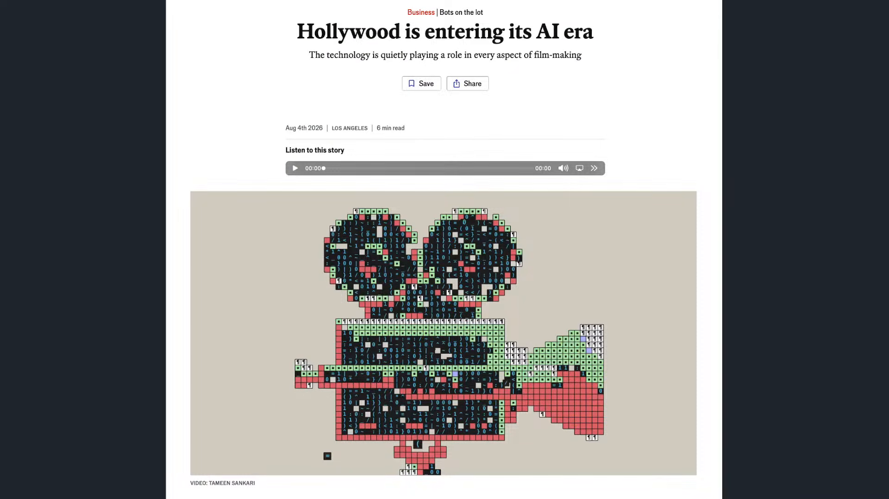

**逐字稿片段：** 你像好萊塢最近就正式進入了AI時代 從之前Netflix收購了 很多的AI製作公司以外 最近好萊塢也願意加快採用AI 背後就是有很多的競爭壓力 現在13-54歲的觀眾 花在Youtube上的時間已經 超過迪士尼福斯派拉蒙 還有環球或者 華納兄弟旗下的內容總和 那很多人呢針對短影音的一個需求 AI的影片的接受度意願也越來越高 之前我們講那個中國的短劇嘛 現在已經成功進入到美國市場了 那有很多是用AI來進行輔助的 通常這種短劇 每集大概1-3分鐘 前3秒就要抓住注意力 然後拆分成50-90集 大量的廣告營收回饋就能夠歸來 美國市場現在也正在蓬勃發展 預計總體規模已經接近90億美元 在單年度 所以這種AI的顯著爆發 在各行各業 包括之前我們所提到的

**話題推測：** 轉到好萊塢採用AI、YouTube觀看時間與短影音競爭壓力。

---

## 00:26:13

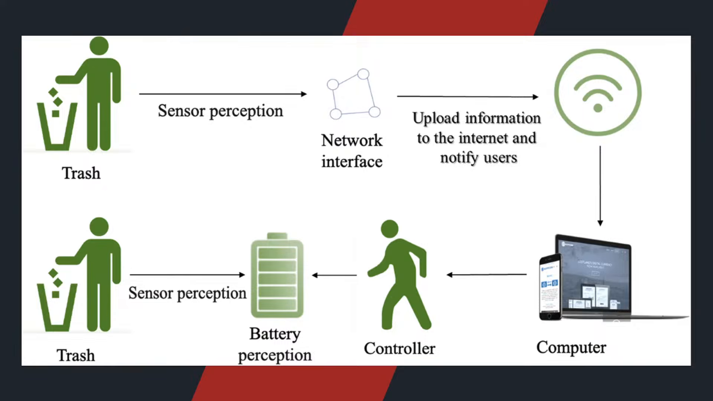

**逐字稿片段：** 然後美國有一家垃圾車公司 處理的智慧樂色車平臺 就借由AI的一個幫助 進行自行分類 流程自動化可以換來 4億美元的成本的 俊傑其他AI法律公司 我們看到新一輪的 融資計畫都在顯著攀升

**話題推測：** 切換到AI在垃圾車分類、法律公司融資等產業應用案例。

---

## 00:26:30

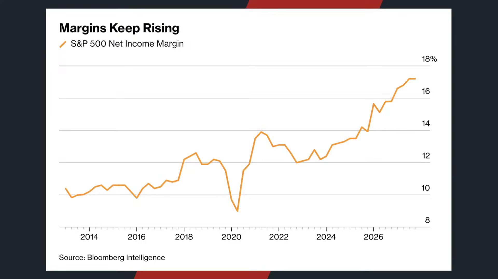

**逐字稿片段：** 那當然另外一個是AI的音樂 哦這個叫SUNO哦 我稍微用過 其實蠻好用的 它是你只要輸入幾句的提示詞 它就可以生產包含旋律 編曲或者人聲的完整歌曲 付費用戶還能夠訓練自己的聲音的 那現在已經有1億人左右使用這個SUNO 好大家可以去用用看 月費大概你花幾百塊哦 哎它這個可以做一首歌 而且現在其實我對於AI歌曲 的接受度其實越來越高了 因為有時候我想要聽 必須承認 然後偷偷用了 就是我想要聽 比如說 周傑倫唱費玉清的歌 我想要聽蔡依林唱其他女演員的歌 因為喜歡你的聲調嘛 但是我喜歡另外一首歌的旋律 有時候就互相搭配 還真的蠻好聽的好 所以這個就是一種AI的生產力的爆發 看AI的實質外溢效果

**話題推測：** 轉到AI音樂平台SUNO的功能、用戶數與付費模式。

---

## 00:27:18

**逐字稿片段：** 包括我們過去所提到 因為現在在圖像生成或者影片生成 其實中國的豆包 目前在全球市場 還是有所領先的 另外一個就Seedance 就是位元組跳動 好在影音生成部分 其實都有非常顯著的發展 最近我們小編才推薦我 好幾個影音生成的AI哦 然後我還看了幾個AI的 短劇哦那其實真的蠻好看的 像這個短劇叫做我的狗外送養我 送外賣養我 我一開始看到我覺得那很離譜 應該是搞笑的 稍微看了一下 哎很感動哎 熱淚盈眶 這是一部熱血劇哦 熱度已經有現在有2,500萬 以前呢拍爛片的風險就成本太高 現在成本那麼低 就算拍爛片又怎麼樣 狗血劇都能夠工業化的量產了 最近還看了另外一個 是叫做 權謀主母惹不起哦 這看起來都很像AI了 那當然就它本身就是AI 可是有很多那種重生復仇霸 總權謀一些題材的固定劇情範本 一集只有幾分鐘哦 角色一致 情緒到位 有時候可以吸引非常多觀眾一起 他就一直打巴掌打巴掌 看的我好興奮

**話題推測：** 切換到中國豆包、Seedance等影音生成AI與短劇案例。

---

## 00:28:30

**逐字稿片段：** 看一下畫面 哇真好看真好看 好所以不管怎麼說了 時間不太夠了 但我們今天主要是跟 投資朋友稍微分享 這個AI發展到這個地步以後 我們當然要清楚知道 在工作在抉擇 在營收回饋層面呢 大家都有會有不同的理解 那尤其我們作為創作者嘛 創作者叫做什麼 有些人會說創作者 其實是沒有樂色時間的 就是就算你發呆 你本身都是在引發新一輪的創意 那普通人呢 他會習慣把時間切成不同的格子嘛 有工作時間 有你的休息時間 有耍廢垃圾時間呢 那一旦在做感覺沒有用的事情時候 很多時候就覺得自己時間被浪費了 可是你要知道 生命中經歷的一切都是素材 有時候不管是我們排隊時 堵車的時候 失眠翻來覆去的時候 誒你這個時候 你看過的很多東西 借由AI的聯想發現了 很多你想要想的一個觀念 你總覺得不好描述你跟AI 你AI你不一定是好好打字問他說 我想要寫一篇怎麼樣的稿子 你可以説明我根據論述一論述2論述3 形成一整條文章的貫徹嗎 那貫通這幾個思維 不是這麼麻煩的 大部分我們跟AI的使用時間呢 都是怎麼樣 我都是chat GPT或者Gemini 然後就語音對話 誒是這樣的 最近想要講一個 男女之間情誼的對話 想要結合目前的時事 可是哦 又覺得硬套科技巨頭目前 的債務好像有點壓力哦 要不然你幫我想一個好了 最好 要有一點邊界感的 也不要太冒犯人的 誒我常常就是這樣跟AI講話 就是你給他很 破碎很零碎的訊息 最後有時候就有聯想了 所以我現在AI不離身的 不 洗澡時候不會了 大部分時候 那想到一個東西就跟AI聊聊天 看能不能引發一些聯想 你生活就不會被白白浪費 到時候你看過的書 你走過的路 你爬過的山 趟過的河 蹩過的坑 經過的事 都是你的經歷 你流過的淚 你喝過的酒 你熬過的夜 你愛過的床 你睡過的人 都是故事 不對 愛過的人 睡過的床 好所以你發現 有了AI的幫助以後 有時候那個思維聯想 程度來的越來越高哎

**話題推測：** 明確提示看畫面，預期播放AI短劇片段或示例畫面。

---

## 00:30:57

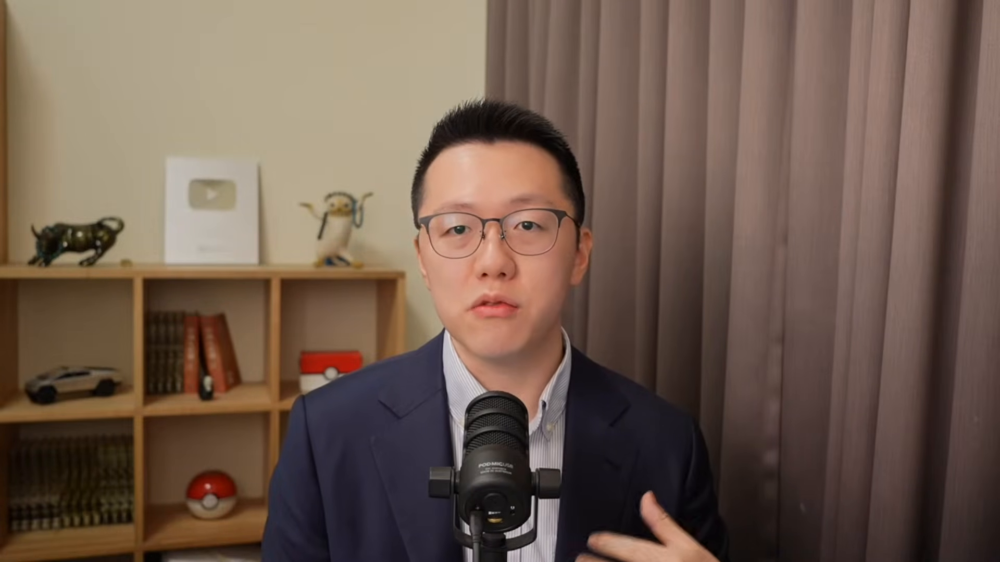

**逐字稿片段：** 九點零二分了 台股上漲306點 收在46,331點了 今天我們推薦一本書 每個禮拜五我們都會跟 投資朋友導讀一本書 希望大家可以從不同的 書籍當中獲取不同思維 我們也只是提供一種觀點 今天介紹這本書 叫做高新賽道 好高新賽道這本書 是抹布寫的 科技工作者的主持人 大家應該對他很熟悉了 最近他好像越來越瘦了哈 我感覺狀態非常不錯 如果他在寫一本 減脂賽道 那我一定也會買 好那這本書要推薦給投資朋友 當然了因為他長期都在針對職場 來發表相關的意見和看法 其實他的觀念呢 一直以來都是一樣的 職場跟投資很像 選錯標的 你再努力加碼也不一定有用 很多人都覺得努力就會有回報 但有時候進入社會才發現 每天工作10小時 有人年薪80萬 有人年薪800萬 而且差距 未必是後者努力的十倍 而是兩個人完全站在不同的產業 在臺灣就很明顯嘛 其實很多 就算是中後段的私立大學 只要你是工程科系 電子科系畢業的 薪水未必很差 因為市場真的非常缺工 那一樣的嘛 我們念文組的 當然知道市場的就業情況 有時候有 必須承認 比如說出版業 做一些文職的工作 行政工作 是真的稍微比較辛苦一點的 所以要如何把不管是 職場的一個選擇 投資的選擇 拿來做聯想

**話題推測：** 短暫更新台股盤中指數，上漲306點至46331點。

---
