# yutinghaofinance_v7TpiWK5DTQ — 關鍵畫面索引

- 來源逐字稿：[yutinghaofinance_v7TpiWK5DTQ_FIN.srt](yutinghaofinance_v7TpiWK5DTQ_FIN.srt)
- 影片：https://www.youtube.com/watch?v=v7TpiWK5DTQ
- 截圖數：31

| 時間碼 | 畫面 | 逐字稿片段 | 話題推測 |
| --- | --- | --- | --- |
| 00:00:34 |  | 美國股市昨天開始做一些回調, 納斯達克指數稍微收低了0.3%, 道瓊下跌0.1%, 標普小跌0.06%, 真正賣壓比較重的還是集中在費辦, 費辦還是波動很大。 昨天下跌362點 2.94% 是到11993點 那今天我們要從兩個角度來看 第一個是目前在最新本季度財報來到高峰之後 陸續投行報告開始出爐了 那這一次的確比較意外的事情是 其實財報表現非常非常亮麗 可是股價的反應是先跌後漲 那現在進入到高位來做盤旋 晶片股做了比較大的估值回調 可是呢 在巨頭 在道瓊 從在標普層面已經創下歷史新高 在這樣的一個效果底下 是否意味著大家針對那些花錢的人 開始有了信心呢 難道是代表著自由現金流 好轉的可能性可能提前來到嗎 事實上我們從本季度財報高峰來看 整體標普的營業利潤率 已經來到16.9% 這基本上是本世紀以來的新高了 所以不只是我們賺的錢變多了 我們的營收創高了 重點來自於我們賺錢的效率 其實來得越來越好 當然回過頭說 這也不代表市場會毫無節制的 給它進一步的高估值 我們講過現在在標普到窮 在巨頭的買盤 其實很大程度來自於左側的價值買盤 也就是它買你是因為基期夠低 它很標準的是屬於低基期買盤 那你開始漲高以後 甚至開始創高以後 市場上也許就沒有這麼大的追價意願了 | 開場後切入美股盤後概況，可能顯示納指、道瓊、標普與費半漲跌表。 |
| 00:02:10 | 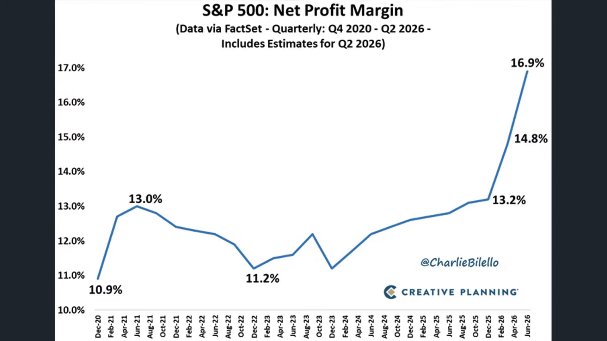 | 其實在最近我們看到在產業配置的部分 其實史上最大的嘎空才過兩週左右 避險基金最近又開始重新放空美股了 其實我們看到 因為標普500現在是創下了今年第26次的歷史新高之後 在整個大盤的部位 美國多空基金的總槓桿單週是下滑了3.9% 淨槓桿則是增加了0.8個百分點來到53.6% 稍微來看也不是大砍多單 是開始放空的速度 重新超過買進的速度 其實現有部位並沒有拋棄 但是避險單突然增加了很多 這也可以稍微解釋 昨天外資其實回頭買了517億的臺股 不過期貨進空單又增加了1300口 現在又來到8.9萬口的空單 所以市場上還是有非常明顯的避險情緒 往好處想 就代表著肯定不是全面樂觀 另外一方面股價一漲高 對沖基金 避險基金又開始緊張了 又擔心會不會迎來一個 比較大劇烈的震盪 | 轉到產業配置與避險基金重新放空美股，可能顯示基金槓桿或空單變化圖。 |
| 00:03:14 |  | 但是從目前資本支出 在幾大四大CSPA的財報當中 都看得出來 還在持續調高 現在標普500 第一季第二季的獲利 年增幅都在25%以上 其中有一半的獲利成長 其實來自於 AI的資本支出的回收 雲端巨頭預估在 明年的資本支出 來到1.1兆美元 甚至比運營的現金流 還要多出1500億 所以看起來自由現金流的集體轉負 看起來搞不好在今年下半年 就會提前看到 那明年是肯定要付一整年的 那現在真正的問題就來自於 現在第一企業投資等級在 在利率預期稍微釋懷 因為最近升息預期沒有這麼強烈了 來自於疲軟的就業數據 第一利率環境是否能夠稍微寬鬆一點 | 切回AI資本支出與四大雲端巨頭財報，可能顯示CapEx與獲利成長圖。 |
| 00:04:03 | 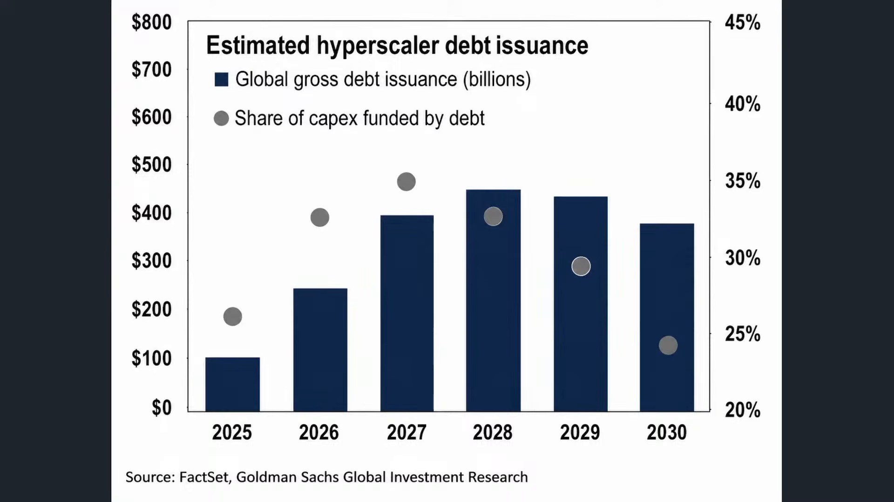 | 美國企業增資金額 現在來到1050億美元 這是2021年同期以來的新高 那未來幾年 27年28年上升幅度會越來越快 那我們預估在28年左右 本輪的AI資料中心會來到建制潮的高峰 與此同時在27年會陸續有資料中心開始建成 那個時候就是衡量本輪建了這麼多資料中心 能否有產能回饋的重要關鍵 但科技巨頭目前的融資 的確相對於10年前已經暴增了接近有24倍左右 現在最大的問題就來自於 AI投資從錢太多變成債太多 那麼在建成的當下 能否有效的立即收回 其實就很重要的 我們過去提過 這一輪你不要看說 現在財報級高峰過以後 過以後很多巨頭繼續放新聞 | 提出美國企業增資金額1050億美元與AI資料中心建置潮，可能顯示融資金額時間序列。 |
| 00:04:53 | 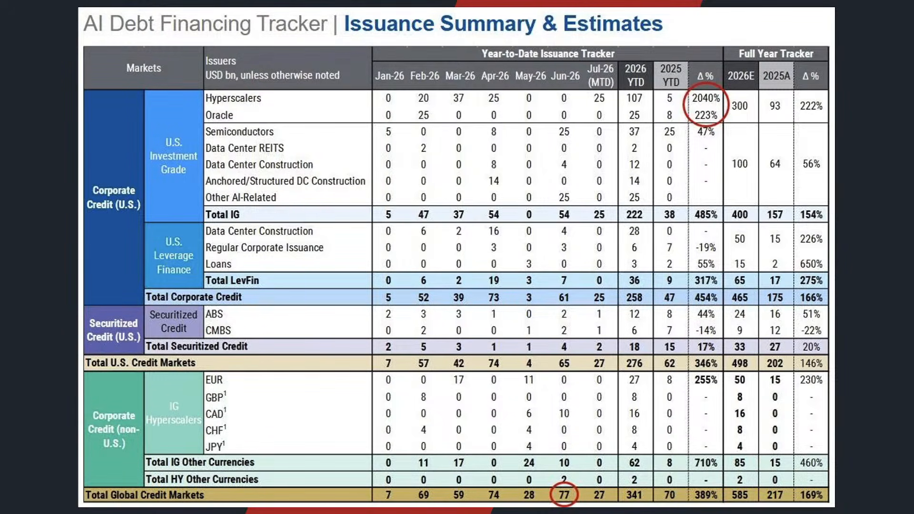 | 像是SpaceX 現在美元債 大概已經募資超過2000億美元了 去年同期也不過130億 暴增了接近有14倍左右 問題是現在新債有點開始賣不動了 現在從債券利差角度而言 搞不好隨時會被列入到垃圾債等級 那也很神奇 股市是巨頭 結果債市可能在邊緣了 那輝達SpaceX亞馬遜各自在本月份和上個月 陸續增加250億美元的債務 那華爾街當然也因此改變了賣債的方式 比如說你像貝萊德 他就替Meta的資料中心籌資的時候 刻意把125億美元的債券優先 配給退休基金或者保險公司 或者一些長期持有者 避免很多短線資金一拿到錢就到火 那倒是狙擊你的債券 會不會回過頭影響到股市 即便如此 Meta現在開的殖利率7.5%起跳 而且現在還在升高 那就很吸引一些債券投資人 隨隨便便 這些巨頭這麼厲害的巨頭 他都要開7%到8% 如果是中小型企業 或其他企業來發行 那不是一定要10%以上了嗎 所以我們才講說 現在搶錢 搶得越來越用力了 | 切到SpaceX美元債募資暴增與新債賣壓，可能顯示公司債新聞或債券利差圖。 |
| 00:06:08 |  | 超大型雲端樂者 今年預估下半年 還大概有500到600億美元的 新在要持續來做發行 那現在巨頭的做法很簡單 就先求有再求好 很多新產業的發展 最自然的入境 AI現在最重要的事情就是 未必要立刻證明 每億美元的資本支出 都能夠產生最高報酬 但是你要至少先把 最基本的算力晶片資料中心電力 和網路基礎設施先準備好 就好像網路剛起飛的時候 一定要先鋪一下光纖 高速公路要先把路給蓋出來 基礎設施不足的階段 最大的問題 不一定是效率不夠高 因為根本沒有足夠的能源 足夠的算力可以用 你如果沒有算力 你再高的資本報酬率也沒有意義 這沒辦法 你只能先把容量做出來 才能夠討論 才能夠有資格去討論 怎麼把它用得更有效率 所以現在就先求有再求好了 這沒辦法的事情 至少先等第一批的資料中心建制完再說 對不對 渣男最常說的 都是這樣先求有再求好 寶貝好想給你買套房 可是現在經濟能力有限 先買套房的話以後再說好不好 所以先求有並不代表可以永遠不求好了 但是當資料中心建成以後 下一個階段就會開始問 資料中心利用率到底有多少 我們看到最近市場的普遍預估 因為你看我們不要否認說 現在好像AI資料中心都沒賺到錢 都沒蓋完要怎麼賺到錢 那你相反的 你說現在一直蓋資料中心 自由現金又一直翻覆 然後以後一直蓋 以後就一直翻覆 最後財報一定出事 你怎麼知道錢收不回來呢 他至少要蓋好錢才收得回來 他永遠蓋不完 我們才可以確保他錢永遠收不回來 當他蓋好的那一刻 他就可以出租算力了 誰說到時候的現金流完全收不回來呢 我們看到最近大摩和高盛 在針對微軟和Google在雲端業務營收 你看微軟是80%的成長 Google是60%的成長 如此高強度的營收 如果真的建成了 也許自由現金流回來的速度不會太晚 我們看真正的邏輯是 | 切到超大型雲端業者下半年仍有新債發行，可能顯示雲端巨頭融資需求圖。 |
| 00:08:20 | 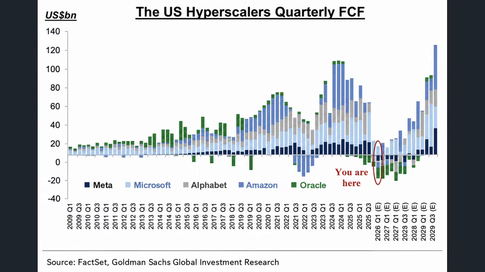 | 26年到27年肯定是燒錢最嚴重的階段 因為自由現金流都已經陸續翻覆了 Meta、微軟、Alphabet、Amazon、加古文 都大量的購買GPU 那FCF就是運營的現金流 相對而言的確比較疲憊 可是我們看 非常普遍的預估 都是明年再投一年 然後明年年底 AI資料中心在兩年前投入的資金 就要逐步建成了 一旦建成以後 營收就能夠開始有效的回饋 而且這個時候 不確定性也變成確定性了 就是到時候你真的開始使用 你還沒蓋完之前 你都無法認列折舊 你開始認列折舊以後 你的利潤其實就相對清晰了 所以等到28年29年 如果到時候 這個微軟和Google 它還能夠維持現在 60%到80%的營收成長 那麼錢一定收得回來 這個就是我們最大的信心 現在其實有很多AI的新創企業 它也不是地端在運算 它始終要跟這些巨頭們來租用算力 就跟我們現在使用 線上的雲端系統一樣 所以現在最大的風險 當然就是AI營收沒有出來 可是你要想想看 它不蓋完 營收怎麼出來呢 所以我們的預估是 明年就會有大量 在兩年前的資料中心計劃 逐步建成 明年看是否能夠 有效的營收回饋 就是重點 那明年投的錢還是很多 等到後年 我個人的看法是 我比較主觀 我相信28年 我們就會提前看到 自由現金流全面翻證 這就是我們講的生產力的爆發 生產力爆發 不一定是你很有感的 感覺機器人走在各地 而是當大量的AI新創公司 都需要算力的時候 就讓這些資料中心的投入 開始有了營收的回饋 我認為這是最有可能的 所以回過頭說 這對於臺灣市場的影響 本質上就是資料中心建制潮 至少還是兩年到三年左右 那兩到三年搞不成 那你也大概知道 遲早半導體的支柱要降下來 那一旦搞成了 而且巨頭們自由現金流翻陣了 會幹什麼事情 當然是繼續求 因為接下來的算力需求 自駕車機器人 肯定會比現在 現在單純的大圓模型來得更大 | 切到2026至2027年自由現金流燒錢階段，可能顯示Meta、微軟、Alphabet、Amazon的FCF與CapEx圖。 |
| 00:10:26 |  | 我們看臺積電在昨天7月份的營收 其實美股費辦是跌蠻重的 不過ADR也不過跌0.37% 所以臺積電其實賣壓還好啦 臺積電7月份營收是暴增了45% 來到4675.8億美元 年增幅是 不好意思北美元臺幣 年增幅45% 這一次也再度證明了 雖然AI資料中心好像有點過熱 但實際的晶片需求 比想象中還要來得強勁許多 | 切入台積電7月營收暴增45%，可能顯示台積電月營收或ADR走勢。 |
| 00:10:54 | 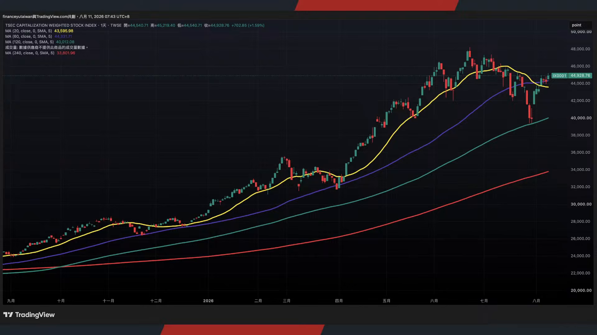 | 那公司也上修了全年展望 將美元營收成長幅度預估會拉昇到40%以上 那資本支出也拉高到創紀錄的600億到640億美元 那當然如果接下來的資料中心 至少還有兩年級的供給的瓶頸期 那就有利於臺股市場持續的向上推 的確臺積電在今年的表現 如果把它算入到7巨頭或者8巨頭 加我9巨頭 全部算起來 已經算是比較亮麗表現的 基本上今年晶片股市場的賣壓 臺積電的賣壓是少數比較輕的 主要還是來自於資金 都是在記憶體這一塊 | 提到台積電上修全年展望與資本支出創高，可能顯示公司展望與CapEx數字。 |
| 00:11:31 | 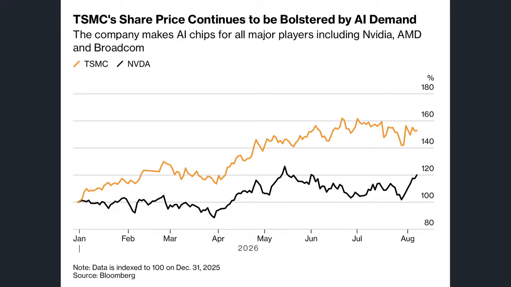 | 那昨天台股上漲702點 稍微站回了記線 不過45000是得而復失 但你也看得出來 臺股本輪的反彈 角度相對於韓國股市 還是比較強勁一點 韓國股市要加把勁 要不然美國股市的晶片股 那感覺記憶體股的籠罩 還是比較大一點 | 轉到台股上漲702點、45000點得而復失與韓股比較，可能顯示台股大盤走勢。 |
| 00:11:49 |  | 而且你要知道外資到今年為止 還是賣了臺股接近有1.6兆 投信ETF買超也不過買了7260億 所以還是很明顯感受到 外資針對整個臺股的調節依舊存在 那這當然不是針對性調節 | 提出外資今年賣超台股1.6兆與投信ETF買超，可能顯示台股籌碼結構。 |
| 00:12:04 | 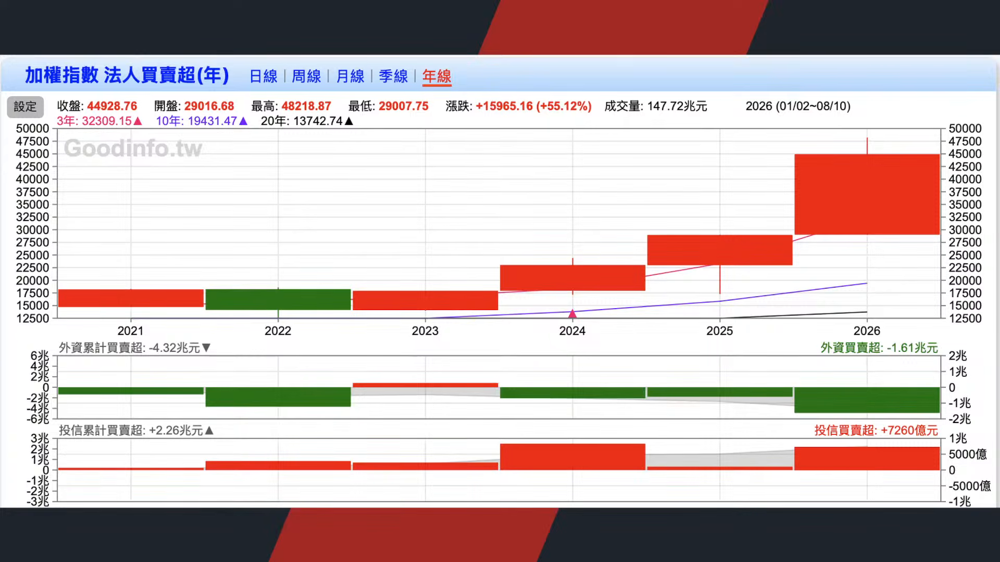 | 亞洲股市的資金 本來就出現了比較明顯的轉變 以前市場漲跌很大程度 都是受到海外那些紐約倫敦的 海外機構資金的影響 但現在亞洲家庭都把更多的儲蓄 從房地產從定存 轉向股票和基金 所以其實這幾年 我們看在亞洲市場當中 海外市場2021年以後 幾乎沒有什麼在回補 你不要講說單純是臺韓市場了 連整個大中華市場 印度市場 東南亞市場 外資現在都不怎麼回補了 | 切入亞洲股市資金結構改變，本地資金取代海外機構，可能顯示亞洲市場資金流圖。 |
| 00:12:36 | 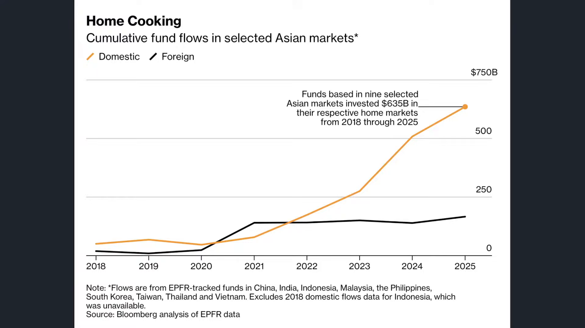 | 可是你看在橘色線的部分 國內市場的買盤卻非常湧入 新興市場在去年 自家股市自掏腰包 就花了5570億 這是4年前的7倍以上 所以現在印度人 臺灣人 印尼人 越南人 都在自己買自家的股票 臺灣證券戶數有1450萬戶 相當於人口的62% 印尼去年有70%的交易量 都來自於本地投資人 越南的外資的交易佔比 今年7月降到14%了 創下歷史新低 你看得出來 整個東亞股市 外資都在討 本地人都在結 為什麼本地人有錢了嗎 撐得住目前的價位 事實上我們看到 在去年一整年當中 你不要看今年 今年還是賣超 去年南韓也被賣了45億 越南被賣了48億 臺灣被賣了78億 就連印度外資也流出了188億 | 提到圖中的橘色線與國內買盤湧入，合理推測畫面切到本地資金流入圖表。 |
| 00:13:31 | 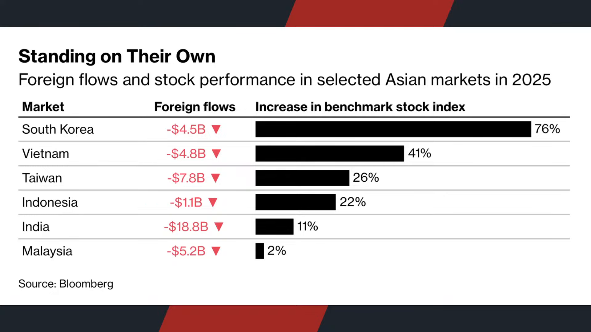 | 但是你看 股價漲幅仍然十分漂亮 事實上臺股在過去4年 漲了大概有接近兩倍 在市值現在 在主要經濟體當中 現在是排行第四 那的確 如果是從過去4年來看 臺股是相對比較亮麗的 | 轉到外資流出但股價仍上漲的各國例子，可能顯示外資流出與股市漲幅對照。 |
| 00:13:47 | 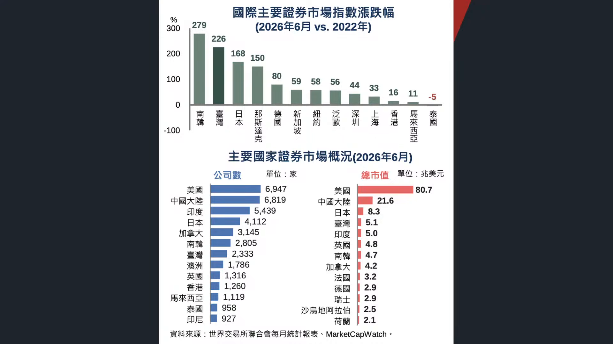 | 基本上就僅次於南韓市場的279% 過去四年臺股市漲226% 那日本是168% 納斯達克也不過150% 德國股市80% 紐約股市58% 所以這一波漲勢 主要就是由半導體 AI伺服器和電子供應鏈推動 大量的外匯收益進來以後 當然就持續往上推 所以有時候我們必須瞭解 就是說我們很習慣 以前會用外資的買賣操 來判斷亞洲股市 外資空單增加 其實這些數據到現在為止都沒有這麼重要 外資買你就會漲 外資賣你就會跌 外資已經賣了六七年了 所以第一個直覺可能覺得股市可能 它雖然不至於大跌 但是也不應該大漲 沒有它真的最後就大漲 所以這幾年就出現那種完全不同的現象 外資就一路賣臺韓股市 結果市場照樣給它上漲下去 因為本地散戶退休基金ETF 和機構的買盤在內部越來越大了 足以把外資所拋出的貨給接走 那也不是外資失去判斷力 市場的定價結構慢慢改變了 | 比較過去四年台股、韓股、日股、納指等漲幅，可能顯示全球股市漲幅排名。 |
| 00:14:52 |  | 這是一個新的邏輯 我前陣子才看到一個名詞 叫擋風玻璃效應 他講的就是 應該很多人都有類似經驗 以前比如說你在日本 那種夏天開車的時候 跑一趟高速公路 北海道 或者在臺灣跑一下山路 那擋風玻璃不是 有時候就很容易 那個黏滿那些小蟲嗎 然後就死狀悽慘這樣子 可是這幾年你有沒有感覺 不管是海外開車 還是在國內開 你就發現好像那個蟲越來越少了 幾乎撞不到 那我第一個直覺 因為現在的汽車都更流線型 空氣力學來得更好 都開跑車你知道嗎 那蟲不會被我撞到 因為我車實在太優秀太好了 後來看一下才發現 真正的原因是什麼 是因為蟲真的變少了 後來不管是德國研究 英國研究都發現 現在的飛蟲 就飛行昆蟲 季節性的生物量 至少減了八成以上 那背後有很多原因 有的都市化 農藥撒很多 棲地的消失 光害 氣候變遷等等 或者現在太陽越來越大了 蟲子不願意飛了 所以從這件事情 放到投資也很值得思考 有時候我們看到一個事情 都想要聽一個合理的解釋 臺股漲成這樣 那看起來是外資有點回補 或者外資賣壓這麼重 臺股不至於大跌 但是沒機會上漲了 這幾年就是它一直大賣 我們就這樣子一直大漲上來 所以投資最危險的 不是看錯數字 是數字看對了 但解釋錯原因了 我們要了解它的內生動力為何 這個很重要 我們看臺股的成交金額 在過去9年大概也暴增了 接近有4.3倍 股票交易也成為了絕對的主流 事實上交易結構也出現比較大的改變 | 引入擋風玻璃效應作為新比喻，可能切到概念插圖或新聞資料。 |
| 00:16:36 | 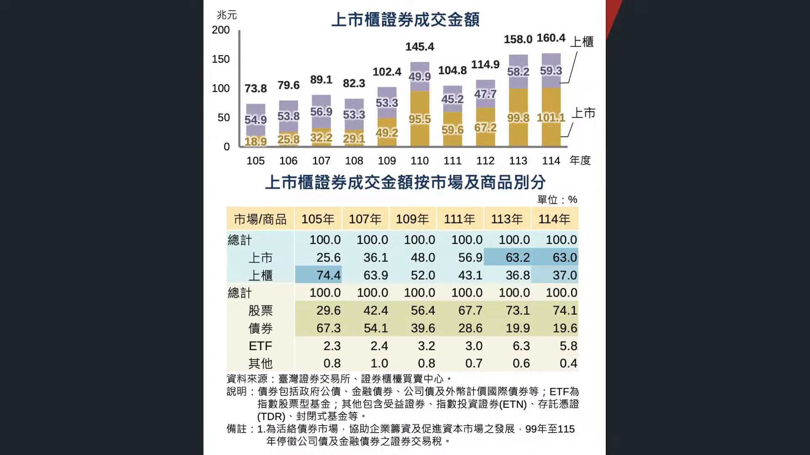 | 2016年股票只佔證券成交金額 大概29.6% 到25年來到74% 債券從67.3%一路下滑到19.6% 主要就來自於受險基金 他當時所買的債券 相對於散戶目前湧入股市的速度 形成了極大的一個轉換 很多人以前是把錢給受險基金 那可能最後去買債券 或者買國內發行的債券型ETF 後來發現直接繞過受險 那直接自己買 或者買股票比較偏好 獲取更高的一個報酬 那當然由於臺股現在已經高度科技化 半導體成交佔比 目前也已經完全突破了三成 它背後就來自於出口的持續增長 | 提出股票與債券成交占比從2016到2025的大幅轉換，可能顯示證券成交結構圖。 |
| 00:17:19 | 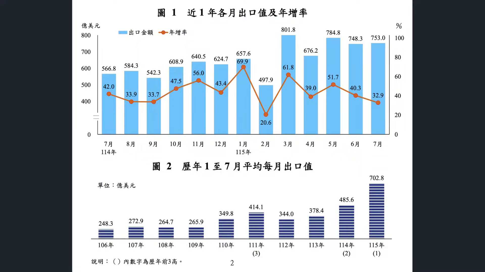 | 上禮拜最新公佈的7月出口是753億美元 創下歷年的單月第三高 年增幅有32.9% 這已經連續33個月成長了 那成長時間已經有2到3年左右了 而且前7月的累計出口是4919億 年增幅44.7% 再創率也新高 那財政部預估8月份到10月份 是全球的拉貨旺季 一定會創下歷史新高 所以這一波很明顯 因為臺灣的出口對象 現在最大佔比已經變成美國了 佔比大概是31% 那中國市場是25% 東協是18% 所以在AS福氣的持續帶動底下 我們剛剛講過 就是28年到29年是第一波的檢驗期 就是投的錢到底劃不划算 能不能讓我的自由現金流翻證回來 翻正回來就可以從第二階段 往五年十年更長遠的資本支出來做佈局 但至少還有一到兩年的瓶頸期 或者說供給的緊縮期 那就代表著出口至少再好一兩年 這是我的看法 | 提出台灣7月出口753億美元、年增32.9%，可能顯示出口統計新聞或長條圖。 |
| 00:18:23 | 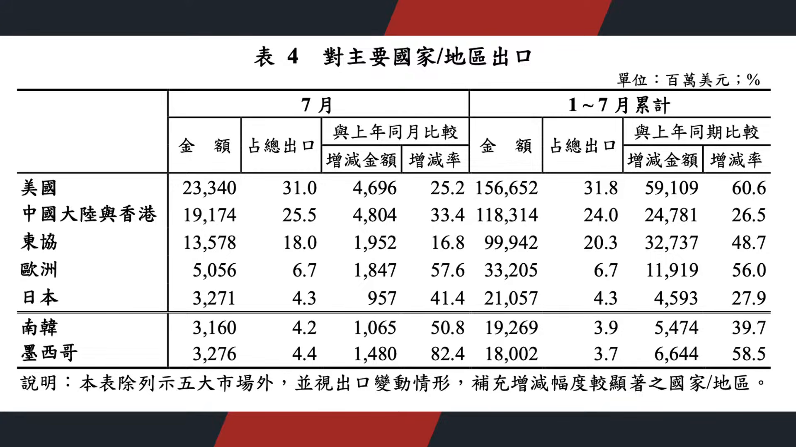 | 其實從今年來看 整個2026年應該又是亞洲四小龍的天下了 臺灣前七個月出口年增幅是44.7% 南韓是50.5% 香港是44.5% 新加坡也有38.1% 所以相對於中國市場 美國 日本 德國 今年就是亞洲四小龍 四個經濟體的成長 是全部大幅領先其他發達經濟體 這也代表著外匯收入進來很快 | 轉到2026年亞洲四小龍出口成長領先，可能顯示台韓港星出口年增比較表。 |
| 00:18:49 | 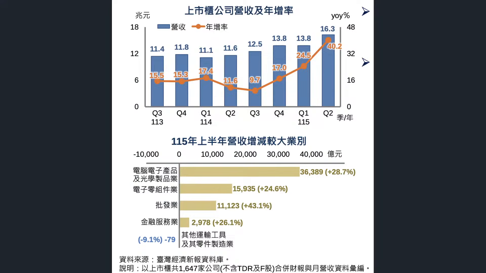 | 我們看臺灣上市櫃的企業營收 目前在上半年已經來到30.1兆臺幣 你要想想看 30.1兆 你就算是隻看毛利率好了 只有10% 那個資金量是有多龐大 對於臺股而言 所以這波成長很明顯 不只是科技業受惠 金融服務業也很受惠 上半年營收26.1% 它都是非常明顯 由科技帶頭所助長的內部繁榮 那ETF市場 其實在早年 五年前十年前 其實臺北股市的成交金額 很多都是一些反義 正惡 甚至是入股的槓桿型ETF 這幾年也逐步變成 我們看到全職型ETF 那前幾年是高股市ETF了 但至少小資族參與的決心也越來越高 上市貴的零股成交金額佔比 現在也在快速提升 去年零股成交金額是2.5兆 今年搞不好要直接翻倍 佔成交值也大概有2% 相對於2019年制度改革前的354億元 6年零股交易已經翻了接近有70倍左右了 尤其現在定期定額的全面ETF化 就讓大家更不容易被甩掉了 我買ETF 你股災是能夠把我殺到什麼地步 所以就更願意進行扣款 那最後導致的效果就是 我買了ETF 我做了穩健型投資 我也確保我不會被洗掉了 那我該怎麼做呢 有些人當然選擇在今年 可能他願意做槓桿 來擴大自己的部位 嘗試著超車 有些人飆車 那可能一次股災可能就翻車了 可是有些人 他是慢慢慢慢的上槓杆 | 提出台灣上市櫃企業上半年營收30.1兆，可能顯示上市櫃營收統計圖。 |
| 00:20:26 | 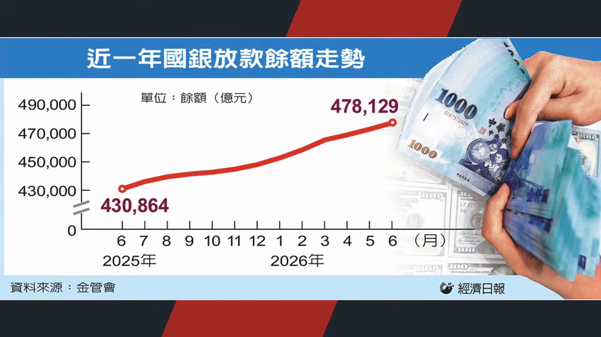 | 我們看國營個人放款 在過去半年已經暴增了1兆元 來到47兆8千億 光是6月就增加了 接近有5000億左右 企業端的需求也很強 年增幅也58% 增加了一兆7400億 所以個人放款 加上企業貸款 合計大概已經增長了 九成的增量 市場上要麼就是 企業去做投資 要麼就是個人去借錢 然後來做股票投資 反而房地產市場 不斷的收縮 所以我們看這次金管會 出招了 從這禮拜開始 已經正式要求銀行 全面清查股票投資相關貸款 也開始直接關切 信用交易的交易量大小 那市場原本是擔心上一次是 整戶的擔保維持率跌破140才會提醒 現在在金管會的要求底下 不少券商把預警線提高到150 準備未來在下一次的回調 碰到150提前通知 希望大家能夠好好重視自己的風險 金管會也在嘗試的穩定市場 那當然現在券商也很缺錢 第一錢都被借光了 那第二內部不管是融資 還是股票借貸 交割貸電款 資金週轉需求還是很強 為了補充銀貸該怎麼辦呢 券商自己也在借錢 這不只是個人在借 券商也在借 | 轉到個人放款與企業貸款暴增，可能顯示銀行放款增量或槓桿資金圖。 |
| 00:21:45 | 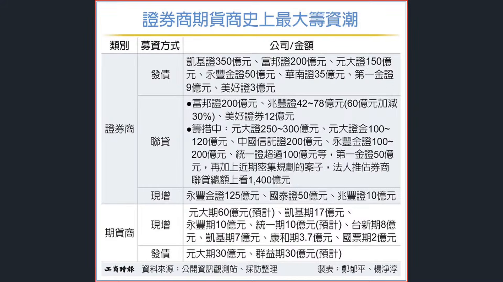 | 你看在最近 發債規模 透過連貸或者現金增值 大概是797億 連貸是1400億 現增大概是185億 我們看到 不管是凱基證 富邦證 元大證 永豐金 或者我們看到華南證 第一金證 美好證 大家都在募資 每個人都缺錢 這就是我們看到的真實跡象 這給投資朋友作為一些參考 它所形成的效果 就是由科技業所帶領的龍井 它支撐住了本輪股市的繁榮 但背後的根本邏輯 其實還來自於 現在市場的確出現了 新一輪的New Rich 這一輪的買盤不是老錢 在那邊資金移來移去 它就是一直有新的人持續參與 為什麼 因為它的本業收入不斷的提升 | 提出券商也在募資並列舉多家券商，可能顯示券商發債、聯貸、現增統計表。 |
| 00:22:29 |  | 瑞銀最新所公佈的 2026全球財富報告 最新統計 當然最多的還是美國 美國真的很離譜 一年就增加了44萬名 美元百萬富翁 我們講的是淨資產 就是把你所有的財產 減掉你的負債 你的房子以後 剩下來的淨資產 美國是增加了44萬人 全球第一 第二名英國 跟美國大概差了十倍 英國只有4萬人 法國3萬人 西班牙3萬人 日本3萬人 印度3萬人 可是亞洲方面 南韓2萬人 中國1.4萬人 臺灣就排名第三了 有9800人 新加坡是5200人 香港是1891人 所以臺灣其實也接近有一萬人左右 在一年的時間內 就晉升到我們講的高資產階級 這種資產分化的角度 當然韓國股市內部壓力比較大 有些人可能5月份的時候 還是超級富豪 可能等6月份過後 又開始迴歸平民的 這種資產分化受到財富效果的影響 的確相對來得大 可是它背後 如果是依賴龐大的年輕世代 我們講的new rich來做支撐的話 那這股買盤其實也沒那麼容易斷掉 所以不要亂退休 不要亂離職 我們看這一波 | 切到瑞銀2026全球財富報告與美元百萬富翁增加，可能顯示全球財富排名圖。 |
| 00:23:47 | 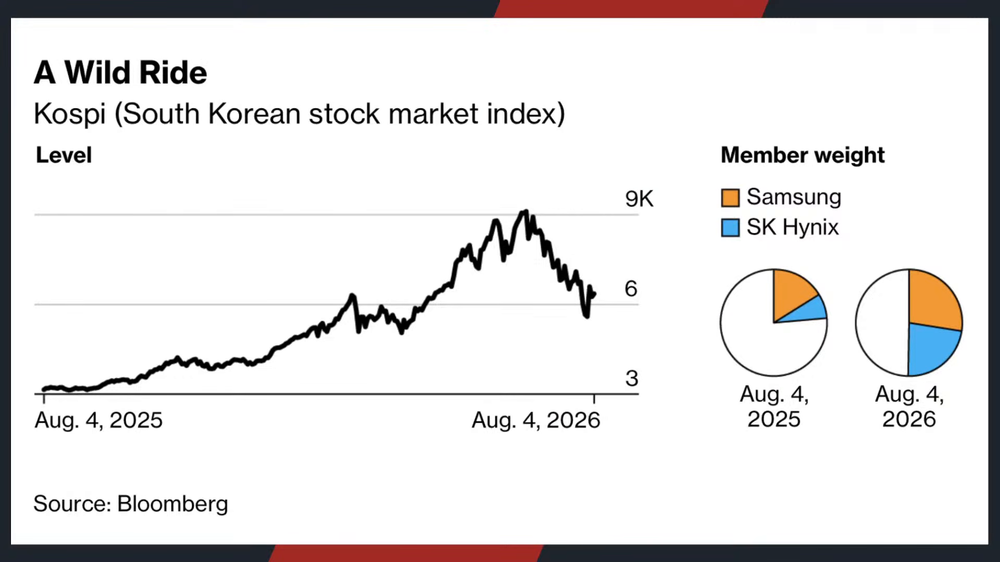 | AI正在重寫南韓的階級 最近韓國很多媒體都有相關的報道 講說在這一輪的半導體市場龍井當中 我們撇開財富的增長 就不看股價的增幅 我們就看受惠於年終獎金 現在SK海力士和三星 在部分部門 今年預估可以領至少40萬美金的獎金 40萬美金 那等同於每個人就發個1000萬 1200萬 帶動了部分科技聚落的實體房價 | 轉到AI重寫南韓階級與晶片工程師獎金，可能顯示韓國半導體薪酬新聞。 |
| 00:24:20 | 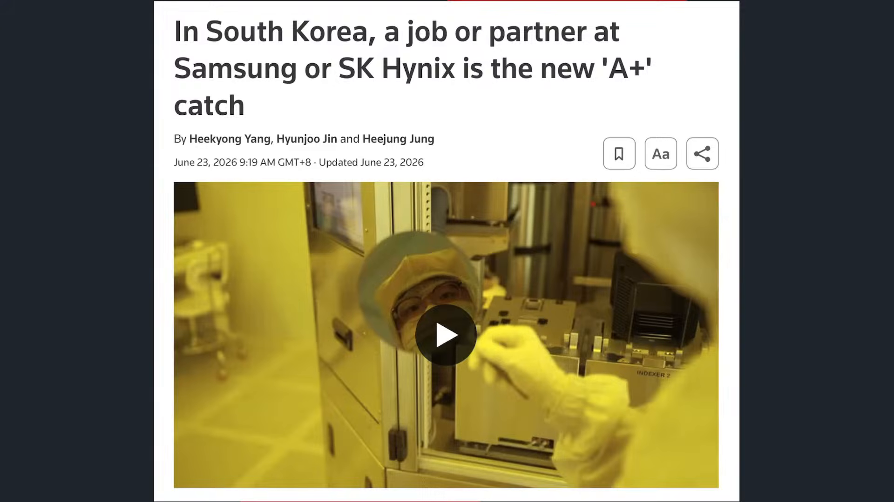 | 那甚至我們看到韓媒的報道 晶片工程師 現在在南韓市場 看起來是比醫生律師還要更受歡迎 成為南韓婚戀市場的新精英 南韓不是有很龐大婚戀市場 常常在韓劇裡頭看到 大型婚友社就表示 過去指定只想要認識醫師 或者律師的女性 如今會主動要求SK海力士 或者三星的工程師 連大學的科系選項都出現變化 2026年的招生當中 五個由三星和SK海力士 所支持的半導體科系 錄取難度比首爾大學的 自然學科 醫學學科 還要來得更為艱困 所以在這樣的一個效果底下 等於社會的潮流也開始轉變 一個是南韓市場 看起來那工程師 看起來是比律師醫師 現在還要更受歡迎 第二點是金融業 我們剛剛講到 金融資產價格 也隨著科技的爆發而跟著創高 股市大漲以後 現在金融男神也越來越受歡迎了 尤其私募男友 | 提到韓媒報導晶片工程師比醫生律師更受歡迎，可能切到韓國社會或婚戀市場新聞畫面。 |
| 00:25:20 |  | 現在變成了好萊塢的新寵 這是華爾街日報的報道 今年夏天 大家發現好萊塢的女星 和私募股權的男友 他的組合開始變得越來越多 像瑞斯韋斯彭 就是演那個金法遊物 還有那個Apple TV 那個晨間直播秀 那個女主角 就是瑞斯韋斯彭 他就帶著他的私募基金的創辦人 男友哈爾曼出席首映會 那尼可基曼也被拍到 跟私募人士在意大利度假 23歲的歌手羅德里哥 他也被拍到 跟金融圈的男友來約會 所以那兩個世界正在靠近 你發現一個是 但是很多明星 因為已經不算是藝人了 很多明星都是品牌的經營者 製作公司老闆或者投資人 私募股權人士 他擅長買公司 剛好可以搭配 雙方生活方式和商業思維上 反而有不少交集 所以現在韓國人是偏愛工程師 美國人現在就偏愛金融男 大概是這樣的一個邏輯 我見過那麼多男生 金融男是最需要提防的 以前我們聊過 通常那種渣男 以前我們的印象中的渣男 都是那種酷酷帥帥的 長得帥就能夠為所欲為 但是其實還會情勒女生 所以很多人都意識到 那種長得太帥的 通常都要小心 因為你會讓女生為他做牛做馬 脾氣很差 吃軟飯 非常自私 但是後來那個渣男 就慢慢慢慢變成那種工程師 要不然就金融男 就真正的渣男 金融圈就是經典 金融圈就每個都穿個西裝打個領帶 感覺好像對社會有益無害 長得乾乾淨淨的 戴一個黑框眼鏡 也沒有長得特別帥 但是蠻有錢的 有點才華 口條還不錯 講講笑話 因為他吸引女孩子的地方 根本就不在於臉 或者那個酷酷的個性 他吸引別人的地方就在於 他感覺無害 中庸 根據我的經驗 最渣的就是這種人 渣男就是你絕對想不到的 有時候是工程師 看起來最呆板 穿個各自襯衫 感覺無害 這種人其實也很渣 穿個西裝 感覺講話很得體 好像常年都保持著自律的穩定 感覺這種好讓人心情愉悅 這種最渣 我不是說我 以前看到一句話 很多女孩子想要的 只有渣男能給 很多男人想要的 只有綠茶能給 全人類想要的 只有騙子能給 所以要小心 騙子越來越多了 現在女生的理想型 一個是工程師 一個是金融男 都要特別小心 好不好 都要特別小心 好那當然了 | 引用華爾街日報好萊塢女星與私募男友新聞，可能顯示相關新聞截圖。 |
| 00:28:11 |  | 9點鐘看一下臺北股市 小蝶75點 剛才我們跟投資朋友提到 的確市場上的概況 比較集中在 在科技業的帶動之後 所形成的金融的擴張 但臺灣市場 現在所面臨更大的一個挑戰 是什麼呢 由於內生經濟 連傳產都有點被帶動了 所以這一次通膨數據 的確開始有所飆高 我們看到最近已經來到2.54% 雖然比6月份稍微降溫 不過已經連續三個月 高於2%的通膨警戒線了 以前臺灣在整個東亞經濟體 通膨是偏低的 大概就僅次於中國市場了 就像臺灣通膨比香港高 比新加坡高 比日本高 通膨壓力是真的開始 有點慢慢增長了 雖然2.59跟美國比 那還是有一段差距 但是我們也知道 這已經是在臺灣做高強度補貼的情況下了 | 回到9點台北股市即時行情小跌75點，可能顯示台股盤中報價。 |
| 00:29:00 | 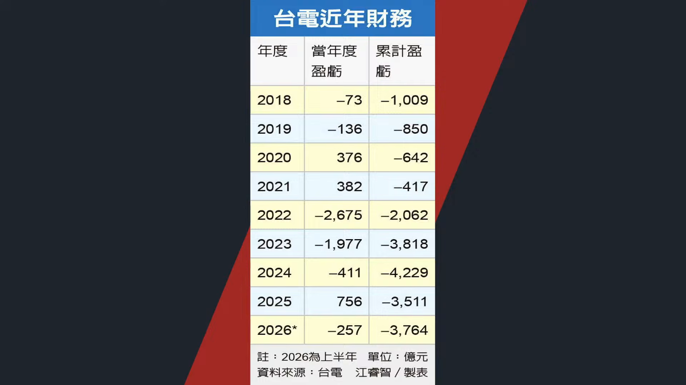 | 臺灣的臺電成本 現在在26年上半年已經虧了257億 你就知道它補貼多少了 去年好不容易翻陣 那今年我們知道 到現在油價都還在補貼 那包括我們也清楚知道 如果真的要打平今年虧損 電價要漲7.3% 那肯定在11月以前 不可能有任何電價上漲的機會 所以我們才講說 這種已經看到的數據 是已經進行電力通膨抑制了 那如果下半年真的開始解封了 臺電不做補貼了 開始適度調漲電價 那會不會持續往下游來轉嫁 是有可能的 所以臺灣央行內部的 這一次的李監事會議的報告 兩位理事是主張 現在就是立即需要升息的時刻 一方面打壓股票市場情緒 另外一方面把通膨進行抑制 那另外一方面 | 提出台電上半年虧損與電價補貼，可能顯示台電財務或電價調漲數字。 |
| 00:29:48 | 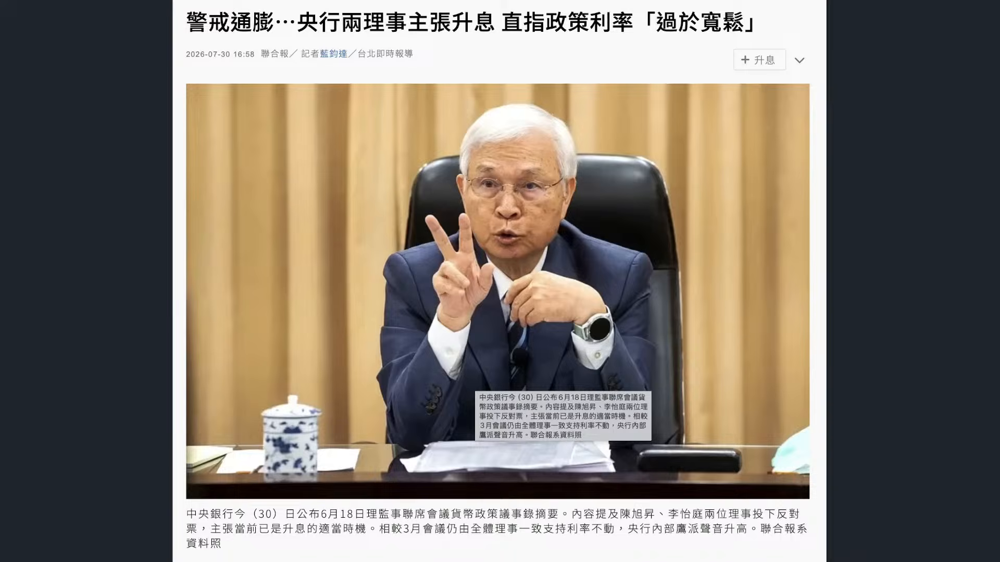 | 的確市場也在投票 預估臺灣央行即將升息 我們看最近臺灣公債殖利率 已經衝上了20年的新高 市場開始壓住央行的升息幾率 這一次10年期公債殖利率 已經來到1.82%左右了 這其實是2008年以來的新高 那主要就是因為 7月底20年期公債殖利率的 標售利率衝高到2.2% 常在賣壓 把整條殖利率曲線做傳導了 那當然這其實背後的原因 一方面是AI行情 推升臺股和資金需求 加上央行又很明顯的 去抑制臺幣的貶值 所以收緊流動性 那市場預估 那你想要一舉殲滅 那最好的方式就是升息了 | 提出市場押注央行升息、台灣公債殖利率衝20年新高，可能顯示10年期公債殖利率曲線。 |
| 00:30:30 | 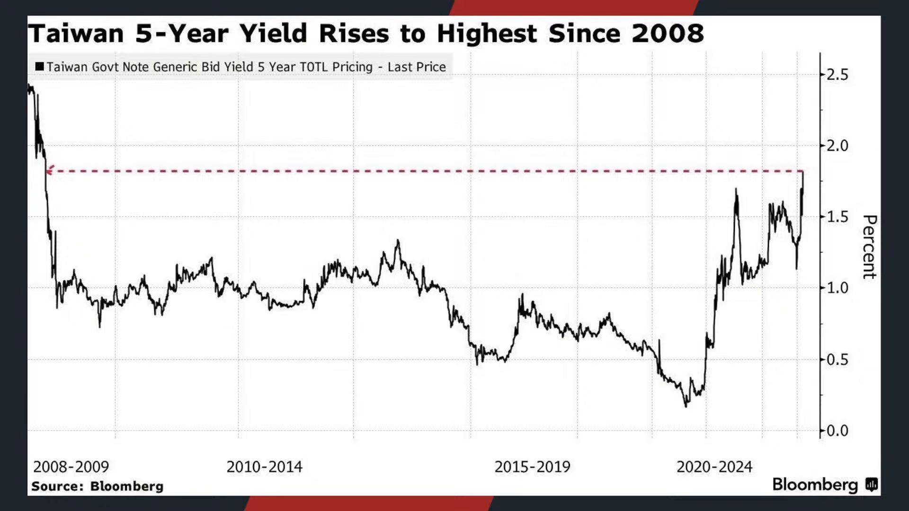 | 所以升息最影響的是什麼呢 當然就是房地產市場的概況 我們稍晚再聊 清安3.0的跡象 但是房地產市場 對於利率市場 還是比較敏感的 而且它已經疲憊很久了 尤其六都上半年的交易量 也創下了9年來的新低 所以市場的沉壓始終沉佔 那我們就過幾天 稍晚來聊一下 整個房地產市場概況 在清安3.0的推出以後 它到底是否為更進一步的刺激政策 還是我們看到有進一步 反而引得市場上 股市資金相對成交量 倒下來以後 轉往房市的可能性 但我們今天聊的範圍 | 由升息影響轉到房地產市場與六都交易量新低，可能顯示房市成交量圖。 |
| 00:31:06 | 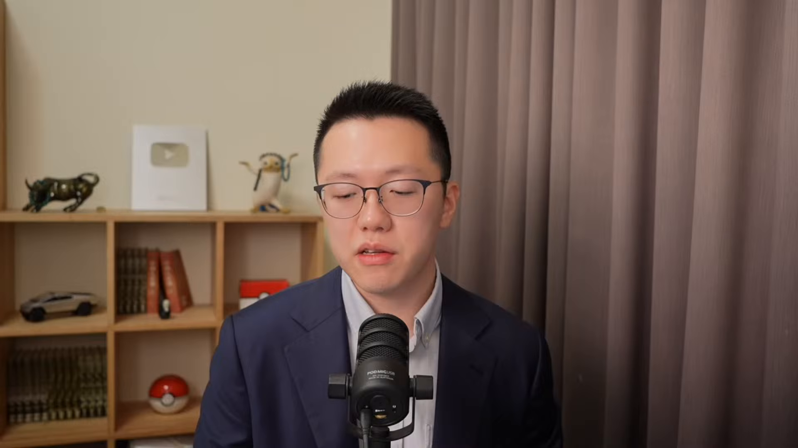 | 稍微比較廣一點 主要是跟投資朋友 稍微去思考 我們從行情一步一步看到現在 美國股市本來在漲高以後 要重新做乖離回調 或者做修正 可是現在市場的重點在於 自由現金流多快可以翻證 一旦在28年29年翻正以後 真正大條的資本支出才會到來 所以我們大概有一到兩年的時間 可以讓出口持續進入到上升循環 然後做一年期的檢視 看一下營收的回饋表現為何 再來往下一波的資本支出來做推送 而臺灣市場在本輪的龍井當中 一方面的確穩穩抓住了 本輪的AI半導體行情 所以外匯收入進來的速度很快 那外資的影響到底大不大呢 我覺得就很明顯了 那第二件事情 這件事情在資金不斷的湧入情況底下 金融業的蓬勃發展 也導致了整個社會觀念的改變 最後形成現在的結果 那副作用當然就是 沒有參與到這個產業的人 還有對於通膨敏感度比較大的人 都會因此受到影響 這也是未來我們面對更大的挑戰 別給投資朋友做一些觀察 如果喜歡我們節目 記得幫我們訂閱按贊加分享 我們就明天早上8點半 早晨財經速點讀再相見 祝各位投資朋友看完順利 操盤愉快 | 進入結尾總結，回顧美股修正、AI自由現金流與台灣出口循環，可能顯示整集重點整理頁。 |
